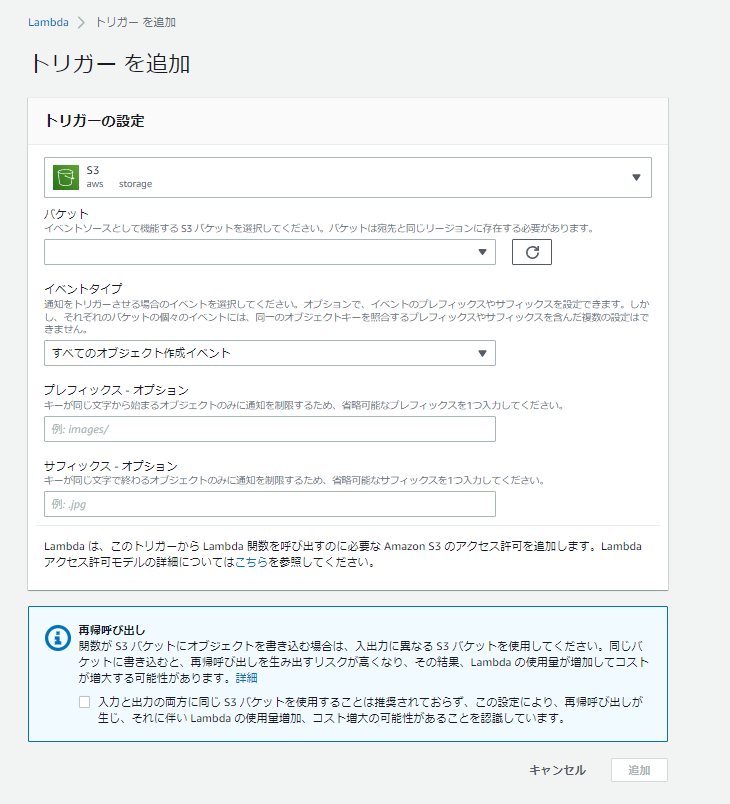
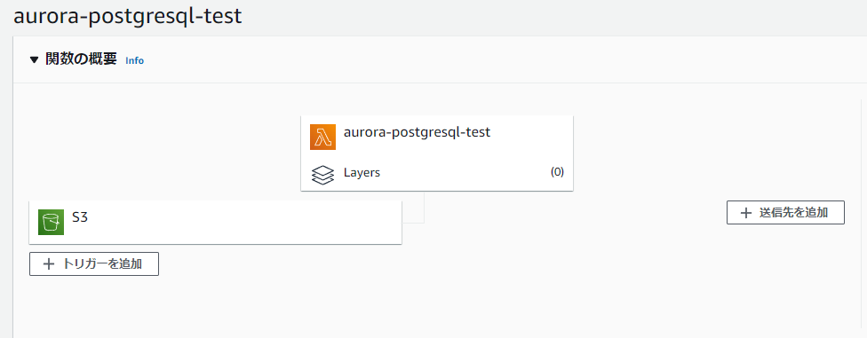

※RDS Proxyやパスワードの外出し等やるべきことやっていません。

### S3のイベント構造

------

Amazon S3 がイベントを発行する場合のJSONはこちら。

> イベントメッセージの構造 - Amazon Simple Storage Service https://docs.aws.amazon.com/ja_jp/AmazonS3/latest/userguide/notification-content-structure.html
>

```json
{  
   "Records":[  
      {  
         "eventVersion":"2.2",
         "eventSource":"aws:s3",
         "awsRegion":"us-west-2",
         "eventTime":"The time, in ISO-8601 format, for example, 1970-01-01T00:00:00.000Z, when Amazon S3 finished processing the request",
         "eventName":"event-type",
         "userIdentity":{  
            "principalId":"Amazon-customer-ID-of-the-user-who-caused-the-event"
         },
         "requestParameters":{  
            "sourceIPAddress":"ip-address-where-request-came-from"
         },
         "responseElements":{  
            "x-amz-request-id":"Amazon S3 generated request ID",
            "x-amz-id-2":"Amazon S3 host that processed the request"
         },
         "s3":{  
            "s3SchemaVersion":"1.0",
            "configurationId":"ID found in the bucket notification configuration",
            "bucket":{  
               "name":"bucket-name",
               "ownerIdentity":{  
                  "principalId":"Amazon-customer-ID-of-the-bucket-owner"
               },
               "arn":"bucket-ARN"
            },
            "object":{  
               "key":"object-key",
               "size":"object-size in bytes",
               "eTag":"object eTag",
               "versionId":"object version if bucket is versioning-enabled, otherwise null",
               "sequencer": "a string representation of a hexadecimal value used to determine event sequence, only used with PUTs and DELETEs"
            }
         },
         "glacierEventData": {
            "restoreEventData": {
               "lifecycleRestorationExpiryTime": "The time, in ISO-8601 format, for example, 1970-01-01T00:00:00.000Z, of Restore Expiry",
               "lifecycleRestoreStorageClass": "Source storage class for restore"
            }
         }
      }
   ]
}
```

### Lambda側でトリガーを追加

------





### Lamdba Pythonスクリプト

------

S3へのCSVファイルのPUTを検知してAurora PostgreSQLのテーブルにロードをする簡易スクリプト。特にエラーハンドリング等は実施していないので注意。

```python
import psycopg2
import psycopg2.extras
import time
import datetime
import logging
import boto3
import sys
import os

def lambda_handler(event, context):

    print('event: {}'.format(event))
    print('context: {}'.format(context))

    logger = logging.getLogger()
    logger.setLevel(logging.INFO)

    s3_client = boto3.client('s3')
    conn = psycopg2.connect("host=auroraserverlessv2.cluster-xxxxx.ap-northeast-1.rds.amazonaws.com port=5432 dbname=postgres user=postgres password=postgres")

    for record in event['Records']:
        bucket = record['s3']['bucket']['name']
        key = record['s3']['object']['key']
        s3location = 's3://' + bucket + '/' + key
        logger.info(s3location)
        logger.info(bucket)
        logger.info(key)
        
        cur = conn.cursor()
        logger.info("SUCCESS: Connection to RDS Aurora instance succeeded")

        sql = "SELECT aws_s3.table_import_from_s3('ddb', '', '(format csv)',  %s  , %s , 'ap-northeast-1');"
        logger.info(sql)

        with conn.cursor() as cur:
                cur.execute(sql, (bucket, key))
                conn.commit()
                logger.info('Data loaded from S3 into Aurora')

        conn.commit()
        cur.close()
        conn.close()
        
```

#### 補足

------

`aws_s3.table_import_from_s3`を使っているのでAurora側にIAMロールの設定や拡張機能の設定が必要となることに注意。

> - [S3からRDS/Aurora\(PostgreSQL\)にCSVファイルをインポートする \| my opinion is my own 👋](https://zatoima.github.io/aws-aurora-rds-s3-import.html)
