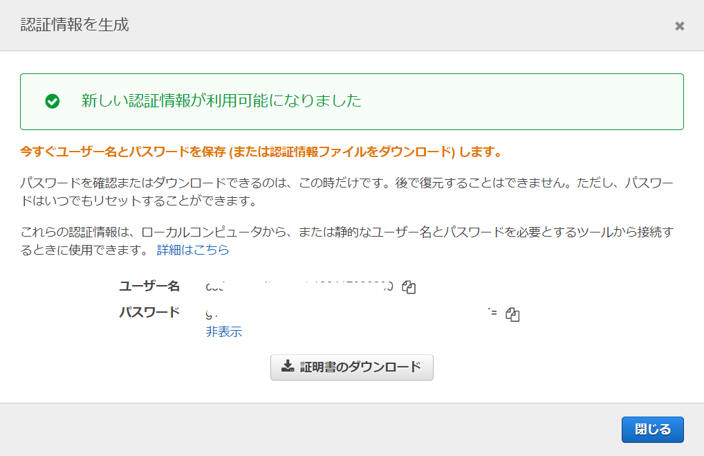
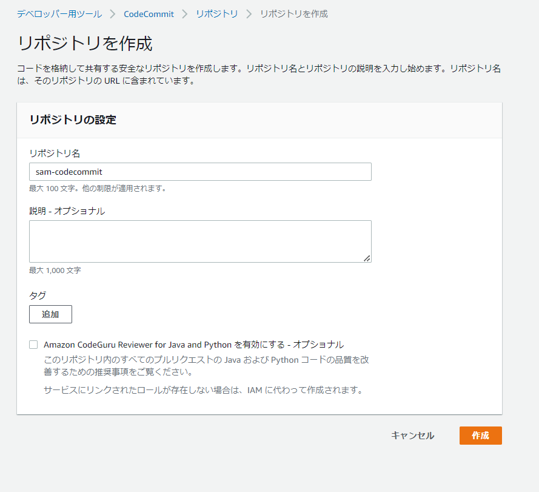
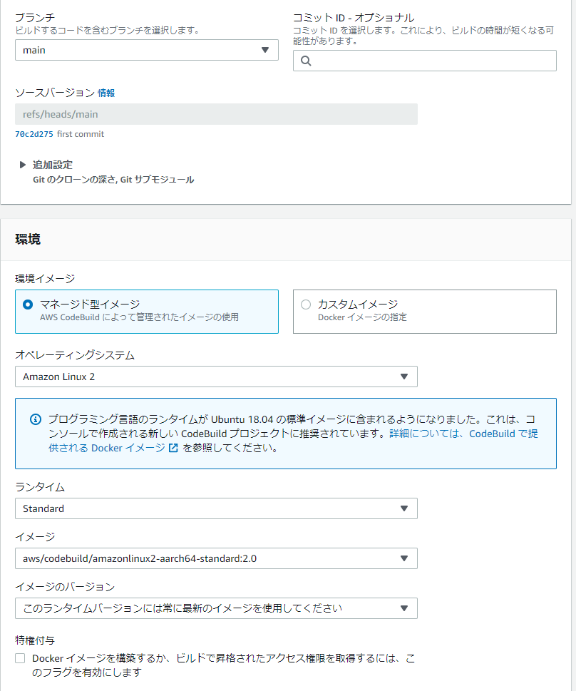
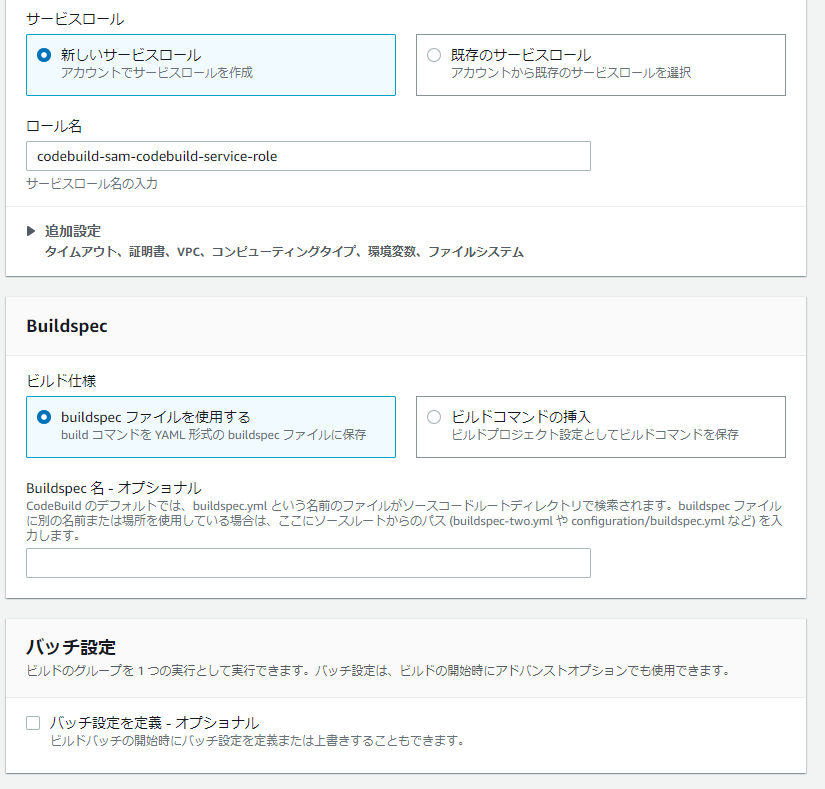
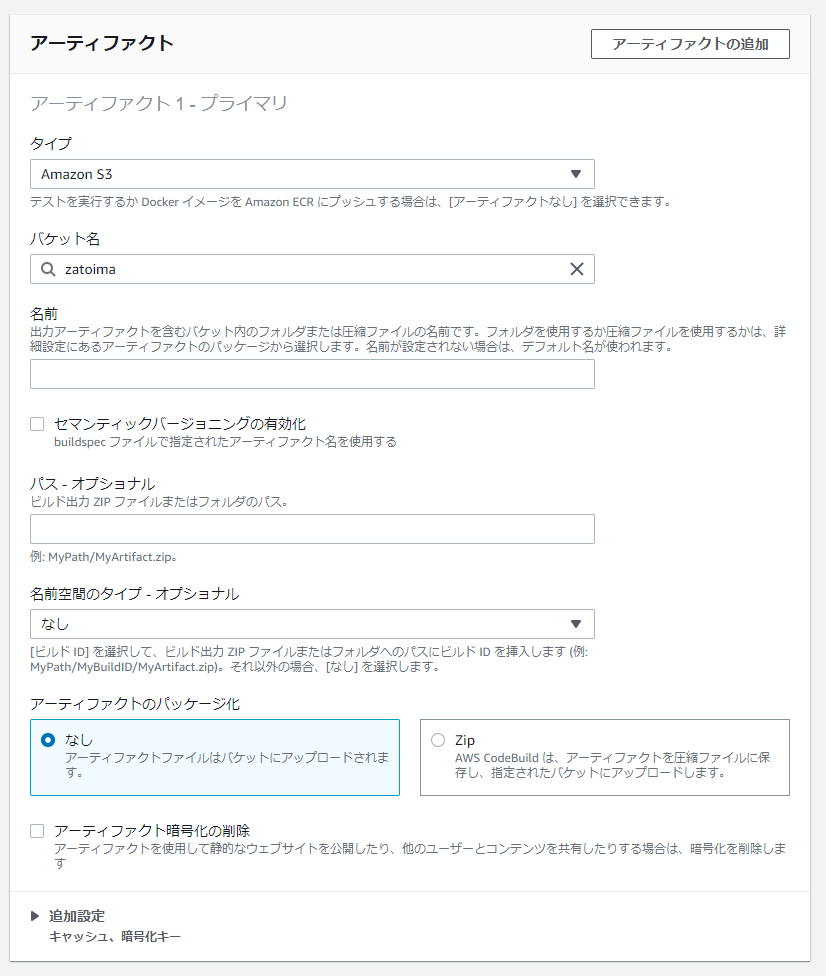
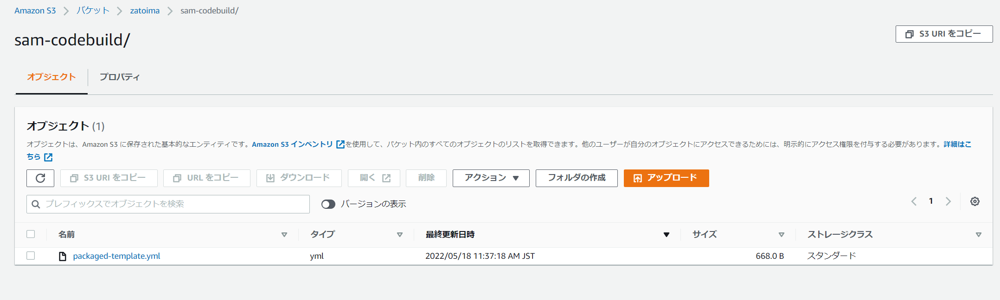
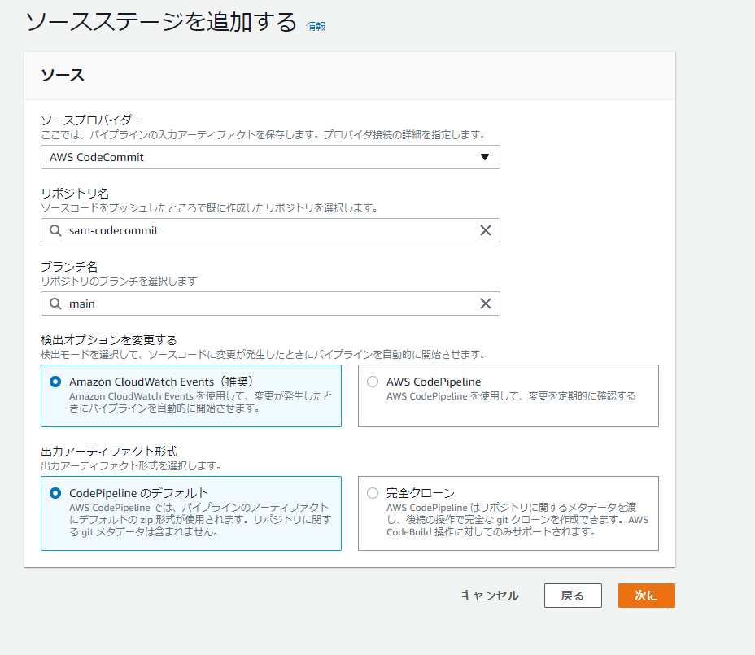
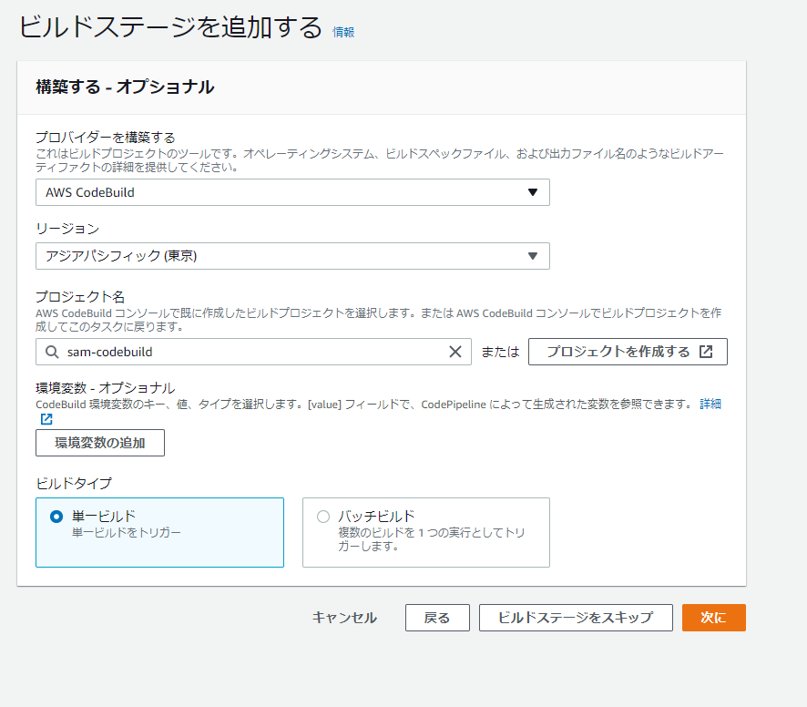
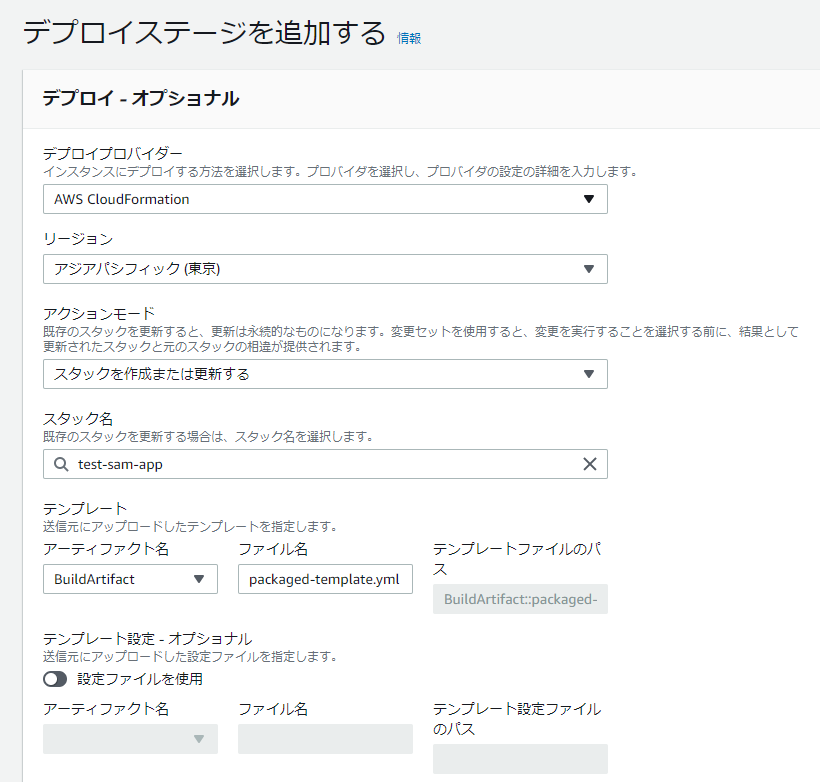

### 前提条件

- SAM CLIがインストールされていること
- CodeCommit用のユーザが事前作成されていること
  - AWSCodeCommitPowerUserを付与する
  - AWS CodeCommit の HTTPS Git 認証情報を控えておく。（IAMの認証情報から生成）

### SAM用のディレクトリ/デプロイ用のファイル準備

```yaml
[ec2-user@bastin test-sam]$ tree
.
├── function
│   ├── function.py
│   └── requirements.txt
├── samconfig.toml
└── template.yaml

1 directory, 4 files
[ec2-user@bastin test-sam]$ cat function/function.py 
import json
import requests

def lambda_handler(event, context):

    print(requests.get('https://google.com'))
    return {
        'statusCode': 200,
        'body': json.dumps('Hello from Lambda!')
    }

[ec2-user@bastin test-sam]$ 
[ec2-user@bastin test-sam]$ cat function/requirements.txt 
requests
[ec2-user@bastin test-sam]$ 
[ec2-user@bastin test-sam]$ cat samconfig.toml 
version = 0.1
[default]
[default.deploy]
[default.deploy.parameters]
stack_name = "test-sam-app"
s3_bucket = "zatoima"
s3_prefix = "test-sam-app"
region = "ap-northeast-1"
capabilities = "CAPABILITY_IAM"

[ec2-user@bastin test-sam]$ 
[ec2-user@bastin test-sam]$ cat template.yaml 
AWSTemplateFormatVersion: '2010-09-09'
Transform: AWS::Serverless-2016-10-31
Description: SAM Template for test-sam-app
Globals:
  Function:
    Timeout: 3

Resources:
  Function:
    Type: AWS::Serverless::Function
    Properties:
      FunctionName: test-sam-app
      CodeUri: function/
      Handler: function.lambda_handler
      Runtime: python3.8

Outputs:
  Function:
    Description: "test-sam-app Lambda Function ARN"
    Value: !GetAtt Function.Arn
  FunctionIamRole:
    Description: "Implicit IAM Role created for test-sam-app function"
    Value: !GetAtt FunctionRole.Arn


```

### buildspec.yamlの準備

`sam package`でパッケージングするBuildspec.yamlを準備

```yaml
version: 0.2
phases:
  install:
    runtime-versions:
        python: 3.8
  build:
    commands:
      - sam package --template-file template.yaml --s3-bucket zatoima --output-template-file packaged-template.yml
artifacts:
  files:
    - packaged-template.yml
```

### CodeCommitの設定





リポジトリをクローンする

```sh
git clone https://git-codecommit.ap-northeast-1.amazonaws.com/v1/repos/sam-codecommit
```

```sh
[ec2-user@bastin ~]$ git clone https://git-codecommit.ap-northeast-1.amazonaws.com/v1/repos/sam-codecommit
Cloning into 'sam-codecommit'...
Username for 'https://git-codecommit.ap-northeast-1.amazonaws.com': codecommituser-at-xxxxxxxxxxxxx
Password for 'https://codecommituser-at-xxxxxxxxxxxxx@git-codecommit.ap-northeast-1.amazonaws.com': 
remote: Counting objects: 3, done.
Unpacking objects: 100% (3/3), 349 bytes | 349.00 KiB/s, done.
[ec2-user@bastin ~]$ 
```

SAMのデプロイ用のファイルをリポジトリにPushする。

```sh
[ec2-user@bastin sam-codecommit]$ git push
Username for 'https://git-codecommit.ap-northeast-1.amazonaws.com': codecommituser-at-xxxxxxxxxxxxx
Password for 'https://codecommituser-at-xxxxxxxxxxxxx@git-codecommit.ap-northeast-1.amazonaws.com': 
Enumerating objects: 8, done.
Counting objects: 100% (8/8), done.
Delta compression using up to 2 threads
Compressing objects: 100% (6/6), done.
Writing objects: 100% (7/7), 1.05 KiB | 1.05 MiB/s, done.
Total 7 (delta 0), reused 0 (delta 0), pack-reused 0
To https://git-codecommit.ap-northeast-1.amazonaws.com/v1/repos/sam-codecommit
   aed7fe9..70c2d27  main -> main
[ec2-user@bastin sam-codecommit]$ 
```

こんな感じの状態になる。


### CodeBuild









成功後に`packaged-template.yml`がS3に生成



## CodePipelineの設定

CodeCommit->CodeBuild->CloudFormation








アクションモードにいくつか種類があるので適切なものを選ぶ


### パイプラインの実行

コードを1行だけ追加。`print("test")`

```
[ec2-user@bastin function]$ cat function.py 
import json
import requests

def lambda_handler(event, context):
    print("test")
    print(requests.get('https://google.com'))
    return {
        'statusCode': 200,
        'body': json.dumps('Hello from Lambda!')
    }
```

codecommitへpush

```
cd /home/ec2-user/sam-codecommit
git add .
git commit -m "Update commit"
git push
```


##### CloudFormation


##### Lambda


### 参考

- [CodePipelineを使ってSAMでシンプルなAPI Gatewayをデプロイしてみた \| DevelopersIO](https://dev.classmethod.jp/articles/codepipeline-deploy-sam-api-gateway/)
- [CodePipelineを step by step でやってみた \| DevelopersIO](https://dev.classmethod.jp/articles/codepipeline/)


