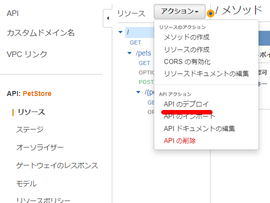

### はじめに

下記の通り`x-api-key`を使用したアクセス制限の方法もあるが、今回はAPI Gateway のリソースポリシー機能を使用してCloudFrontを限定する

> API Gateway で Cloudfront 経由のアクセスのみ許可する - ablog https://yohei-a.hatenablog.jp/entry/20210702/1625203047

### 前提

#### API Gateway

petstoreのサンプルをそのまま使う

```
[ec2-user@bastin ~]$ curl https://hbdqg3riq2.execute-api.ap-northeast-1.amazonaws.com/prod/pets
[
  {
    "id": 1,
    "type": "dog",
    "price": 249.99
  },
  {
    "id": 2,
    "type": "cat",
    "price": 124.99
  },
  {
    "id": 3,
    "type": "fish",
    "price": 0.99
  }
]
```


#### API GatewayをオリジンとしたCloudFrontのディストリビューションを作成


CloudFront経由のアクセスもできるようになった

```
[ec2-user@bastin ~]$ curl https://d3bkz0zeq00fjv.cloudfront.net/prod/pets
[
  {
    "id": 1,
    "type": "dog",
    "price": 249.99
  },
  {
    "id": 2,
    "type": "cat",
    "price": 124.99
  },
  {
    "id": 3,
    "type": "fish",
    "price": 0.99
  }
]
```

### API Gateway のアクセス元をリソースポリシー機能を使用してCloudFront のみに限定する方法

ここからが本題

#### CloudFront側でカスタムヘッダーを追加する

カスタムヘッダーは第三者にバレない値を設定する必要がある。バレたらアクセスできるので。


#### API Gateway 側でリソースポリシーを設定

```
{
    "Version": "2012-10-17",
    "Statement": [
        {
            "Effect": "Allow",
            "Principal": "*",
            "Action": "execute-api:Invoke",
            "Resource": "arn:aws:execute-api:<リージョン>:<アカウントID>:<API ID>/*/*/*"
        },
        {
            "Effect": "Deny",
            "Principal": "*",
            "Action": "execute-api:Invoke",
            "Resource": "arn:aws:execute-api:<リージョン>:<アカウントID>:<API ID>/*/*/*",
            "Condition": {
                "StringNotEquals": {
                    "aws:Referer": "<第三者から推測されにくい任意の文字列>"
                }
            }
        }
    ]
}

```


※忘れずにAPIの再デプロイを実施する



上記設定を行うことでCloudFront経由はアクセスが出来、API GatewayのURLからはアクセスが出来ないことを確認出来た。

```
[ec2-user@bastin ~]$ curl https://d3bkz0zeq00fjv.cloudfront.net/prod/pets
[
  {
    "id": 1,
    "type": "dog",
    "price": 249.99
  },
  {
    "id": 2,
    "type": "cat",
    "price": 124.99
  },
  {
    "id": 3,
    "type": "fish",
    "price": 0.99
  }
][ec2-user@bastin ~]$ 
[ec2-user@bastin ~]$ curl https://hbdqg3riq2.execute-api.ap-northeast-1.amazonaws.com/prod/pets
{"Message":"User: anonymous is not authorized to perform: execute-api:Invoke on resource: arn:aws:execute-api:ap-northeast-1:********6200:hbdqg3riq2/prod/GET/pets with an explicit deny"}
```

### 参考

> [オリジンリクエストへのカスタムヘッダーの追加 \- Amazon CloudFront](https://docs.aws.amazon.com/ja_jp/AmazonCloudFront/latest/DeveloperGuide/add-origin-custom-headers.html)
