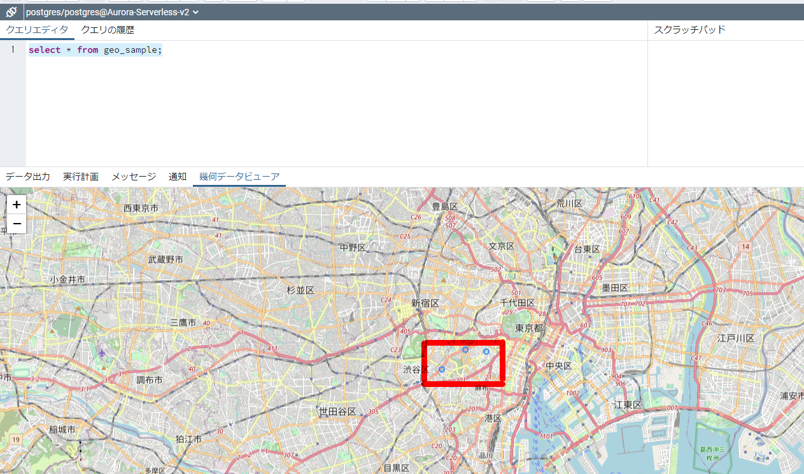

### 事前準備

-----

#### 参考資料

- [PostGIS 拡張機能を使用した空間データの管理 \- Amazon Relational Database Service](https://docs.aws.amazon.com/ja_jp/AmazonRDS/latest/UserGuide/Appendix.PostgreSQL.CommonDBATasks.PostGIS.html)

#### 拡張機能の有効化

```sql
CREATE EXTENSION postgis;
CREATE EXTENSION fuzzystrmatch;
CREATE EXTENSION postgis_tiger_geocoder;
CREATE EXTENSION postgis_topology;
```

```sql
postgres=> CREATE EXTENSION postgis;

CREATE EXTENSION
postgres=> CREATE EXTENSION fuzzystrmatch;
CREATE EXTENSION
postgres=> CREATE EXTENSION postgis_tiger_geocoder;
CREATE EXTENSION
postgres=> CREATE EXTENSION postgis_topology;
CREATE EXTENSION
postgres=> 
postgres=> 
postgres=> \dx
                                              List of installed extensions
          Name          | Version |   Schema   |                              Description                               
------------------------+---------+------------+------------------------------------------------------------------------
 aws_commons            | 1.2     | public     | Common data types across AWS services
 aws_s3                 | 1.1     | public     | AWS S3 extension for importing data from S3
 fuzzystrmatch          | 1.1     | public     | determine similarities and distance between strings
 pg_buffercache         | 1.3     | public     | examine the shared buffer cache
 pg_stat_statements     | 1.8     | public     | track planning and execution statistics of all SQL statements executed
 plpgsql                | 1.0     | pg_catalog | PL/pgSQL procedural language
 postgis                | 3.1.5   | public     | PostGIS geometry and geography spatial types and functions
 postgis_tiger_geocoder | 3.1.5   | tiger      | PostGIS tiger geocoder and reverse geocoder
 postgis_topology       | 3.1.5   | topology   | PostGIS topology spatial types and functions
(9 rows)

postgres=> 
```

#### バージョン確認

```sql
postgres=> select * from postgis_version();
            postgis_version            
---------------------------------------
 3.1 USE_GEOS=1 USE_PROJ=1 USE_STATS=1
(1 row)
```

#### 権限変更

```sql
ALTER SCHEMA tiger OWNER TO rds_superuser;
ALTER SCHEMA tiger_data OWNER TO rds_superuser; 
ALTER SCHEMA topology OWNER TO rds_superuser;
```

```sql
postgres=> \dn
       List of schemas
    Name     |     Owner     
-------------+---------------
 aws_commons | rds_superuser
 aws_s3      | rds_superuser
 public      | postgres
 tiger       | rdsadmin
 tiger_data  | rdsadmin
 topology    | rdsadmin
(6 rows)

postgres=> ALTER SCHEMA tiger OWNER TO rds_superuser;
ALTER SCHEMA
postgres=> ALTER SCHEMA tiger_data OWNER TO rds_superuser; 
ALTER SCHEMA
postgres=> ALTER SCHEMA topology OWNER TO rds_superuser;
ALTER SCHEMA
postgres=> \dn
       List of schemas
    Name     |     Owner     
-------------+---------------
 aws_commons | rds_superuser
 aws_s3      | rds_superuser
 public      | postgres
 tiger       | rds_superuser
 tiger_data  | rds_superuser
 topology    | rds_superuser
(6 rows)

postgres=> 
```

`rds_superuser` ロールにオブジェクトの所有権を転送

ALTER文を生成してくれるので実行。

```sql
CREATE FUNCTION exec(text) returns text language plpgsql volatile AS $f$ BEGIN EXECUTE $1; RETURN $1; END; $f$;
SELECT exec('ALTER TABLE ' || quote_ident(s.nspname) || '.' || quote_ident(s.relname) || ' OWNER TO rds_superuser;')
  FROM (
    SELECT nspname, relname
    FROM pg_class c JOIN pg_namespace n ON (c.relnamespace = n.oid) 
    WHERE nspname in ('tiger','topology') AND
    relkind IN ('r','S','v') ORDER BY relkind = 'S')
s;
```

```sql
postgres=> CREATE FUNCTION exec(text) returns text language plpgsql volatile AS $f$ BEGIN EXECUTE $1; RETURN $1; END; $f$;
CREATE FUNCTION
postgres=> 
postgres=> SELECT exec('ALTER TABLE ' || quote_ident(s.nspname) || '.' || quote_ident(s.relname) || ' OWNER TO rds_superuser;')
postgres->   FROM (
postgres(>     SELECT nspname, relname
postgres(>     FROM pg_class c JOIN pg_namespace n ON (c.relnamespace = n.oid) 
postgres(>     WHERE nspname in ('tiger','topology') AND
postgres(>     relkind IN ('r','S','v') ORDER BY relkind = 'S')
postgres-> s;
                                exec                                
--------------------------------------------------------------------
 ALTER TABLE tiger.loader_variables OWNER TO rds_superuser;
 ALTER TABLE tiger.loader_lookuptables OWNER TO rds_superuser;
 ALTER TABLE tiger.zip_lookup OWNER TO rds_superuser;
 ALTER TABLE tiger.tract OWNER TO rds_superuser;
 ALTER TABLE tiger.geocode_settings_default OWNER TO rds_superuser;
 ALTER TABLE tiger.tabblock OWNER TO rds_superuser;
 ALTER TABLE tiger.county OWNER TO rds_superuser;
 ALTER TABLE tiger.bg OWNER TO rds_superuser;
 ALTER TABLE tiger.direction_lookup OWNER TO rds_superuser;
 ALTER TABLE tiger.pagc_gaz OWNER TO rds_superuser;
 ALTER TABLE tiger.geocode_settings OWNER TO rds_superuser;
 ALTER TABLE tiger.pagc_lex OWNER TO rds_superuser;
 ALTER TABLE tiger.state OWNER TO rds_superuser;
 ALTER TABLE tiger.pagc_rules OWNER TO rds_superuser;
 ALTER TABLE tiger.secondary_unit_lookup OWNER TO rds_superuser;
 ALTER TABLE topology.topology OWNER TO rds_superuser;
 ALTER TABLE topology.layer OWNER TO rds_superuser;
 ALTER TABLE tiger.place OWNER TO rds_superuser;
 ALTER TABLE tiger.zip_state OWNER TO rds_superuser;
 ALTER TABLE tiger.zip_state_loc OWNER TO rds_superuser;
 ALTER TABLE tiger.state_lookup OWNER TO rds_superuser;
 ALTER TABLE tiger.cousub OWNER TO rds_superuser;
 ALTER TABLE tiger.street_type_lookup OWNER TO rds_superuser;
 ALTER TABLE tiger.edges OWNER TO rds_superuser;
 ALTER TABLE tiger.place_lookup OWNER TO rds_superuser;
 ALTER TABLE tiger.addrfeat OWNER TO rds_superuser;
 ALTER TABLE tiger.county_lookup OWNER TO rds_superuser;
 ALTER TABLE tiger.faces OWNER TO rds_superuser;
 ALTER TABLE tiger.countysub_lookup OWNER TO rds_superuser;
 ALTER TABLE tiger.featnames OWNER TO rds_superuser;
 ALTER TABLE tiger.zip_lookup_all OWNER TO rds_superuser;
 ALTER TABLE tiger.addr OWNER TO rds_superuser;
 ALTER TABLE tiger.zip_lookup_base OWNER TO rds_superuser;
 ALTER TABLE tiger.zcta5 OWNER TO rds_superuser;
 ALTER TABLE tiger.tabblock20 OWNER TO rds_superuser;
 ALTER TABLE tiger.loader_platform OWNER TO rds_superuser;
 ALTER TABLE tiger.pagc_lex_id_seq OWNER TO rds_superuser;
 ALTER TABLE tiger.county_gid_seq OWNER TO rds_superuser;
 ALTER TABLE tiger.state_gid_seq OWNER TO rds_superuser;
 ALTER TABLE tiger.place_gid_seq OWNER TO rds_superuser;
 ALTER TABLE tiger.cousub_gid_seq OWNER TO rds_superuser;
 ALTER TABLE tiger.edges_gid_seq OWNER TO rds_superuser;
 ALTER TABLE tiger.addrfeat_gid_seq OWNER TO rds_superuser;
 ALTER TABLE tiger.faces_gid_seq OWNER TO rds_superuser;
 ALTER TABLE tiger.featnames_gid_seq OWNER TO rds_superuser;
 ALTER TABLE tiger.addr_gid_seq OWNER TO rds_superuser;
 ALTER TABLE tiger.zcta5_gid_seq OWNER TO rds_superuser;
 ALTER TABLE tiger.tract_gid_seq OWNER TO rds_superuser;
 ALTER TABLE tiger.tabblock_gid_seq OWNER TO rds_superuser;
 ALTER TABLE tiger.bg_gid_seq OWNER TO rds_superuser;
 ALTER TABLE tiger.pagc_gaz_id_seq OWNER TO rds_superuser;
 ALTER TABLE tiger.pagc_rules_id_seq OWNER TO rds_superuser;
 ALTER TABLE topology.topology_id_seq OWNER TO rds_superuser;
(53 rows)
```

### PostGISを使用して実行

-----

#### テスト①

```sql
postgres=> CREATE TABLE t1 (id int primary key);
CREATE TABLE
postgres=> 
postgres=> SELECT addGeometryColumn('t1', 'p1', 4326, 'POINT', 2);
             addgeometrycolumn             
-------------------------------------------
 public.t1.p1 SRID:4326 TYPE:POINT DIMS:2 
(1 row)

postgres=> \d t1
                       Table "public.t1"
 Column |         Type         | Collation | Nullable | Default 
--------+----------------------+-----------+----------+---------
 id     | integer              |           | not null | 
 p1     | geometry(Point,4326) |           |          | 
Indexes:
    "t1_pkey" PRIMARY KEY, btree (id)

postgres=> 
postgres=> INSERT INTO t1 VALUES (1, ST_GeomFromText('POINT(139 36)',4326));
INSERT 0 1
postgres=> SELECT id, ST_AsText(p1) FROM t1;
 id |   st_astext   
----+---------------
  1 | POINT(139 36)
(1 row)

postgres=> 
postgres=> 
postgres=> SELECT id,
postgres->   ST_Transform(p1, 32654) <->
postgres->   ST_Transform(ST_GeomFromText('POINT(139.11234 35.998765)', 4326), 32654)
postgres->   AS distance FROM t1 ORDER BY distance ;
 id |      distance      
----+--------------------
  1 | 10129.774748121428
(1 row)

```

#### テスト②

#### テーブル作成

```sql
CREATE TABLE geo_sample (
 id integer PRIMARY KEY,
 name varchar(255),
 geom geometry(POINT, 4326)
);
```

#### データ投入

```sql
INSERT INTO geo_sample VALUES (1, '表参道駅', ST_GeomFromText('POINT(139.712288 35.664342)',4326));
INSERT INTO geo_sample VALUES (2, '青山一丁目駅', ST_GeomFromText('POINT(139.725146 35.672963)',4326));
INSERT INTO geo_sample VALUES (3, '赤坂駅', ST_GeomFromText('POINT(139.7365419 35.671949)',4326));
```

#### 2点間の距離を求める: ST_Distance()

```sql
select a.name || ' to ' || b.name,
ST_Distance(
 ST_Transform(a.geom, 2163),
 ST_Transform(b.geom, 2163))
from geo_sample a, geo_sample b
where a.name = '表参道駅' and b.name = '青山一丁目駅';

postgres=> select a.name || ' to ' || b.name,
postgres-> ST_Distance(
postgres(>  ST_Transform(a.geom, 2163),
postgres(>  ST_Transform(b.geom, 2163))
postgres-> from geo_sample a, geo_sample b
postgres-> where a.name = '表参道駅' and b.name = '青山一丁目駅';
         ?column?         |    st_distance     
--------------------------+--------------------
 表参道駅 to 青山一丁目駅 | 1184.3450716154289
(1 row)

```

#### PgAdminで確認

簡単にPgAdminを使用してさっくり確認も出来る。



#### テスト③

```sql
CREATE TABLE geotable (
    id   SERIAL NOT NULL PRIMARY KEY,
    name varchar (255) NOT NULL,
    geom geography(POINT, 4326) NOT NULL
);

-- データの挿入
INSERT INTO geotable (name, geom) VALUES
('上野駅', ST_GeographyFromText('SRID=4326;POINT(139.777254 35.713768)')),
('西郷隆盛像', ST_GeographyFromText('SRID=4326;POINT(139.774029 35.711846)')),
('上野の森美術館', ST_GeographyFromText('SRID=4326;POINT(139.774744 35.712737)')),
('不忍池弁財天', ST_GeographyFromText('SRID=4326;POINT(139.770872 35.712351)')),
('野口英世博士像', ST_GeographyFromText('SRID=4326;POINT(139.775696 35.716293)')),
('国立西洋美術館', ST_GeographyFromText('SRID=4326;POINT(139.775803 35.71542)')),
('国立科学博物館', ST_GeographyFromText('SRID=4326;POINT(139.776544 35.716319)')),
('東京都美術館', ST_GeographyFromText('SRID=4326;POINT(139.772776 35.717186)')),
('東京国立博物館', ST_GeographyFromText('SRID=4326;POINT(139.776462 35.718883)')),
('花やしき', ST_GeographyFromText('SRID=4326;POINT(139.794547 35.71528)')),
('雷門', ST_GeographyFromText('SRID=4326;POINT(139.792692 35.710635)'));

-- 空間インデックスの作成
CREATE INDEX gist_geotable on geotable USING GIST (geom);
```


```sql
SELECT
    name,
    ST_AsText(geom),
    ST_Distance('SRID=4326;POINT(139.777254 35.713768)', geom) as dist
FROM geotable
WHERE ST_DWithin(geom, ST_GeographyFromText('SRID=4326;POINT(139.777254 35.713768)'), 500.0)
ORDER BY dist;
```


```sql
postgres=> SELECT
postgres->     name,
postgres->     ST_AsText(geom),
postgres->     ST_Distance('SRID=4326;POINT(139.777254 35.713768)', geom) as dist
postgres-> FROM geotable
postgres-> WHERE ST_DWithin(geom, ST_GeographyFromText('SRID=4326;POINT(139.777254 35.713768)'), 500.0)
postgres-> ORDER BY dist;
      name      |          st_astext          |     dist     
----------------+-----------------------------+--------------
 上野駅         | POINT(139.777254 35.713768) |            0
 国立西洋美術館 | POINT(139.775803 35.71542)  | 225.46891659
 上野の森美術館 | POINT(139.774744 35.712737) | 254.30812788
 国立科学博物館 | POINT(139.776544 35.716319) | 290.24270722
 野口英世博士像 | POINT(139.775696 35.716293) | 313.62968599
 西郷隆盛像     | POINT(139.774029 35.711846) | 361.44255611
(6 rows)
```


> - PostGIS（地理情報システムを実現するための拡張モジュール） https://www.sraoss.co.jp/tech-blog/pgsql/postgis/
> - [位置情報を可視化しよう！\[PostGIS入門\]｜kota｜note](https://note.com/kotarai/n/nd2bfbafbef6e)


