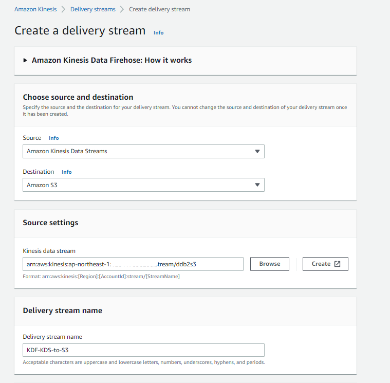
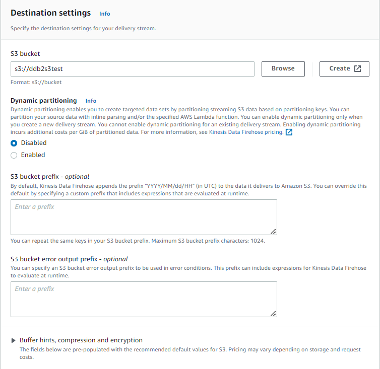
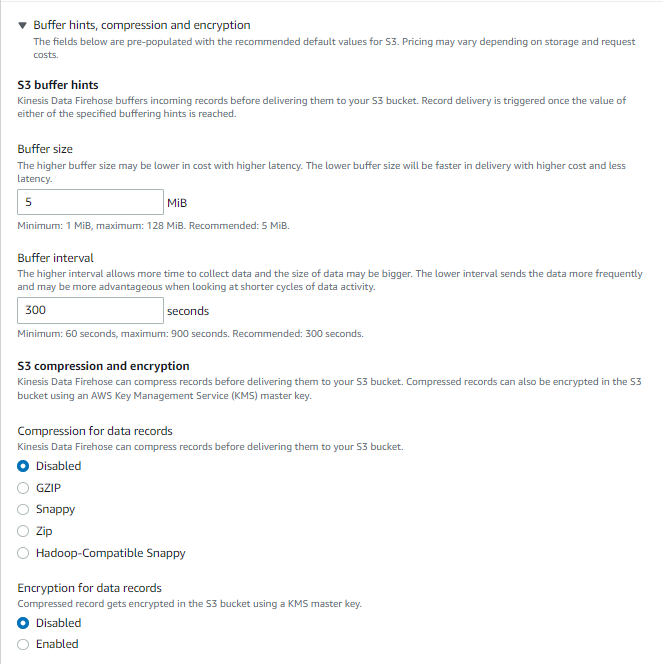
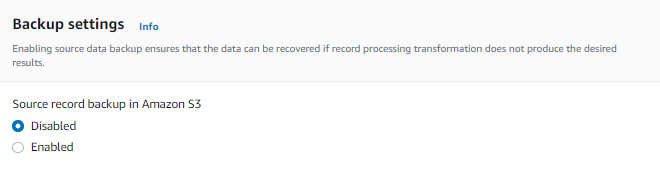

### はじめに

> Amazon DynamoDB からのデータストリームを AWS Lambda と Amazon Kinesis Firehose を活用して Amazon Aurora に格納する | Amazon Web Services ブログ https://aws.amazon.com/jp/blogs/news/how-to-stream-data-from-amazon-dynamodb-aws-lambda-amazon-kinesis-firehose/

2017年のこの記事を参考にしつつ、色々と実現方式も変わっているのでイチから環境構築等を行うメモ。Glue Elastic ViewsがGAになれば置き換わるかもしれない。単純なレプリケーションのみであることに注意。更新、削除の場合はAuroraへのロード方式を変更する必要がある。

### DynamoDBからAuroraへのデータレプリケーション方式について

DynamoDBからAuroraへの連携についてはいくつかパターンがあるので適切な方式を選択した方が良い。下記参考。

- [AWS DMS と Amazon Kinesis Data Firehose を利用した Aurora PostgreSQL データベースへのストリームデータのロード \| Amazon Web Services ブログ](https://aws.amazon.com/jp/blogs/news/stream-data-into-an-aurora-postgresql-database-using-aws-dms-and-amazon-kinesis-data-firehose/)
- [Amazon DynamoDB ストリームを使用して、順序付けされたデータをアプリケーション間でレプリケーションする方法 \| Amazon Web Services ブログ](https://aws.amazon.com/jp/blogs/news/how-to-perform-ordered-data-replication-between-applications-by-using-amazon-dynamodb-streams/)
- [Amazon Kinesis Firehose Data Transformation with AWS Lambda \| AWS Compute Blog](https://aws.amazon.com/jp/blogs/compute/amazon-kinesis-firehose-data-transformation-with-aws-lambda/)

今回は`①DynamoDB->②DynamoDB Streams-> ③Amazon Kinesis Data Stream-> ④Amazon Kinesis Firehose->⑤Lambda->⑥S3->⑦Lambda->⑧Aurora`となる。

S3に配置する前段階の⑤のLambdaでストリーミングで流れてくるJSONをCSVにデータ変換を行い、⑥のS3のイベント通知で⑦のLambdaを発火させ、Aurora PostgreSQLにデータロードを行う。

⑤Lambdaを挟まずとも④のKinesis FirehoseからS3に対してはデータを送れるが、CSV形式で格納し、データロードをしたかったので⑤のLamdbaを挟むことにした。

### ①DynamoDB


```sh
aws dynamodb create-table \
    --table-name dynamotest \
    --attribute-definitions \
      AttributeName=id,AttributeType=S \
      AttributeName=datetime,AttributeType=S \
    --key-schema AttributeName=id,KeyType=HASH AttributeName=datetime,KeyType=RANGE \
    --billing-mode PAY_PER_REQUEST
```

### ②DynamoDB Streams

データストリームを有効化する


### ③Amazon Kinesis Data Stream

`オンデマンド`、もしくは`シャード数の指定`。`データ保持期間`等を事前に決めておく。


### ④Amazon Kinesis Firehose

バックアップの有無やバッファサイズやインターバルは適宜変更した方が良さそう。



`Transform source records with AWS Lambda`でLamdbaを指定する。









### ⑤Lambda

下記ブログの通り

- [DynamoDBからkinesis firehose経由でS3に出力時にJSON形式からCSV形式に変換するLamdba用のPythonスクリプト \| my opinion is my own 👋](https://zatoima.github.io/aws-dynamodb-to-s3-csv-transform-python-lamdba/)

### ⑥S3

特に変わったところはなし

### ⑦Lambda、⑧Aurora

下記ブログの通り

- [S3へのファイルのPUTを検知してLamdbaからAurora PostgreSQLのテーブルへCSV形式のデータをロード \| my opinion is my own 👋](https://zatoima.github.io/aws-aurora-postgres-lambda-s3-event/)

- [Lambdaからawslambda\-psycopg2を使用してAurora PostgreSQLに接続 \| my opinion is my own 👋](https://zatoima.github.io/aws-aurora-postgres-psycopg2-lambda/)
