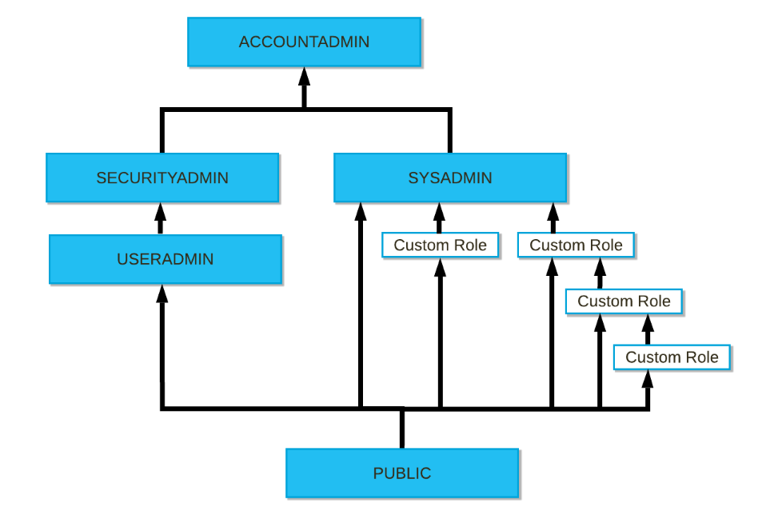

### アクセス制御フレームワーク

- **任意アクセス制御（DAC）：** 各オブジェクトに所有者がおり、所有者はそのオブジェクトへのアクセスを許可できる
- **ロールベースのアクセス制御（RBAC）：** アクセス権限がロールに割り当てられ、ロールはユーザーに割り当てられる


### ACCOUNTADMINについて

勘違いしていたことがあって、ACCOUNTADMINはシステムで最も強力なロールだが、OracleでいうところのSYSDBA、PostgreSQLでいうところのルートユーザだと思っていたが、実際にはスーパーユーザロールではない。

>https://docs.snowflake.com/ja/user-guide/security-access-control-considerations.html#using-the-accountadmin-role
>
>ACCOUNTADMINはスーパーユーザーロール **ではない** ことに注意してください。このロールは、このロール、または [ロール階層](https://docs.snowflake.com/ja/user-guide/security-access-control-overview.html#label-role-hierarchy-and-privilege-inheritance) の下位のロールがオブジェクトに対して十分な権限を持っている場合にのみ、アカウント内のオブジェクトの表示と管理を許可します。
>
>https://docs.snowflake.com/ja/user-guide/security-access-control-considerations.html#managing-custom-roles
>
>カスタムロールが最初に作成されると、孤立した状態にあります。ロールに関連付けられたオブジェクト権限を使用するユーザーにロールを割り当てる必要があります。カスタムロールは、カスタムロールによって作成されたオブジェクトを管理するロールにも付与する必要があります。
>
>デフォルトでは、ACCOUNTADMIN ロールでさえ、カスタムロールによって作成されたオブジェクトの変更やドロップはできません。カスタムロールは、ACCOUNTADMIN ロールに直接付与するか、できれば、SYSADMIN ロールを親とする階層内の別のロールに付与する必要があります。SYSADMIN ロールは ACCOUNTADMIN ロールによって管理されます。

#### 保護可能なオブジェクト

- アカウント配下
  - ユーザ
  - ロール
  - データベース
  - ウェアハウス
  - スキーマ
    - テーブル
    - ビュー
    - ステージ
    - ストアドプロシージャ
    - UDF等

#### 権限の階層の継承

- [アクセス制御の概要 — Snowflake Documentation](https://docs.snowflake.com/ja/user-guide/security-access-control-overview.html#role-hierarchy-and-privilege-inheritance)




### 実際に試してみる

`accountadmin`で作業を実施する。本来であれば`USERADMIN`でやるべきかも…

```sql
use role accountadmin;
```

USER作成

```sql
CREATE USER IF NOT EXISTS WORKUSER
  PASSWORD = 'workusertest'
  DEFAULT_ROLE = 'PUBLIC';
```

ロール作成

```sql
CREATE ROLE IF NOT EXISTS WORKROLE;
```

ロールをユーザに付与

```sql
GRANT ROLE WORKROLE TO USER WORKUSER;
SHOW USER LIKE 'WORKUSER';
```

データベース作成

```sql
USE ROLE SYSADMIN;
CREATE DATABASE WORKDB;
```

データベースの権限付与

```sql
USE ROLE SECURITYADMIN;
GRANT OWNERSHIP ON DATABASE WORKDB TO ROLE WORKROLE;
GRANT OWNERSHIP ON SCHEMA WORKDB.PUBLIC TO ROLE WORKROLE;
```

ウェアハウスの権限付与

```sql
USE ROLE SYSADMIN;
CREATE WAREHOUSE WH_X_SMALL;

USE ROLE SECURITYADMIN;
GRANT USAGE ON WAREHOUSE WH_X_SMALL TO ROLE WORKROLE;
GRANT OPERATE ON WAREHOUSE WH_X_SMALL TO ROLE WORKROLE;
```

作成したユーザとロールに切り替えて使っていく

```sql
USE ROLE WORKROLE;
USE DATABASE WORKDB;
USE WAREHOUSE WH_X_SMALL;
```

スキーマ作成

```sql
CREATE SCHEMA WORKSCHEMA;
```

テーブル作成

OWNER等も大丈夫そう。

```sql
workuser#WH_X_SMALL@WORKDB.WORKSCHEMA>CREATE TABLE t1(a number,b VARCHAR,c VARCHAR,d number,e varchar) AS
                                      SELECT SEQ8()
                                            ,randstr(200, random())
                                            ,randstr(300, random())
                                            ,row_number() over (order by seq4()) 
                                            ,current_timestamp
                                      FROM   table(generator(rowcount => 1000))
                                      ;
+--------------------------------+                                              
| status                         |
|--------------------------------|
| Table T1 successfully created. |
+--------------------------------+
1 Row(s) produced. Time Elapsed: 1.784s
workuser#WH_X_SMALL@WORKDB.WORKSCHEMA>
workuser#WH_X_SMALL@WORKDB.WORKSCHEMA>show tables;
+-------------------------------+------+---------------+-------------+-------+---------+------------+------+--------+----------+----------------+----------------------+-----------------+-------------+
| created_on                    | name | database_name | schema_name | kind  | comment | cluster_by | rows |  bytes | owner    | retention_time | automatic_clustering | change_tracking | is_external |
|-------------------------------+------+---------------+-------------+-------+---------+------------+------+--------+----------+----------------+----------------------+-----------------+-------------|
| 2022-08-25 18:18:01.195 -0700 | T1   | WORKDB        | WORKSCHEMA  | TABLE |         |            | 1000 | 505344 | WORKROLE | 1              | OFF                  | OFF             | N           |
+-------------------------------+------+---------------+-------------+-------+---------+------------+------+--------+----------+----------------+----------------------+-----------------+-------------+
1 Row(s) produced. Time Elapsed: 0.110s
workuser#WH_X_SMALL@WORKDB.WORKSCHEMA>
```

### ロール階層の仕組みの確認

カスタムロールを作成するときは、最終的に高レベルの管理者ロールに割り当てられるロール階層を作成することを検討が必要ということがマニュアルに書いてある。

- [アクセス制御の構成 — Snowflake Documentation](https://docs.snowflake.com/ja/user-guide/security-access-control-configure.html#creating-a-role-hierarchy)


現状の状態だとSYSADMINでもACCOUNTADMINでもWORKDB内のWORKSCHEMA内のT1テーブルにはアクセスできない状態になっている。

```sql
zatoima#COMPUTE_WH@(no database).(no schema)>select current_user(),current_database(), current_role(), current_warehouse();
+----------------+--------------------+----------------+---------------------+  
| CURRENT_USER() | CURRENT_DATABASE() | CURRENT_ROLE() | CURRENT_WAREHOUSE() |
|----------------+--------------------+----------------+---------------------|
| ZATOIMA        | NULL               | ACCOUNTADMIN   | COMPUTE_WH          |
+----------------+--------------------+----------------+---------------------+
zatoima#COMPUTE_WH@(no database).(no schema)>use database WORKDB;
003001 (42501): SQL access control error:                                       
Insufficient privileges to operate on database 'WORKDB'
zatoima#COMPUTE_WH@(no database).(no schema)>use role WORKROLE;
003013 (42501): SQL access control error:                                       
Requested role 'WORKROLE' is not assigned to the executing user.  Specify another role to activate.
zatoima#COMPUTE_WH@(no database).(no schema)>
```

sysadminにロールを付与して階層を作成

```sql
grant role WORKROLE to role sysadmin;
```

```sql
zatoima#COMPUTE_WH@(no database).(no schema)>grant role WORKROLE to role sysadmin;
+----------------------------------+                                            
| status                           |
|----------------------------------|
| Statement executed successfully. |
+----------------------------------+
1 Row(s) produced. Time Elapsed: 0.108s
zatoima#COMPUTE_WH@(no database).(no schema)>
zatoima#COMPUTE_WH@(no database).(no schema)>use database WORKDB;

+----------------------------------+                                            
| status                           |
|----------------------------------|
| Statement executed successfully. |
+----------------------------------+
1 Row(s) produced. Time Elapsed: 0.148s
zatoima#COMPUTE_WH@WORKDB.PUBLIC>select current_user(),current_database(), current_role(), current_warehouse();
+----------------+--------------------+----------------+---------------------+  
| CURRENT_USER() | CURRENT_DATABASE() | CURRENT_ROLE() | CURRENT_WAREHOUSE() |
|----------------+--------------------+----------------+---------------------|
| ZATOIMA        | WORKDB             | ACCOUNTADMIN   | COMPUTE_WH          |
+----------------+--------------------+----------------+---------------------+

```

#### 権限の確認

```sql
zatoima#(no warehouse)@WORKDB.PUBLIC>show grants on schema WORKSCHEMA;
+-------------------------------+-----------+------------+-------------------+------------+--------------+--------------+------------+
| created_on                    | privilege | granted_on | name              | granted_to | grantee_name | grant_option | granted_by |
|-------------------------------+-----------+------------+-------------------+------------+--------------+--------------+------------|
| 2022-08-25 18:17:01.660 -0700 | OWNERSHIP | SCHEMA     | WORKDB.WORKSCHEMA | ROLE       | WORKROLE     | true         | WORKROLE   |
+-------------------------------+-----------+------------+-------------------+------------+--------------+--------------+------------+
1 Row(s) produced. Time Elapsed: 0.084s
zatoima#(no warehouse)@WORKDB.PUBLIC>
zatoima#(no warehouse)@WORKDB.PUBLIC>show grants to user workuser;
+-------------------------------+----------+------------+--------------+--------------+
| created_on                    | role     | granted_to | grantee_name | granted_by   |
|-------------------------------+----------+------------+--------------+--------------|
| 2022-08-25 18:06:33.349 -0700 | WORKROLE | USER       | WORKUSER     | ACCOUNTADMIN |
+-------------------------------+----------+------------+--------------+--------------+
1 Row(s) produced. Time Elapsed: 0.088s
zatoima#(no warehouse)@WORKDB.PUBLIC>
zatoima#(no warehouse)@WORKDB.PUBLIC>
zatoima#(no warehouse)@WORKDB.PUBLIC>show grants to role WORKROLE;
+-------------------------------+-----------+------------+----------------------+------------+--------------+--------------+------------+
| created_on                    | privilege | granted_on | name                 | granted_to | grantee_name | grant_option | granted_by |
|-------------------------------+-----------+------------+----------------------+------------+--------------+--------------+------------|
| 2022-08-25 18:11:16.801 -0700 | OWNERSHIP | DATABASE   | WORKDB               | ROLE       | WORKROLE     | true         | WORKROLE   |
| 2022-08-25 18:11:57.027 -0700 | OWNERSHIP | SCHEMA     | WORKDB.PUBLIC        | ROLE       | WORKROLE     | true         | WORKROLE   |
| 2022-08-25 18:17:01.660 -0700 | OWNERSHIP | SCHEMA     | WORKDB.WORKSCHEMA    | ROLE       | WORKROLE     | true         | WORKROLE   |
| 2022-08-25 18:18:01.317 -0700 | OWNERSHIP | TABLE      | WORKDB.WORKSCHEMA.T1 | ROLE       | WORKROLE     | true         | WORKROLE   |
| 2022-08-25 18:13:55.955 -0700 | OPERATE   | WAREHOUSE  | WH_X_SMALL           | ROLE       | WORKROLE     | false        | SYSADMIN   |
| 2022-08-25 18:13:42.713 -0700 | USAGE     | WAREHOUSE  | WH_X_SMALL           | ROLE       | WORKROLE     | false        | SYSADMIN   |
+-------------------------------+-----------+------------+----------------------+------------+--------------+--------------+------------+
6 Row(s) produced. Time Elapsed: 0.089s
zatoima#(no warehouse)@WORKDB.PUBLIC>

```

| カラム名     | 意味                                           |
| ------------ | ---------------------------------------------- |
| created_on   | 権限操作によって新たにレコードが作成された日時 |
| privilege    | 付与した権限の種類                             |
| granted_on   | 権限付与対象の種類                             |
| name         | 権限付与対象の名前                             |
| granted_to   | 非権限付与対象の種類                           |
| grantee_name | 非権限付与対象の種類                           |
| grant_option | 権限は操作特権付きか                           |
| granted_by   | 権限付与の操作を行ったロール                   |

#### ロールを付与されたロールとユーザ一覧の表示

```sql
zatoima#COMPUTE_WH@WORKDB.WORKSCHEMA>show grants of role WORKROLE;
+-------------------------------+----------+------------+--------------+--------------+
| created_on                    | role     | granted_to | grantee_name | granted_by   |
|-------------------------------+----------+------------+--------------+--------------|
| 2022-08-25 18:37:02.342 -0700 | WORKROLE | ROLE       | SYSADMIN     | ACCOUNTADMIN |
| 2022-08-25 18:06:33.349 -0700 | WORKROLE | USER       | WORKUSER     | ACCOUNTADMIN |
+-------------------------------+----------+------------+--------------+--------------+
2 Row(s) produced. Time Elapsed: 0.411s

```

