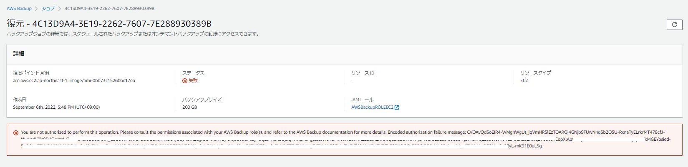

`aws sts decode-authorization-message`を使う

```json
[ec2-user@bastin ~]$ aws sts decode-authorization-message --encoded-message CVOAvQdSoEIR4<省略>
{
    "DecodedMessage": "{\"allowed\":false,\"explicitDeny\":false,\"matchedStatements\":{\"items\":[]},\"failures\":{\"items\":[]},\"context\":{\"principal\":{\"id\":\"AROAR23YLZYEOUMEHOE2O:AWSBackup-AWSBackupROLEEC2\",\"arn\":\"arn:aws:sts::xxxxxx:assumed-role/AWSBackupROLEEC2/AWSBackup-AWSBackupROLEEC2\"},\"action\":\"iam:PassRole\",\"resource\":\"arn:aws:iam::xxxxxx:role/IAM_ROLE_EC2_Access\",\"conditions\":{\"items\":[{\"key\":\"aws:Region\",\"values\":{\"items\":[{\"value\":\"ap-northeast-1\"}]}},{\"key\":\"aws:Service\",\"values\":{\"items\":[{\"value\":\"ec2\"}]}},{\"key\":\"aws:Resource\",\"values\":{\"items\":[{\"value\":\"role/IAM_ROLE_EC2_Access\"}]}},{\"key\":\"iam:RoleName\",\"values\":{\"items\":[{\"value\":\"IAM_ROLE_EC2_Access\"}]}},{\"key\":\"aws:Type\",\"values\":{\"items\":[{\"value\":\"role\"}]}},{\"key\":\"aws:Account\",\"values\":{\"items\":[{\"value\":\"xxxxxx\"}]}},{\"key\":\"aws:ARN\",\"values\":{\"items\":[{\"value\":\"arn:aws:iam::xxxxxx:role/IAM_ROLE_EC2_Access\"}]}}]}}}"

```

