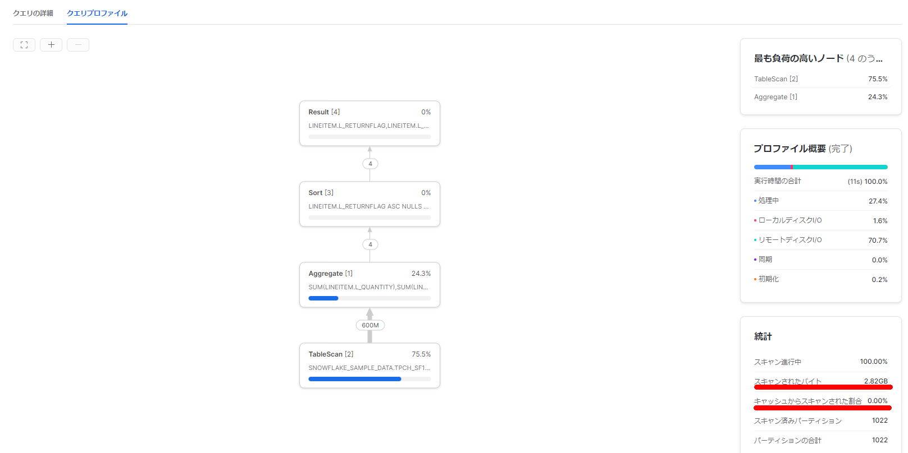
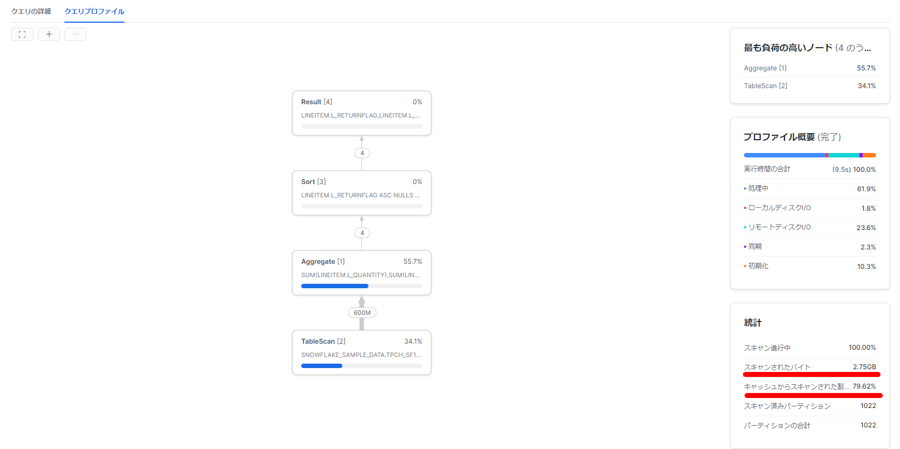
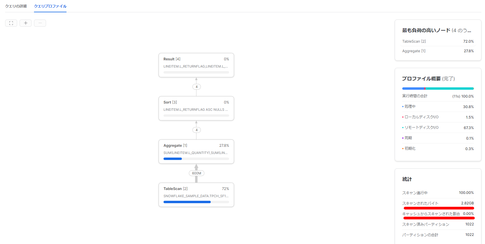

Snowflakeの結果キャッシュはパラメータを変更することで無効化することが出来るが、データキャッシュを無効化することは出来るのか？と思い確認してみた。

### 結論

ウェアハウスの一時停止、再開を行う。

> [ウェアハウスに関する考慮事項 — Snowflake Documentation](https://docs.snowflake.com/ja/user-guide/warehouses-considerations.html)
>
> - ウェアハウスが一時停止されると、このキャッシュはドロップされるため、ウェアハウスの再開後、一部のクエリの初期パフォーマンスが低下する可能性があります。再開されたウェアハウスが実行され、より多くのクエリが処理されると、キャッシュが再構築され、キャッシュを利用できるクエリのパフォーマンスが向上します。

```sql
SHOW WAREHOUSES;
ALTER WAREHOUSE IF EXISTS XSMALL SUSPEND;
SHOW WAREHOUSES;
ALTER WAREHOUSE XSMALL RESUME IF SUSPENDED;
SHOW WAREHOUSES;
```

### SQL

```sql
SELECT l_returnflag, l_linestatus,  
SUM(l_quantity) AS sum_qty,  
SUM(l_extendedprice) AS sum_base_price,  
SUM(l_extendedprice * (l_discount)) AS sum_disc_price, 
SUM(l_extendedprice * (l_discount) * (1+l_tax)) AS sum_charge,  
AVG(l_quantity) AS avg_qty,  
AVG(l_extendedprice) AS avg_price,  
AVG(l_discount) AS avg_disc,  
COUNT(*) AS count_order  
FROM lineitem 
WHERE l_shipdate <= dateadd(day, 90, to_date('1998-12-01'))  
GROUP BY l_returnflag, l_linestatus  
ORDER BY l_returnflag, l_linestatus;
```

### 初回実行

リモートディスク（S3）からの読み取りが発生する。キャッシュからスキャンされた割合も当然0%となる。



### 何もしない状態で2回実行した際のクエリプロファイル

結果キャッシュを使用することで高速に完了する


### クエリ結果キャッシュの無効化

```sql
SHOW PARAMETERS LIKE '%USE_CACHED_RESULT%';
ALTER SESSION SET USE_CACHED_RESULT = FALSE;
```

結果キャッシュは使用されずともデータキャッシュから読み取られている。（ウェアハウスのサイズが小さいのですべてがキャッシュに乗り切れていないのかもしれない。）



### データキャッシュを無効化する方法について

> Is it possible to clear the cache? https://community.snowflake.com/s/question/0D50Z00008SNECoSAP/is-it-possible-to-clear-the-cache
>
> Aside from the USE_CACHED_RESULT session parameter, is there any way to force the warehouse cache to disable? https://community.snowflake.com/s/question/0D70Z000001l2ovSAA/detail

上記に記載の通り、コマンドとしては用意されていないようなので、ウェアハウスの停止、起動を行うことでデータキャッシュを使用されないようにする。

- [ウェアハウスに関する考慮事項 — Snowflake Documentation](https://docs.snowflake.com/ja/user-guide/warehouses-considerations.html)
  - ウェアハウスが一時停止されると、このキャッシュはドロップされるため、ウェアハウスの再開後、一部のクエリの初期パフォーマンスが低下する可能性があります。再開されたウェアハウスが実行され、より多くのクエリが処理されると、キャッシュが再構築され、キャッシュを利用できるクエリのパフォーマンスが向上します。

```sql
SHOW WAREHOUSES;
ALTER WAREHOUSE IF EXISTS XSMALL SUSPEND;
SHOW WAREHOUSES;
ALTER WAREHOUSE XSMALL RESUME IF SUSPENDED;
SHOW WAREHOUSES;
```

キャッシュからスキャンされた割合が0%に。



### 参考

> - [Snowflakeの3種類のキャッシュについてお勉強してみた \#SnowflakeDB \| DevelopersIO](https://dev.classmethod.jp/articles/snowflake-cache-three/)
