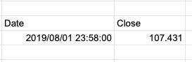

GOOGLEFINANCE関数だけを使用するとDateとClose時点のPriceを指定してしまう。

```
=GOOGLEFINANCE("CURRENCY:USDJPY", "price", "2019/8/1")
```



関数を`index(..., 2, 2)`でラップして、2行目の2番目のセルだけを取得

```
=index(GOOGLEFINANCE("CURRENCY:USDJPY", "price", "2019/8/1"), 2, 2)
```

特定企業の株価を取得。こちらもIndex関数を使用してほしい情報のみを取得

```
=index(GOOGLEFINANCE("NASDAQ:AMZN", "price", "2019/8/1"), 2, 2)
```

