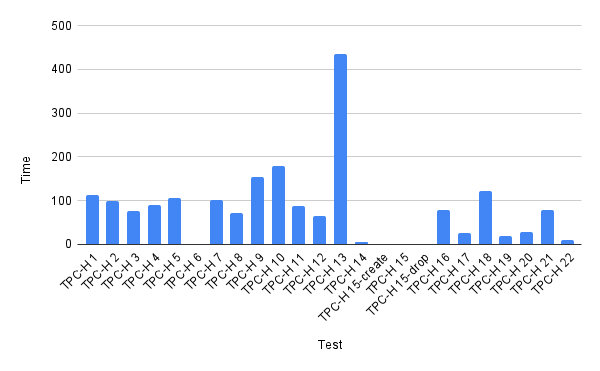

この[Githubのスクリプト](https://github.com/SatoriCyber/snowflake-tpch-timing)を参考にしつつ動くようにしました。

### 参考資料

- TPC BENCHMARKTM H https://www.tpc.org/tpc_documents_current_versions/pdf/tpc-h_v3.0.1.pdf
- TPC Download Current Specs/Source https://www.tpc.org/tpc_documents_current_versions/current_specifications5.asp?utm_source=pocket_saves

## 事前準備

### スクリプト実行環境

```sh
zatoima@M1MBA snowflake_benchmark % sw_vers
ProductName:		macOS
ProductVersion:		13.0
BuildVersion:		22A380
```

### ロール作成するためにSECURITYADMINを使用
```sql
USE ROLE SECURITYADMIN;
```


### ロール作成
```sql
CREATE ROLE WORKROLE;
```

### 作ったSYSADMIN および自分のユーザーに権限を付与する（継承）
```sql
GRANT ROLE WORKROLE TO ROLE SYSADMIN;
GRANT ROLE WORKROLE TO USER zato;
```


### ウェアハウスを作るのでロール切り替え&作成
```sql
USE ROLE SYSADMIN;
CREATE WAREHOUSE WORK_WH WITH
  WAREHOUSE_SIZE = xsmall
  INITIALLY_SUSPENDED = TRUE
  AUTO_SUSPEND = 60
  AUTO_RESUME = TRUE;
```

### ウェアハウスの使用権限の付与
```sql
GRANT USAGE ON WAREHOUSE WORK_WH TO ROLE WORKROLE;
```

### DB作成
```sql
CREATE DATABASE TESTDB;
```

### 任意のスキーマでテーブルを作成するために必要なすべての権限をロールに付与
```sql
GRANT USAGE ON DATABASE TESTDB TO ROLE WORKROLE;
GRANT USAGE ON SCHEMA TESTDB.PUBLIC TO ROLE WORKROLE;
GRANT CREATE TABLE ON SCHEMA TESTDB.PUBLIC TO ROLE WORKROLE;
```

### テーブル作成
```sql
USE ROLE WORKROLE;
USE WAREHOUSE WORK_WH;
USE DATABASE TESTDB;
USE SCHEMA TESTDB.PUBLIC;
```

### VIEW作成用のスキーマを作成

```sql
CREATE DATABASE TESTDB;
CREATE SCHEMA temp;
GRANT USAGE ON DATABASE TESTDB TO ROLE WORKROLE;
GRANT USAGE ON SCHEMA TESTDB.temp TO ROLE WORKROLE;
GRANT CREATE TABLE ON SCHEMA TESTDB.temp TO ROLE WORKROLE;
GRANT CREATE VIEW ON SCHEMA TESTDB.TEMP TO ROLE WORKROLE;
```

### pipでライブラリをインストール
```python
pip install snowflake.connector,logzero
```

### 下記の通りファイルを配置する
```sh
zatoima@M1MBA snowflake_benchmark % tree
.
├── tpch.py
└── tpch.sql
```

### Python

`tpch.py`として作成。環境依存部分を書き換える。結果キャッシュを使わないようにセッションパラメータ(`USE_CACHED_RESULT`)を設定。

```python
import snowflake.connector
import time
from logzero import logger
import logzero
import os

# 環境依存
direct_con = snowflake.connector.connect(
    user='xxxx',
    password='xxxxx',
    account='xxxxxxx',
    database='SNOWFLAKE_SAMPLE_DATA',
    schema='tpch_sf10',
    warehouse='WORK_WH'
    session_parameters={
        'USE_CACHED_RESULT': 'False',
    }
)

NUM_OF_SAMPLES = 10

# 環境依存ここまで
# SQLスクリプト側のVIEWの作成用データベースとスキーマも環境依存なので注意

def benchmark():
    print("Benchmarking for snowflake")

    filename = "results.txt"
    with open(filename, 'w') as result_file:
        with open('tpch.sql') as f:
            all_queries = f.read()
            results = "Test\tTime\n"
            for i in range(0, NUM_OF_SAMPLES):

                # Running the benchmark for each query in the queries file
                for query in all_queries.split(';'):
                    #If there is a blank line, "IndexError: list index out of range list split" is returned, so "if statement" is added.
                    if query != '\n':
                        label = query.split("-- ")[1].split('\n')[0]
                        query = query.rstrip()
                        start_ts = time.time()

                        logger.info(label + " Start!!")
                        cs = direct_con.cursor()
                        cs.execute(query)
                        rows = cs.fetchall()
                        for _row in rows:
                            continue

                        end_ts = time.time()
                        delta = end_ts-start_ts
                        # Results are tab-delimited for easy pasting to a spreadsheet
                        results += "{0:s}\t{1:3.5f}\n".format(label, delta)
                        logger.info(label + " Done!!")
            result_file.write(results)

if __name__ == "__main__":
    if "LOG_LEVEL" in os.environ:
        logzero.loglevel(int(os.environ["LOG_LEVEL"]))
    benchmark()
```

### 実行用SQL

Python側から呼ばれるTPC-H用のSQL。

※VIEWの作成用データベースとスキーマも環境依存なので注意。`TESTDB`の`TEMP`スキーマに作成している

```sql
-- TPC-H 1
select
	l_returnflag,
	l_linestatus,
	sum(l_quantity) as sum_qty,
	sum(l_extendedprice) as sum_base_price,
	sum(l_extendedprice * (1 - l_discount)) as sum_disc_price,
	sum(l_extendedprice * (1 - l_discount) * (1 + l_tax)) as sum_charge,
	avg(l_quantity) as avg_qty,
	avg(l_extendedprice) as avg_price,
	avg(l_discount) as avg_disc,
	count(*) as count_order
from
	lineitem
where
	l_shipdate <= DATEADD(day, 90, '1998-12-01')
group by
	l_returnflag,
	l_linestatus
order by
	l_returnflag,
	l_linestatus;

-- TPC-H 2
select
	s_acctbal,
	s_name,
	n_name,
	p_partkey,
	p_mfgr,
	s_address,
	s_phone,
	s_comment
from
	part,
	supplier,
	partsupp,
	nation,
	region
where
	p_partkey = ps_partkey
	and s_suppkey = ps_suppkey
	and p_size = 15
	and p_type like '%BRASS'
	and s_nationkey = n_nationkey
	and n_regionkey = r_regionkey
	and r_name = 'EUROPE'
	and ps_supplycost = (
		select
			min(ps_supplycost)
		from
			partsupp,
			supplier,
			nation,
			region
		where
			p_partkey = ps_partkey
			and s_suppkey = ps_suppkey
			and s_nationkey = n_nationkey
			and n_regionkey = r_regionkey
			and r_name = 'EUROPE'
	)
order by
	s_acctbal desc,
	n_name,
	s_name,
	p_partkey LIMIT 100;

-- TPC-H 3
select
	l_orderkey,
	sum(l_extendedprice * (1 - l_discount)) as revenue,
	o_orderdate,
	o_shippriority
from
	customer,
	orders,
	lineitem
where
	c_mktsegment = 'BUILDING'
	and c_custkey = o_custkey
	and l_orderkey = o_orderkey
	and o_orderdate < date '1995-03-15'
	and l_shipdate > date '1995-03-15'
group by
	l_orderkey,
	o_orderdate,
	o_shippriority
order by
	revenue desc,
	o_orderdate limit 10;

-- TPC-H 4
select
	o_orderpriority,
	count(*) as order_count
from
	orders
where
	o_orderdate >= date '1993-07-01'
	AND o_orderdate < DATEADD(month, 3, '1993-07-01')
	and exists (
		select
			*
		from
			lineitem
		where
			l_orderkey = o_orderkey
			and l_commitdate < l_receiptdate
	)
group by
	o_orderpriority
order by
	o_orderpriority;

-- TPC-H 5
select
	n_name,
	sum(l_extendedprice * (1 - l_discount)) as revenue
from
	customer,
	orders,
	lineitem,
	supplier,
	nation,
	region
where
	c_custkey = o_custkey
	and l_orderkey = o_orderkey
	and l_suppkey = s_suppkey
	and c_nationkey = s_nationkey
	and s_nationkey = n_nationkey
	and n_regionkey = r_regionkey
	and r_name = 'ASIA'
	and o_orderdate >= date '1994-01-01'
	AND o_orderdate < DATEADD(year, 1, '1994-01-01')
group by
	n_name
order by
	revenue desc;

-- TPC-H 6
select
	sum(l_extendedprice * l_discount) as revenue
from
	snowflake_sample_data.tpch_sf1.lineitem
where
	l_shipdate >= date '1994-01-01'
	AND l_shipdate < DATEADD(year, 1, '1994-01-01')
	and l_discount between .06 - 0.01 and .06 + 0.01
	and l_quantity < 24;

-- TPC-H 7
select
	supp_nation,
	cust_nation,
	l_year,
	sum(volume) as revenue
from
	(
		select
			n1.n_name as supp_nation,
			n2.n_name as cust_nation,
			extract(year from l_shipdate) as l_year,
			l_extendedprice * (1 - l_discount) as volume
		from
			supplier,
			lineitem,
			orders,
			customer,
			nation n1,
			nation n2
		where
			s_suppkey = l_suppkey
			and o_orderkey = l_orderkey
			and c_custkey = o_custkey
			and s_nationkey = n1.n_nationkey
			and c_nationkey = n2.n_nationkey
			and (
				(n1.n_name = 'FRANCE' and n2.n_name = 'GERMANY')
				or (n1.n_name = 'GERMANY' and n2.n_name = 'FRANCE')
			)
			and l_shipdate between date '1995-01-01' and date '1996-12-31'
	) as shipping
group by
	supp_nation,
	cust_nation,
	l_year
order by
	supp_nation,
	cust_nation,
	l_year;

-- TPC-H 8
select
	o_year,
	sum(case
		when nation = 'BRAZIL' then volume
		else 0
	end) / sum(volume) as mkt_share
from
	(
		select
			extract(year from o_orderdate) as o_year,
			l_extendedprice * (1 - l_discount) as volume,
			n2.n_name as nation
		from
			part,
			supplier,
			lineitem,
			orders,
			customer,
			nation n1,
			nation n2,
			region
		where
			p_partkey = l_partkey
			and s_suppkey = l_suppkey
			and l_orderkey = o_orderkey
			and o_custkey = c_custkey
			and c_nationkey = n1.n_nationkey
			and n1.n_regionkey = r_regionkey
			and r_name = 'AMERICA'
			and s_nationkey = n2.n_nationkey
			and o_orderdate between date '1995-01-01' and date '1996-12-31'
			and p_type = 'ECONOMY ANODIZED STEEL'
	) as all_nations
group by
	o_year
order by
	o_year;

-- TPC-H 9
select
	nation,
	o_year,
	sum(amount) as sum_profit
from
	(
		select
			n_name as nation,
			extract(year from o_orderdate) as o_year,
			l_extendedprice * (1 - l_discount) - ps_supplycost * l_quantity as amount
		from
			part,
			supplier,
			lineitem,
			partsupp,
			orders,
			nation
		where
			s_suppkey = l_suppkey
			and ps_suppkey = l_suppkey
			and ps_partkey = l_partkey
			and p_partkey = l_partkey
			and o_orderkey = l_orderkey
			and s_nationkey = n_nationkey
			and p_name like '%green%'
	) as profit
group by
	nation,
	o_year
order by
	nation,
	o_year desc;

-- TPC-H 10
select
	c_custkey,
	c_name,
	sum(l_extendedprice * (1 - l_discount)) as revenue,
	c_acctbal,
	n_name,
	c_address,
	c_phone,
	c_comment
from
	customer,
	orders,
	lineitem,
	nation
where
	c_custkey = o_custkey
	and l_orderkey = o_orderkey
	and o_orderdate >= date '1993-10-01'
	AND o_orderdate < DATEADD(month, 3, '1993-10-01')
	and l_returnflag = 'R'
	and c_nationkey = n_nationkey
group by
	c_custkey,
	c_name,
	c_acctbal,
	c_phone,
	n_name,
	c_address,
	c_comment
order by
	revenue desc limit 20;

-- TPC-H 11
select
	ps_partkey,
	sum(ps_supplycost * ps_availqty) as value
from
	partsupp,
	supplier,
	nation
where
	ps_suppkey = s_suppkey
	and s_nationkey = n_nationkey
	and n_name = 'GERMANY'
group by
	ps_partkey having
		sum(ps_supplycost * ps_availqty) > (
			select
				sum(ps_supplycost * ps_availqty) * 0.0001000000
			from
				partsupp,
				supplier,
				nation
			where
				ps_suppkey = s_suppkey
				and s_nationkey = n_nationkey
				and n_name = 'GERMANY'
		)
order by
	value desc;

-- TPC-H 12
select
	l_shipmode,
	sum(case
		when o_orderpriority = '1-URGENT'
			or o_orderpriority = '2-HIGH'
			then 1
		else 0
	end) as high_line_count,
	sum(case
		when o_orderpriority <> '1-URGENT'
			and o_orderpriority <> '2-HIGH'
			then 1
		else 0
	end) as low_line_count
from
	orders,
	lineitem
where
	o_orderkey = l_orderkey
	and l_shipmode in ('MAIL', 'SHIP')
	and l_commitdate < l_receiptdate
	and l_shipdate < l_commitdate
	and l_receiptdate >= date '1994-01-01'
	AND o_orderdate < DATEADD(year, 1, '1994-01-01')
group by
	l_shipmode
order by
	l_shipmode;

-- TPC-H 13
select
	c_count,
	count(*) as custdist
from
	(
		select
			c_custkey,
			count(o_orderkey)
		from
			customer left outer join orders on
				c_custkey = o_custkey
				and o_comment not like '%special%requests%'
		group by
			c_custkey
	) as c_orders (c_custkey, c_count)
group by
	c_count
order by
	custdist desc,
	c_count desc;

-- TPC-H 14
select
	100.00 * sum(case
		when p_type like 'PROMO%'
			then l_extendedprice * (1 - l_discount)
		else 0
	end) / sum(l_extendedprice * (1 - l_discount)) as promo_revenue
from
	lineitem,
	part
where
	l_partkey = p_partkey
	and l_shipdate >= date '1995-09-01'
	AND l_shipdate < DATEADD(month, 1, '1995-09-01');

-- TPC-H 15-create
create view testdb.temp.revenue0 (supplier_no, total_revenue) as
	select
		l_suppkey,
		sum(l_extendedprice * (1 - l_discount))
	from
		snowflake_sample_data.tpch_sf1.lineitem
	where
		l_shipdate >= date '1996-01-01'
	AND l_shipdate < DATEADD(month, 3, '1996-01-01')
	group by
		l_suppkey;

-- TPC-H 15
select
	s_suppkey,
	s_name,
	s_address,
	s_phone,
	total_revenue
from
	supplier,
	testdb.temp.revenue0
where
	s_suppkey = supplier_no
	and total_revenue = (
		select
			max(total_revenue)
		from
			testdb.temp.revenue0
	)
order by
	s_suppkey;

-- TPC-H 15-drop
drop view testdb.temp.revenue0;

-- TPC-H 16
select
	p_brand,
	p_type,
	p_size,
	count(distinct ps_suppkey) as supplier_cnt
from
	partsupp,
	part
where
	p_partkey = ps_partkey
	and p_brand <> 'Brand#45'
	and p_type not like 'MEDIUM POLISHED%'
	and p_size in (49, 14, 23, 45, 19, 3, 36, 9)
	and ps_suppkey not in (
		select
			s_suppkey
		from
			supplier
		where
			s_comment like '%Customer%Complaints%'
	)
group by
	p_brand,
	p_type,
	p_size
order by
	supplier_cnt desc,
	p_brand,
	p_type,
	p_size;

-- TPC-H 17
select
	sum(l_extendedprice) / 7.0 as avg_yearly
from
	lineitem,
	part
where
	p_partkey = l_partkey
	and p_brand = 'Brand#23'
	and p_container = 'MED BOX'
	and l_quantity < (
		select
			0.2 * avg(l_quantity)
		from
			lineitem
		where
			l_partkey = p_partkey
	);


-- TPC-H 18
select
	c_name,
	c_custkey,
	o_orderkey,
	o_orderdate,
	o_totalprice,
	sum(l_quantity)
from
	customer,
	orders,
	lineitem
where
	o_orderkey in (
		select
			l_orderkey
		from
			lineitem
		group by
			l_orderkey having
				sum(l_quantity) > 300
	)
	and c_custkey = o_custkey
	and o_orderkey = l_orderkey
group by
	c_name,
	c_custkey,
	o_orderkey,
	o_orderdate,
	o_totalprice
order by
	o_totalprice desc,
	o_orderdate
limit 100;


-- TPC-H 19
select
	sum(l_extendedprice* (1 - l_discount)) as revenue
from
	lineitem,
	part
where
	(
		p_partkey = l_partkey
		and p_brand = 'Brand#12'
		and p_container in ('SM CASE', 'SM BOX', 'SM PACK', 'SM PKG')
		and l_quantity >= 1 and l_quantity <= 1 + 10
		and p_size between 1 and 5
		and l_shipmode in ('AIR', 'AIR REG')
		and l_shipinstruct = 'DELIVER IN PERSON'
	)
	or
	(
		p_partkey = l_partkey
		and p_brand = 'Brand#23'
		and p_container in ('MED BAG', 'MED BOX', 'MED PKG', 'MED PACK')
		and l_quantity >= 10 and l_quantity <= 10 + 10
		and p_size between 1 and 10
		and l_shipmode in ('AIR', 'AIR REG')
		and l_shipinstruct = 'DELIVER IN PERSON'
	)
	or
	(
		p_partkey = l_partkey
		and p_brand = 'Brand#34'
		and p_container in ('LG CASE', 'LG BOX', 'LG PACK', 'LG PKG')
		and l_quantity >= 20 and l_quantity <= 20 + 10
		and p_size between 1 and 15
		and l_shipmode in ('AIR', 'AIR REG')
		and l_shipinstruct = 'DELIVER IN PERSON'
	);


-- TPC-H 20
select
	s_name,
	s_address
from
	supplier,
	nation
where
	s_suppkey in (
		select
			ps_suppkey
		from
			partsupp
		where
			ps_partkey in (
				select
					p_partkey
				from
					part
				where
					p_name like 'forest%'
			)
			and ps_availqty > (
				select
					0.5 * sum(l_quantity)
				from
					lineitem
				where
					l_partkey = ps_partkey
					and l_suppkey = ps_suppkey
					and l_shipdate >= date '1994-01-01'
                	AND l_shipdate < DATEADD(year, 1, '1994-01-01')
			)
	)
	and s_nationkey = n_nationkey
	and n_name = 'CANADA'
order by
	s_name;

-- TPC-H 21
select
	s_name,
	count(*) as numwait
from
	supplier,
	lineitem l1,
	orders,
	nation
where
	s_suppkey = l1.l_suppkey
	and o_orderkey = l1.l_orderkey
	and o_orderstatus = 'F'
	and l1.l_receiptdate > l1.l_commitdate
	and exists (
		select
			*
		from
			lineitem l2
		where
			l2.l_orderkey = l1.l_orderkey
			and l2.l_suppkey <> l1.l_suppkey
	)
	and not exists (
		select
			*
		from
			lineitem l3
		where
			l3.l_orderkey = l1.l_orderkey
			and l3.l_suppkey <> l1.l_suppkey
			and l3.l_receiptdate > l3.l_commitdate
	)
	and s_nationkey = n_nationkey
	and n_name = 'SAUDI ARABIA'
group by
	s_name
order by
	numwait desc,
	s_name limit 100;


-- TPC-H 22
select
	cntrycode,
	count(*) as numcust,
	sum(c_acctbal) as totacctbal
from
	(
		select
      SUBSTRING(c_phone, 1, 2) AS cntrycode,
			c_acctbal
		from
			customer
		where
          SUBSTRING(c_phone, 1, 2) IN
				('13', '31', '23', '29', '30', '18', '17')
			and c_acctbal > (
				select
					avg(c_acctbal)
				from
					customer
				where
					c_acctbal > 0.00
                    AND SUBSTRING(c_phone, 1, 2) IN
						('13', '31', '23', '29', '30', '18', '17')
			)
			and not exists (
				select
					*
				from
					orders
				where
					o_custkey = c_custkey
			)
	) as custsale
group by
	cntrycode
order by
	cntrycode
```

### 実行
```python
python3 tpch.py
```

### 実行後

`results.txt`に出力される

```bash
zatoima@M1MBA snowflake_benchmark % cat results.txt
Test	Time
TPC-H 1	113.73667
TPC-H 2	99.42642
TPC-H 3	75.91233
TPC-H 4	90.76858
TPC-H 5	106.15041
TPC-H 6	0.61596
TPC-H 7	101.50721
TPC-H 8	72.16892
TPC-H 9	153.48268
TPC-H 10	180.15991
TPC-H 11	87.48690
TPC-H 12	64.69897
TPC-H 13	435.00685
TPC-H 14	5.21159
TPC-H 15-create	0.27758
TPC-H 15	1.82527
TPC-H 15-drop	0.17074
TPC-H 16	78.74033
TPC-H 17	25.61653
TPC-H 18	122.15002
TPC-H 19	19.55574
TPC-H 20	28.58548
TPC-H 21	78.01457
TPC-H 22	9.47315
```



バッググランド実行をしてキューの溜まり具合やマルチクラスタの動作を見ることができるはず。どうせならウェアハウスのサイズ変更の自動化を出来るようにしておけばよかった。


