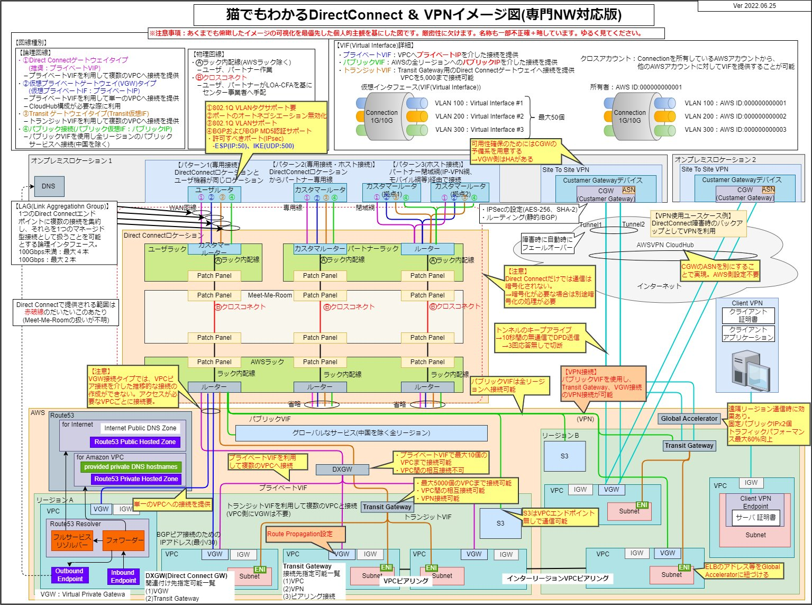

最高にわかりやすかった。毎回マニュアルかBlackbelt見ないと理解出来ないのでメモしておく。`[@kamogashira](https://twitter.com/kamogashira)`さんのツイートから。

https://twitter.com/kamogashira/status/1589182761440792576?s=12&t=KUYcQm1RyjKtp8WCm3QJVQ

