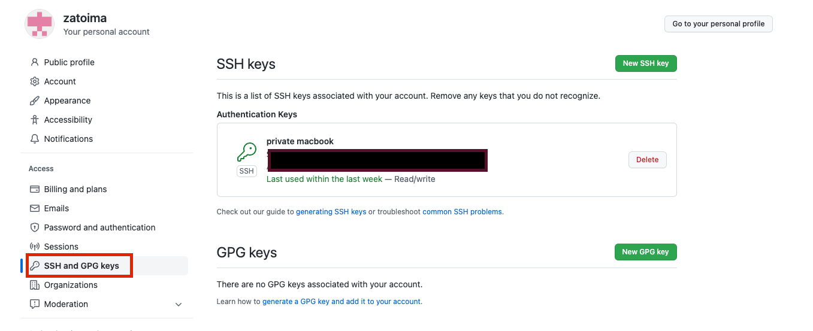

WindowsからMacにHugoのブログ執筆環境を移行した際の環境構築（移行）メモです。

#### OS確認
```sh
xxxx@xxxx blog % sw_vers
ProductName:		macOS
ProductVersion:		13.0.1
BuildVersion:		22A400
```

#### hugoのインストール
```sh
brew install hugo
```

#### 作業用ディレクトリの作成
```sh
mkdir -p /Users/jimazato/work/hugo/zatoima.github.io
```

#### Githubの初期設定
公開鍵を生成してGithubの`SSH and GPG Keys`に登録する
```sh
cd $HOME/.ssh && ls
ssh-keygen -t rsa -f id_rsa_git
cat id_rsa_git.pub
```



ssh接続の際「~/.ssh/id_rsa」、「~/.ssh/id_dsa」、「~/.ssh/identity」しかデフォルトではチェックしないので、デフォルトから変更した場合は`$HOME/.ssh`配下にconfigファイルを作成し下記のように記載する。
```sh
jimazato@XXXXXXX .ssh % cat config
Host github github.com
  HostName github.com
  IdentityFile ~/.ssh/id_rsa_git #ここに自分の鍵のファイル名
  User git
```

これをやっていない場合、pushやpull時に下記のようにエラーとなってしまう。
```sh
jimazato@XXXXXXX zatoima.github.io % git pull origin master
This key is not known by any other names
Are you sure you want to continue connecting (yes/no/[fingerprint])? yes
Warning: Permanently added 'github.com' (ED25519) to the list of known hosts.
git@github.com: Permission denied (publickey).
fatal: Could not read from remote repository.
```

その他のGithub側の初期設定。
```sh
git config --global user.name zatoima
git config --global user.email xxxx.xxxxx@gmail.com
git remote set-url origin git@github.com:
git remote set-url origin git@github.com:zatoima/zatoima.github.io.git
```

こんな感じになっていると思う
```sh
jimazato@XXXXXXX zatoima.github.io % git remote -v
origin	git@github.com:zatoima/zatoima.git (fetch)
origin	git@github.com:zatoima/zatoima.git (push)
```

ここまで来たらpullやpush、clone等をして設定の正しさを確認する。


