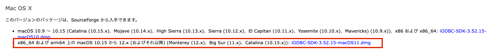
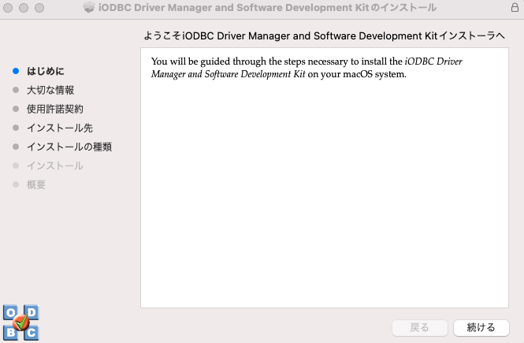
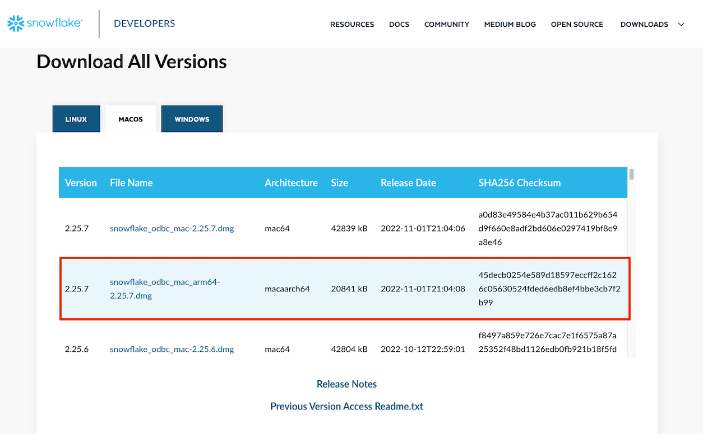
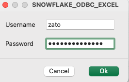
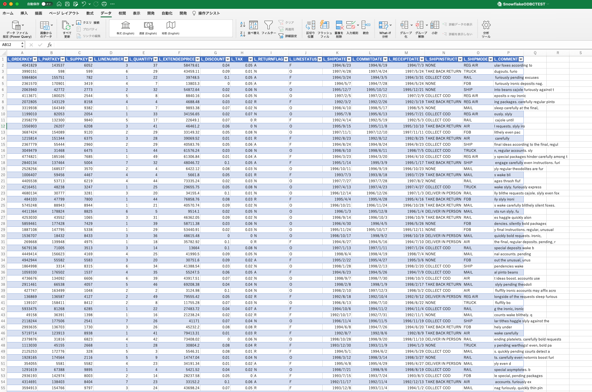
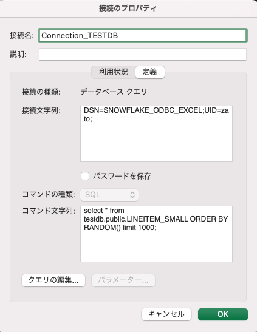

M1 MacからSnowflakeへExcelで接続する場合の設定メモ。

### MacのVersion
```sh
(base) jimazato@CJ2VQ9Y2M1 ~ % sw_vers
ProductName:		macOS
ProductVersion:		13.0.1
BuildVersion:		22A400
```

### ODBCとは
Open Database Connectivity（オープン・データベース・コネクティビティ）

> https://e-words.jp/w/ODBC.html
> ODBCとは、アプリケーションソフトがデータベース管理システム（DBMS）などに接続し、データの取得や書き込み、操作などを行う方法の標準を定めたもの。Microsoft社が制定したもので、主に同社のWindowsで動作するデータベース関連ソフトウェアで用いられる。

なお、LinuxやUnix、Mac OSの場合はiODBCを使うことになる。

### iODBCのダウンロード
- [iODBC Driver Manager: iODBC Downloads](https://www.iodbc.org/dataspace/doc/iodbc/wiki/iodbcWiki/Downloads)

arm64なので赤枠部分をダウンロードする。



 - ダウンロードした`iODBC-SDK-3.52.15-macOS11.dmg`をインストール(インストーラーファイルのiODBC-SDK.pkgを実行していく)

   

下記ディレクトリにインストールされる。

```sh
(base) jimazato@CJ2VQ9Y2M1 ~ % cd "/Library/Application Support/iODBC/bin"
(base) jimazato@CJ2VQ9Y2M1 bin % ls -l
total 648
-rwxrwxr-x  1 root  wheel    6222  6  7  2021 iodbc-config
-rwxrwxr-x  1 root  wheel  153360  6  7  2021 iodbctest
-rwxrwxr-x  1 root  wheel  153360  6  7  2021 iodbctestw
-rwxrwxr-x  1 root  wheel    9450  6  7  2021 uninstall-iodbc.pl
```

### ODBC マネージャーのインストール

下記からインストール

> http://www.odbcmanager.net/


### Snowflake用のODBCドライバーのインストール

Snowflake用のODBCドライバーをインストールする。

https://developers.snowflake.com/odbc/

`macaarch64`をインストール



```sh
(base) jimazato@CJ2VQ9Y2M1 iODBC % cd /opt/snowflake/snowflakeodbc
(base) jimazato@CJ2VQ9Y2M1 snowflakeodbc % ls -l
total 0
drwxr-xr-x  3 root  wheel   96  7 29 02:51 ErrorMessages
drwxr-xr-x  4 root  wheel  128  7 29 02:51 Setup
drwxr-xr-x  3 root  wheel   96  7 29 02:51 Tools
drwxr-xr-x  3 root  wheel   96  7 29 02:51 include
drwxr-xr-x  3 root  wheel   96  7 29 02:51 lib
(base) jimazato@CJ2VQ9Y2M1 snowflakeodbc % find .
.
./Tools
./Tools/DriverInstaller
./ErrorMessages
./ErrorMessages/en-US
./ErrorMessages/en-US/SQLEngineMessages.xml
./ErrorMessages/en-US/ODBCMessages.xml
./ErrorMessages/en-US/SFMessages.xml
./include
./include/sf_odbc.h
./Setup
./Setup/odbc.ini
./Setup/odbcinst.ini
./lib
./lib/universal
./lib/universal/libSnowflake.dylib
./lib/universal/cacert.pem
./lib/universal/simba.snowflake.ini
(base) jimazato@CJ2VQ9Y2M1 snowflakeodbc %
```

### ODBC マネージャーを使用したデータソースの管理

ダウンロードした Snowflake ODBC ドライバーからすべてのファイルを `/Library/ODBC/ODBCDataSources` フォルダーにコピー

```sh
(base) jimazato@CJ2VQ9Y2M1 ~ % cp /opt/snowflake/snowflakeodbc/lib/universal/* /Library/ODBC/ODBCDataSources
(base) jimazato@CJ2VQ9Y2M1 ~ %
(base) jimazato@CJ2VQ9Y2M1 ~ % cd /Library/ODBC/ODBCDataSources
(base) jimazato@CJ2VQ9Y2M1 ODBCDataSources % ll
total 281032
-rw-r--r--@ 1 jimazato  admin     222172 12 23 21:21 cacert.pem
-rwxr-xr-x@ 1 jimazato  admin  143657808 12 23 21:21 libSnowflake.dylib
-rw-r--r--@ 1 jimazato  admin       1340 12 23 21:21 simba.snowflake.ini
```

`simba.snowflake.ini` ファイルを開き、`ODBCInstLib`で ODBC ドライバー マネージャーの`libiodbcinst.dylib`ライブラリ パスを指定し、CABundleFile の詳細で証明書の`cacert.pem`パスを指定。

このとき、`ODBCInstLib`の場所に注意する必要がある。環境依存のケースが多いため`mdfind -name libodbcinst.dylib`等で検索した方が早そう。

```sh
vi /Library/ODBC/ODBCDataSources/simba.snowflake.ini 
```

```sh
# To use this INI file, replace [INSTALLDIR] with the
# directory the tarball was extracted to.

[Driver]
ANSIENCODING=UTF-8

## Note that this default DriverManagerEncoding of UTF-32 is for iODBC. unixODBC uses UTF-16 by default.
## If unixODBC was compiled with -DSQL_WCHART_CONVERT, then UTF-32 is the correct value.
## Execute 'odbc_config --cflags' to determine if you need UTF-32 or UTF-16 on unixODBC
DriverManagerEncoding=UTF-32
DriverLocale=en-US
ErrorMessagesPath=/Library/ODBC/ErrorMessages
LogLevel=0
LogPath=/tmp
CURLVerboseMode=false
ODBCInstLib=/Users/jimaza$$to/opt/anaconda3/lib/libodbcinst.dylib
CABundleFile=/Library/ODBC/ODBCDataSources/cacert.pem

## - Uncomment the ODBCInstLib corresponding to the Driver Manager being used.
## - Note that the path to your ODBC Driver Manager must be specified in LD_LIBRARY_PATH (LIBPATH for AIX, DYLD_LIBRARY_PATH for Darwin).
## - Note that AIX has a different format for specifying its shared libraries.

# Generic ODBCInstLib
#   iODBC
# ODBCInstLib=libiodbcinst.so

#   SimbaDM / unixODBC
#ODBCInstLib=libodbcinst.so

# Darwin specific ODBCInstLib
#   iODBC
ODBCInstLib=libodbcinst.dylib
# ODBCInstLib=libiodbcinst.dylib

# AIX specific ODBCInstLib
#   iODBC
#ODBCInstLib=libiodbcinst.a(libiodbcinst.so.2)

#   SimbaDM
#ODBCInstLib=libodbcinst.a(odbcinst.so)

#   unixODBC
#ODBCInstLib=libodbcinst.a(libodbcinst.so.1)
```


`odbcinst.ini`の設定。このとき、変更するodbc.iniでユーザ個別の設定となるかのか全ユーザ共通の設定となるシステムDSNとなるかが決まる。下記の通り、このodbc.iniに異なるエントリを追加することで複数のDSN設定を持つことが出来る。

> - [macOS用 ODBC ドライバーのインストールと構成 — Snowflake Documentation](https://docs.snowflake.com/ja/user-guide/odbc-mac.html?utm_source=pocket_saves#creating-a-dsn-by-adding-an-entry-in-the-odbc-ini-file)

- ユーザー DSNs ： ~/Library/ODBC/odbc.ini
- システム DSNs ： /Library/ODBC/odbc.ini

```sh
(base) jimazato@CJ2VQ9Y2M1 ODBCDataSources % vi /Library/ODBC/odbcinst.ini
(base) jimazato@CJ2VQ9Y2M1 ODBCDataSources % cat /Library/ODBC/odbcinst.ini
[ODBC Drivers]
SnowflakeDSIIDriver=Installed

[SnowflakeDSIIDriver]
APILevel=1
ConnectFunctions=YYY
Description=Snowflake DSII
Driver=/Library/ODBC/ODBCDataSources/libSnowflake.dylib
DriverODBCVer=03.52
SQLLevel=1
```

`odbc.ini`の設定
```sh
(base) jimazato@CJ2VQ9Y2M1 ODBCDataSources % vi /Library/ODBC/odbc.ini
(base) jimazato@CJ2VQ9Y2M1 ODBCDataSources % cat /Library/ODBC/odbc.ini$$
[ODBC Data Sources]
SNOWFLAKE_ODBC_EXCEL = SnowflakeDSIIDriver

[SNOWFLAKE_ODBC_EXCEL]
Driver      = /Library/ODBC/ODBCDataSources/libSnowflake.dylib
Description =  Internal Snowflake
uid         = zato
server      = xxxxx.ap-northeast-1.aws.snowflakecomputing.com
database    = testdb
schema      = public
warehouse   = WORK_WH
role        = WORKROLE
tracing     = 6
```

ここまでで事前準備が完了したので、ExcelからSnowflakeにODBC経由で接続する。

「データ」->「データベースから（Microsoft Query）」を選択


DSNを選択する画面が出力される。`odbc.ini`の内容が反映されているはずなので`System DSN`から作成したDSNを選択する。


`Test`ボタンをクリックするとユーザ名とパスワードを求められる。


正常に接続出来た場合、下記のように成功画面が出力される。


実際にクエリを設定する画面がこちら。SQLを直書きしてデータを引っ張ってくるSQLを定義する。




接続のプロパティとして下記のような設定画面がある。更新間隔やファイルを開くときにデータを更新する等が選択出来るが、都度都度ウェアハウスが起動してクエリが投げられるのもよろしくないと思うため、要件に応じて必要かどうか検討した方が良さそう。


クエリ文字列定義は定義タブで確認出来るため、SQLを修正したい場合はこちらから。


### 参考資料
- [How to configure Excel on MacOS to use Snowflake using ODBC driver?](https://community.snowflake.com/s/article/How-to-configure-Excel-on-MacOS-to-use-Snowflake-using-ODBC-driver)
- [macOS用 ODBC ドライバーのインストールと構成 — Snowflake Documentation](https://docs.snowflake.com/ja/user-guide/odbc-mac.html?utm_source=pocket_saves)
