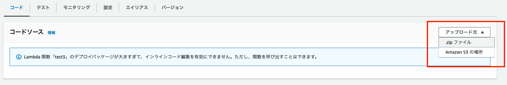
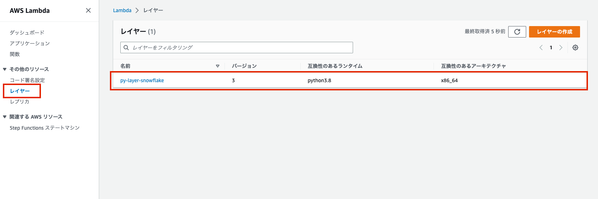

### はじめに

snowflake-connector-pythonのようなLambdaで対応していないPythonライブラリを使用したい場合、下記のいずれかの方法を使用してLambdaを構成する必要がある。

1. zip ファイルアーカイブ
2. Lambdaレイヤー
3. コンテナ

ネット上にあった方法で実行したところ、下記のエラーに悩まされ、`1.zip ファイルアーカイブ`や`2.Lambdaレイヤー`のいずれも想定通りに動作しなかったので方法1と2のDockerを使ったzipファイルアーカイブ方法やLambdaレイヤー作成方法をメモしておく。

> AWS Lambda: Unable to import module 'python_handler': No module named '_cffi_backend'

原因については、`amazonlinux`のイメージではNGで`aws-sam-cli-build-image-python3.8`ではOKだったので、環境準備が不十分だったと思っている。

ここに至るまでに試した方法は下記の通り。

- [Lambda から Snowflake にシュッとつなぎたい！ \- Qiita](https://qiita.com/foursue/items/394f39786693ee362fef)
- [Lambda packaging the right way \- OzNetNerd\.com](https://oznetnerd.com/2020/11/11/lambda-packaging-the-right-way/)
- [python \- AWS Lambda: Unable to import module 'python\_handler': No module named '\_cffi\_backend' \- Stack Overflow](https://stackoverflow.com/questions/57189352/aws-lambda-unable-to-import-module-python-handler-no-module-named-cffi-bac)

### 実行環境

```sh
(base) jimazato@CJ2VQ9Y2M1 ~ % sw_vers
ProductName:		macOS
ProductVersion:		13.0.1
BuildVersion:		22A400
(base) jimazato@CJ2VQ9Y2M1 ~ % docker --version
Docker version 20.10.21, build baeda1f
(base) jimazato@CJ2VQ9Y2M1 ~ % docker-compose --version
Docker Compose version v2.13.0
```

### 方法1:zip ファイルアーカイブを使用する

##### ファイルの配置

```sh
base) jimazato@CJ2VQ9Y2M1 snow_lambda_zip % tree
.
├── Dockerfile
├── docker-compose.yml
├── lambda_function.py
└── requirements.txt
```

#### Dockerfile

※ArmアーキテクチャのM1 Mac上でx86_64向けのPython環境を動作させるため、明示的に`--platform`を指定

aws-sam-cli-build-image-pythonはLamdbaで動作している環境とほぼ同一のようなので、イメージとして非常に大きい。なお、ここでイメージ指定を例えば`amazonlinux:latest`にした場合、上記で記載した`AWS Lambda: Unable to import module 'python_handler': No module named '_cffi_backend'`が自分の環境で出てしまった。

```sh
FROM --platform=linux/x86_64 amazon/aws-sam-cli-build-image-python3.8:latest

RUN yum update -y
RUN yum install python3 -y
RUN pip3 install virtualenv
RUN yum install zip -y
RUN yum -y install gcc openssl-devel bzip2-devel libffi-devel zip
```

##### docker-compose.yml

※ArmアーキテクチャのM1 Mac上でx86_64向けのPython環境を動作させるため、明示的に`--platform`を指定

```sh
version: '2'
services:
  app_zip:
    build: .
    platform: linux/x86_64
    volumes:
      - '.:/var/task'
    working_dir: /var/task
    command: >
     bash -c 'virtualenv env &&
     source env/bin/activate &&
     mkdir -p snow_lambda &&
     cd ./snow_lambda &&
     pip3 install -r ../requirements.txt -t . &&
     zip -9 ../snow_lambda.zip ../lambda_function.py &&
     zip -r9 /var/task/snow_lambda.zip .'
```

##### requirements.txt

```sh
snowflake-connector-python
```

##### lambda_function.py

中身は省略

#### コマンド

```sh
docker-compose build --no-cache
docker-compose up -d
```

`snow_lambda.zip`がカレントディレクトリに出来るので、これをLambdaにアップロードして実行する。

```sh
(base) jimazato@CJ2VQ9Y2M1 snow_lambda_zip % ls -l
total 67640
-rw-r--r--@  1 jimazato  staff       300  1  1 16:13 Dockerfile
-rw-r--r--@  1 jimazato  staff       419  1  4 09:14 docker-compose.yml
drwxr-xr-x@  6 jimazato  staff       192  1  4 10:04 env
-rw-r--r--@  1 jimazato  staff      1335  1  1 15:14 lambda_function.py
-rw-r--r--@  1 jimazato  staff        27  1  1 15:30 requirements.txt
drwxr-xr-x@ 44 jimazato  staff      1408  1  4 10:05 snow_lambda
-rw-r--r--@  1 jimazato  staff  34570052  1  4 10:05 snow_lambda.zip
```



#### 参考

- [\.zip ファイルアーカイブで Python Lambda 関数をデプロイする \- AWS Lambda](https://docs.aws.amazon.com/ja_jp/lambda/latest/dg/python-package.html)

### 方法2:Lambdaレイヤーを使用する

##### ファイルの配置

```sh
base) jimazato@CJ2VQ9Y2M1 snow_lambda_zip % tree
.
├── Dockerfile
├── docker-compose.yml
└── requirements.txt
```

#### Dockerfile

方法1とDockerファイルは変わらない。

※ArmアーキテクチャのM1 Mac上でx86_64向けのPython環境を動作させるため、明示的に`--platform`を指定

```sh
FROM --platform=linux/x86_64 amazon/aws-sam-cli-build-image-python3.8:latest

RUN yum update -y
RUN yum install python3 -y
RUN pip3 install virtualenv
RUN yum install zip -y
RUN yum -y install gcc openssl-devel bzip2-devel libffi-devel zip
```

##### docker-compose.yml

方法1とほぼ一緒のコマンドとなるが、lambda_function.pyはLambdaレイヤーには不要なので入れていないのと、`/opt/python/`配下に各ライブラリが配置されるように微修正。

※ArmアーキテクチャのM1 Mac上でx86_64向けのPython環境を動作させるため、明示的に`--platform`を指定

```sh
version: '2'
services:
  app_layer:
    build: .
    platform: linux/x86_64
    volumes:
      - '.:/var/task'
    working_dir: /var/task
    command: >
     bash -c 'virtualenv env &&
     source env/bin/activate &&
     mkdir -p python &&
     pip3 install -r requirements.txt -t ./python &&
     zip -r9 /var/task/layer.zip python'

```

##### requirements.txt

```sh
snowflake-connector-python
```

#### コマンド

```sh
docker-compose build --no-cache
docker-compose up -d
```

`layer.zip`がカレントディレクトリに出来るので、これをLambdaレイヤーにアップロードして実行する。

```sh
(base) jimazato@CJ2VQ9Y2M1 snow_lambda_layer % ls -l
total 67632
-rw-r--r--@  1 jimazato  staff       300  1  1 16:13 Dockerfile
-rw-r--r--@  1 jimazato  staff       336  1  1 22:53 docker-compose.yml
drwxr-xr-x@  6 jimazato  staff       192  1  4 10:06 env
-rw-r--r--@  1 jimazato  staff      1335  1  1 15:14 lambda_function.py
-rw-r--r--@  1 jimazato  staff  34608594  1  4 10:08 layer.zip
drwxr-xr-x@ 44 jimazato  staff      1408  1  4 10:07 python
-rw-r--r--@  1 jimazato  staff        27  1  1 15:30 requirements.txt
```




#### 参考

- [Lambda レイヤーの作成と共有 \- AWS Lambda](https://docs.aws.amazon.com/ja_jp/lambda/latest/dg/configuration-layers.html)
- [AWS Lambda Layersでライブラリを共通化 \- Qiita](https://qiita.com/t_okkan/items/394a15577bd1aad46ec3)

---

### 追記（2026-02-23）

本記事の執筆時点ではPython 3.8を使用していましたが、以下の点にご注意ください。

- **Python 3.8はAWS Lambdaで非推奨・サポート終了済み**：2025年2月以降、Python 3.8での新規Lambda関数の作成はできなくなっています。現在はPython 3.13が最新のサポートランタイムです。新規で構築する場合は`aws-sam-cli-build-image-python3.12`以降のイメージを使用してください
- **Docker Compose V1（`docker-compose`コマンド）は非推奨**：2023年7月にサポート終了しています。`docker compose`（ハイフンなし）コマンドに移行してください
- **`docker-compose.yml`の`version`フィールドは不要**：Docker Compose V2ではCompose Specificationが採用され、`version`キーは無視されます。削除しても問題ありません
