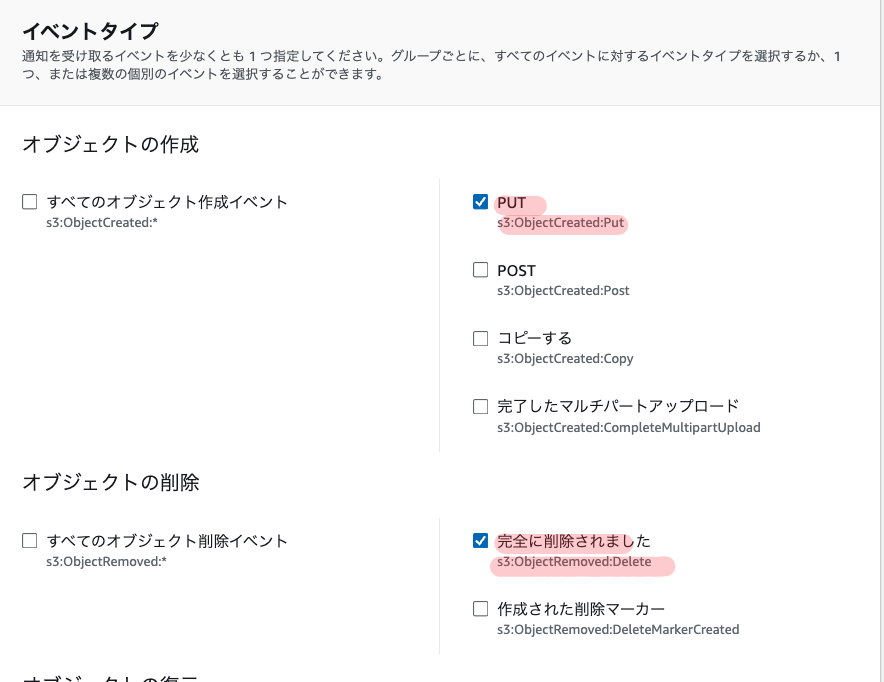

## はじめに

AWSのS3バケットとSnowflakeのディレクトリテーブル機能を使って、S3上のデータファイルの変更を自動的にSnowflakeのメタデータに反映させる方法についてやってみる。S3バケットへのファイルの追加・更新・削除を検知し、それをトリガーにしてSnowflakeのディレクトリテーブルのメタデータを最新の状態に保つことができる。

## ディレクトリテーブルとは

ディレクトリテーブルは、Snowflakeのステージ上のデータファイルに関するメタデータを格納するオブジェクトで、外部テーブルに似た概念で、ステージ内のファイルのパス、サイズ、最終更新日時などの情報を保持する

ディレクトリテーブルを使うことで、以下のような非構造化データの処理が可能になる。

- ステージ上の全ファイルのリストとメタデータのクエリ
- 非構造化データと構造化データを組み合わせたビューの作成
- ファイル処理パイプラインの構築

ディレクトリテーブルのメタデータは、クラウドストレージのイベント通知と連携することで自動更新できる。これにより、ステージ上のファイルの追加・更新・削除を常にメタデータに反映させておくことが可能である。

今回はAWS上で実施してみる

## 前提条件

- AWSアカウントとS3バケットが作成済みであること
- Snowflakeアカウントが作成済みであること
- S3バケットとSnowflakeを連携するためのストレージ統合が設定済みであること

## 手順

### ステップ1: ディレクトリテーブル付きの外部ステージを作成

まず、S3バケットを指すSnowflakeの外部ステージを、ディレクトリテーブルオプションを指定して作成する

```sql
CREATE STAGE mystage
  URL='s3://mybucket/path/'
  STORAGE_INTEGRATION = my_storage_int
  DIRECTORY = (ENABLE = true, AUTO_REFRESH = true);
```

- URLにはS3バケットのパスを指定
- STORAGE_INTEGRATIONにはあらかじめ作成したストレージ統合オブジェクトを指定
- DIRECTORYオプションでENABLE=trueとAUTO_REFRESH=trueを指定し、ディレクトリテーブルを有効化

### ステップ2: 通知用SQSキューのARNを確認

ディレクトリテーブルの更新に使われるSQSキューのARN(Amazon Resource Name)を確認。

`DESC STAGE mystage;` を実行し、出力内の `directory_notification_channel` の値をコピーする。

### ステップ3: S3バケットのイベント通知を設定

AWSマネジメントコンソールからS3バケットのプロパティ画面を開き、「イベント通知」の設定を実施

- 「イベント」で `s3:ObjectCreated:Put` と `s3:ObjectRemoved:Delete` を選択



- 「送信先」で `SQS キュー` を選択し、ステップ2でコピーしたSQSキューのARNを指定

これで、S3バケットへのオブジェクトの作成・削除が、指定したSQSキューへ通知されるようになる。

### ステップ4: 初回のメタデータ更新を手動で実行

`ALTER STAGE mystage REFRESH;` コマンドを実行して、現時点でのS3バケットの状態をディレクトリテーブルに反映させる。この初回の手動更新が完了すると、以降はS3のイベント通知をトリガーに自動更新が行われるようになる。

### ステップ5: アクセス権限の設定

ディレクトリテーブルをクエリするために必要な権限を、追加のロールに付与します。

- データベースとスキーマに対する `USAGE` 権限
- ステージに対する `USAGE` と `READ` 権限
- ファイルフォーマットに対する `USAGE` 権限

## ディレクトリテーブルの活用

### ディレクトリテーブルのクエリ

ディレクトリテーブルに対してSELECT文を実行することで、ステージ上の全ファイルのリストと、各ファイルのメタデータを取得できる。

```sql
SELECT * FROM DIRECTORY(@mystage);
```

これにより、以下のような列が返される。

- RELATIVE_PATH : ファイルへの相対パス
- SIZE : ファイルサイズ(バイト)
- LAST_MODIFIED : 最終更新日時
- FILE_URL : ファイルへのSnowflake URL
- etc.

条件によるフィルタリングも可能である。

```sql
-- 100KBより大きいファイルのURLを取得
SELECT FILE_URL FROM DIRECTORY(@mystage) WHERE SIZE > 100000;

-- CSVファイルのURLを取得
SELECT FILE_URL FROM DIRECTORY(@mystage) WHERE RELATIVE_PATH LIKE '%.csv';
```

### ユースケース1:非構造化データのビュー作成

ディレクトリテーブルを他のテーブルと結合することで、ファイルのメタデータと他の情報を組み合わせた非構造化データのビューを作成できる。

例えば、PDFファイルを格納したステージ `my_pdf_stage` と、それらのメタデータテーブル `report_metadata` があるとする。FILE_URLをキーにしてJOINすることで、以下のようなビューが作成できる。

```sql
CREATE VIEW reports_information AS
  SELECT
    file_url AS report_link,
    author,  
    publish_date,
    approved_date,
    geography,
    num_of_pages
  FROM directory(@my_pdf_stage) s
  JOIN report_metadata m
    ON s.file_url = m.file_url;
```

このビューには、各PDFファイルのURLと、著者や公開日などの関連メタデータが含まれる。

### ユースケース2:データ処理パイプラインの構築

ディレクトリテーブルをSnowflakeの他の機能と組み合わせることで、データ処理パイプラインを構築することもできる。

例えば、以下のようなステップでPDFファイルを処理するシンプルなパイプラインが作れる。

1. ディレクトリテーブル付きのステージ `my_pdf_stage` を作成
2. ディレクトリテーブルの変更を検知するストリーム `my_pdf_stream` を作成
3. PDFからデータを抽出するUDF `PDF_PARSE` を作成
4. 抽出したデータを格納するテーブル `prod_reviews` を作成
5. ストリームをトリガーにタスク `load_new_file_data` を作成し、UDFを実行してテーブルにデータをロード

ステージにPDFを追加すると、タスクが自動実行されてテーブルにデータが挿入される。`prod_reviews` をクエリすれば、PDFから抽出されたデータを参照できる。

### ディレクトリテーブルでのストリームの作成

ディレクトリテーブルの変更を検知するために、Snowflakeストリームを作成することもできる。

```sql
CREATE STREAM dirtable_mystage_s ON STAGE mystage;
```

ストリームにデータを流し込むには、ディレクトリテーブルのメタデータを手動更新する。

```sql
ALTER STAGE mystage REFRESH;
```

ステージにファイルを追加した後、ストリームをクエリすると変更が確認できる。

```sql
SELECT * FROM dirtable_mystage_s;
```

出力:

```text
+-------------------+--------+-------------------------------+----------------------------------+----------------------------------+-------------------------------------------------------------------------------------------+-----------------+-------------------+-----------------+
| RELATIVE_PATH     | SIZE   | LAST_MODIFIED                 | MD5                              | ETAG                             | FILE_URL                                                                                  | METADATA$ACTION | METADATA$ISUPDATE | METADATA$ROW_ID |
|-------------------+--------+-------------------------------+----------------------------------+----------------------------------+-------------------------------------------------------------------------------------------+-----------------+-------------------+-----------------|
| file1.csv.gz      |   1048 | 2021-05-14 06:09:08.000 -0700 | c98f600c492c39bef249e2fcc7a4b6fe | c98f600c492c39bef249e2fcc7a4b6fe | https://myaccount.snowflakecomputing.com/api/files/MYDB/MYSCHEMA/MYSTAGE/file1%2ecsv%2egz | INSERT          | False             |                 |
| file2.csv.gz      |   3495 | 2021-05-14 06:09:09.000 -0700 | 7f1a4f98ef4c7c42a2974504d11b0e20 | 7f1a4f98ef4c7c42a2974504d11b0e20 | https://myaccount.snowflakecomputing.com/api/files/MYDB/MYSCHEMA/MYSTAGE/file2%2ecsv%2egz | INSERT          | False             |                 |
+-------------------+--------+-------------------------------+-------------------------------
```

このストリームを使って、ディレクトリテーブルへのファイルの追加・削除を検知し、さらなる処理をトリガーすることができる。

## 注意事項

- S3イベント通知は、ディレクトリテーブルのメタデータ更新専用のSQSキューを指定する必要がある。他の用途と共用してはならない。
- 1つのS3バケットに対して作成できるイベント通知設定は最大100個までである。
- 同じS3バケットのプレフィックス(ディレクトリ)に対し、重複するイベント通知は作成できない。
- Snowflakeのストレージ統合の設定で、S3バケットへの適切なアクセス権限を付与しておく必要がある。
- SnowflakeのステージにENCRYPTION=(TYPE='SNOWFLAKE_SSE')の設定が必要である。設定がないとダウンロードしたファイルが破損する可能性がある。

## 請求について

ディレクトリテーブルのメタデータ自動更新に関する管理オーバーヘッドは、Snowpipeの料金として請求される。料金はステージに追加されるファイル数に応じて増加する。

`PIPE_USAGE_HISTORY` 関数や `Account Usage PIPE_USAGE_HISTORY` ビューで使用量を確認できる。

メタデータの手動更新(`ALTER STAGE REFRESH`)を行う場合も、若干の追加料金が発生する。

## まとめ

以上の手順により、S3をデータソースとしSnowflakeのディレクトリテーブルを使う環境において、S3のファイル変更を自動的にメタデータに反映させることができる。

これにより、常に最新のデータに対してクエリを実行できるようになり、データパイプラインの自動化を促進できる。

ディレクトリテーブルは、ファイルのメタデータを他のテーブルと結合して活用することもでき、非構造化データを柔軟に扱うことができる。

また、ディレクトリテーブルの変更を検知するストリームを作成することで、リアルタイムにファイルの追加・削除を検知し、それをトリガーにしたデータ処理フローを構築することもできる。

## 参考資料

[ディレクトリテーブルを使用したデータ処理パイプラインの構築 \| Snowflake Documentation](https://docs.snowflake.com/ja/user-guide/data-load-dirtables-pipeline)

[ディレクトリテーブルの自動化されたメタデータ更新 \| Snowflake Documentation](https://docs.snowflake.com/ja/user-guide/data-load-dirtables-auto)

[ディレクトリテーブルのクエリ \| Snowflake Documentation](https://docs.snowflake.com/ja/user-guide/data-load-dirtables-query)

