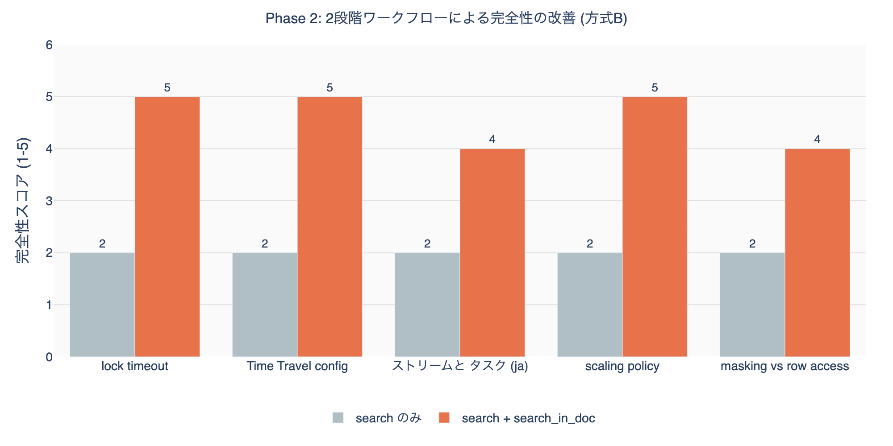

## はじめに

Snowflake公式ドキュメントの検索用MCPサーバーとして、`snowflake-documentation-assistant`と自作の`snowflake-docs`の2つを運用している。



自作のMCP Serverを作った理由としてはCKEのデプロイ無しにローカルで動作させているClaude Code、Cursor、Cortex Code CLIから参照させたいと思ったからだ。

`snowflake-documentation-assistant`のバックエンドは、Snowflakeの[Cortex Agent](https://docs.snowflake.com/en/user-guide/snowflake-cortex/cortex-agents)に[Cortex Knowledge Extension（CKE）](https://docs.snowflake.com/en/user-guide/snowflake-cortex/cortex-knowledge-extensions/cke-overview)としてCortex Search Serviceを登録したものである。Cortex AgentはCortex Search（非構造化データ）やCortex Analyst（構造化データ）をツールとして統合し、LLMベースでオーケストレーションを行う仕組みで、これをMCPサーバーとしてラップし、Claude CodeやCursor、Cortex Code CLI等から呼び出す構成となっている。一方の`snowflake-docs`は公式サイトのAPIとスクレイピングをベースとした自作MCPサーバーである。

本記事では、10カテゴリ・20クエリ・5評価軸で包括的にベンチマークした結果をまとめる。

## 構成詳細

### 方式A: snowflake-documentation-assistant（Cortex Agent + CKE）

| 項目 | 詳細 |
|------|------|
| 識別子 | `snowflake-documentation-assistant` |
| バックエンド | Cortex Agent + Cortex Search Service（CKE） |
| 呼び出し方式 | MCPサーバーとしてClaude Code / Cursor / Cortex Code CLI等から利用 |
| 検索方式 | セマンティック検索（ベクトル類似度 + テキストマッチ） |
| ツール数 | 1個 |
| 対応言語 | 英語のみ |

Cortex Agentに登録されたCortex Search Service（CKE）がバックエンドとして動作し、ドキュメントチャンクをセマンティック検索してスコア付きで返却する。Claude Code等からはMCPサーバー経由でこのCortex Agentを呼び出す形となる。

| パラメータ | 型 | デフォルト | 説明 |
|-----------|-----|-----------|------|
| `query` (必須) | string | - | 非構造化テキストクエリ |
| `columns` | array[string] | 全カラム | 返却カラムの指定 |
| `filter` | object | - | Cortex Search フィルタ (`@eq`, `@contains`, `@gte`, `@lte`) |
| `limit` | integer | 10 | 最大結果数 |

特徴:
- 1回の呼び出しでチャンク全文が返る（追加呼び出し不要）
- セマンティック検索によりタイポ・表現揺れに対応
- フィルタ機能（日付・数値・属性）あり
- limit=5で約2,500-3,000トークン消費

### 方式B: snowflake-docs（自作MCPサーバー）

| 項目 | 詳細 |
|------|------|
| サーバー識別子 | `user-snowflake-docs` |
| GitHub | https://github.com/zatoima/snowflake-docs-mcp-server |
| 基盤技術 | Snowflake公式サイト API + スクレイピング |
| 検索方式 | キーワード全文検索（公式検索API） |
| ツール数 | 5個 |
| 対応言語 | 英語・日本語 (`language` パラメータ) |

#### ツール一覧

| # | ツール名 | 用途 | 主要パラメータ |
|---|---------|------|--------------|
| 1 | `search_snowflake_docs` | キーワード全文検索 | `query`, `max_results`(1-20), `language`("en"/"ja"), `include_headings` |
| 2 | `search_in_doc` | ページ内検索（関連セクション自動抽出） | `url`, `query`, `max_sections`(default 3), `max_length`(max 20000) |
| 3 | `get_doc_toc` | 見出し構造（目次）取得 | `url` |
| 4 | `get_doc_section` | 特定セクション取得 | `url`, `section_id`, `include_code_blocks`, `max_length` |
| 5 | `get_doc_content` | ページ全文取得 | `url`, `max_length`, `start_index`(ページネーション) |

推奨ワークフロー:

```
search_snowflake_docs(include_headings=True)  ~200-400 tokens
         |
         v
search_in_doc(url, query)                     ~600-900 tokens 追加
         |
         v
合計 ~800-1,200 tokens で必要情報を取得
```

特徴:
- 段階的取得で必要情報だけを効率的に取得
- コードブロックはデフォルト除外（`include_code_blocks=True` で取得）
- 日本語ドキュメントをネイティブサポート
- Knowledge Base記事も検索対象
- ページネーション対応

### アーキテクチャ比較

| 比較項目 | 方式A (Cortex Agent + CKE) | 方式B (snowflake-docs MCP) |
|---------|-------------------------------|----------------------|
| 種別 | MCPサーバー（バックエンド: Cortex Agent + CKE） | MCPサーバー（自作） |
| 検索方式 | セマンティック（ベクトル類似度） | キーワード（全文検索API） |
| ツール数 | 1 | 5 |
| 呼び出し回数 | 1回で完結 | 1-3回の段階的取得 |
| 典型的トークン消費数 | ~2,500-3,000 (limit=5) | ~200-400 (検索のみ), ~800-1,200 (2段階) |
| 日本語対応 | 非対応 | 対応 |
| コード例取得 | チャンクに含まれれば自動 | `include_code_blocks=True` で明示指定 |
| フィルタリング | Cortex Searchフィルタ | なし |
| ソース範囲 | 公式ドキュメント + SnowConvert | 公式ドキュメント + Knowledge Base |
| 粒度制御 | limit（チャンク数）のみ | max_results, max_sections, max_length, section_id |

## 評価方法

### スコアリング方式

各クエリの検索結果に対するスコアリングはLLM-as-a-Judge方式を採用した。Claude Opus 4.6が検索結果を評価し、5軸それぞれに1-5のスコアを付与している。人間による採点ではないため、評価の一貫性は高いが、主観的な判断が入る軸（特にノイズ率・ソース品質）については留意が必要である。

### 評価軸（5軸、各1-5スコア）

| 軸 | 定義 |
|---|---|
| 精度 (Accuracy) | 求めている情報が結果に含まれているか |
| 完全性 (Completeness) | 追加呼び出しなしで回答に十分な情報があるか |
| ノイズ率 (Noise) | 無関係な結果の混入度合い (5=ノイズなし) |
| コンテキスト効率 (Efficiency) | トークン消費に対する情報価値の比率 |
| ソース品質 (Source) | 公式リファレンスが上位に来るか |

### スコア定義（1-5）

| スコア | 精度 | 完全性 | ノイズ率 | コンテキスト効率 | ソース品質 |
|--------|------|--------|----------|------------------|------------|
| 5 | 正確な公式情報を返す | 追加検索不要で回答可能 | 無関係な結果なし | 最小トークンで必要情報を網羅 | 公式リファレンスのみ |
| 4 | 正確だが一部不足 | 軽微な補足で回答可能 | 無関係な結果が1-2件 | 多少の冗長はあるが許容範囲 | 公式が大半、一部KB記事混入 |
| 3 | 関連情報はあるが間接的 | 追加検索が1回必要 | 半数程度が無関係 | 情報量に対しトークン消費がやや多い | 公式と非公式が混在 |
| 2 | 部分的にしか一致しない | 複数回の追加検索が必要 | 大半が無関係 | 冗長な情報が多い | 非公式情報が大半 |
| 1 | 求めている情報がない | 回答不可能 | ほぼ全て無関係 | トークン消費に見合う情報なし | 公式情報なし |

### テストカテゴリ（10カテゴリ x 2クエリ = 20テスト）

1. SQL構文: CREATE DYNAMIC TABLE, MERGE INTO
2. 概念・アーキテクチャ: micro-partitions, scaling policy
3. エラー: Object does not exist, lock timeout
4. 新機能: Cortex Agent, Notebooks ML
5. ベストプラクティス: CSV loading, warehouse auto-suspend
6. セキュリティ: masking vs row access policy, network policy
7. パラメータ: STATEMENT_TIMEOUT, DATA_RETENTION_TIME
8. API/SDK: Snowpark saveAsTable, REST API
9. マイグレーション: Oracle PL/SQL, Redshift DISTKEY
10. 日本語: ストリームとタスク, 外部ステージ

## Phase 1: 20クエリ スコアマトリクス

各クエリの内容は上記テストカテゴリを参照。スコアは各軸1-5で、合計は25点満点。

### 方式A

| # | カテゴリ | Acc | Comp | Noise | Eff | Src | 合計 |
|---|---------|-----|------|-------|-----|-----|------|
| Q1 | SQL構文 | 5 | 5 | 5 | 3 | 5 | 23 |
| Q2 | SQL構文 | 4 | 4 | 3 | 2 | 3 | 16 |
| Q3 | 概念 | 5 | 5 | 5 | 3 | 5 | 23 |
| Q4 | 概念 | 4 | 4 | 3 | 3 | 5 | 19 |
| Q5 | エラー | 4 | 4 | 3 | 2 | 4 | 17 |
| Q6 | エラー | 4 | 4 | 4 | 2 | 5 | 19 |
| Q7 | 新機能 | 5 | 5 | 5 | 3 | 5 | 23 |
| Q8 | 新機能 | 5 | 5 | 5 | 3 | 5 | 23 |
| Q9 | BP | 4 | 4 | 3 | 2 | 3 | 16 |
| Q10 | BP | 5 | 5 | 5 | 3 | 5 | 23 |
| Q11 | セキュリティ | 3 | 3 | 3 | 2 | 4 | 15 |
| Q12 | セキュリティ | 4 | 4 | 4 | 2 | 5 | 19 |
| Q13 | パラメータ | 5 | 5 | 5 | 3 | 5 | 23 |
| Q14 | パラメータ | 5 | 5 | 5 | 3 | 5 | 23 |
| Q15 | API/SDK | 4 | 4 | 3 | 2 | 4 | 17 |
| Q16 | API/SDK | 5 | 5 | 5 | 3 | 5 | 23 |
| Q17 | 移行 | 4 | 3 | 3 | 2 | 4 | 16 |
| Q18 | 移行 | 5 | 5 | 4 | 2 | 4 | 20 |
| Q19 | 日本語 | 1 | 1 | 1 | 1 | 1 | 5 |
| Q20 | 日本語 | 1 | 1 | 1 | 1 | 1 | 5 |
| | **平均** | **4.1** | **4.1** | **3.8** | **2.4** | **4.2** | **18.4** |

### 方式B

| # | カテゴリ | Acc | Comp | Noise | Eff | Src | 合計 |
|---|---------|-----|------|-------|-----|-----|------|
| Q1 | SQL構文 | 5 | 2 | 5 | 5 | 5 | 22 |
| Q2 | SQL構文 | 5 | 2 | 3 | 5 | 4 | 19 |
| Q3 | 概念 | 5 | 2 | 5 | 5 | 5 | 22 |
| Q4 | 概念 | 4 | 2 | 4 | 5 | 4 | 19 |
| Q5 | エラー | 3 | 2 | 3 | 5 | 2 | 15 |
| Q6 | エラー | 4 | 2 | 3 | 5 | 3 | 17 |
| Q7 | 新機能 | 5 | 2 | 5 | 5 | 5 | 22 |
| Q8 | 新機能 | 5 | 2 | 5 | 5 | 5 | 22 |
| Q9 | BP | 5 | 2 | 4 | 5 | 4 | 20 |
| Q10 | BP | 4 | 2 | 3 | 5 | 4 | 18 |
| Q11 | セキュリティ | 5 | 2 | 5 | 5 | 5 | 22 |
| Q12 | セキュリティ | 5 | 2 | 4 | 5 | 4 | 20 |
| Q13 | パラメータ | 3 | 2 | 2 | 5 | 2 | 14 |
| Q14 | パラメータ | 3 | 2 | 1 | 5 | 2 | 13 |
| Q15 | API/SDK | 4 | 2 | 5 | 5 | 5 | 21 |
| Q16 | API/SDK | 5 | 2 | 5 | 5 | 5 | 22 |
| Q17 | 移行 | 5 | 2 | 5 | 5 | 5 | 22 |
| Q18 | 移行 | 5 | 2 | 5 | 5 | 5 | 22 |
| Q19 | 日本語 | 5 | 2 | 4 | 5 | 5 | 21 |
| Q20 | 日本語 | 5 | 2 | 5 | 5 | 5 | 22 |
| | **平均** | **4.5** | **2.0** | **4.0** | **5.0** | **4.2** | **19.8** |

### カテゴリ別集計


方式A優勢: 概念、エラー、新機能、ベストプラクティス、パラメータ（5カテゴリ）
方式B優勢: SQL構文、セキュリティ、API/SDK、マイグレーション、日本語（5カテゴリ）

### 軸別集計


## Phase 2: 深掘りワークフローテスト（snowflake-docs）

`search` + `search_in_doc` の2段階ワークフローで完全性がどう改善されるかを検証した。



`search_in_doc` を組み合わせると完全性が平均 2.0 → 4.6 に改善。追加コストは ~700-900 tokens。2段階ワークフロー合計は ~1,000-1,200 tokens で、方式A の ~2,500-3,000 tokens の約40%に収まる。

## Phase 3: 特殊ケーステスト

### 曖昧クエリ「how to connect」

| | 方式A | 方式B |
|---|---|---|
| 結果 | Spark接続、CONNECT BY構文 → ほぼ無関係 | UiPath, DataGrip, Tableau接続 → 具体的 |
| 精度 | 1 | 3 |

### 具体的クエリ「FLATTEN RECURSIVE nested JSON array」

| | 方式A | 方式B |
|---|---|---|
| 結果 | FLATTEN関数のコード例・パラメータ具体例 | FLATTENリファレンスページ + KB記事 |
| 精度 | 5 | 5 |
| 完全性 | 5 (コード例含む) | 2 (excerpt のみ) |

### 存在しない機能「Snowflake GraphQL API endpoint」

| | 方式A | 方式B |
|---|---|---|
| 結果 | SQL API, Cortex Search REST API | REST API, SQL API概要 |
| 精度 | 2 | 3 |
| 判定 | どちらも「存在しない」と明示しない |

### タイポ含みクエリ「CREAT TABEL with primery key」

| | 方式A | 方式B |
|---|---|---|
| 結果 | CREATE TABLE + PRIMARY KEY実例 | CREATE TABLE CONSTRAINT + リファレンス |
| 精度 | 4 | 5 |

### 特殊ケース集計

| テスト | 方式A | 方式B | 優勢 |
|--------|-------|-------|------|
| 曖昧 | 1 | 3 | B |
| 具体的 | 5 | 5 | 同点 (Aは完全性で優勢) |
| 存在しない機能 | 2 | 3 | B |
| タイポ | 4 | 5 | B |

## 総合スコアカード

### search のみ（1回呼び出し）

| 評価軸 | 方式A | 方式B | 優勢 |
|--------|-------|-------|------|
| 精度 | 4.1 | 4.5 | B |
| 完全性 | 4.1 | 2.0 | A |
| ノイズ率 | 3.8 | 4.0 | B |
| 効率 | 2.4 | 5.0 | B |
| ソース品質 | 4.2 | 4.2 | 同点 |
| 日本語対応 | 1.0 | 5.0 | B |
| 特殊ケース耐性 | 3.0 | 4.0 | B |

### 2段階ワークフロー（search + search_in_doc）

| 評価軸 | 方式A (1回) | 方式B (2回) | 優勢 |
|--------|-------------|-------------|------|
| 精度 | 4.1 | 4.5 | B |
| 完全性 | 4.1 | 4.6 | B |
| ノイズ率 | 3.8 | 4.0 | B |
| 効率 | 2.4 | 4.0 | B |
| トークン消費 | ~2,500-3,000 | ~1,000-1,200 | B |

## 検証から得られた所感

### 1. 日本語対応の決定的な差

方式Aは日本語クエリに対して全く関連のない結果を返した（text_matchスコア 0.0）。Cortex Search Serviceのインデックスが英語コンテンツのみで構成されていることが原因。方式Bは `language: "ja"` で日本語ドキュメントを正確に検索可能。

### 2. 完全性 vs 効率のトレードオフ

方式Aは1回でチャンク全文を返すため「完全性」が高い（4.1）が、コンテキスト消費が2-3倍になる。方式Bは2段階ワークフローで同等以上の完全性（4.6）をより少ないトークンで達成可能。

### 3. ソース多様性

方式BはKnowledge Base記事も検索対象に含む。トラブルシューティング系で有用だが、パラメータ関連ではKB記事が上位に来すぎて公式リファレンスが見つけにくい場合がある。

### 4. SnowConvertノイズ

方式Aはマイグレーション関連チャンク（SnowConvert: Oracle, Redshift等）が混入しやすい。SQL構文クエリで5件中3-4件がSnowConvertドキュメントになることがある。

### 5. パラメータ検索

方式Aはパラメータ名をチャンク内で直接マッチするため、`STATEMENT_TIMEOUT_IN_SECONDS` のような具体的パラメータの検索精度が高い。方式BではKB記事が上位に来る傾向がある。

## 関連記事





## 参考資料








