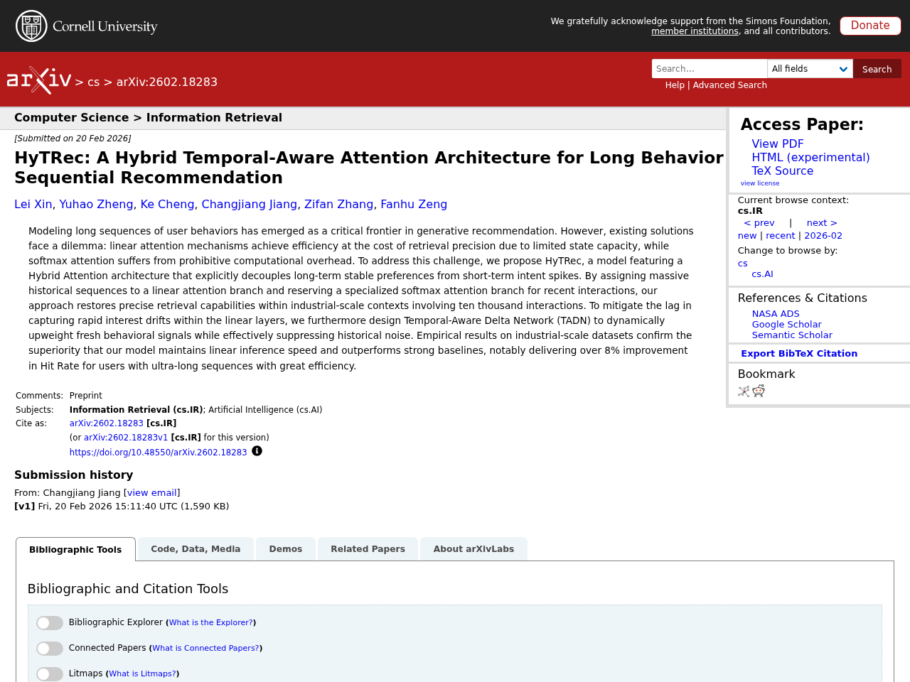
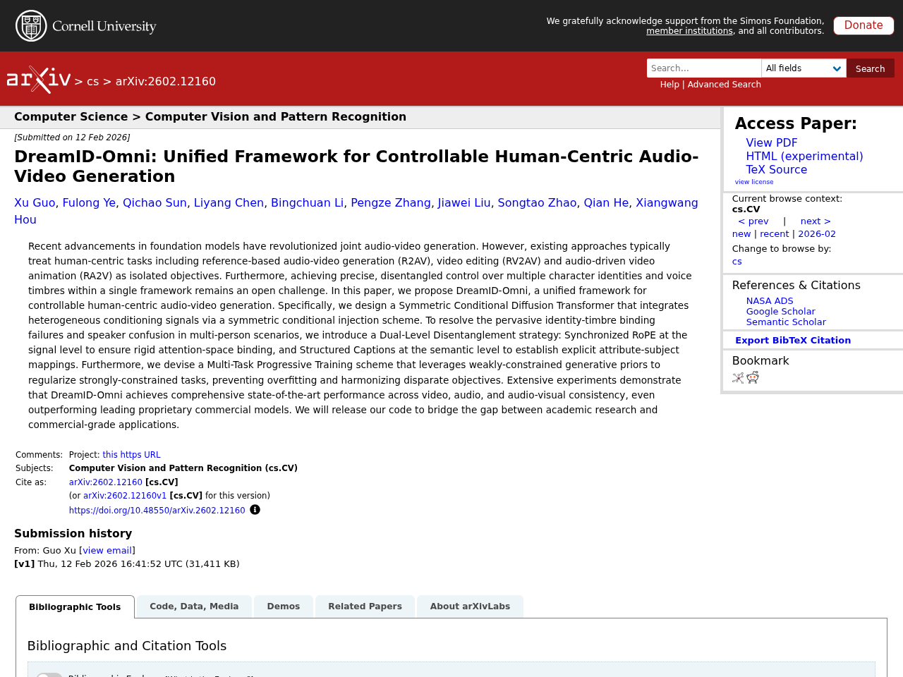
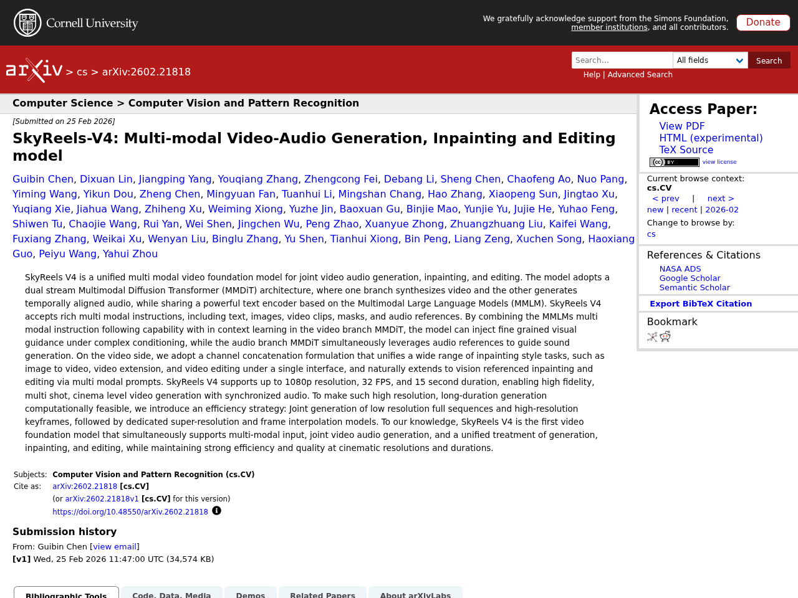
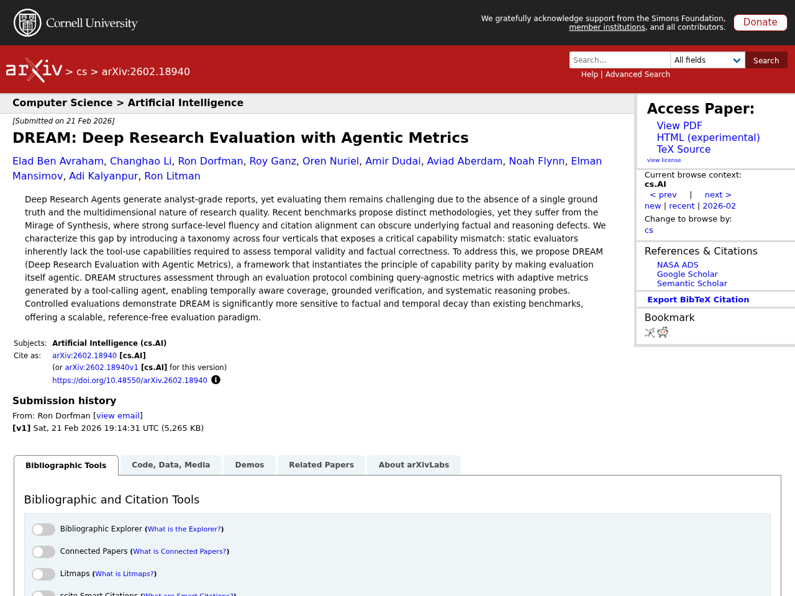
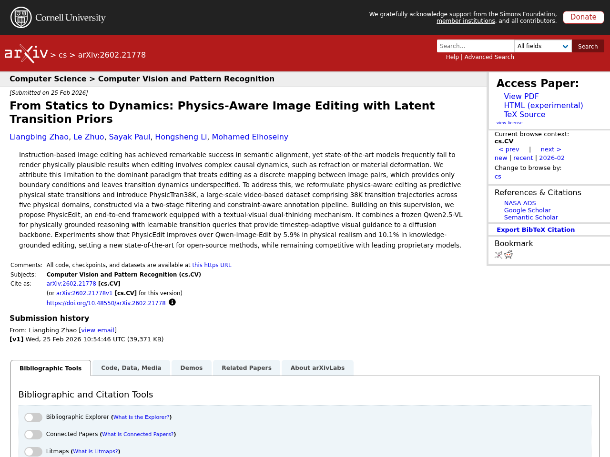

## はじめに

本記事は2026-02-27時点でのLLM関連の注目論文をまとめたものです。arXiv、Semantic Scholar、Hugging Face Daily Papersから自動収集し、Claude APIで日本語要約を生成しています。

## 1. HyTRec: A Hybrid Temporal-Aware Attention Architecture for Long Behavior Sequential Recommendation

- **著者**: Lei Xin, Yuhao Zheng, Ke Cheng, Changjiang Jiang, Zifan Zhang ほか
- **公開日**: 2026-02-20
- **ソース**: [huggingface](https://arxiv.org/abs/2602.18283)
- **arXiv ID**: 2602.18283

### 要約

生成的推薦システムにおけるユーザーの長期行動系列モデリングにおいて、線形アテンションは効率的だが検索精度が低く、ソフトマックスアテンションは計算コストが高いというジレンマが存在する。本論文では、長期的な安定した嗜好と短期的な興味の急変を明示的に分離するハイブリッドアテンションアーキテクチャ「HyTRec」を提案する。大規模な過去の行動系列には線形アテンションを、直近のインタラクションには専用のソフトマックスアテンションを割り当てることで、数万規模のインタラクションを含む産業規模の文脈でも高精度な検索を実現する。さらに、線形層における急速な興味変化の捕捉遅延を軽減するため、新しい行動シグナルを動的に重み付けし過去のノイズを抑制するTemporal-Aware Delta Network（TADN）を設計した。産業規模データセットでの実験により、線形推論速度を維持しつつ強力なベースラインを上回り、超長系列ユーザーに対してヒット率8%以上の改善を達成することが確認された。


Modeling long sequences of user behaviors has emerged as a critical frontier in generative recommendation. However, existing solutions face a dilemma: linear attention mechanisms achieve efficiency at the cost of retrieval precision due to limited state capacity, while softmax attention suffers from prohibitive computational overhead. To address this challenge, we propose HyTRec, a model featuring a Hybrid Attention architecture that explicitly decouples long-term stable preferences from short-term intent spikes. By assigning massive historical sequences to a linear attention branch and reserving a specialized softmax attention branch for recent interactions, our approach restores precise retrieval capabilities within industrial-scale contexts involving ten thousand interactions. To mitigate the lag in capturing rapid interest drifts within the linear layers, we furthermore design Temporal-Aware Delta Network (TADN) to dynamically upweight fresh behavioral signals while effectively suppressing historical noise. Empirical results on industrial-scale datasets confirm the superiority that our model maintains linear inference speed and outperforms strong baselines, notably delivering over 8% improvement in Hit Rate for users with ultra-long sequences with great efficiency.


## 2. DreamID-Omni: Unified Framework for Controllable Human-Centric Audio-Video Generation

- **著者**: Xu Guo, Fulong Ye, Qichao Sun, Liyang Chen, Bingchuan Li ほか
- **公開日**: 2026-02-12
- **ソース**: [huggingface](https://arxiv.org/abs/2602.12160)
- **arXiv ID**: 2602.12160

### 要約

DreamID-Omniは、人物中心の音声・映像生成を統一的に扱うフレームワークである。従来手法では参照ベースの音声映像生成、映像編集、音声駆動映像アニメーションが個別に扱われていたが、本手法はこれらを単一フレームワークで実現する。異種条件信号を統合する対称条件付き拡散Transformerを設計し、複数人物シナリオにおけるアイデンティティと音色の結合失敗や話者混同を解決するため、同期RoPEと構造化キャプションによる二重レベル分離戦略を導入した。さらに、弱制約の生成事前分布を活用して強制約タスクを正則化するマルチタスク段階的学習手法により、過学習を防ぎつつ異なる目的を調和させている。実験の結果、映像・音声・音声映像整合性の全指標で最先端性能を達成し、主要な商用モデルをも上回る結果を示した。


Recent advancements in foundation models have revolutionized joint audio-video generation. However, existing approaches typically treat human-centric tasks including reference-based audio-video generation (R2AV), video editing (RV2AV) and audio-driven video animation (RA2V) as isolated objectives. Furthermore, achieving precise, disentangled control over multiple character identities and voice timbres within a single framework remains an open challenge. In this paper, we propose DreamID-Omni, a unified framework for controllable human-centric audio-video generation. Specifically, we design a Symmetric Conditional Diffusion Transformer that integrates heterogeneous conditioning signals via a symmetric conditional injection scheme. To resolve the pervasive identity-timbre binding failures and speaker confusion in multi-person scenarios, we introduce a Dual-Level Disentanglement strategy: Synchronized RoPE at the signal level to ensure rigid attention-space binding, and Structured Captions at the semantic level to establish explicit attribute-subject mappings. Furthermore, we devise a Multi-Task Progressive Training scheme that leverages weakly-constrained generative priors to regularize strongly-constrained tasks, preventing overfitting and harmonizing disparate objectives. Extensive experiments demonstrate that DreamID-Omni achieves comprehensive state-of-the-art performance across video, audio, and audio-visual consistency, even outperforming leading proprietary commercial models. We will release our code to bridge the gap between academic research and commercial-grade applications.


## 3. SkyReels-V4: Multi-modal Video-Audio Generation, Inpainting and Editing model

- **著者**: Guibin Chen, Dixuan Lin, Jiangping Yang, Youqiang Zhang, Zhengcong Fei ほか
- **公開日**: 2026-02-25
- **ソース**: [huggingface](https://arxiv.org/abs/2602.21818)
- **arXiv ID**: 2602.21818

### 要約

SkyReels V4は、映像と音声の同時生成、インペインティング、編集を統合的に扱うマルチモーダル動画基盤モデルである。デュアルストリームのMultimodal Diffusion Transformer（MMDiT）アーキテクチャを採用し、一方のブランチが映像を、もう一方が時間的に整合した音声を生成し、マルチモーダル大規模言語モデル（MMLM）ベースのテキストエンコーダを共有する。テキスト、画像、動画クリップ、マスク、音声参照など多様な入力を受け付け、チャネル結合による定式化により、画像から動画への変換、動画延長、動画編集といった幅広いインペインティング系タスクを単一インターフェースで統一的に処理できる。1080p解像度・32FPS・最大15秒の高品質シネマレベルの映像生成を実現するため、低解像度フルシーケンスと高解像度キーフレームの同時生成に続く超解像・フレーム補間という効率化戦略を導入している。マルチモーダル入力、映像音声同時生成、生成・インペインティング・編集の統一処理を同時にサポートする初の動画基盤モデルとされている。


SkyReels V4 is a unified multi modal video foundation model for joint video audio generation, inpainting, and editing. The model adopts a dual stream Multimodal Diffusion Transformer (MMDiT) architecture, where one branch synthesizes video and the other generates temporally aligned audio, while sharing a powerful text encoder based on the Multimodal Large Language Models (MMLM). SkyReels V4 accepts rich multi modal instructions, including text, images, video clips, masks, and audio references. By combining the MMLMs multi modal instruction following capability with in context learning in the video branch MMDiT, the model can inject fine grained visual guidance under complex conditioning, while the audio branch MMDiT simultaneously leverages audio references to guide sound generation. On the video side, we adopt a channel concatenation formulation that unifies a wide range of inpainting style tasks, such as image to video, video extension, and video editing under a single interface, and naturally extends to vision referenced inpainting and editing via multi modal prompts. SkyReels V4 supports up to 1080p resolution, 32 FPS, and 15 second duration, enabling high fidelity, multi shot, cinema level video generation with synchronized audio. To make such high resolution, long-duration generation computationally feasible, we introduce an efficiency strategy: Joint generation of low resolution full sequences and high-resolution keyframes, followed by dedicated super-resolution and frame interpolation models. To our knowledge, SkyReels V4 is the first video foundation model that simultaneously supports multi-modal input, joint video audio generation, and a unified treatment of generation, inpainting, and editing, while maintaining strong efficiency and quality at cinematic resolutions and durations.


## 4. DREAM: Deep Research Evaluation with Agentic Metrics

- **著者**: Elad Ben Avraham, Changhao Li, Ron Dorfman, Roy Ganz, Oren Nuriel ほか
- **公開日**: 2026-02-21
- **ソース**: [huggingface](https://arxiv.org/abs/2602.18940)
- **arXiv ID**: 2602.18940

### 要約

Deep Researchエージェントはアナリスト級のレポートを生成するが、単一の正解が存在しないことや研究品質の多次元性から、その評価は依然として困難である。既存のベンチマークは「合成の蜃気楼（Mirage of Synthesis）」という問題を抱えており、表面的な流暢さや引用の整合性が、事実やリーズニングの欠陥を覆い隠してしまう。本研究では4つの領域にわたる分類体系を導入し、静的な評価器では時間的妥当性や事実正確性の評価に必要なツール使用能力が本質的に欠如しているという能力の不一致を明らかにした。この課題に対処するため、評価自体をエージェント化する「能力同等性」の原則に基づくフレームワークDREAM（Deep Research Evaluation with Agentic Metrics）を提案する。DREAMはクエリ非依存メトリクスとツール呼び出しエージェントが生成する適応的メトリクスを組み合わせた評価プロトコルにより、時間的カバレッジ、根拠に基づく検証、体系的な推論検査を実現し、既存ベンチマークよりも事実的・時間的劣化に対して有意に高い感度を持つスケーラブルかつ参照不要の評価パラダイムであることが示された。


Deep Research Agents generate analyst-grade reports, yet evaluating them remains challenging due to the absence of a single ground truth and the multidimensional nature of research quality. Recent benchmarks propose distinct methodologies, yet they suffer from the Mirage of Synthesis, where strong surface-level fluency and citation alignment can obscure underlying factual and reasoning defects. We characterize this gap by introducing a taxonomy across four verticals that exposes a critical capability mismatch: static evaluators inherently lack the tool-use capabilities required to assess temporal validity and factual correctness. To address this, we propose DREAM (Deep Research Evaluation with Agentic Metrics), a framework that instantiates the principle of capability parity by making evaluation itself agentic. DREAM structures assessment through an evaluation protocol combining query-agnostic metrics with adaptive metrics generated by a tool-calling agent, enabling temporally aware coverage, grounded verification, and systematic reasoning probes. Controlled evaluations demonstrate DREAM is significantly more sensitive to factual and temporal decay than existing benchmarks, offering a scalable, reference-free evaluation paradigm.


## 5. See and Fix the Flaws: Enabling VLMs and Diffusion Models to Comprehend Visual Artifacts via Agentic Data Synthesis

- **著者**: Jaehyun Park, Minyoung Ahn, Minkyu Kim, Jonghyun Lee, Jae-Gil Lee ほか
- **公開日**: 2026-02-24
- **ソース**: [huggingface](https://arxiv.org/abs/2602.20951)
- **arXiv ID**: 2602.20951

### 要約

拡散モデルの進歩にもかかわらず、AI生成画像にはリアリズムを損なう視覚的アーティファクトが依然として含まれており、その軽減は重要な研究課題である。従来手法は人手によるアーティファクトアノテーションに依存しており、コストとスケーラビリティに課題があった。本論文では、実画像とアーティファクトを注入した画像のペアを効率的に生成するマルチエージェントフレームワーク「ArtiAgent」を提案する。ArtiAgentは、実画像からエンティティを認識・グラウンディングする知覚エージェント、拡散トランスフォーマー内のパッチ単位の埋め込み操作によりアーティファクトを注入する合成エージェント、生成されたアーティファクトをフィルタリングしローカル・グローバルな説明を付与するキュレーションエージェントの3つで構成される。このフレームワークにより、豊富なアーティファクトアノテーション付きの10万枚の画像を合成し、多様なアプリケーションにおけるその有効性と汎用性を実証した。


Despite recent advances in diffusion models, AI generated images still often contain visual artifacts that compromise realism. Although more thorough pre-training and bigger models might reduce artifacts, there is no assurance that they can be completely eliminated, which makes artifact mitigation a highly crucial area of study. Previous artifact-aware methodologies depend on human-labeled artifact datasets, which are costly and difficult to scale, underscoring the need for an automated approach to reliably acquire artifact-annotated datasets. In this paper, we propose ArtiAgent, which efficiently creates pairs of real and artifact-injected images. It comprises three agents: a perception agent that recognizes and grounds entities and subentities from real images, a synthesis agent that introduces artifacts via artifact injection tools through novel patch-wise embedding manipulation within a diffusion transformer, and a curation agent that filters the synthesized artifacts and generates both local and global explanations for each instance. Using ArtiAgent, we synthesize 100K images with rich artifact annotations and demonstrate both efficacy and versatility across diverse applications. Code is available at link.


---

*この記事は自動生成されています。論文の詳細は各ソースURLをご参照ください。*