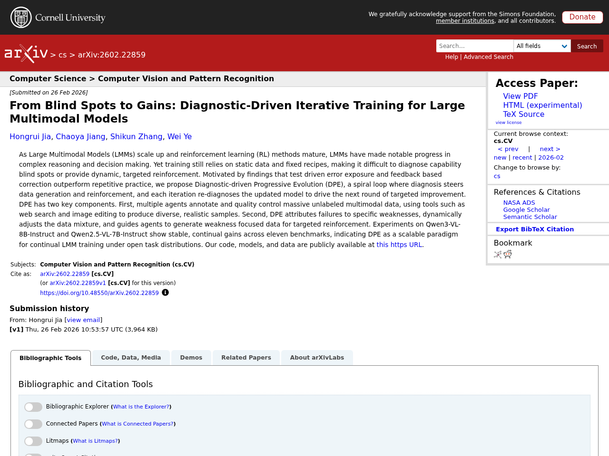
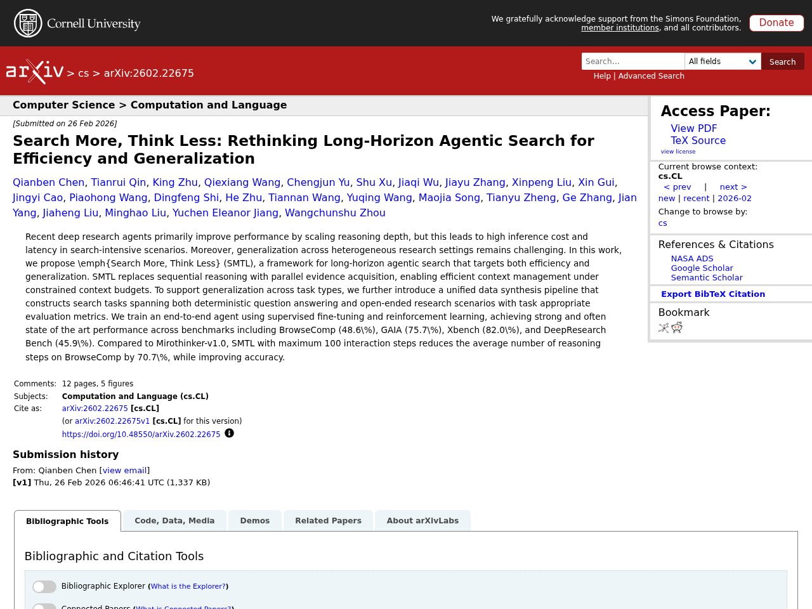

## はじめに

本記事は2026-02-28時点でのLLM関連の注目論文をまとめたものです。arXiv、Semantic Scholar、Hugging Face Daily Papersから自動収集し、Claude APIで日本語要約を生成しています。

## 1. From Blind Spots to Gains: Diagnostic-Driven Iterative Training for Large Multimodal Models

- **著者**: Hongrui Jia, Chaoya Jiang, Shikun Zhang, Wei Ye
- **公開日**: 2026-02-26
- **ソース**: [huggingface](https://arxiv.org/abs/2602.22859)
- **arXiv ID**: 2602.22859

### 要約

大規模マルチモーダルモデル（LMM）の学習は静的なデータと固定的な手法に依存しており、能力の盲点の診断や動的かつ的確な強化が困難である。本研究では、診断が データ生成と強化学習を導き、各イテレーションで更新されたモデルを再診断して次の改善サイクルに繋げるスパイラルループ型の手法「Diagnostic-driven Progressive Evolution（DPE）」を提案する。DPEは、複数のエージェントがWeb検索や画像編集などのツールを用いて大量の未ラベルマルチモーダルデータにアノテーションと品質管理を行い、多様で現実的なサンプルを生成する仕組みと、失敗を特定の弱点に帰属させてデータ配合を動的に調整し、弱点に特化したデータ生成による的確な強化を行う仕組みの2つの主要コンポーネントから構成される。Qwen3-VL-8B-InstructおよびQwen2.5-VL-7B-Instructを用いた実験では、11のベンチマークにわたって安定的かつ継続的な性能向上が確認され、DPEがオープンなタスク分布下でのLMMの継続学習におけるスケーラブルなパラダイムであることが示された。


As Large Multimodal Models (LMMs) scale up and reinforcement learning (RL) methods mature, LMMs have made notable progress in complex reasoning and decision making. Yet training still relies on static data and fixed recipes, making it difficult to diagnose capability blind spots or provide dynamic, targeted reinforcement. Motivated by findings that test driven error exposure and feedback based correction outperform repetitive practice, we propose Diagnostic-driven Progressive Evolution (DPE), a spiral loop where diagnosis steers data generation and reinforcement, and each iteration re-diagnoses the updated model to drive the next round of targeted improvement. DPE has two key components. First, multiple agents annotate and quality control massive unlabeled multimodal data, using tools such as web search and image editing to produce diverse, realistic samples. Second, DPE attributes failures to specific weaknesses, dynamically adjusts the data mixture, and guides agents to generate weakness focused data for targeted reinforcement. Experiments on Qwen3-VL-8B-Instruct and Qwen2.5-VL-7B-Instruct show stable, continual gains across eleven benchmarks, indicating DPE as a scalable paradigm for continual LMM training under open task distributions. Our code, models, and data are publicly available at https://github.com/hongruijia/DPE.


## 2. MobilityBench: A Benchmark for Evaluating Route-Planning Agents in Real-World Mobility Scenarios

- **著者**: Zhiheng Song, Jingshuai Zhang, Chuan Qin, Chao Wang, Chao Chen ほか
- **公開日**: 2026-02-26
- **ソース**: [huggingface](https://arxiv.org/abs/2602.22638)
- **arXiv ID**: 2602.22638

### 要約

大規模言語モデル（LLM）を活用した経路計画エージェントは、自然言語によるインタラクションとツールを介した意思決定を通じて日常的な移動を支援する有望なパラダイムであるが、多様な経路要求、非決定的な地図サービス、再現性の限界により体系的な評価が困難であった。本研究では、実世界の移動シナリオにおけるLLMベースの経路計画エージェントを評価するためのスケーラブルなベンチマーク「MobilityBench」を提案する。このベンチマークはAmapから収集した大規模な匿名化ユーザークエリに基づき、世界各地の都市における多様な経路計画意図を網羅しており、ライブサービスの環境差異を排除する決定論的APIリプレイサンドボックスと、結果の妥当性を中心とした多次元評価プロトコルを備えている。複数のLLMベースエージェントを評価した結果、基本的な情報検索や経路計画タスクでは十分な性能を示す一方、ユーザーの嗜好制約付き経路計画では大幅に性能が低下し、パーソナライズされたモビリティ応用における改善の余地が大きいことが明らかになった。


Route-planning agents powered by large language models (LLMs) have emerged as a promising paradigm for supporting everyday human mobility through natural language interaction and tool-mediated decision making. However, systematic evaluation in real-world mobility settings is hindered by diverse routing demands, non-deterministic mapping services, and limited reproducibility. In this study, we introduce MobilityBench, a scalable benchmark for evaluating LLM-based route-planning agents in real-world mobility scenarios. MobilityBench is constructed from large-scale, anonymized real user queries collected from Amap and covers a broad spectrum of route-planning intents across multiple cities worldwide. To enable reproducible, end-to-end evaluation, we design a deterministic API-replay sandbox that eliminates environmental variance from live services. We further propose a multi-dimensional evaluation protocol centered on outcome validity, complemented by assessments of instruction understanding, planning, tool use, and efficiency. Using MobilityBench, we evaluate multiple LLM-based route-planning agents across diverse real-world mobility scenarios and provide an in-depth analysis of their behaviors and performance. Our findings reveal that current models perform competently on Basic information retrieval and Route Planning tasks, yet struggle considerably with Preference-Constrained Route Planning, underscoring significant room for improvement in personalized mobility applications. We publicly release the benchmark data, evaluation toolkit, and documentation at https://github.com/AMAP-ML/MobilityBench .


## 3. Imagination Helps Visual Reasoning, But Not Yet in Latent Space

- **著者**: You Li, Chi Chen, Yanghao Li, Fanhu Zeng, Kaiyu Huang ほか
- **公開日**: 2026-02-26
- **ソース**: [huggingface](https://arxiv.org/abs/2602.22766)
- **arXiv ID**: 2602.22766

### 要約

潜在視覚推論は、マルチモーダル大規模言語モデルの隠れ状態を通じて人間の想像プロセスを模倣することを目指すが、その有効性の根本的なメカニズムは不明であった。本研究では因果媒介分析を用いて潜在推論の妥当性を検証し、2つの重大な断絶を発見した。入力に大きな摂動を加えても潜在トークンにほとんど変化が生じない「入力-潜在間の断絶」と、潜在トークンを摂動しても最終回答にほとんど影響しない「潜在-回答間の断絶」である。さらにプロービング分析により、潜在トークンが符号化する視覚情報は限定的で、トークン間の類似度が高いことが明らかになった。これらの知見に基づき、潜在空間での推論の必要性に疑問を呈し、テキストを用いて明示的に想像を行うCapImagineという手法を提案したところ、視覚中心のベンチマークにおいて複雑な潜在空間ベースラインを大幅に上回る性能を達成した。


Latent visual reasoning aims to mimic human's imagination process by meditating through hidden states of Multimodal Large Language Models. While recognized as a promising paradigm for visual reasoning, the underlying mechanisms driving its effectiveness remain unclear. Motivated to demystify the true source of its efficacy, we investigate the validity of latent reasoning using Causal Mediation Analysis. We model the process as a causal chain: the input as the treatment, the latent tokens as the mediator, and the final answer as the outcome. Our findings uncover two critical disconnections: (a) Input-Latent Disconnect: dramatic perturbations on the input result in negligible changes to the latent tokens, suggesting that latent tokens do not effectively attend to the input sequence. (b) Latent-Answer Disconnect: perturbations on the latent tokens yield minimal impact on the final answer, indicating the limited causal effect latent tokens imposing on the outcome. Furthermore, extensive probing analysis reveals that latent tokens encode limited visual information and exhibit high similarity. Consequently, we challenge the necessity of latent reasoning and propose a straightforward alternative named CapImagine, which teaches the model to explicitly imagine using text. Experiments on vision-centric benchmarks show that CapImagine significantly outperforms complex latent-space baselines, highlighting the superior potential of visual reasoning through explicit imagination.


## 4. AgentDropoutV2: Optimizing Information Flow in Multi-Agent Systems via Test-Time Rectify-or-Reject Pruning

- **著者**: Yutong Wang, Siyuan Xiong, Xuebo Liu, Wenkang Zhou, Liang Ding ほか
- **公開日**: 2026-02-26
- **ソース**: [huggingface](https://arxiv.org/abs/2602.23258)
- **arXiv ID**: 2602.23258

### 要約

マルチエージェントシステム（MAS）は複雑な推論に優れる一方、個々のエージェントが生成する誤情報の連鎖的影響が課題となっている。本研究では、再学習なしにMASの情報フローを動的に最適化するテスト時の修正・棄却プルーニングフレームワーク「AgentDropoutV2」を提案する。このアプローチはアクティブファイアウォールとして機能し、エージェントの出力を傍受して、失敗駆動型インジケータプールに基づく検索拡張修正器で誤りを反復的に修正する。修正不可能な出力はプルーニングによりエラー伝播を防止し、フォールバック戦略でシステムの整合性を維持する。数学ベンチマークでの実験では平均6.3ポイントの精度向上を達成し、タスク難易度に応じた修正量の動的調整やコンテキスト認識型インジケータによる幅広いエラーパターンへの対応など、高い汎化性と適応性を示した。


While Multi-Agent Systems (MAS) excel in complex reasoning, they suffer from the cascading impact of erroneous information generated by individual participants. Current solutions often resort to rigid structural engineering or expensive fine-tuning, limiting their deployability and adaptability. We propose AgentDropoutV2, a test-time rectify-or-reject pruning framework designed to dynamically optimize MAS information flow without retraining. Our approach acts as an active firewall, intercepting agent outputs and employing a retrieval-augmented rectifier to iteratively correct errors based on a failure-driven indicator pool. This mechanism allows for the precise identification of potential errors using distilled failure patterns as prior knowledge. Irreparable outputs are subsequently pruned to prevent error propagation, while a fallback strategy preserves system integrity. Empirical results on extensive math benchmarks show that AgentDropoutV2 significantly boosts the MAS's task performance, achieving an average accuracy gain of 6.3 percentage points on math benchmarks. Furthermore, the system exhibits robust generalization and adaptivity, dynamically modulating rectification efforts based on task difficulty while leveraging context-aware indicators to resolve a wide spectrum of error patterns. Our code and dataset are released at https://github.com/TonySY2/AgentDropoutV2.


## 5. Search More, Think Less: Rethinking Long-Horizon Agentic Search for Efficiency and Generalization

- **著者**: Qianben Chen, Tianrui Qin, King Zhu, Qiexiang Wang, Chengjun Yu ほか
- **公開日**: 2026-02-26
- **ソース**: [huggingface](https://arxiv.org/abs/2602.22675)
- **arXiv ID**: 2602.22675

### 要約

最近のディープリサーチエージェントは推論の深さをスケールさせることで性能向上を図っているが、検索集約的なシナリオでは推論コストとレイテンシが高くなり、異種の研究設定への汎化も課題となっている。本研究では、効率性と汎化の両立を目指す長期エージェント検索フレームワーク「Search More, Think Less（SMTL）」を提案する。SMTLは逐次的な推論を並列的なエビデンス収集に置き換え、制約のあるコンテキスト予算下で効率的なコンテキスト管理を実現する。さらに、確定的な質問応答からオープンエンドな研究シナリオまでをカバーする統一的なデータ合成パイプラインを導入し、タスクに応じた評価指標を備えることで汎化性能を支える。教師ありファインチューニングと強化学習によりエンドツーエンドのエージェントを訓練した結果、BrowseComp（48.6%）、GAIA（75.7%）、Xbench（82.0%）、DeepResearch Bench（45.9%）など複数のベンチマークで高い性能を達成し、Mirothinker-v1.0と比較してBrowseCompにおける推論ステップ数を70.7%削減しつつ精度を向上させた。


Recent deep research agents primarily improve performance by scaling reasoning depth, but this leads to high inference cost and latency in search-intensive scenarios. Moreover, generalization across heterogeneous research settings remains challenging. In this work, we propose Search More, Think Less (SMTL), a framework for long-horizon agentic search that targets both efficiency and generalization. SMTL replaces sequential reasoning with parallel evidence acquisition, enabling efficient context management under constrained context budgets. To support generalization across task types, we further introduce a unified data synthesis pipeline that constructs search tasks spanning both deterministic question answering and open-ended research scenarios with task appropriate evaluation metrics. We train an end-to-end agent using supervised fine-tuning and reinforcement learning, achieving strong and often state of the art performance across benchmarks including BrowseComp (48.6\%), GAIA (75.7\%), Xbench (82.0\%), and DeepResearch Bench (45.9\%). Compared to Mirothinker-v1.0, SMTL with maximum 100 interaction steps reduces the average number of reasoning steps on BrowseComp by 70.7\%, while improving accuracy.


---

*この記事は自動生成されています。論文の詳細は各ソースURLをご参照ください。*