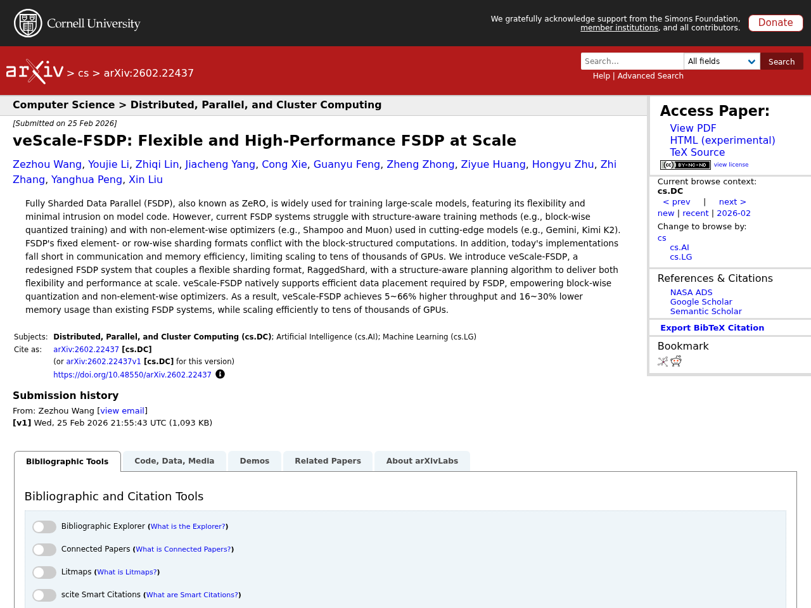
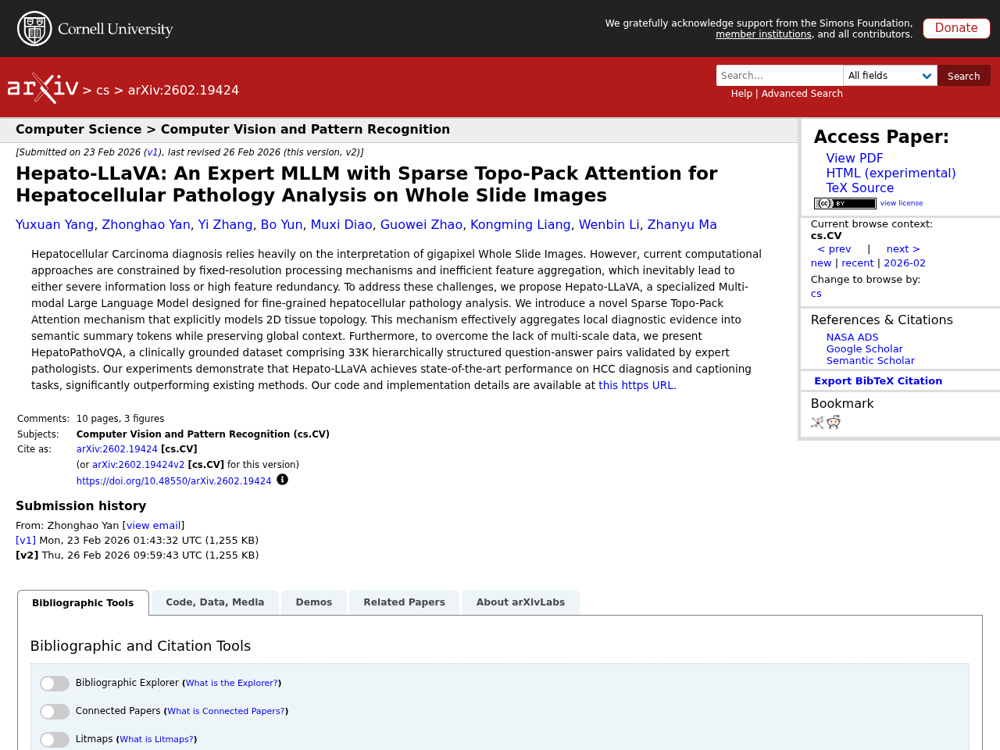
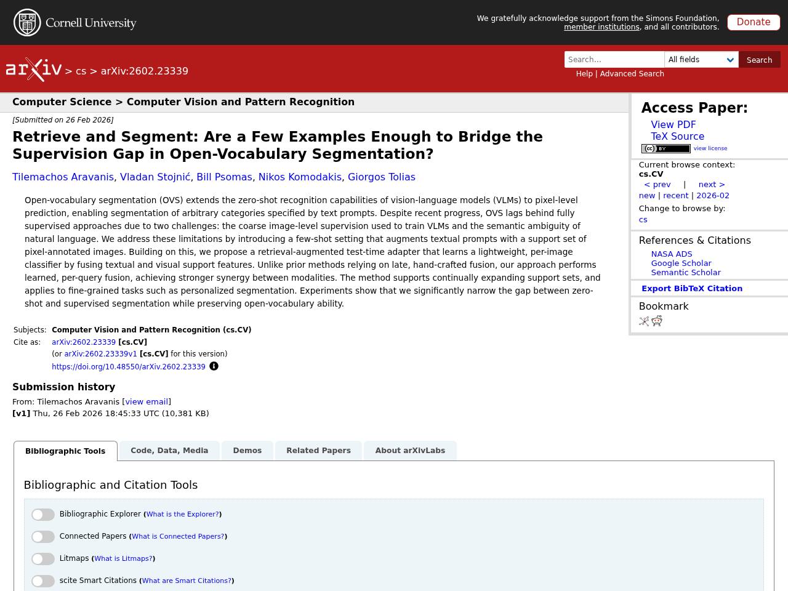

## はじめに

本記事は2026-03-02時点でのLLM関連の注目論文をまとめたものです。arXiv、Semantic Scholar、Hugging Face Daily Papersから自動収集し、Claude APIで日本語要約を生成しています。

## 1. GeoWorld: Geometric World Models

- **著者**: Zeyu Zhang, Danning Li, Ian Reid, Richard Hartley
- **公開日**: 2026-02-26
- **ソース**: [huggingface](https://arxiv.org/abs/2602.23058)
- **arXiv ID**: 2602.23058

### 要約

エネルギーベースの予測的世界モデルは、ピクセル生成ではなく潜在エネルギーランドスケープ上での推論により、多段階の視覚的計画立案に有効なアプローチである。しかし既存手法には、潜在表現がユークリッド空間で学習されるため状態間の幾何学的・階層的構造が無視される点と、長期予測において性能が急速に劣化する点という2つの課題がある。本研究では、双曲JEPA（Hyperbolic JEPA）を用いて潜在表現をユークリッド空間から双曲多様体へ写像することで幾何学的構造と階層的関係を保持する幾何学的世界モデル「GeoWorld」を提案する。さらに、双曲潜在空間における安定した多段階計画を実現するため、エネルギーベース最適化のための幾何学的強化学習を導入する。CrossTaskおよびCOINベンチマークでの実験により、最先端のV-JEPA 2と比較して3ステップ計画で約3%、4ステップ計画で約2%の成功率向上を達成した。


Energy-based predictive world models provide a powerful approach for multi-step visual planning by reasoning over latent energy landscapes rather than generating pixels. However, existing approaches face two major challenges: (i) their latent representations are typically learned in Euclidean space, neglecting the underlying geometric and hierarchical structure among states, and (ii) they struggle with long-horizon prediction, which leads to rapid degradation across extended rollouts. To address these challenges, we introduce GeoWorld, a geometric world model that preserves geometric structure and hierarchical relations through a Hyperbolic JEPA, which maps latent representations from Euclidean space onto hyperbolic manifolds. We further introduce Geometric Reinforcement Learning for energy-based optimization, enabling stable multi-step planning in hyperbolic latent space. Extensive experiments on CrossTask and COIN demonstrate around 3% SR improvement in 3-step planning and 2% SR improvement in 4-step planning compared to the state-of-the-art V-JEPA 2. Project website: https://steve-zeyu-zhang.github.io/GeoWorld.


## 2. veScale-FSDP: Flexible and High-Performance FSDP at Scale

- **著者**: Zezhou Wang, Youjie Li, Zhiqi Lin, Jiacheng Yang, Cong Xie ほか
- **公開日**: 2026-02-25
- **ソース**: [huggingface](https://arxiv.org/abs/2602.22437)
- **arXiv ID**: 2602.22437

### 要約

Fully Sharded Data Parallel（FSDP、ZeROとも呼ばれる）は大規模モデル訓練に広く使われているが、既存のFSDPシステムはブロック単位の量子化訓練やShampoo・Muonなどの非要素単位オプティマイザに対応できず、固定的な要素単位・行単位のシャーディング形式がブロック構造の計算と衝突する問題がある。本論文では、柔軟なシャーディング形式「RaggedShard」と構造認識型の計画アルゴリズムを組み合わせた新システム「veScale-FSDP」を提案する。このシステムはFSDPが必要とする効率的なデータ配置をネイティブにサポートし、ブロック単位の量子化や非要素単位オプティマイザを実現する。その結果、既存のFSDPシステムと比較してスループットが5〜66%向上し、メモリ使用量が16〜30%削減され、数万GPU規模への効率的なスケーリングを達成した。


Fully Sharded Data Parallel (FSDP), also known as ZeRO, is widely used for training large-scale models, featuring its flexibility and minimal intrusion on model code. However, current FSDP systems struggle with structure-aware training methods (e.g., block-wise quantized training) and with non-element-wise optimizers (e.g., Shampoo and Muon) used in cutting-edge models (e.g., Gemini, Kimi K2). FSDP's fixed element- or row-wise sharding formats conflict with the block-structured computations. In addition, today's implementations fall short in communication and memory efficiency, limiting scaling to tens of thousands of GPUs. We introduce veScale-FSDP, a redesigned FSDP system that couples a flexible sharding format, RaggedShard, with a structure-aware planning algorithm to deliver both flexibility and performance at scale. veScale-FSDP natively supports efficient data placement required by FSDP, empowering block-wise quantization and non-element-wise optimizers. As a result, veScale-FSDP achieves 5~66% higher throughput and 16~30% lower memory usage than existing FSDP systems, while scaling efficiently to tens of thousands of GPUs.


## 3. Hepato-LLaVA: An Expert MLLM with Sparse Topo-Pack Attention for Hepatocellular Pathology Analysis on Whole Slide Images

- **著者**: Yuxuan Yang, Zhonghao Yan, Yi Zhang, Bo Yun, Muxi Diao ほか
- **公開日**: 2026-02-23
- **ソース**: [huggingface](https://arxiv.org/abs/2602.19424)
- **arXiv ID**: 2602.19424

### 要約

肝細胞癌（HCC）の診断はギガピクセル規模の全スライド画像（WSI）の解釈に大きく依存するが、既存の計算手法は固定解像度処理や非効率な特徴集約により、深刻な情報損失または高い特徴冗長性を招いている。本研究では、肝細胞病理の精密解析に特化したマルチモーダル大規模言語モデル「Hepato-LLaVA」を提案し、2D組織トポロジーを明示的にモデル化する新規のSparse Topo-Pack Attentionメカニズムを導入した。この機構は局所的な診断根拠を意味的要約トークンに効果的に集約しつつ、大域的文脈を保持する。さらに、多スケールデータの不足を補うため、専門病理医が検証した33Kの階層的質問応答ペアからなる臨床基盤データセットHepatoPathoVQAを構築した。実験の結果、Hepato-LLaVAはHCC診断およびキャプショニングタスクにおいて最先端の性能を達成し、既存手法を大幅に上回った。


Hepatocellular Carcinoma diagnosis relies heavily on the interpretation of gigapixel Whole Slide Images. However, current computational approaches are constrained by fixed-resolution processing mechanisms and inefficient feature aggregation, which inevitably lead to either severe information loss or high feature redundancy. To address these challenges, we propose Hepato-LLaVA, a specialized Multi-modal Large Language Model designed for fine-grained hepatocellular pathology analysis. We introduce a novel Sparse Topo-Pack Attention mechanism that explicitly models 2D tissue topology. This mechanism effectively aggregates local diagnostic evidence into semantic summary tokens while preserving global context. Furthermore, to overcome the lack of multi-scale data, we present HepatoPathoVQA, a clinically grounded dataset comprising 33K hierarchically structured question-answer pairs validated by expert pathologists. Our experiments demonstrate that Hepato-LLaVA achieves state-of-the-art performance on HCC diagnosis and captioning tasks, significantly outperforming existing methods. Our code and implementation details are available at https://pris-cv.github.io/Hepto-LLaVA/.


## 4. Retrieve and Segment: Are a Few Examples Enough to Bridge the Supervision Gap in Open-Vocabulary Segmentation?

- **著者**: Tilemachos Aravanis, Vladan Stojnić, Bill Psomas, Nikos Komodakis, Giorgos Tolias
- **公開日**: 2026-02-26
- **ソース**: [huggingface](https://arxiv.org/abs/2602.23339)
- **arXiv ID**: 2602.23339

### 要約

オープンボキャブラリーセグメンテーション（OVS）は、視覚言語モデル（VLM）のゼロショット認識能力をピクセルレベルの予測に拡張し、テキストプロンプトで指定された任意のカテゴリのセグメンテーションを可能にするが、VLMの学習に用いられる粗い画像レベルの教師信号と自然言語の意味的曖昧性により、完全教師ありアプローチとの性能差が依然として存在する。本研究では、テキストプロンプトにピクセルアノテーション付きのサポート画像セットを付加するfew-shot設定を導入し、テキスト特徴と視覚的サポート特徴を融合して画像ごとに軽量な分類器を学習する検索拡張型テスト時アダプタを提案する。従来手法が後段での手作業による融合に依存していたのに対し、提案手法はクエリごとに学習ベースの融合を行うことで、モダリティ間のより強力な相乗効果を実現する。サポートセットの継続的な拡張やパーソナライズドセグメンテーションなどの細粒度タスクにも対応可能であり、実験ではオープンボキャブラリー能力を維持しつつ、ゼロショットと教師ありセグメンテーションの性能差を大幅に縮小することが示された。


Open-vocabulary segmentation (OVS) extends the zero-shot recognition capabilities of vision-language models (VLMs) to pixel-level prediction, enabling segmentation of arbitrary categories specified by text prompts. Despite recent progress, OVS lags behind fully supervised approaches due to two challenges: the coarse image-level supervision used to train VLMs and the semantic ambiguity of natural language. We address these limitations by introducing a few-shot setting that augments textual prompts with a support set of pixel-annotated images. Building on this, we propose a retrieval-augmented test-time adapter that learns a lightweight, per-image classifier by fusing textual and visual support features. Unlike prior methods relying on late, hand-crafted fusion, our approach performs learned, per-query fusion, achieving stronger synergy between modalities. The method supports continually expanding support sets, and applies to fine-grained tasks such as personalized segmentation. Experiments show that we significantly narrow the gap between zero-shot and supervised segmentation while preserving open-vocabulary ability.


## 5. Revisiting Text Ranking in Deep Research

- **著者**: Chuan Meng, Litu Ou, Sean MacAvaney, Jeff Dalton
- **公開日**: 2026-02-25
- **ソース**: [huggingface](https://arxiv.org/abs/2602.21456)
- **arXiv ID**: 2602.21456

### 要約

深層研究（Deep Research）はLLMエージェントがウェブ検索APIを用いて反復的に情報を収集・推論するタスクとして注目されているが、ブラックボックスな検索APIが体系的な分析を妨げており、既存のテキストランキング手法の振る舞いは十分に解明されていない。本研究では、検索単位（文書 vs. パッセージ）、パイプライン構成（リトリーバー・リランカー・リランキング深度の組み合わせ）、クエリ特性（エージェント発行クエリとランカー学習時クエリの不一致）の3つの観点からテキストランキング手法の有効性を検証した。BrowseComp-Plusデータセット上で2つのオープンソースエージェント、5つのリトリーバー、3つのリランカーを用いた実験の結果、エージェント発行クエリは引用符付き完全一致などウェブ検索スタイルの構文を持つため、語彙ベース・学習済みスパース・マルチベクトルのリトリーバーが有利であることが判明した。また、パッセージ単位の検索はコンテキストウィンドウの制約下で効率的であり、語彙検索における文書長正規化の困難を回避できること、リランキングが非常に有効であること、さらにエージェント発行クエリを自然言語の質問形式に変換することでクエリの不一致を大幅に軽減できることが示された。


Deep research has emerged as an important task that aims to address hard queries through extensive open-web exploration. To tackle it, most prior work equips large language model (LLM)-based agents with opaque web search APIs, enabling agents to iteratively issue search queries, retrieve external evidence, and reason over it. Despite search's essential role in deep research, black-box web search APIs hinder systematic analysis of search components, leaving the behaviour of established text ranking methods in deep research largely unclear. To fill this gap, we reproduce a selection of key findings and best practices for IR text ranking methods in the deep research setting. In particular, we examine their effectiveness from three perspectives: (i) retrieval units (documents vs. passages), (ii) pipeline configurations (different retrievers, re-rankers, and re-ranking depths), and (iii) query characteristics (the mismatch between agent-issued queries and the training queries of text rankers). We perform experiments on BrowseComp-Plus, a deep research dataset with a fixed corpus, evaluating 2 open-source agents, 5 retrievers, and 3 re-rankers across diverse setups. We find that agent-issued queries typically follow web-search-style syntax (e.g., quoted exact matches), favouring lexical, learned sparse, and multi-vector retrievers; passage-level units are more efficient under limited context windows, and avoid the difficulties of document length normalisation in lexical retrieval; re-ranking is highly effective; translating agent-issued queries into natural-language questions significantly bridges the query mismatch.


---

*この記事は自動生成されています。論文の詳細は各ソースURLをご参照ください。*