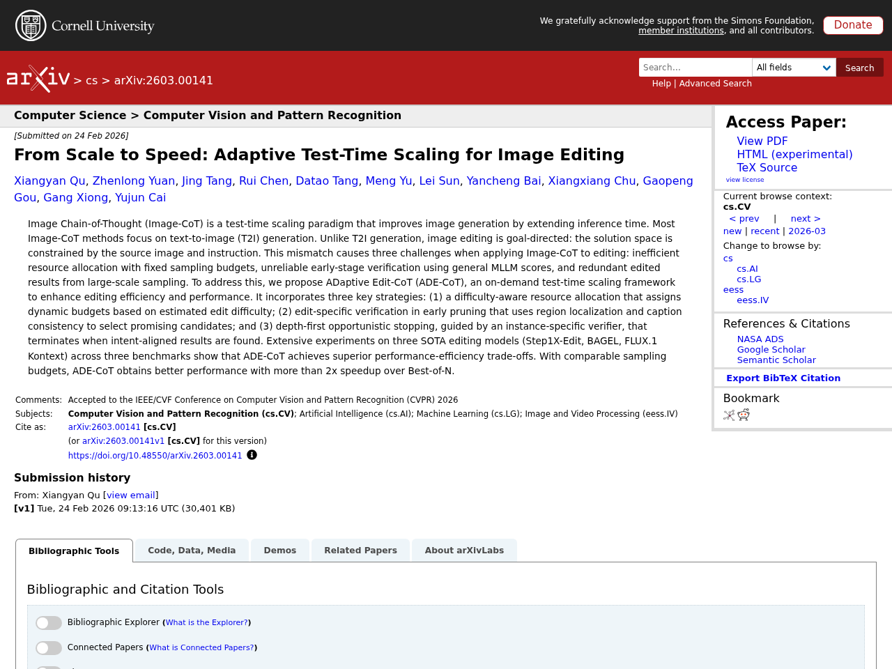
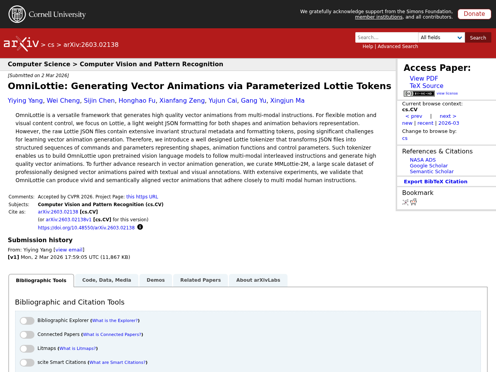
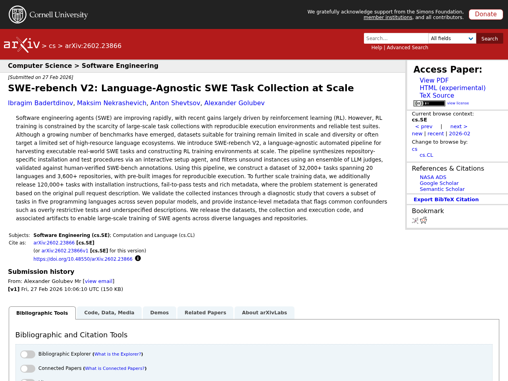
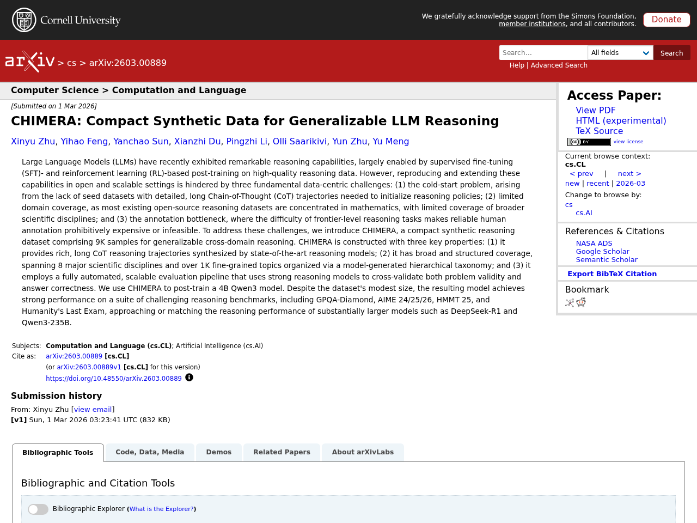
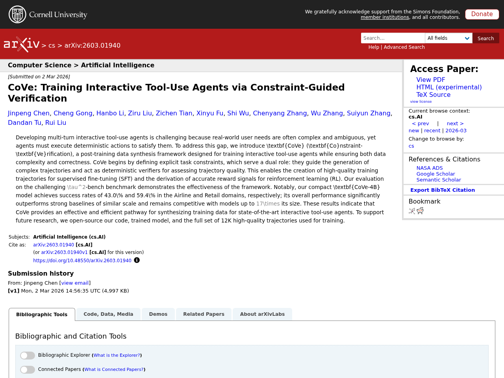

## はじめに

本記事は2026-03-04時点でのLLM関連の注目論文をまとめたものです。arXiv、Semantic Scholar、Hugging Face Daily Papersから自動収集した新着21件のうち、人気度の高い5件をピックアップし、Claude APIで日本語要約を生成しています。

## 1. From Scale to Speed: Adaptive Test-Time Scaling for Image Editing

- **著者**: Xiangyan Qu, Zhenlong Yuan, Jing Tang, Rui Chen, Datao Tang ほか
- **公開日**: 2026-02-24
- **ソース**: [huggingface](https://arxiv.org/abs/2603.00141)
- **arXiv ID**: 2603.00141
- **人気度スコア**: 112

### 要約

Image Chain-of-Thought (Image-CoT) is a test-time scaling paradigm that improves image generation by extending inference time. Most Image-CoT methods focus on text-to-image (T2I) generation. Unlike T2I generation, image editing is goal-directed: the solution space is constrained by the source image ...


Image Chain-of-Thought (Image-CoT) is a test-time scaling paradigm that improves image generation by extending inference time. Most Image-CoT methods focus on text-to-image (T2I) generation. Unlike T2I generation, image editing is goal-directed: the solution space is constrained by the source image and instruction. This mismatch causes three challenges when applying Image-CoT to editing: inefficient resource allocation with fixed sampling budgets, unreliable early-stage verification using general MLLM scores, and redundant edited results from large-scale sampling. To address this, we propose ADaptive Edit-CoT (ADE-CoT), an on-demand test-time scaling framework to enhance editing efficiency and performance. It incorporates three key strategies: (1) a difficulty-aware resource allocation that assigns dynamic budgets based on estimated edit difficulty; (2) edit-specific verification in early pruning that uses region localization and caption consistency to select promising candidates; and (3) depth-first opportunistic stopping, guided by an instance-specific verifier, that terminates when intent-aligned results are found. Extensive experiments on three SOTA editing models (Step1X-Edit, BAGEL, FLUX.1 Kontext) across three benchmarks show that ADE-CoT achieves superior performance-efficiency trade-offs. With comparable sampling budgets, ADE-CoT obtains better performance with more than 2x speedup over Best-of-N.


## 2. OmniLottie: Generating Vector Animations via Parameterized Lottie Tokens

- **著者**: Yiying Yang, Wei Cheng, Sijin Chen, Honghao Fu, Xianfang Zeng ほか
- **公開日**: 2026-03-02
- **ソース**: [huggingface](https://arxiv.org/abs/2603.02138)
- **arXiv ID**: 2603.02138
- **人気度スコア**: 105

### 要約

OmniLottie is a versatile framework that generates high quality vector animations from multi-modal instructions. For flexible motion and visual content control, we focus on Lottie, a light weight JSON formatting for both shapes and animation behaviors representation. However, the raw Lottie JSON fil...


OmniLottie is a versatile framework that generates high quality vector animations from multi-modal instructions. For flexible motion and visual content control, we focus on Lottie, a light weight JSON formatting for both shapes and animation behaviors representation. However, the raw Lottie JSON files contain extensive invariant structural metadata and formatting tokens, posing significant challenges for learning vector animation generation. Therefore, we introduce a well designed Lottie tokenizer that transforms JSON files into structured sequences of commands and parameters representing shapes, animation functions and control parameters. Such tokenizer enables us to build OmniLottie upon pretrained vision language models to follow multi-modal interleaved instructions and generate high quality vector animations. To further advance research in vector animation generation, we curate MMLottie-2M, a large scale dataset of professionally designed vector animations paired with textual and visual annotations. With extensive experiments, we validate that OmniLottie can produce vivid and semantically aligned vector animations that adhere closely to multi modal human instructions.


## 3. SWE-rebench V2: Language-Agnostic SWE Task Collection at Scale

- **著者**: Ibragim Badertdinov, Maksim Nekrashevich, Anton Shevtsov, Alexander Golubev
- **公開日**: 2026-02-27
- **ソース**: [huggingface](https://arxiv.org/abs/2602.23866)
- **arXiv ID**: 2602.23866
- **人気度スコア**: 43

### 要約

Software engineering agents (SWE) are improving rapidly, with recent gains largely driven by reinforcement learning (RL). However, RL training is constrained by the scarcity of large-scale task collections with reproducible execution environments and reliable test suites. Although a growing number o...


Software engineering agents (SWE) are improving rapidly, with recent gains largely driven by reinforcement learning (RL). However, RL training is constrained by the scarcity of large-scale task collections with reproducible execution environments and reliable test suites. Although a growing number of benchmarks have emerged, datasets suitable for training remain limited in scale and diversity or often target a limited set of high-resource language ecosystems. We introduce SWE-rebench V2, a language-agnostic automated pipeline for harvesting executable real-world SWE tasks and constructing RL training environments at scale. The pipeline synthesizes repository-specific installation and test procedures via an interactive setup agent, and filters unsound instances using an ensemble of LLM judges, validated against human-verified SWE-bench annotations. Using this pipeline, we construct a dataset of 32,000+ tasks spanning 20 languages and 3,600+ repositories, with pre-built images for reproducible execution. To further scale training data, we additionally release 120,000+ tasks with installation instructions, fail-to-pass tests and rich metadata, where the problem statement is generated based on the original pull request description. We validate the collected instances through a diagnostic study that covers a subset of tasks in five programming languages across seven popular models, and provide instance-level metadata that flags common confounders such as overly restrictive tests and underspecified descriptions. We release the datasets, the collection and execution code, and associated artifacts to enable large-scale training of SWE agents across diverse languages and repositories.


## 4. CHIMERA: Compact Synthetic Data for Generalizable LLM Reasoning

- **著者**: Xinyu Zhu, Yihao Feng, Yanchao Sun, Xianzhi Du, Pingzhi Li ほか
- **公開日**: 2026-03-01
- **ソース**: [huggingface](https://arxiv.org/abs/2603.00889)
- **arXiv ID**: 2603.00889
- **人気度スコア**: 31

### 要約

Large Language Models (LLMs) have recently exhibited remarkable reasoning capabilities, largely enabled by supervised fine-tuning (SFT)- and reinforcement learning (RL)-based post-training on high-quality reasoning data. However, reproducing and extending these capabilities in open and scalable sett...


Large Language Models (LLMs) have recently exhibited remarkable reasoning capabilities, largely enabled by supervised fine-tuning (SFT)- and reinforcement learning (RL)-based post-training on high-quality reasoning data. However, reproducing and extending these capabilities in open and scalable settings is hindered by three fundamental data-centric challenges: (1) the cold-start problem, arising from the lack of seed datasets with detailed, long Chain-of-Thought (CoT) trajectories needed to initialize reasoning policies; (2) limited domain coverage, as most existing open-source reasoning datasets are concentrated in mathematics, with limited coverage of broader scientific disciplines; and (3) the annotation bottleneck, where the difficulty of frontier-level reasoning tasks makes reliable human annotation prohibitively expensive or infeasible. To address these challenges, we introduce CHIMERA, a compact synthetic reasoning dataset comprising 9K samples for generalizable cross-domain reasoning. CHIMERA is constructed with three key properties: (1) it provides rich, long CoT reasoning trajectories synthesized by state-of-the-art reasoning models; (2) it has broad and structured coverage, spanning 8 major scientific disciplines and over 1K fine-grained topics organized via a model-generated hierarchical taxonomy; and (3) it employs a fully automated, scalable evaluation pipeline that uses strong reasoning models to cross-validate both problem validity and answer correctness. We use CHIMERA to post-train a 4B Qwen3 model. Despite the dataset's modest size, the resulting model achieves strong performance on a suite of challenging reasoning benchmarks, including GPQA-Diamond, AIME 24/25/26, HMMT 25, and Humanity's Last Exam, approaching or matching the reasoning performance of substantially larger models such as DeepSeek-R1 and Qwen3-235B.


## 5. CoVe: Training Interactive Tool-Use Agents via Constraint-Guided Verification

- **著者**: Jinpeng Chen, Cheng Gong, Hanbo Li, Ziru Liu, Zichen Tian ほか
- **公開日**: 2026-03-02
- **ソース**: [huggingface](https://arxiv.org/abs/2603.01940)
- **arXiv ID**: 2603.01940
- **人気度スコア**: 20

### 要約

Developing multi-turn interactive tool-use agents is challenging because real-world user needs are often complex and ambiguous, yet agents must execute deterministic actions to satisfy them. To address this gap, we introduce CoVe (Constraint-Verification), a post-training data synthesis framework de...


Developing multi-turn interactive tool-use agents is challenging because real-world user needs are often complex and ambiguous, yet agents must execute deterministic actions to satisfy them. To address this gap, we introduce CoVe (Constraint-Verification), a post-training data synthesis framework designed for training interactive tool-use agents while ensuring both data complexity and correctness. CoVe begins by defining explicit task constraints, which serve a dual role: they guide the generation of complex trajectories and act as deterministic verifiers for assessing trajectory quality. This enables the creation of high-quality training trajectories for supervised fine-tuning (SFT) and the derivation of accurate reward signals for reinforcement learning (RL). Our evaluation on the challenging τ^2-bench benchmark demonstrates the effectiveness of the framework. Notably, our compact CoVe-4B model achieves success rates of 43.0\% and 59.4\% in the Airline and Retail domains, respectively; its overall performance significantly outperforms strong baselines of similar scale and remains competitive with models up to 17times its size. These results indicate that CoVe provides an effective and efficient pathway for synthesizing training data for state-of-the-art interactive tool-use agents. To support future research, we open-source our code, trained model, and the full set of 12K high-quality trajectories used for training.


---

*この記事は自動生成されています。論文の詳細は各ソースURLをご参照ください。*