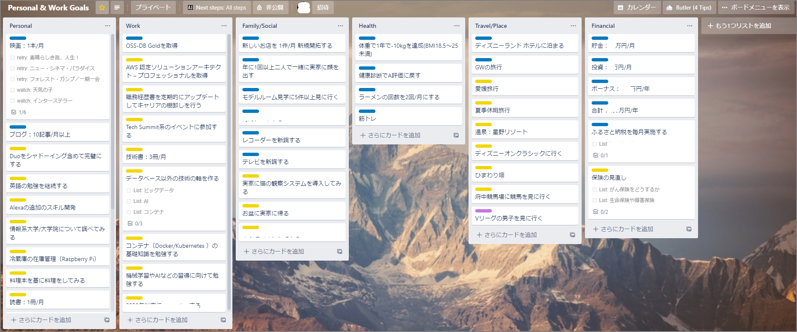

In 2019, I achieved my two major goals: changing jobs and keeping up with the blog. I took New Year's Day to organize what I want to do in 2020.

#### Goals

This year, I organized my goals (mostly things I want to try) in Trello so that I can update my status and reflect regularly. The number of goals is a round 50. I want to make each one a bit more quantifiable and review them monthly. (This year I really will...)

#### List

Key focus areas: health management and Personal.

| List          | Title                                                        | Labels            |
| ------------- | ------------------------------------------------------------ | ----------------- |
| Personal      | Movies: 1/month                                              | On Going          |
| Personal      | Blog: 10+ posts/month                                        | On Going          |
| Personal      | Master Duo with shadowing                                    | Needs work/review |
| Personal      | Continue studying English                                    | Needs work/review |
| Personal      | Develop additional Alexa skills                              | Needs work/review |
| Personal      | Research IT-related universities/graduate schools            | Needs work/review |
| Personal      | Set up fridge inventory management (Raspberry Pi)            | Needs work/review |
| Personal      | Cook from a cookbook                                         | Needs work/review |
| Personal      | Reading: 1 book/month                                        | Needs work/review |
| Personal      | Blog: 100 PV/month                                           | Needs work/review |
| Personal      | Enter 3 Advent Calendars                                     | Needs work/review |
| Personal      | Create a repository and release something                    | Needs work/review |
| Personal      | Build a web service or bot                                   | Needs work/review |
| Work          | Obtain OSS-DB Gold                                           | On Going          |
| Work          | Obtain AWS Certified Solutions Architect – Professional      | Needs work/review |
| Work          | Regularly update resume and review career                    | Needs work/review |
| Work          | Attend Tech Summit events                                    | Needs work/review |
| Work          | Technical books: 3/month                                     | Needs work/review |
| Work          | Build a technical pillar outside databases                   | Needs work/review |
| Work          | Study container basics (Docker/Kubernetes)                   | Needs work/review |
| Work          | Study machine learning and AI                                | Needs work/review |
| Family/Social | Discover 1 new restaurant/month                              | On Going          |
| Family/Social | Visit both parents' homes together at least once a year      | On Going          |
| Family/Social | Tour 5+ model homes                                          | On Going          |
| Family/Social | Buy a new recorder                                           | On Going          |
| Family/Social | Buy a new TV                                                 | On Going          |
| Family/Social | Set up a cat observation system at my parents' house         | Needs work/review |
| Family/Social | Go back to parents' house in Obon                            | Needs work/review |
| Health        | Lose 10kg in a year (BMI 18.5–25)                            | On Going          |
| Health        | Return to A rating on health checkup                         | On Going          |
| Health        | Limit ramen to 2x/month                                      | On Going          |
| Health        | Strength training                                            | On Going          |
| Travel/Place  | Stay at Disneyland Hotel                                     | On Going          |
| Travel/Place  | Golden Week trip                                             | On Going          |
| Travel/Place  | Trip to Ehime                                                | Needs work/review |
| Travel/Place  | Summer vacation trip                                         | Needs work/review |
| Travel/Place  | Onsen: Hoshino Resort                                        | Needs work/review |
| Travel/Place  | Attend Disney on Classic                                     | Needs work/review |
| Travel/Place  | Sunflower field                                              | Needs work/review |
| Travel/Place  | Watch horse racing at Fuchu Racecourse                       | Needs work/review |
| Travel/Place  | Watch V-League men's volleyball                              | Impossible        |
| Financial     | Savings: ○○ 10k yen/month                                    | On Going          |
| Financial     | Investment: ○ 10k yen/month                                  | On Going          |
| Financial     | Bonus: ○○○ 10k yen/year                                      | On Going          |
| Financial     | Total: ○○○ 10k yen/year                                      | On Going          |
| Financial     | Do furusato nozei (hometown tax) every month                 | On Going          |
| Financial     | Review insurance coverage                                    | Needs work/review |
