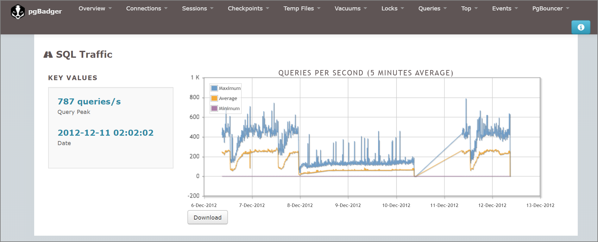
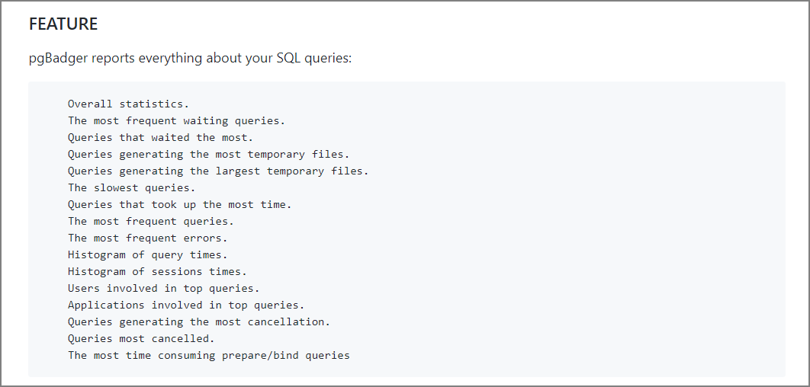

#### Introduction

pgBadger is a tool that analyzes PostgreSQL log files and generates reports. Based on the logs, it can examine many workloads including SQL statements, wait events, I/O statistics, error statistics, SQL histograms, locks, and vacuum statistics.

For a sample report, see [here](http://pgbadger.darold.net/samplev7.html). It was more graphical than I expected.



The GitHub repository and README are here:

> darold/pgbadger: A fast PostgreSQL Log Analyzer https://github.com/darold/pgbadger

Since pgBadger can be installed on EC2 to statically analyze logs, it can apparently be run against RDS or Aurora PostgreSQL-compatible instances. Let me verify. (Note: pgbadger was run on PostgreSQL 10.11 installed on EC2.)

> Optimizing and Tuning Queries in Amazon RDS PostgreSQL Based on Native and External Tools | AWS Blog https://aws.amazon.com/blogs/database/optimizing-and-tuning-queries-in-amazon-rds-postgresql-based-on-native-and-external-tools/

#### pgBadger Setup and postgresql.conf Configuration

##### Installation

```sh
[ec2-user@postdb ~]$ sudo yum install pgbadger
[ec2-user@postdb ~]$ which pgbadger
/usr/bin/pgbadger
[ec2-user@postdb ~]$
```

##### postgresql.conf

Modify parameters related to logging. Note that this will output more information than the defaults.

```sh
log_filename = 'postgresql-%Y-%m-%d.log'
#Log query text and execution time for queries exceeding the specified time. 0 means all queries are logged; adjust as needed
log_min_duration_statement = 0
log_line_prefix = '%t [%p]: [%l-1] user=%u, db=%d'
# Log checkpoint execution
log_checkpoints = on
# Log client connections
log_connections = on
# Log client disconnections
log_disconnections = on
# Log lock waits exceeding deadlock_timeout (default 1 second)
log_lock_waits = on
# Log when temp files larger than the specified size are created
log_temp_files = 0
lc_messages = 'C'
log_autovacuum_min_duration = 0
log_error_verbosity = default
```

#### Execution Command

```sh
/usr/bin/pgbadger -f '%t [%p]: [%l-1] user=%u, db=%d' -I -q /var/lib/pgsql/10/data/log/postgresql-2019-12-30.log -O /var/lib/pgsql/pgbadger/
```

#### Available Information

You can check time-period statistics, frequently-waiting SQL queries, frequently-executed queries, and rankings of queries with the longest average execution time. For a sample report, see [here](http://pgbadger.darold.net/samplev7.html).

> https://github.com/darold/pgbadger#FEATURE



#### Other Features

- Automatic incremental report mode (run via cron with the incremental option)
- Monthly reports
- Parallel processing
