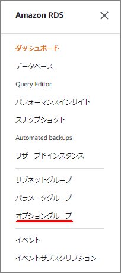
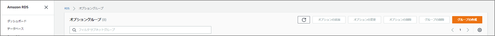
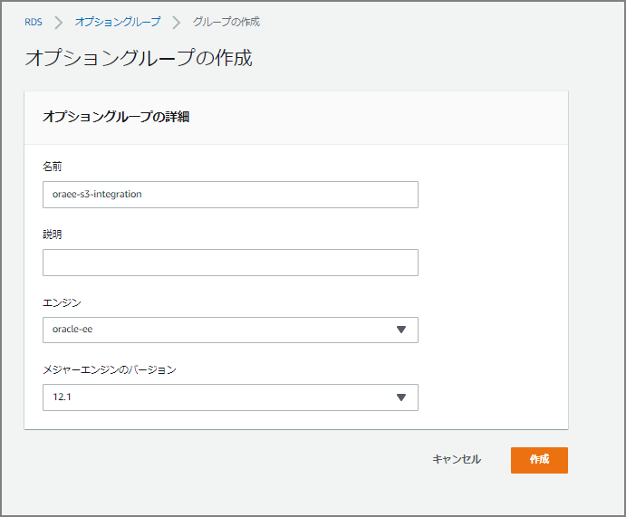
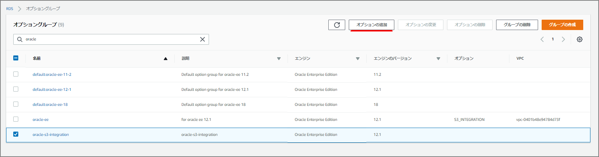
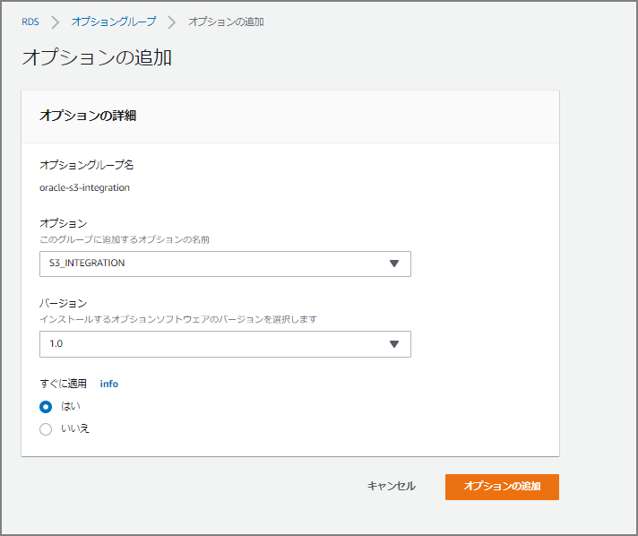
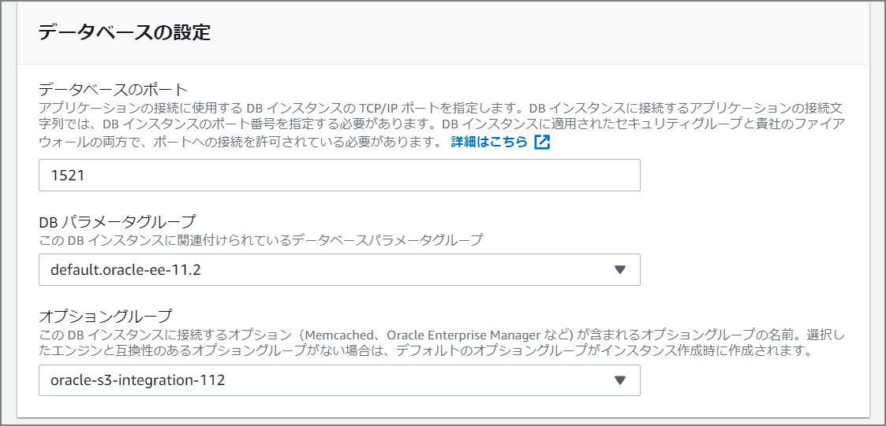

#### Review the Notes

First, review the manual. Importing the entire database is not supported; imports must be done at the schema or table level. Since Amazon RDS for Oracle does not allow access to the administrative users `SYS` or `SYSDBA`, importing in `full` mode or importing schemas of Oracle-managed components can damage the Oracle data directory and affect database stability. Also note that transportable tablespaces — which are fast and convenient — are not supported.

> #### Importing Data into Oracle on Amazon RDS - Amazon Relational Database Service https://docs.aws.amazon.com/AmazonRDS/latest/UserGuide/Oracle.Procedural.Importing.html

> - To import specific schemas or objects, run the import in `schema` or `table` mode.
>
> - Restrict imported schemas to those required by your application.
>
> - Do not import in `full` mode.
>
>   Amazon RDS for Oracle does not allow access to administrative users `SYS` or `SYSDBA`, so importing in `full` mode or importing schemas of Oracle-managed components can damage the Oracle data directory and affect database stability.
>
> - When loading large amounts of data, transfer the dump file to the target Amazon RDS for Oracle DB instance, create a DB snapshot of the instance, test the import to verify it completes successfully, and if database components are invalid, delete the DB instance and recreate it from the DB snapshot. The restored DB instance will include all dump files staged on the DB instance at the time the DB snapshot was created.
>
> - Do not import dump files created using Oracle Data Pump export parameters (`TRANSPORT_TABLESPACES`, `TRANSPORTABLE`, `TRANSPORT_FULL_CHECK`). Importing such dump files is not supported on Amazon RDS for Oracle DB instances.

The Data Pump dump file is transferred to `DATA_PUMP_DIR` (directory object) inside RDS, which temporarily requires a large amount of storage inside RDS. Pay particular attention to avoid `Storage Full`. Note that files are not automatically deleted after import; use `UTL_FILE.FREMOVE` as needed.

#### Data Pump Methods

There are two methods for importing with Data Pump:

1. [Importing Data Using Oracle Data Pump and Amazon S3](https://docs.aws.amazon.com/AmazonRDS/latest/UserGuide/Oracle.Procedural.Importing.html#Oracle.Procedural.Importing.DataPump.S3)
2. [Importing Data Using Oracle Data Pump and a Database Link](https://docs.aws.amazon.com/AmazonRDS/latest/UserGuide/Oracle.Procedural.Importing.html#Oracle.Procedural.Importing.DataPump.DBLink)

#### Importing Data via S3 Bucket

##### Create an Option Group and Attach It to the Existing RDS (Oracle)

Select Option Groups.



Create an option group.



Select the name, description, engine, and major engine version.



After creating the group, add an option.



Select "oracle-s3-integration" as the option. Set "Apply Immediately" to "Yes".



In "Database Settings" there is an "Option Group" field; specify the option group just created.



##### Create the Necessary Policy and IAM Role, and Attach to the RDS Instance

> Amazon S3 Integration - Amazon Relational Database Service https://docs.aws.amazon.com/AmazonRDS/latest/UserGuide/oracle-s3-integration.html#oracle-s3-integration.preparing

##### Expand the Tablespace

```sql
ALTER tablespace USERS resize 30G;
```

##### Grant Permissions to the Import User

```sql
DROP USER "DPUSR" CASCADE;
CREATE USER "DPUSR" identified BY "oracle";

ALTER USER "DPUSR" QUOTA UNLIMITED ON USERS;

GRANT DBA to "DPUSR";
GRANT CREATE SESSION TO "DPUSR";
GRANT "RESOURCE" TO "DPUSR";
GRANT UNLIMITED TABLESPACE TO "DPUSR";
```

##### Transfer and Import the Data Pump Dump File from S3

First, check the directory objects.

```sql
set pages 2000 lin 2000
col filename for a30
col FILESIZE for 99999999999
alter session set nls_date_format='YYYY/MM/DD HH24:MI:SS';
select * from table (rdsadmin.rds_file_util.listdir(p_directory => 'BDUMP'));
select * from table (rdsadmin.rds_file_util.listdir(p_directory => 'DATA_PUMP_DIR'));
```

Specify the S3 bucket and download to `DATA_PUMP_DIR`.

```sql
select rdsadmin.rdsadmin_s3_tasks.download_from_s3(p_bucket_name => 'pluto-dev-s3-test', p_directory_name => 'DATA_PUMP_DIR') AS TASK_ID FROM DUAL;
```

Check the log as needed. The task ID is output to the console when `rdsadmin.rdsadmin_s3_tasks.download_from_s3` is executed; use it as an argument to `rdsadmin.rds_file_util.read_text_file`.

```sql
select text from table(rdsadmin.rds_file_util.read_text_file('BDUMP','dbtask-1574174424228-1248.log'));
```

Confirm that the dmp file has been placed under DATA_PUMP_DIR.

```sql
SQL> select * from table (rdsadmin.rds_file_util.listdir(p_directory => 'DATA_PUMP_DIR'));

FILENAME		       TYPE	      FILESIZE MTIME
------------------------------ ---------- ------------ -------------------
datapump/		       directory	  4096 2019/12/06 01:02:22
datapump_meta.dmp 	       file	       8237056 2019/12/06 01:02:22
```

Import using the dbms_datapump procedure.

```sql
DECLARE
    hdnl NUMBER;
BEGIN
    hdnl := dbms_datapump.open (operation => 'IMPORT', job_mode => 'FULL', version => 'COMPATIBLE');
    DBMS_DATAPUMP.ADD_FILE( handle => hdnl, filename => 'import.log', directory => 'DATA_PUMP_DIR', filetype => dbms_datapump.ku$_file_type_log_file);
    DBMS_DATAPUMP.ADD_FILE( handle => hdnl, filename => 'expdat.dmp', directory => 'DATA_PUMP_DIR', filetype => dbms_datapump.ku$_file_type_dump_file);
    DBMS_DATAPUMP.START_JOB(handle => hdnl);
end;
/
```

#### Importing Data via Database Link

Create a database link on the source from which the Data Pump dump file will be transferred.

```sql
drop database link ora121;
create database link ora121 connect to master identified by "Oracle2019%" using '(DESCRIPTION=(ADDRESS=(PROTOCOL=TCP)(HOST=ora121rds.xxxxxxxxxx.ap-northeast-1.rds.amazonaws.com)(PORT=1521))(CONNECT_DATA=(SID=ora121)))';
```

Transfer the dump file.

```sql
BEGIN
DBMS_FILE_TRANSFER.PUT_FILE(
    source_directory_object       => 'DP_DIR',
    source_file_name              => 'expdat.dmp',
    destination_directory_object  => 'DATA_PUMP_DIR',
    destination_file_name         => 'expdat.dmp',
    destination_database          => 'ora121'
);
END;
/
```

Verify the transfer on the RDS side.

```sql
set pages 2000 lin 2000
col filename for a30
col FILESIZE for 99999999999
alter session set nls_date_format='YYYY/MM/DD HH24:MI:SS';
select * from table (rdsadmin.rds_file_util.listdir(p_directory => 'BDUMP'));
select * from table (rdsadmin.rds_file_util.listdir(p_directory => 'DATA_PUMP_DIR'));
```

Import.

```sql
DECLARE
hdnl NUMBER;
BEGIN
    hdnl := DBMS_DATAPUMP.open( operation => 'IMPORT', job_mode => 'SCHEMA', job_name=>null);
    DBMS_DATAPUMP.ADD_FILE( handle => hdnl, filename => 'expdat.dmp', directory => 'DATA_PUMP_DIR', filetype => dbms_datapump.ku$_file_type_dump_file);
    DBMS_DATAPUMP.add_file( handle => hdnl, filename => 'imp.log', directory => 'DATA_PUMP_DIR', filetype => dbms_datapump.ku$_file_type_log_file);
    DBMS_DATAPUMP.METADATA_FILTER(hdnl,'SCHEMA_EXPR','IN (''HR'')');
    DBMS_DATAPUMP.start_job(hdnl);
END;
/
```

Check the log as needed.

```sql
SELECT TEXT FROM TABLE(RDSADMIN.RDS_FILE_UTIL.READ_TEXT_FILE('DATA_PUMP_DIR','imp.log'));
```

How to delete the log.

```sql
EXEC UTL_FILE.FREMOVE('DATA_PUMP_DIR','imp.log');
```

Import using the dbms_datapump procedure.

```sql
DECLARE
    hdnl NUMBER;
BEGIN
    hdnl := dbms_datapump.open (operation => 'IMPORT', job_mode => 'FULL', version => 'COMPATIBLE');
    DBMS_DATAPUMP.ADD_FILE( handle => hdnl, filename => 'import.log', directory => 'DATA_PUMP_DIR', filetype => dbms_datapump.ku$_file_type_log_file);
    DBMS_DATAPUMP.ADD_FILE( handle => hdnl, filename => 'expdat.dmp', directory => 'DATA_PUMP_DIR', filetype => dbms_datapump.ku$_file_type_dump_file);
    DBMS_DATAPUMP.START_JOB(handle => hdnl);
end;
/
```

#### Other

The following contains a method using a Perl script to transfer to DATA_PUMP_DIR:

[Strategies for Migrating Oracle Databases to AWS](https://d0.awsstatic.com/whitepapers/strategies-for-migrating-oracle-database-to-aws.pdf)

Data Migration Using Oracle Data Pump - Next Steps for a Database on Amazon RDS

> [AWS] Transferring Data Pump Dump Files to an RDS for Oracle Instance | Developers.IO https://dev.classmethod.jp/cloud/aws/transfer-data-pump-file-to-rds-instace/
