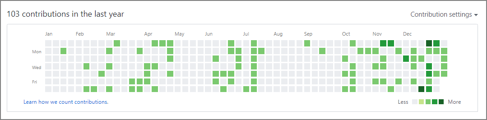

#### Introduction

This blog is hosted on GitHub Pages, and one of my goals for this year is to "regularly update the blog and produce output," so I wanted to visualize that. GitHub has a contribution graph — commonly called "grass" — so I decided to use it for visualization.


On the other hand, I had written many articles before I started using GitHub Pages, so I wanted to reflect those update dates in the Contributions graph. I looked into how to grow GitHub "grass" using past dates.

#### Method

The conditions for contributions to appear are as follows. Commits, issues, and pull requests all count. No actual source code changes are required — just these actions alone can ~~forge~~ create Contributions.

> https://help.github.com/en/github/setting-up-and-managing-your-github-profile/viewing-contributions-on-your-profile
>
> ### [What counts as a contribution](https://help.github.com/en/github/setting-up-and-managing-your-github-profile/viewing-contributions-on-your-profile#what-counts-as-a-contribution)
>
> On your profile page, certain actions count as contributions:
>
> - Committing to a repository's default branch or `gh-pages` branch
> - Opening an issue
> - Proposing a pull request
> - Submitting a pull request review

This time, I used the `--date` option with the `git commit` command to set the AuthorDate to a past date. Then simply push, and you're done.

##### Command

```sh
git commit --allow-empty -m "COMMIT" --date="Dec 29 23:59:59 2019 +0900"
git push origin master
```

##### Verification

```sh
git log --pretty=fuller

commit d0d02bd117419f4aacc7d8f16e78f192ec8ce79d
Author:     Imazato <xxxxx.xxxxxx@gmail.com>
AuthorDate: Sun Dec 29 23:59:59 2019 +0900
Commit:     Imazato <xxxxx.xxxxxx@gmail.com>
CommitDate: Wed Jan 8 17:46:25 2020 +0900

    COMMIT
```

##### Result

By pulling the update dates from the articles and running the command, contributions appeared even for past dates. My goal is to reach a state where I feel restless if there is no grass growing.


