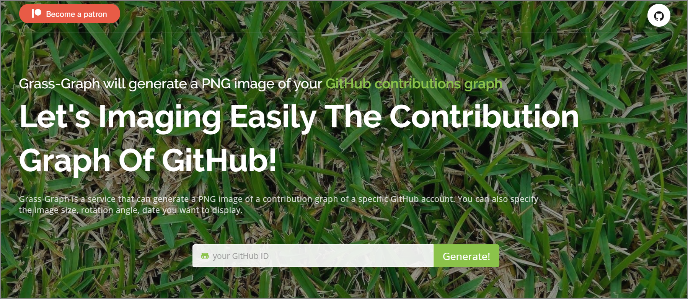
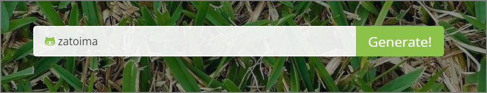
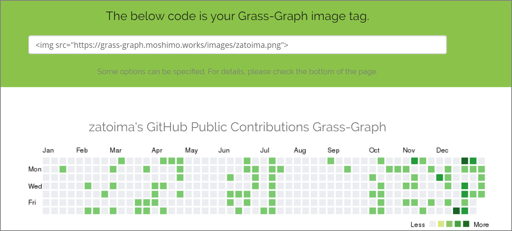
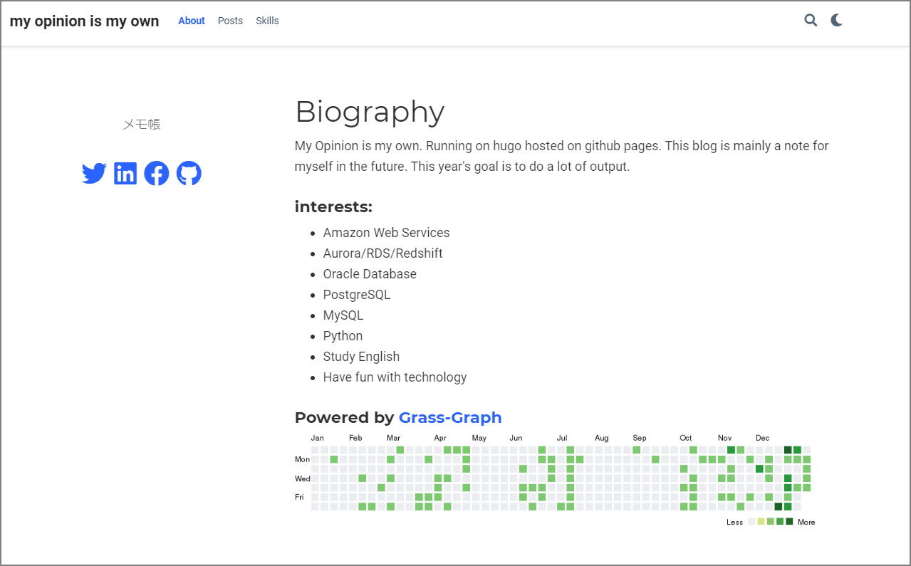

I added GitHub contributions to the top page of the blog. Since I run this blog on GitHub Pages, every time I write a post, the "grass" grows. The motivation was both the visual appeal and a desire to track my activity.

The tool I used:

> GitHub の草状況を PNG 画像で返す heroku app をつくってみた - えいのうにっき https://blog.a-know.me/entry/2016/01/09/222210

##### 1.) Visit the Site

Go to the following URL:

> Grass-Graph / Imaging your GitHub Contributions Graph https://grass-graph.appspot.com/



##### 2.) Enter Your GitHub ID



##### 3.) A Meta Tag Is Generated — Take Note of It



##### 4.) Add a Tag So That Clicking the Image Links to Your GitHub Profile

```html
<a href="https://github.com/zatoima" target="_blank">
  
</a>
```

##### 5.) Paste This Tag into the Designated Area of Your Blog Service

I added it to the top page of the blog.


