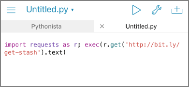
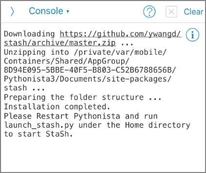
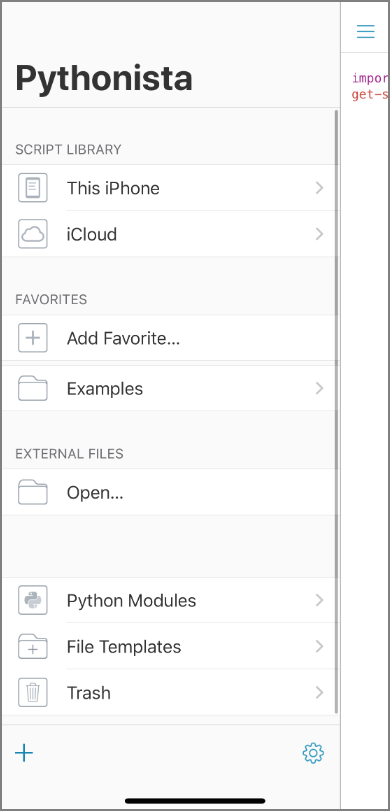
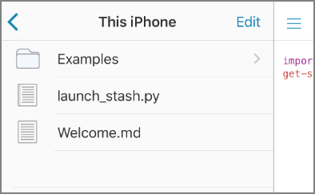
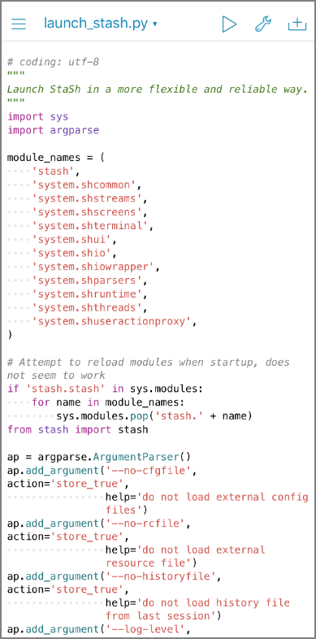
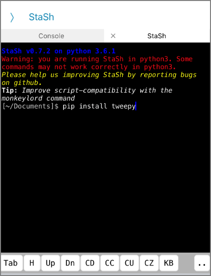
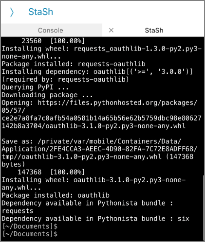
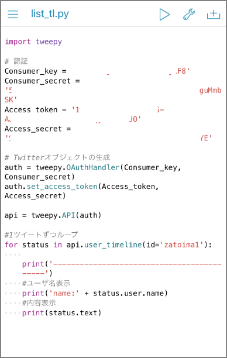
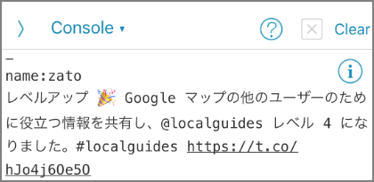

I had some Python code that I didn't need to run continuously but wanted to run occasionally during downtime. While it's fine if I always have access to a PC, that's not always the case. So I tried Pythonista 3 to see if I could run it from my iPhone or iPad, which I always carry with me.

Pythonista 3 is a paid app for running Python on iOS. As of January 2020, it costs 1,200 yen.

> ‎Pythonista 3 https://apps.apple.com/jp/app/pythonista-3/id1085978097

The official page is here:

> Pythonista for iOS http://omz-software.com/pythonista/

Popular third-party modules such as numpy, matplotlib, and requests are available, as well as modules customized for iOS. You can access iPhone motion sensor data, photo library, contacts, alarms, iOS clipboard, and more.

One concern is whether it continues to receive updates (the last update was in 2018).

That said, I couldn't find any other option that allows installing 3rd-party modules and running Python code on iOS, so this seems to be the only choice.

In this post, I'll install StaSH to set up a pip-capable environment, then use tweepy to operate the Twitter API.

### Installing StaSH

StaSH (Pythoni**<u>sta Sh</u>**ell) is an extension that enables command operations like pip within Pythonista 3. Since pip is essentially a required feature for using Python, StaSH should also be installed.

To install, first open the console and run the following command. This downloads **getstash.py** from `https://raw.githubusercontent.com/ywangd/stash/master/getstash.py`.

```python
import requests as r; exec(r.get('http://bit.ly/get-stash').text)
```

​



**launch_stash.py** is downloaded from GitHub. The message says "Home directory to Start StaSh."



Restart the app and navigate to "Script Library" - "This iPhone."



**launch_stash.py** has been placed there. Execute this Python file.





The console screen launches. Run pip commands from this screen. Here, I'll install tweepy, a Twitter API wrapper.






### Running Python Code

Now that I can install required modules via pip, I'll create a Python script by copy-pasting and try running it. Note that loading from cloud storage like Google Drive or Dropbox is not possible — only local files or iCloud Drive are supported.

##### Source Code




##### Execution Result



It ran successfully. Now I can run Python even in situations where I only have my smartphone, which should improve quality of life. ~~I wonder if game automation is also possible?~~

For more details:

> Pythonista for iOS http://omz-software.com/pythonista/
