### Introduction

I decided to try Neptune, AWS's fully managed graph database service. The plan is to go from instance creation through loading `RDF`-format data, and finally issue a simple query using `SPARQL`.

I'll cover what a graph database is and what Amazon Neptune is in a separate article.

Steps to be performed:

1. Create the instance
2. Create an IAM role, attach the role to Neptune, configure the S3 VPC endpoint
3. Load data from S3
4. Verify the loaded data using the RDF4J console and HTTP REST endpoint

Prerequisites:
- VPC and S3 created in advance

### Creating the Instance

#### Select "Create Database"

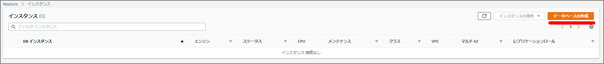

#### Fill in "Specify DB Details"

For this test, I specified "Neptune 1.0.2.1.R4," the latest version at the time. Note that changing to Multi-AZ after instance creation is not currently possible, so select it at this stage if needed.

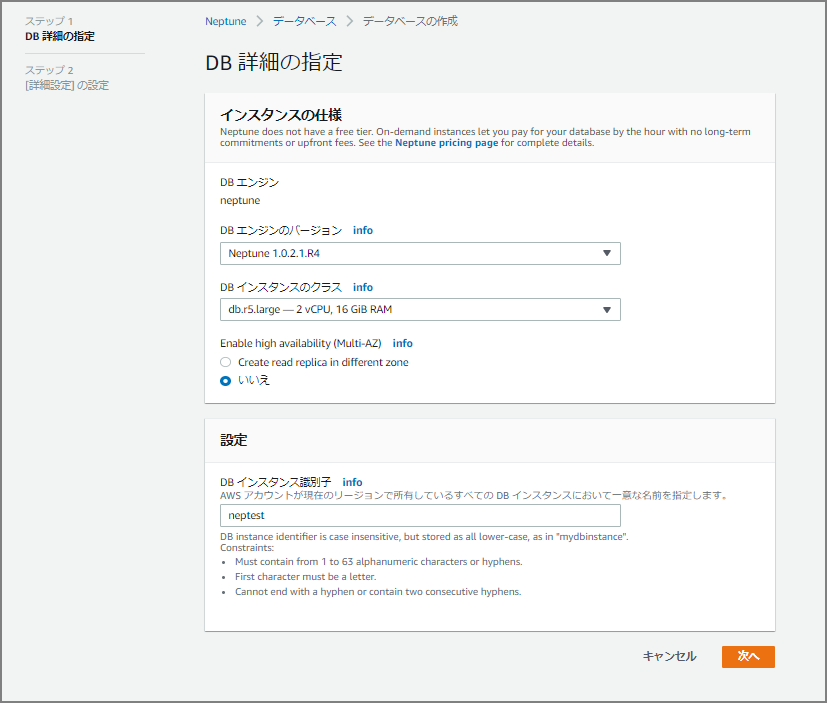

#### Continue Filling In Details

The input fields are similar to RDS and Aurora.

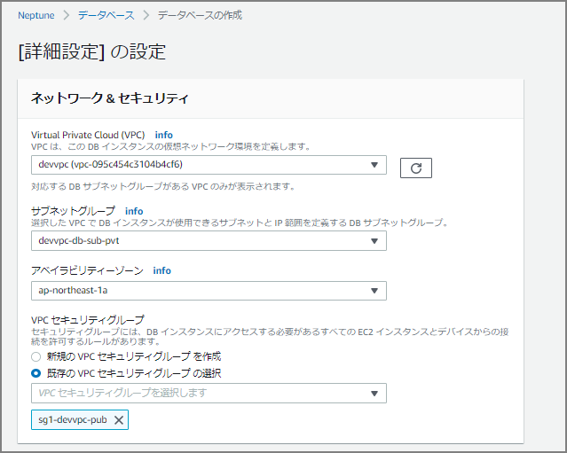

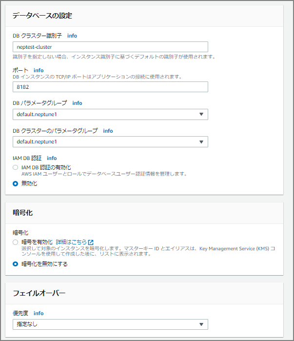

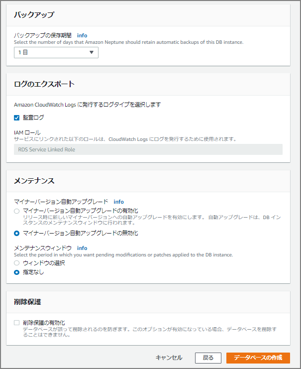

After clicking the "Create Database" button, creation begins — wait a bit.


Creation completed in roughly 5 to 10 minutes.

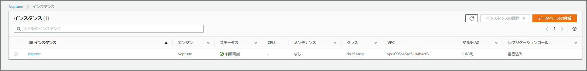


### Setting Up IAM Role and S3 VPC Endpoint

As preparation for data loading, configure the IAM role and S3 VPC endpoint.

> Prerequisite: IAM Role and Amazon S3 Access - Amazon Neptune https://docs.aws.amazon.com/ja_jp/neptune/latest/userguide/bulk-load-tutorial-IAM.html

From the IAM screen, select "Create Role."

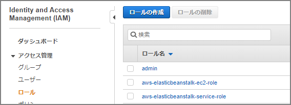

Select S3.

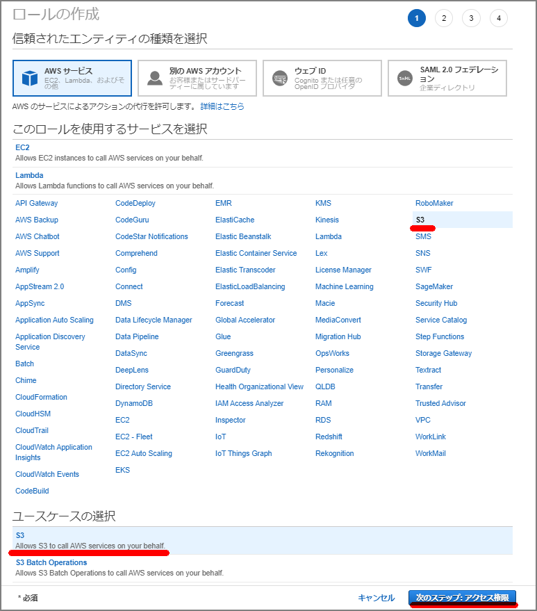

Select "`AmazonS3ReadOnlyAccess`" to attach the policy.

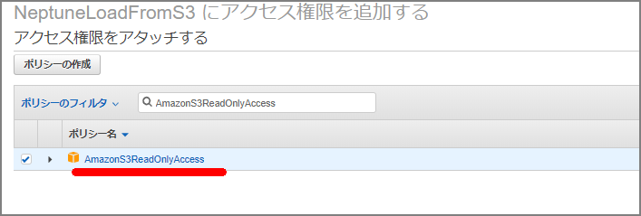

Fill in as needed.


The role name was set to "NeptuneLoadFromS3."

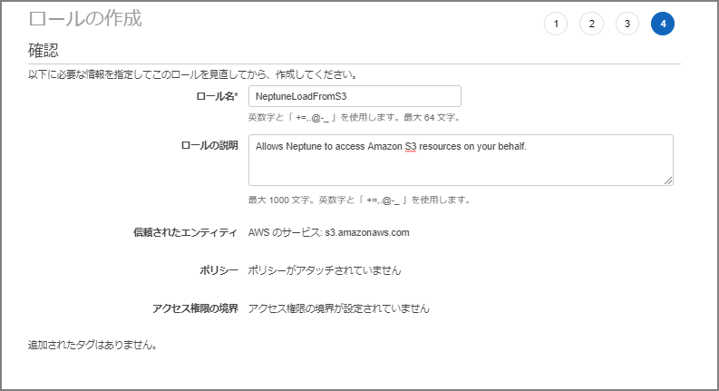

Navigate to the created role's screen.

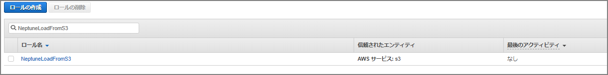

Go to "Trust relationships" - "Edit trust relationship" and paste the following, overwriting the existing content.


```json
{
  "Version": "2012-10-17",
  "Statement": [
    {
      "Sid": "",
      "Effect": "Allow",
      "Principal": {
        "Service": [
          "rds.amazonaws.com"
        ]
      },
      "Action": "sts:AssumeRole"
    }
  ]
}
```


### Add an IAM Role to the Amazon Neptune Cluster

Go to the Neptune cluster and select "Manage IAM roles."

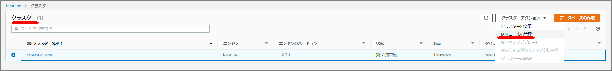

Add the IAM role just created (`NeptuneLoadFromS3`).

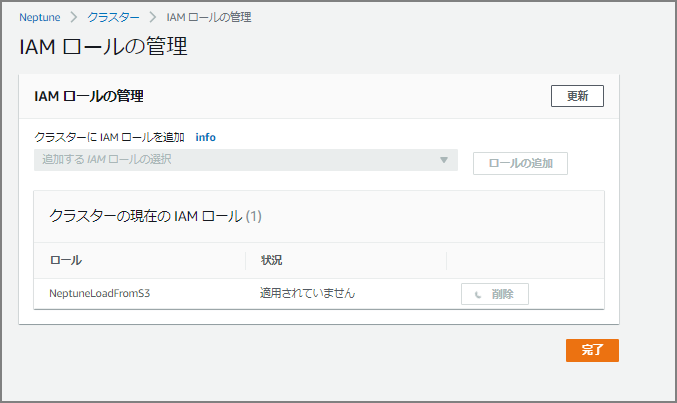

### Create an S3 VPC Endpoint

A VPC endpoint is required to load data from S3 into Neptune. Set up a VPC endpoint.

On the endpoint creation screen, select "com.amazonaws.ap-northeast-1.s3." (Since this is the Tokyo region, it's `ap-northeast-1`; other regions will have a different region name.)

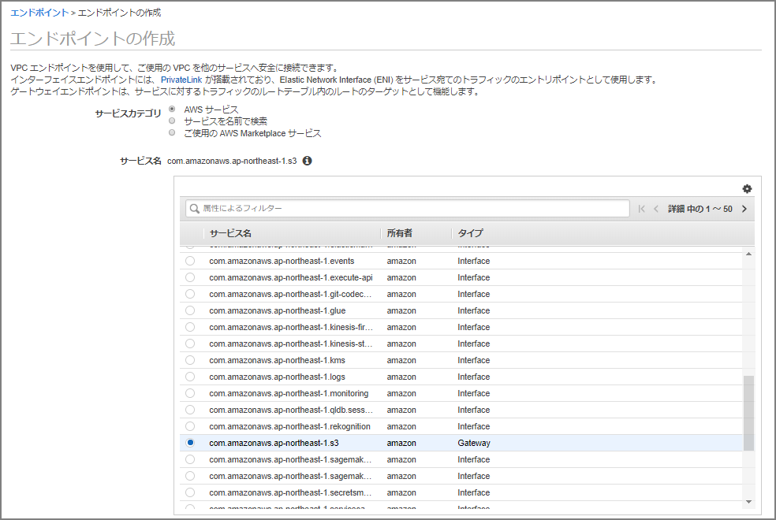

Specify the VPC and route table.

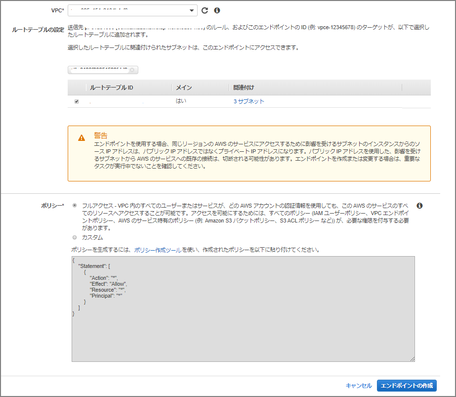

### Loading Data from S3 into Neptune

We're now ready to load from S3 into Neptune. The data to load will be from http://rdf.geospecies.org. Upload a sample RDF data file in rdfxml format to the designated S3 bucket.

```sh
[ec2-user@bastin nep-tool]$ curl -O http://rdf.geospecies.org/geospecies.rdf.gz
  % Total    % Received % Xferd  Average Speed   Time    Time     Time  Current
                                 Dload  Upload   Total   Spent    Left  Speed
  0     0    0     0    0     0      0      0 --:--:-- --:--:-- --:--:--     0
100 8891k  100 8891k    0     0  3405k      0  0:00:02  0:00:02 --:--:-- 3404k
[ec2-user@bastin nep-tool]$
[ec2-user@bastin nep-tool]$ ls -l geospecies.rdf.gz
-rw-rw-r-- 1 ec2-user ec2-user 9105109 Jan 28 08:16 geospecies.rdf.gz
[ec2-user@bastin nep-tool]$ aws s3 cp geospecies.rdf.gz s3://nep-s3-xxxx/
upload: ./geospecies.rdf.gz to s3://nep-s3-xxxx/geospecies.rdf.gz
[ec2-user@bastin nep-tool]$
```

Load the data with the following command. Update `endpoint`, `source`, `format`, and `iamRoleArn` as needed.

For RDF, the `format` can also be `turtle`, `ntriples`, and others.

> Load Data Formats - Amazon Neptune https://docs.aws.amazon.com/ja_jp/neptune/latest/userguide/bulk-load-tutorial-format.html

```sh
curl -X POST \
    -H 'Content-Type: application/json' \
    https://neptest.xxxxxxxxxxxx.ap-northeast-1.neptune.amazonaws.com:8182/loader -d '
    {
      "source" : "s3://nep-s3-xxxx/geospecies.rdf.gz",
      "format" : "rdfxml",
      "iamRoleArn" : "arn:aws:iam::xxxxxxxxx:role/NeptuneLoadFromS3",
      "region" : "ap-northeast-1",
      "failOnError" : "FALSE",
      "parallelism" : "HIGH"
    }'
```

After execution, the following is displayed. Note the `loadId` as it's needed to check status.

```sh
{
    "status" : "200 OK",
    "payload" : {
        "loadId" : "eff1268f-17ab-473a-b845-c2d91a317c01"
    }

```

Check the data load status. Specify the `loadId` obtained earlier.

```sh
curl -G 'https://neptest.xxxxxxxxxxxx.ap-northeast-1.neptune.amazonaws.com:8182/loader/eff1268f-17ab-473a-b845-c2d91a317c01'
```

##### In-Progress Output

```json
[ec2-user@bastin nep-tool]$ curl -G 'https://neptest.xxxxxxxxxxxx.ap-northeast-1.neptune.amazonaws.com:8182/loader/eff1268f-17ab-473a-b845-c2d91a317c01'
{
    "status" : "200 OK",
    "payload" : {
        "feedCount" : [
            {
                "LOAD_IN_PROGRESS" : 1
            }
        ],
        "overallStatus" : {
            "fullUri" : "s3://nep-s3-xxxx/geospecies.rdf.gz",
            "runNumber" : 1,
            "retryNumber" : 0,
            "status" : "LOAD_IN_PROGRESS",
            "totalTimeSpent" : 148,
            "startTime" : 1580199498,
            "totalRecords" : 2130000,
            "totalDuplicates" : 0,
            "parsingErrors" : 0,
            "datatypeMismatchErrors" : 0,
            "insertErrors" : 0
        }
    }
}
```

##### Load Complete Output

```json
[ec2-user@bastin nep-tool]$ curl -G 'https://neptest.xxxxxxxxxxxx.ap-northeast-1.neptune.amazonaws.com:8182/loader/eff1268f-17ab-473a-b845-c2d91a317c01'
{
    "status" : "200 OK",
    "payload" : {
        "feedCount" : [
            {
                "LOAD_COMPLETED" : 1
            }
        ],
        "overallStatus" : {
            "fullUri" : "s3://nep-s3-xxxx/geospecies.rdf.gz",
            "runNumber" : 1,
            "retryNumber" : 0,
            "status" : "LOAD_COMPLETED",
            "totalTimeSpent" : 149,
            "startTime" : 1580199498,
            "totalRecords" : 2201532,
            "totalDuplicates" : 0,
            "parsingErrors" : 0,
            "datatypeMismatchErrors" : 0,
            "insertErrors" : 0
        }
    }
```

The field descriptions are as follows. In this example, **2,201,532** records were loaded in **149** seconds.

> Neptune Loader Get-Status API - Amazon Neptune https://docs.aws.amazon.com/ja_jp/neptune/latest/userguide/load-api-reference-status.html

| Field                  | Description                                                  |
| ---------------------- | ------------------------------------------------------------ |
| fullUri                | The URI of one or more files to be loaded. Format: s3://bucket/key |
| runNumber              | The number of runs for this load or feed. This increments when the load is resumed. |
| retryNumber            | The number of retries for this load or feed. This increments when the loader automatically retries a feed or load. |
| status                 | The returned status for this load or feed. LOAD_COMPLETED indicates the load succeeded without issues. |
| totalTimeSpent         | Time spent (in seconds) parsing and inserting data for this load or feed. Does not include time spent retrieving the list of source files. |
| totalRecords           | Total records loaded or attempted to be loaded. |
| totalDuplicates        | Number of duplicate records encountered. |
| parsingErrors          | Number of parsing errors encountered. |
| datatypeMismatchErrors | Number of records where the specified data did not match the data type. |
| insertErrors           | Number of records that could not be inserted due to errors. |


### Issuing Queries to Neptune

Now that data is loaded, let's issue queries.

#### Using the HTTP REST Endpoint

> Connecting to a Neptune DB Instance Using the HTTP REST Endpoint - Amazon Neptune https://docs.aws.amazon.com/ja_jp/neptune/latest/userguide/access-graph-sparql-http-rest.html

```sh
curl -X POST --data-binary 'query=select ?s ?p ?o where {?s ?p ?o} limit 10' https://neptest.xxxxxxxxxxxx.ap-northeast-1.neptune.amazonaws.com:8182/sparql
```

##### Execution Result

```json
[ec2-user@bastin nep-tool]$ curl -X POST --data-binary 'query=select ?s ?p ?o where {?s ?p ?o} limit 10' https://neptest.xxxxxxxxxxxx.ap-northeast-1.neptune.amazonaws.com:8182/sparql
{
  "head" : {
    "vars" : [ "s", "p", "o" ]
  },
  "results" : {
    "bindings" : [ {
      "s" : {
        "type" : "uri",
        "value" : "http://lod.geospecies.org/ses/uRtpv"
      },
      "p" : {
        "type" : "uri",
        "value" : "http://rdf.geospecies.org/ont/geospecies#isUnexpectedIn"
      },
      "o" : {
        "type" : "uri",
        "value" : "http://sws.geonames.org/5001836/"
      }
～omitted～
```


#### Using the RDF4J Console

> Connecting to a Neptune DB Instance Using the RDF4J Console - Amazon Neptune https://docs.aws.amazon.com/ja_jp/neptune/latest/userguide/access-graph-sparql-rdf4j-console.html

Download the RDF4J SDK from the [RDF4J site](https://rdf4j.org/download/).

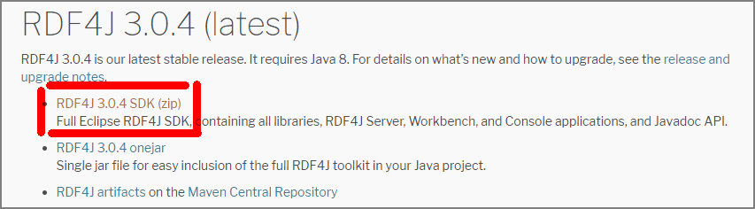

Upload the downloaded zip file to a specific EC2 instance.

```sh
[ec2-user@bastin nep-tool]$ ls -l
total 104740
-rw-r--r-- 1 ec2-user ec2-user 98147430 Jan 25 06:16 eclipse-rdf4j-3.0.4-sdk.zip
-rw-rw-r-- 1 ec2-user ec2-user  9105109 Jan 28 08:16 geospecies.rdf.gz
```

After unzipping, run `console.sh` located under `bin/`.

```sh
[ec2-user@bastin nep-tool]$ ./eclipse-rdf4j-3.0.4/bin/console.sh
08:37:35.639 [main] DEBUG org.eclipse.rdf4j.common.platform.PlatformFactory - os.name = linux
08:37:35.652 [main] DEBUG org.eclipse.rdf4j.common.platform.PlatformFactory - Detected Posix platform
Connected to default data directory
RDF4J Console 3.0.4+47737c0

3.0.4+47737c0
Type 'help' for help.
>
```

Create a SPARQL repository for the Neptune DB instance.

```sh
create sparql
```

You will be prompted to enter the following information. (Unverified, but if a read replica is created, the "SPARQL query endpoint" and "SPARQL update endpoint" should probably be split between master and read replica.)

| Variable                                                     | Value                                     |
| ------------------------------------------------------------ | ----------------------------------------- |
| SPARQL query endpoint                                        | https://your-neptune-endpoint:port/sparql |
| SPARQL update endpoint                                       | https://your-neptune-endpoint:port/sparql |
| Local repository ID [endpoint@localhost]                     | neptune                                   |
| Repository title [SPARQL endpoint repository @localhost]     | Neptune DB instance                       |

```sh
> create sparql
Please specify values for the following variables:
SPARQL query endpoint: https://neptest.xxxxxxxxxxxx.ap-northeast-1.neptune.amazonaws.com:8182/sparql
SPARQL update endpoint: https://neptest.xxxxxxxxxxxx.ap-northeast-1.neptune.amazonaws.com:8182/sparql
Local repository ID [endpoint@localhost]: neptune
Repository title [SPARQL endpoint repository @localhost]: neptune

Repository created
```

Connect to the Neptune instance. After connecting, the local repository ID appears in the prompt.

```
> open neptune
Opened repository 'neptune'
neptune>
```

Run the same query as with the HTTP REST endpoint approach.

```sh
neptune> sparql select ?s ?p ?o where {?s ?p ?o} limit 10
Evaluating SPARQL query...
+------------------------+------------------------+------------------------+
| s                      | p                      | o                      |
+------------------------+------------------------+------------------------+
| <http://lod.geospecies.org/ses/zJIK4>| <http://rdf.geospecies.org/ont/geospecies#hasScientificNameAuthorship>| "(LeConte, 1866)"^^xsd:string|
| <http://lod.geospecies.org/ses/zJIK4>| <http://rdf.geospecies.org/ont/geospecies#hasScientificName>| "Iphthiminus opacus (LeConte, 1866)"^^xsd:string|
| <http://lod.geospecies.org/ses/zJIK4>| <http://rdf.geospecies.org/ont/geospecies#isExpectedIn>| <http://sws.geonames.org/6255149/>|
| <http://lod.geospecies.org/ses/zJIK4>| <http://rdf.geospecies.org/ont/geospecies#isExpectedIn>| <http://sws.geonames.org/5279468/>|
| <http://lod.geospecies.org/ses/zJIK4>| <http://rdf.geospecies.org/ont/geospecies#hasNomenclaturalCode>| <http://rdf.geospecies.org/ont/geospecies#NomenclaturalCode_ICZN>|
| <http://lod.geospecies.org/ses/zJIK4>| <http://rdf.geospecies.org/ont/geospecies#isUnknownAboutIn>| <http://sws.geonames.org/4862182/>|
| <http://lod.geospecies.org/ses/zJIK4>| <http://rdf.geospecies.org/ont/geospecies#isUnknownAboutIn>| <http://sws.geonames.org/5037779/>|
| <http://lod.geospecies.org/ses/zJIK4>| <http://rdf.geospecies.org/ont/geospecies#isUnknownAboutIn>| <http://sws.geonames.org/5001836/>|
| <http://lod.geospecies.org/ses/zJIK4>| <http://rdf.geospecies.org/ont/geospecies#isUnknownAboutIn>| <http://sws.geonames.org/2635167/>|
| <http://lod.geospecies.org/ses/zJIK4>| <http://rdf.geospecies.org/ont/geospecies#hasSubfamilyName>| "Coelometopinae"^^xsd:string|
+------------------------+------------------------+------------------------+
10 result(s) (1268 ms)
neptune>

```
