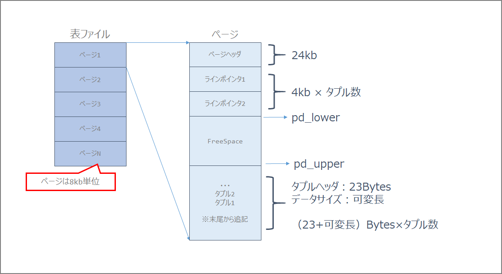
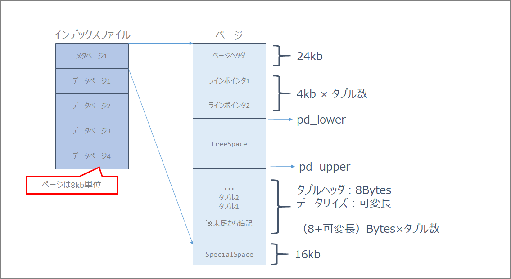

### Introduction

I decided to study for the OSS-DB Gold (Open Source Database Engineer Certification Exam), but since there are no books published within the last 5 years, I decided to study using the exam syllabus as a guide, along with the manual, actual systems, and information from other pioneers on the web.

Compared to other exams, the OSS-DB exam scope is clearly defined, and while not listed here, there are entries for "important terms, commands, and parameters." If you want to see the complete exam scope, please refer to the exam overview below.

> OSS-DB Gold https://oss-db.jp/outline/gold

This time I will summarize the database server construction section of operations management. There is not much content here; it's just notes.

#### Exam Scope

- Operations Management (30%)
  - Database Server Construction [Importance: 2]
  - Operations Management Commands in General [Importance: 4]
  - Database Structure [Importance: 2]
  - Hot Standby Operations [Importance: 1]
- Performance Monitoring (30%)
  - Access Statistics [Importance: 3]
  - Table/Column Statistics [Importance: 2]
  - Query Execution Plans [Importance: 3]
  - Other Performance Monitoring [Importance: 1]
- Performance Tuning (20%)
  - Performance-Related Parameters [Importance: 4]
  - Tuning Implementation [Importance: 2]
- Failure Response (20%)
  - Possible Failure Patterns [Importance: 3]
  - Corrupted Cluster Recovery [Importance: 2]
  - Hot Standby Recovery [Importance: 1]


### Operations Management - Database Server Construction

The description, key knowledge areas, important terms, commands, and parameters for this exam scope are as follows.

- Description:
  - Tests knowledge of capacity estimation in server construction and database security
- Key Knowledge Areas:
  - Table/Index capacity estimation
  - Security
    - Communication path encryption (SSL)
    - Data encryption
    - Client authentication
    - Audit logs
  - Data type sizes
  - Per-user and per-database parameter configuration
- Important terms, commands, parameters, etc.:
  - Checksum
  - pg_xact
  - pg_multixact
  - pg_notify
  - pg_serial
  - pg_snapshots
  - pg_stat_tmp
  - pg_subtrans
  - pg_tblspc
  - pg_twophase
  - ssl
  - pg_stat_ssl
  - pgcrypto
  - ALTER ROLE
  - ALTER DATABASE
  - initdb -data-checksums (-k)
  - log_statement
  - track_functions
  - track_activities

### Exam Preparation Summary

#### Table/Index Capacity Estimation

The internal structure (pages) of a table is as follows.

| Item          | Description                                                  |
| :------------ | :----------------------------------------------------------- |
| Page Header   | 24 bytes long. Contains general information about the page, including free space pointers. |
| Line Pointer  | An array of item identifiers pointing to actual items. 4 bytes per item. |
| Free Space    | Unallocated space. Line pointers are allocated from the beginning of this area, and new items (tuples) from the end. |
| Tuple         | The actual data (row data)                                   |
| Special Space | Data specific to the index access method; empty for ordinary tables. |



Calculate using the t1 table below as an example.

```sql
postgres=# select tablename, attname, avg_width from pg_stats where tablename = 't1';
 tablename | attname | avg_width
-----------+---------+-----------
 t1        | a       |         4
 t1        | b       |         2
 t1        | c       |         6
 t1        | d       |         8
(4 rows)
```

From the above results, the number of bytes required per tuple (row) is `(4+2+6+8)` = `20 bytes`. Since a line pointer of `4 bytes` is required for each tuple, in this example, `24 bytes` are needed per tuple.

```
Tuples per page = (8192 - PageHeaderData) / (Tuple size + ItemIdData)
= (8192 - 24) / (20 + 4)
= 8168 / 24 = 340.33
```

Therefore, approximately 340 tuples fit in one page. For example, if the number of tuples is 10,000, the required number of blocks is 240,000 bytes. In terms of pages, that would be 30,000 pages.

FILLFACTOR was not considered in this calculation, but with 90%, the calculation would be as follows.

```
Tuples per page = (8192 - PageHeaderData) / (Tuple size + ItemIdData)
= (8192 - 24 - 819) / (20 + 4)
= 8168 / 24 = 306
```

For indexes, the page structure is as follows.



#### Security

- Communication path encryption (SSL)
- Data encryption
- Client authentication
- Audit logs

#### Data Type Sizes

##### Character Types

| PostgreSQL Data Type | Max Length | Overview                                                     |
| -------------------- | ---------- | ------------------------------------------------------------ |
| VARCHAR(n)           | 1GB        | Variable-length character string of up to n characters       |
| CHAR(n)              | 1GB        | Fixed-length character data of n characters. Values shorter than the specified length are padded with spaces. |
| TEXT                 | 1GB        | Variable-length character string with no length specification |

##### Numeric Types

| PostgreSQL Data Type | Max Length | Overview                                                     |
| -------------------- | ---------- | ------------------------------------------------------------ |
| INTEGER              | 4 bytes    | Integer type. Good balance of numeric range, storage size, and performance. |
| SMALLINT             | 2 bytes    | Integer type with a narrow range                             |
| BIGINT               | 8 bytes    | Integer type with a wide range                               |
| NUMERIC              | 1000 digits | Fixed-point positive and negative numbers. You can specify the number of digits to the right of the decimal point and the total number of digits. |
| REAL                 | 4 bytes    | Single-precision floating-point number                       |
| DOUBLE PRECISION     | 8 bytes    | Double-precision floating-point number                       |

##### Date Types

| PostgreSQL Data Type | Max Length | Overview                                           |
| -------------------- | ---------- | -------------------------------------------------- |
| DATE                 | 4 bytes    | Data representing only dates in daily increments   |
| TIMESTAMP            | 8 bytes    | Data representing both date and time               |

##### Binary Types

| PostgreSQL Data Type | Max Length | Overview                               |
| -------------------- | ---------- | -------------------------------------- |
| bytea                | 1GB        | Variable-length binary data            |
| Large Object         | 2GB        | Stored within the database             |

#### Checksums (initdb -data-checksums (-k))

Data checksums specify whether to enable them when initializing the PostgreSQL database cluster. Use the `-k` option.

```
initdb -D $PGDATA -k
```

#### pg_xact

#### pg_multixact

#### pg_notify

#### pg_serial

#### pg_snapshots

#### pg_stat_tmp

#### pg_subtrans

#### pg_tblspc

#### pg_twophase

66.1. Database File Layout https://www.postgresql.jp/document/10/html/storage-file-layout.html

| Item                   | Description                                                  |
| ---------------------- | ------------------------------------------------------------ |
| `PG_VERSION`           | File containing the major version number of PostgreSQL       |
| `base`                 | Subdirectory containing per-database subdirectories          |
| `current_logfiles`     | File recording log files currently being written by the logging collector |
| `global`               | Subdirectory containing cluster-wide tables, such as `pg_database` |
| `pg_commit_ts`         | Subdirectory containing transaction commit timestamp data    |
| `pg_dynshmem`          | Subdirectory containing files used by the dynamic shared memory subsystem |
| `pg_logical`           | Subdirectory containing status data for logical decoding     |
| `pg_multixact`         | Subdirectory containing multitransaction status data (used for shared row locks) |
| `pg_notify`            | Subdirectory containing LISTEN/NOTIFY status data            |
| `pg_replslot`          | Subdirectory containing replication slot data                |
| `pg_serial`            | Subdirectory containing information about committed serializable transactions |
| `pg_snapshots`         | Subdirectory containing exported snapshots                   |
| `pg_stat`              | Subdirectory containing permanent files for the statistics subsystem |
| `pg_stat_tmp`          | Subdirectory containing temporary files for the statistics subsystem |
| `pg_subtrans`          | Subdirectory containing subtransaction status data           |
| `pg_tblspc`            | Subdirectory containing symbolic links to tablespaces        |
| `pg_twophase`          | Subdirectory containing state files for prepared transactions |
| `pg_wal`               | Subdirectory containing WAL (Write Ahead Log) files          |
| `pg_xact`              | Subdirectory containing transaction commit status data       |
| `postgresql.auto.conf` | File used to store configuration parameters set by `ALTER SYSTEM` |
| `postmaster.opts`      | File recording the command-line options from the last server startup |
| `postmaster.pid`       | Lock file recording the current postmaster process ID (PID), cluster data directory path, postmaster startup timestamp, port number, Unix-domain socket directory path (empty on Windows), first valid listen address (IP address or `*`, empty if not listening on TCP), and shared memory segment ID (does not exist after server shutdown) |

#### ssl

#### pg_stat_ssl

The `pg_stat_ssl` view holds one row per backend process and WAL sender process, showing statistics about SSL use on the connection.

> 28.2. The Statistics Collector https://www.postgresql.jp/document/10/html/monitoring-stats.html#PG-STAT-SSL-VIEW

#### pgcrypto

## Installation

```sh
pgbench=# CREATE EXTENSION pgcrypto;
CREATE EXTENSION
pgbench=# \dx
                   List of installed extensions
    Name     | Version |   Schema   |         Description
-------------+---------+------------+------------------------------
 pgcrypto    | 1.3     | public     | cryptographic functions
 pgstattuple | 1.5     | public     | show tuple-level statistics
 plpgsql     | 1.0     | pg_catalog | PL/pgSQL procedural language
(3 rows)

pgbench=# \dx+
            Objects in extension "pgcrypto"
                  Object description
-------------------------------------------------------
 function armor(bytea)
 function armor(bytea,text[],text[])
 function crypt(text,text)
 function dearmor(text)
 function decrypt(bytea,bytea,text)
 function decrypt_iv(bytea,bytea,bytea,text)
 function digest(bytea,text)
 function digest(text,text)
 function encrypt(bytea,bytea,text)
 function encrypt_iv(bytea,bytea,bytea,text)
 function gen_random_bytes(integer)
 function gen_random_uuid()
 function gen_salt(text)
 function gen_salt(text,integer)
 function hmac(bytea,bytea,text)
 function hmac(text,text,text)
 function pgp_armor_headers(text)
 function pgp_key_id(bytea)
 function pgp_pub_decrypt(bytea,bytea)
 function pgp_pub_decrypt_bytea(bytea,bytea)
 function pgp_pub_decrypt_bytea(bytea,bytea,text)
 function pgp_pub_decrypt_bytea(bytea,bytea,text,text)
 function pgp_pub_decrypt(bytea,bytea,text)
 function pgp_pub_decrypt(bytea,bytea,text,text)
 function pgp_pub_encrypt_bytea(bytea,bytea)
 function pgp_pub_encrypt_bytea(bytea,bytea,text)
 function pgp_pub_encrypt(text,bytea)
 function pgp_pub_encrypt(text,bytea,text)
 function pgp_sym_decrypt_bytea(bytea,text)
 function pgp_sym_decrypt_bytea(bytea,text,text)
 function pgp_sym_decrypt(bytea,text)
 function pgp_sym_decrypt(bytea,text,text)
 function pgp_sym_encrypt_bytea(bytea,text)
 function pgp_sym_encrypt_bytea(bytea,text,text)
 function pgp_sym_encrypt(text,text)
 function pgp_sym_encrypt(text,text,text)
(36 rows)

```

Since pgcrypt is one of the contrib modules, you may need to install contrib as needed.

```sh
sudo yum -y install postgresql10-devel postgresql10-contrib
```

## How to Use Functions

As confirmed above, pgcrypt provides many functions. Let's try some common ones.

#### digest

##### General Hash Function

```sql
digest(data text, type text) returns bytea
digest(data bytea, type text) returns bytea
```

md5, sha1, sha224, sha256, sha384, and sha512 are available as standard encryption algorithms.

##### Usage Example

```sql
pgbench=# select digest('aaaa','sha256');
                               digest
--------------------------------------------------------------------
 \x61be55a8e2f6b4e172338bddf184d6dbee29c98853e0a0485ecee7f27b9af0b4
```

#### hmac

Calculates a keyed-hash MAC with key as the key for data. MAC is Message Authentication Code.

```
hmac(data text, key text, type text) returns bytea
hmac(data bytea, key bytea, type text) returns bytea
```

The type uses the same standard encryption algorithms as digest: md5, sha1, sha224, sha256, sha384, and sha512.

If the keys do not match, the hash values will not be the same.

##### Usage Example

```sql
pgbench=# select hmac('aaaa','key1','sha256');
                                hmac
--------------------------------------------------------------------
 \xbb9d9016b60ef5ebe72e859d5a5f630c62fff00571361998267a3f6d7c12e482
(1 row)

pgbench=# select hmac('aaaa','key2','sha256');
                                hmac
--------------------------------------------------------------------
 \xdca517b3144dc65219660ecd0e2d1c2e19f70b6122f5289e82f093f87e2daaa0
(1 row)
```

#### crypt()

##### Password Hash Function

```sql
crypt(password text, salt text) returns text
```

The salt must be generated using `gen_salt()`. des, xdes, md5, and bf are available as algorithms.

##### Usage

```sql
pgbench=# select crypt('CRYPTPASSWORD', gen_salt('md5'));
               crypt
------------------------------------
 $1$UniwWec.$NnpXvamtau8zEXjyoVHU./
(1 row)
```

#### log_statement

> Error Reporting and Logging https://www.postgresql.jp/document/9.3/html/runtime-config-logging.html

> Controls which SQL statements are logged. Valid values are none (off), ddl, mod, and all (all messages). ddl logs all data definition statements, such as CREATE, ALTER, and DROP statements.

#### track_functions

> Enables tracking of function call counts and time spent. The default is `none`, which disables statistics tracking. Only superusers can change this setting.

#### track_activities

> Runtime Statistics https://www.postgresql.jp/document/9.2/html/runtime-config-statistics.html

> Enables the collection of information on the currently executing command in each session, along with the command's start time. This parameter is enabled by default. Note that even when enabled, not all users can see this information; only superusers and the owner of the reported session can see it. This does not present a security risk. Only superusers can change this setting.
