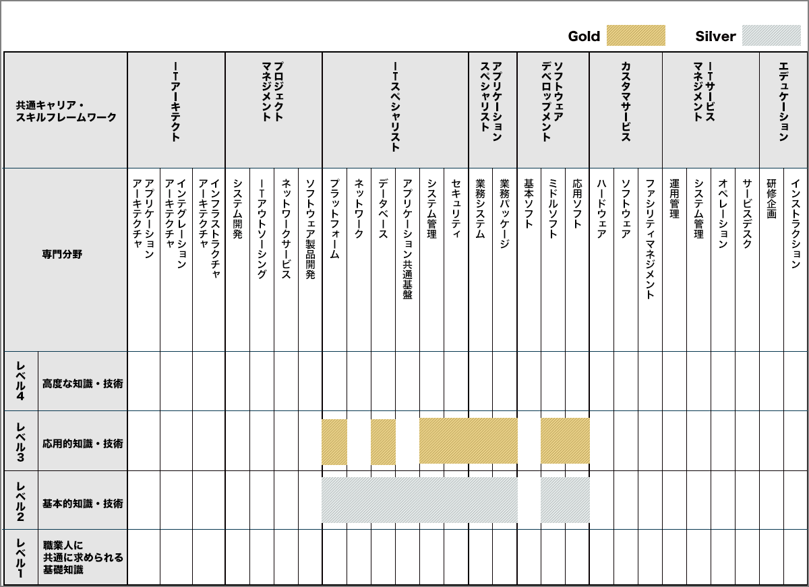
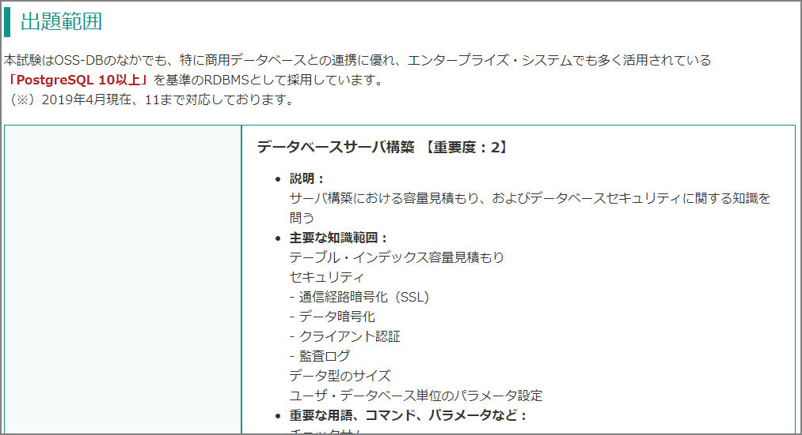

### Introduction

I passed the OSS-DB Gold Ver.2.0 exam.

This certification appears to prove the following knowledge and skills. While the subject is "open source databases" at a broad level, what you actually learn is PostgreSQL exclusively.

- Has knowledge of RDBMS and SQL.
- Has deep knowledge of open source databases.
- Can manage and operate large-scale databases using open source.
- Can develop large-scale databases using open source.
- Has thorough knowledge of the internal structure of OSS-DBs such as PostgreSQL.
- Can verify the usage and status of OSS-DBs such as PostgreSQL and perform performance tuning.
- Can verify the usage and status of OSS-DBs such as PostgreSQL and perform troubleshooting.

OSS-DB Gold is positioned at Level 3 in the "Relationship between ITSS Career Framework and Certification Exams/Qualifications." It is equivalent to Oracle Master Gold.

> Benefits of Certification https://oss-db.jp/merit

Please refer to this page for exam details.

> OSS-DB Gold https://oss-db.jp/outline/gold

### Exam Scope

The exam scope is described in detail at a level uncommon for other certification exams.

The following is an excerpt at the major category level.

- Operations Management (30%)
  - Database Server Construction [Importance: 2]
  - Operations Management Commands in General [Importance: 4]
  - Database Structure [Importance: 2]
  - Hot Standby Operations [Importance: 1]
- Performance Monitoring (30%)
  - Access Statistics [Importance: 3]
  - Table/Column Statistics [Importance: 2]
  - Query Execution Plans [Importance: 3]
  - Other Performance Monitoring [Importance: 1]
- Performance Tuning (20%)
  - Performance-Related Parameters [Importance: 4]
  - Tuning Implementation [Importance: 2]
- Failure Response (20%)
  - Possible Failure Patterns [Importance: 3]
  - Corrupted Cluster Recovery [Importance: 2]
  - Hot Standby Recovery [Importance: 1]

"Database Server Construction" requires knowledge of "Table/Index Capacity Estimation" and "Communication Path Encryption (SSL)." Parameters like "track_functions", system catalogs like "pg_tblspc" and "pg_xact", and directories are also within the exam scope.

There is no textbook specifically for OSS-DB Gold Ver.2.0 (there are older textbooks), so I think the best approach is to study using the manual and actual systems that correspond to this exam scope.

### Study Materials

1. LPI-Japan OSS-DB Gold Certified Textbook: PostgreSQL Advanced Engineer Training Text

2. Official site sample questions

3. OSS-DB Gold seminar materials

4. Manual and hands-on verification

#### LPI-Japan OSS-DB Gold Certified Textbook: PostgreSQL Advanced Engineer Training Text

I bought the official textbook. It's not tailored to OSS-DB Gold Ver.2.0, but it was the only reasonably priced textbook available. However, it was published around 2014 and covers version 9.x. You would need to use this book alongside the official documentation and practice on actual systems. If you buy it expecting something like Oracle Master's white or black book, you'll be disappointed.

That said, while parts of it are outdated, it comprehensively covers the exam scope, which is useful. (Of course, since the exam version has changed, some areas are missing.) The included problem set is particularly good! The actual exam felt harder than the practice problems, though...

<iframe style="width:120px;height:240px;" marginwidth="0" marginheight="0" scrolling="no" frameborder="0" src="//rcm-fe.amazon-adsystem.com/e/cm?lt1=_blank&bc1=000000&IS2=1&bg1=FFFFFF&fc1=000000&lc1=0000FF&t=&language=ja_JP&o=9&p=8&l=as4&m=amazon&f=ifr&ref=as_ss_li_til&asins=B00P4WD4QG&linkId=d8a13241e1e7e978e2217bb77c710c1b"></iframe>

#### Official Site Sample Questions

> Sample Questions/Example Explanations https://oss-db.jp/sample

#### OSS-DB Gold Seminar Materials

> Reference Material Download https://oss-db.jp/measures/download

#### Manual, Hands-on Verification, and Commercial Books

After going through the Advanced Engineer Training Text, sample questions, and seminar materials, I steadily worked through the manual and hands-on verification while comparing against the exam scope. I had previously read this book and re-read it.

<iframe style="width:120px;height:240px;" marginwidth="0" marginheight="0" scrolling="no" frameborder="0" src="//rcm-fe.amazon-adsystem.com/e/cm?lt1=_blank&bc1=000000&IS2=1&bg1=FFFFFF&fc1=000000&lc1=0000FF&t=zatoima-22&language=ja_JP&o=9&p=8&l=as4&m=amazon&f=ifr&ref=as_ss_li_til&asins=B07H5GCJ8J&linkId=a2ec7429e7e8eab86b05329425cce382"></iframe>

### Impressions

My study period was about 2 to 3 weeks. I had already obtained OSS-DB Silver at the end of December 2019.

Having passed Gold, I felt that reading the manual according to the detailed exam scope and solving the official sample questions was the best approach. The PostgreSQL Advanced Engineer Training Text broadly covers the scope, but the content is rough, so this book alone is not enough. The content is also outdated, so I recommend reading the PostgreSQL 10 or 11 manual.

There were certainly some nit-picky questions that I didn't remember even after reading the manual and working on actual systems, so for those, I recommend getting a sense of the level from the "sample questions" and the problem section of the "PostgreSQL Advanced Engineer Training Text." For example, questions about the meaning of each column in pg_stats appeared, and I wasn't prepared for every detail, which was a bit stressful.

That said, since I have Oracle certifications and knowledge, I was able to fill in the gaps by comparing with that knowledge. Rather than aiming to pass in the shortest time, I approached it by enjoying the hands-on work, so it wasn't too difficult. Since PostgreSQL's features are simpler than Oracle's, there was less to study. You can also get through the manual in a few days if you read it during free time.

The exam only has 30 questions, so I personally have some doubts about its effectiveness, but skimming through the manual and working on actual systems gave me a good introduction to PostgreSQL. I usually work with Aurora and RDS, but I think raw PostgreSQL knowledge and skills are also necessary, so I will continue studying.
