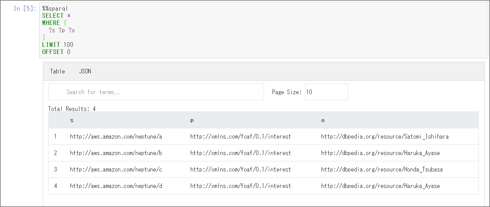

### Introduction

Let's try exporting RDF data to Turtle using the Neptune tool available in awslabs.

> amazon-neptune-tools/neptune-export at master · awslabs/amazon-neptune-tools https://github.com/awslabs/amazon-neptune-tools/tree/master/neptune-export

Please refer to `readme.md` for detailed usage instructions.

> amazon-neptune-tools/readme.md at master · awslabs/amazon-neptune-tools https://github.com/awslabs/amazon-neptune-tools/blob/master/neptune-export/readme.md
>
> awslabs/amazon-neptune-tools https://github.com/awslabs/amazon-neptune-tools/blob/master/neptune-export/docs/export-rdf.md

### Notes

Regarding `Exporting an RDF Graph`, there is a note: `At present neptune-export supports exporting an RDF dataset to Turtle with a single-threaded long-running query.` Depending on the data volume, the export may be long-running due to single-threaded operation. You should be mindful of execution time and load on the target instance. It may be worth considering options such as creating a clone and using a separate instance, or using the Read Replica side.

### Environment Check

Let's try it out. Data is minimized for verification. The loaded data is as follows:

```sql
SELECT *
WHERE {
  ?s ?p ?o .
}
LIMIT 100
OFFSET 0
```



### Execution

Create the output directory:

```sh
mkdir -p /home/ec2-user/output
```

Download the neptune-export tool from awslabs:

```sh
#sudo yum -y install git
git clone https://github.com/awslabs/amazon-neptune-tools.git
```

Install Maven:

```
sudo wget http://repos.fedorapeople.org/repos/dchen/apache-maven/epel-apache-maven.repo -O /etc/yum.repos.d/epel-apache-maven.repo
sudo sed -i s/\$releasever/6/g /etc/yum.repos.d/epel-apache-maven.repo
sudo yum install -y apache-maven
mvn --version
```

Build the jar file:

```
cd /home/ec2-user/amazon-neptune-tools/neptune-export
mvn clean install
```

The neptune-export.jar is built in the target directory:

```
[ec2-user@bastin neptune-export]$ ls -l target
total 62712
drwxrwxr-x 4 ec2-user ec2-user       28 Feb 24 05:13 classes
drwxrwxr-x 3 ec2-user ec2-user       25 Feb 24 05:13 generated-sources
drwxrwxr-x 3 ec2-user ec2-user       30 Feb 24 05:13 generated-test-sources
drwxrwxr-x 2 ec2-user ec2-user       28 Feb 24 05:13 maven-archiver
drwxrwxr-x 3 ec2-user ec2-user       35 Feb 24 05:13 maven-status
-rw-rw-r-- 1 ec2-user ec2-user   202719 Feb 24 05:13 neptune-export-1.0-SNAPSHOT.jar
-rw-rw-r-- 1 ec2-user ec2-user 64006996 Feb 24 05:14 neptune-export.jar
drwxrwxr-x 2 ec2-user ec2-user     4096 Feb 24 05:13 surefire-reports
drwxrwxr-x 3 ec2-user ec2-user       17 Feb 24 05:13 test-classes
[ec2-user@bastin neptune-export]$
```

#### Run neptune-export.sh

```sh
cd /home/ec2-user/amazon-neptune-tools/neptune-export
sh ./bin/neptune-export.sh export-rdf -e neptestdb.xxxxxxxxx.ap-northeast-1.neptune.amazonaws.com -d /home/ec2-user/output
```

*Note: The command must be run from neptune-export, one level above bin, not from within bin. This is because the script searches for neptune-export.jar and stores it in a variable.*

```sh
jar=$(find . -name neptune-export.jar)
java -jar ${jar} "$@"
```

*Note: When specifying the Neptune instance name, do NOT include "https". This will cause an error.*

```sh
Completed export-rdf in 0 seconds
An error occurred while exporting from Neptune:
java.lang.RuntimeException: org.eclipse.rdf4j.query.QueryEvaluationException: https: Name or service not known
	at com.amazonaws.services.neptune.rdf.NeptuneSparqlClient.executeQuery(NeptuneSparqlClient.java:166)
	at com.amazonaws.services.neptune.rdf.io.ExportRdfGraphJob.execute(ExportRdfGraphJob.java:31)
```

After execution, a ttl file is output in the `output` directory. The triples match correctly.

```sh
cd /home/ec2-user/output/1584768727668/statements
[ec2-user@bastin statements]$ cat statements-0.ttl

<http://aws.amazon.com/neptune/a> <http://xmlns.com/foaf/0.1/interest> <http://dbpedia.org/resource/Satomi_Ishihara> .
<http://aws.amazon.com/neptune/b> <http://xmlns.com/foaf/0.1/interest> <http://dbpedia.org/resource/Haruka_Ayase> .
<http://aws.amazon.com/neptune/c> <http://xmlns.com/foaf/0.1/interest> <http://dbpedia.org/resource/Honda_Tsubasa> .
<http://aws.amazon.com/neptune/d> <http://xmlns.com/foaf/0.1/interest> <http://dbpedia.org/resource/Haruka_Ayase> .
```

The available output formats are "turtle (default)", "nquads", and "json (neptuneStreamsJson)".

For json (neptuneStreamsJson), the result looked like this:

```sh
[ec2-user@bastin neptune-export]$ sh ./bin/neptune-export.sh export-rdf --format neptuneStreamsJson -e neptestdb.xxxxxxxxx.ap-northeast-1.neptune.amazonaws.com -d /home/ec2-user/output
Creating statement files

/home/ec2-user/output/1584769323164

[ec2-user@bastin statements]$ cat statements-0.json | jq
{
  "eventId": {
    "commitNum": -1,
    "opNum": 0
  },
  "data": {
    "stmt": "<http://aws.amazon.com/neptune/a> <http://xmlns.com/foaf/0.1/interest> <http://dbpedia.org/resource/Satomi_Ishihara> ."
  },
  "op": "ADD"
}
{
  "eventId": {
    "commitNum": -1,
    "opNum": 0
  },
  "data": {
    "stmt": "<http://aws.amazon.com/neptune/b> <http://xmlns.com/foaf/0.1/interest> <http://dbpedia.org/resource/Haruka_Ayase> ."
  },
  "op": "ADD"
}
{
  "eventId": {
    "commitNum": -1,
    "opNum": 0
  },
  "data": {
    "stmt": "<http://aws.amazon.com/neptune/c> <http://xmlns.com/foaf/0.1/interest> <http://dbpedia.org/resource/Honda_Tsubasa> ."
  },
  "op": "ADD"
}
{
  "eventId": {
    "commitNum": -1,
    "opNum": 0
  },
  "data": {
    "stmt": "<http://aws.amazon.com/neptune/d> <http://xmlns.com/foaf/0.1/interest> <http://dbpedia.org/resource/Haruka_Ayase> ."
  },
  "op": "ADD"
}
```

### Side Note

I initially encountered an error and couldn't complete successfully, but after posting on Stack Overflow, someone fixed it. I'm grateful.

> amazon web services - regarding about export of neptune data - Stack Overflow https://stackoverflow.com/questions/60429428/regarding-about-export-of-neptune-data
