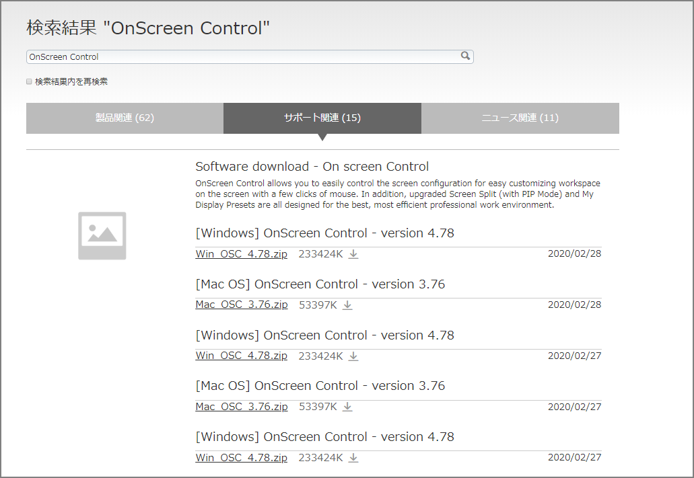
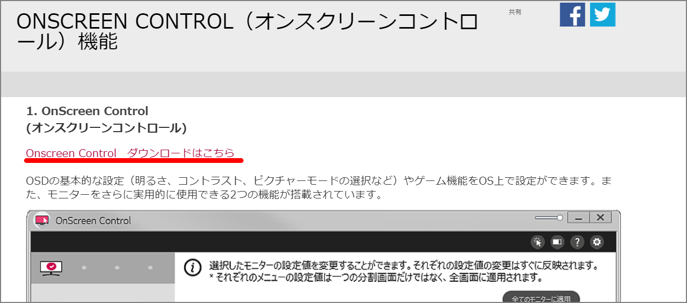
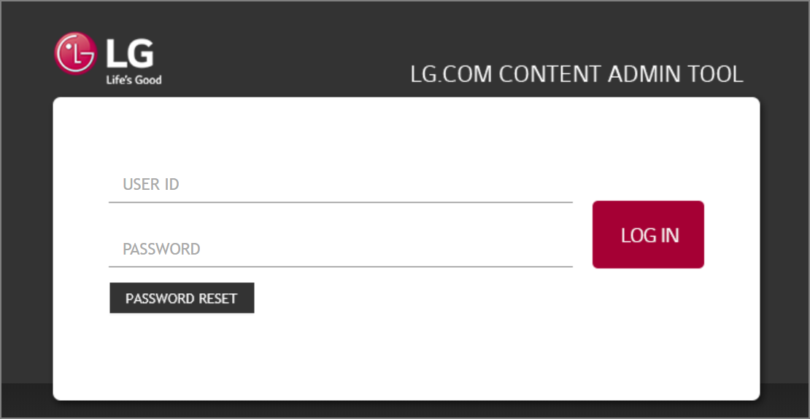
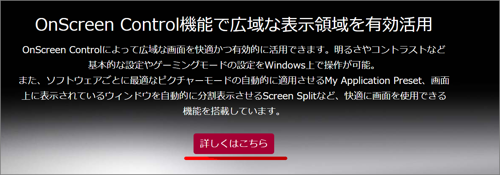
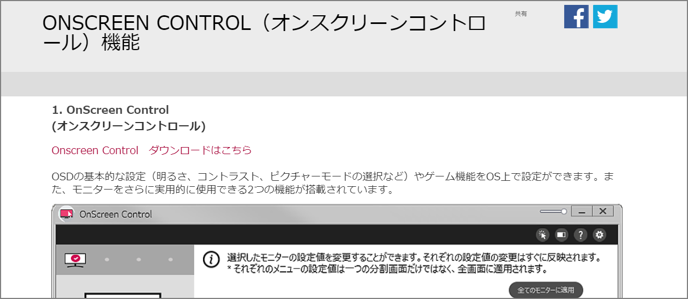
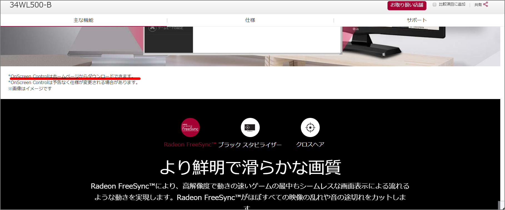
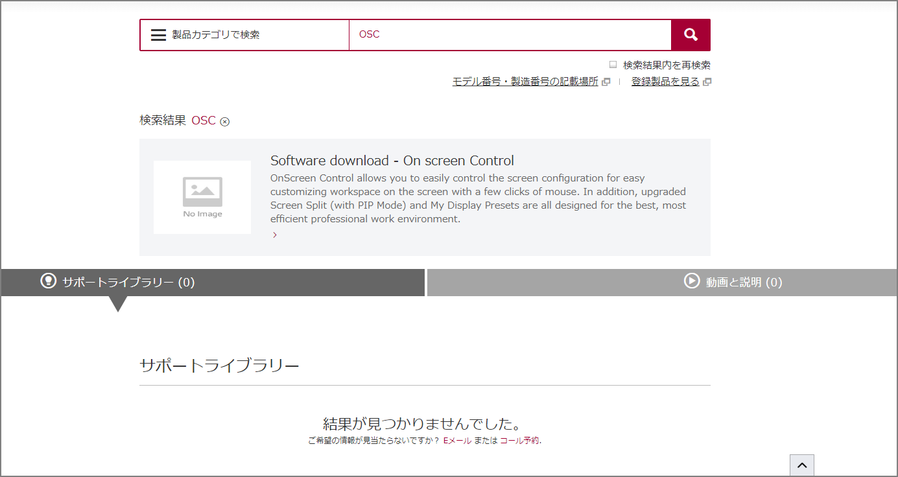

I bought an LG monitor 34WL500-B!

There is monitor management software called [OnScreen Control](https://www.lg.com/jp/monitor/OSC), but I couldn't figure out where to find the download link, so it took me a while. Here's a note just in case.

### Working Approach

Searching for "OnScreen Control" brings up a download link where you can download the software for your OS.

https://www.lg.com/jp/search.lg?search=OnScreen+Control

The following are bonus failure cases.

### Failed Approach 1

Tried following the link from here:

https://www.lg.com/jp/monitor/OSC

For some reason, it redirects to a login page.

### Failed Approach 2

Followed the link from the individual product page:

https://www.lg.com/jp/business-monitor/lg-34WL500-B

It redirects to the Failed Approach 1 page.

### Failed Approach 3

Followed the link from the individual product page:

https://www.lg.com/jp/business-monitor/lg-34WL500-B

No search results were found, and no download page was available either.

