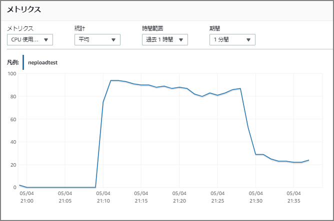

### Purpose

Since gzip-format compressed files are supported, I was curious and compared bulk load times from S3 into Neptune.

> Load Data Formats - Amazon Neptune https://docs.aws.amazon.com/ja_jp/neptune/latest/userguide/bulk-load-tutorial-format.html
>
> Neptune supports compression for single files in gzip format. The file name must have a .gz extension and must contain a single text file encoded in UTF-8. Multiple files can be loaded, but each must be in a separate .gz file (an uncompressed text file). Archive files (e.g., .tar, .tar.gz, and .tgz) are not supported.

For reference, here's how compressed vs. uncompressed files differ for Redshift loads. (Reading this made me wonder how it compares for Neptune.)

> [New Feature] Testing BZIP2 File Support for Redshift COPY/UNLOAD | Developers.IO https://dev.classmethod.jp/articles/amazon-redshift-bzip2-support/#toc-4

### Prerequisites

Executed on `db.r5.4xlarge`. `parallelism` is set to HIGH. Even without specifying it, HIGH is the default behavior. CPU usage during HIGH mode was between 80% and 100%.

> https://docs.aws.amazon.com/ja_jp/neptune/latest/userguide/load-api-reference-load.html
>
> > Neptune Loader Request Parameters
> >
> > LOW – The number of threads used equals the number of cores divided by 8.
> >
> > MEDIUM – The number of threads used equals the number of cores divided by 2.
> >
> > HIGH – The number of threads used equals the number of cores.
> >
> > OVERSUBSCRIBE – The number of threads used equals the number of cores multiplied by 2. When using this value, the bulk loader consumes all available resources.

### Results

For 10 million triples, there was no significant difference. For 100 million triples, there was a 150-second difference in data load time.

|                       | Parallelism | Compression   | Data Load | Data Delete (drop all) |
| --------------------- | ----------- | ------------- | --------- | ---------------------- |
| 10 million triples    | HIGH        | Uncompressed  | 139 sec   | 420 sec                |
| 10 million triples    | HIGH        | Compressed    | 140 sec   | 417 sec                |
| 100 million triples   | HIGH        | Uncompressed  | 1169 sec  | 4866 sec               |
| 100 million triples   | HIGH        | Compressed    | 1303 sec  | 4844 sec               |

Since `parallelism` was set to HIGH, CPU usage was between 80% and 100% during loading. Data deletion used `drop all`, which appeared to run single-threaded, keeping CPU usage at around 20%.



To reduce load time, as mentioned in the best practices page, it is advisable to temporarily scale up before loading. This increases parallelism and reduces load time.

> General Basic Operation Guidelines for Amazon Neptune - Amazon Neptune https://docs.aws.amazon.com/ja_jp/neptune/latest/userguide/best-practices-general-basic.html#best-practices-loader-tempinstance
>
> Use a temporarily larger instance to reduce load time.

### Commands and Results During Execution

The following are the commands and execution results for reference.

#### 10 Million Triples (Uncompressed)

##### Bulk Load from S3

```
curl -X POST \
    -H 'Content-Type: application/json' \
    https://xxxxxxxxx.xxxxxxxxx.ap-northeast-1.neptune.amazonaws.com:8182/loader -d '
    {
      "source" : "s3://xxxxxxxxxx/non-compression/rdf-test.nq",
      "format" : "nquads",
      "iamRoleArn" : "arn:aws:iam::xxxxxxxxxx:role/NeptuneLoadFromS3",
      "region" : "ap-northeast-1",
      "failOnError" : "FALSE",
      "parallelism" : "HIGH"
    }'
```

##### Check Bulk Load Status

```
curl -G 'https://xxxxxxxxx.xxxxxxxxx.ap-northeast-1.neptune.amazonaws.com:8182/loader/4b197f60-9239-4ab3-8b21-6a320930df51'
{
    "status" : "200 OK",
    "payload" : {
        "feedCount" : [
            {
                "LOAD_COMPLETED" : 1
            }
        ],
        "overallStatus" : {
            "fullUri" : "s3://xxxxxxxxxx/non-compression/rdf-test.nq",
            "runNumber" : 1,
            "retryNumber" : 0,
            "status" : "LOAD_COMPLETED",
            "totalTimeSpent" : 139,
            "startTime" : 1588592100,
            "totalRecords" : 10000000,
            "totalDuplicates" : 0,
            "parsingErrors" : 0,
            "datatypeMismatchErrors" : 0,
            "insertErrors" : 0
        }
    }
}
```

##### Delete Data

```
curl -X POST --data-binary 'update=drop all' https://xxxxxxxxx.xxxxxxxxx.ap-northeast-1.neptune.amazonaws.com:8182/sparql
[
{
    "type" : "UpdateEvent",
    "totalElapsedMillis" : 420916,
    "elapsedMillis" : 420915,
    "connFlush" : 0,
    "batchResolve" : 0,
    "whereClause" : 0,
    "deleteClause" : 0,
    "insertClause" : 0
},
{
    "type" : "Commit",
    "totalElapsedMillis" : 421169
}
]
```

#### 10 Million Triples (Compressed)

##### Bulk Load from S3

```
curl -X POST \
    -H 'Content-Type: application/json' \
    https://xxxxxxxxx.xxxxxxxxx.ap-northeast-1.neptune.amazonaws.com:8182/loader -d '
    {
      "source" : "s3://xxxxxxxxxx/compression/rdf-test.nq.gz",
      "format" : "nquads",
      "iamRoleArn" : "arn:aws:iam::xxxxxxxxxx:role/NeptuneLoadFromS3",
      "region" : "ap-northeast-1",
      "failOnError" : "FALSE",
      "parallelism" : "HIGH"
    }'
```

##### Check Bulk Load Status

```
curl -G 'https://xxxxxxxxx.xxxxxxxxx.ap-northeast-1.neptune.amazonaws.com:8182/loader/f1e8303c-077b-44f8-a6f2-c1b65a6f61e6'
{
    "status" : "200 OK",
    "payload" : {
        "feedCount" : [
            {
                "LOAD_COMPLETED" : 1
            }
        ],
        "overallStatus" : {
            "fullUri" : "s3://xxxxxxxxxx/compression/rdf-test.nq.gz",
            "runNumber" : 1,
            "retryNumber" : 0,
            "status" : "LOAD_COMPLETED",
            "totalTimeSpent" : 140,
            "startTime" : 1588592750,
            "totalRecords" : 10000000,
            "totalDuplicates" : 0,
            "parsingErrors" : 0,
            "datatypeMismatchErrors" : 0,
            "insertErrors" : 0
        }
    }
}
```

##### Delete Data

```
curl -X POST --data-binary 'update=drop all' https://xxxxxxxxx.xxxxxxxxx.ap-northeast-1.neptune.amazonaws.com:8182/sparql
[
{
    "type" : "UpdateEvent",
    "totalElapsedMillis" : 417666,
    "elapsedMillis" : 417665,
    "connFlush" : 0,
    "batchResolve" : 0,
    "whereClause" : 0,
    "deleteClause" : 0,
    "insertClause" : 0
},
{
    "type" : "Commit",
    "totalElapsedMillis" : 417913
}
]
```

#### 100 Million Triples (Uncompressed)

##### Bulk Load from S3

```
curl -X POST \
    -H 'Content-Type: application/json' \
    https://xxxxxxxxx.xxxxxxxxx.ap-northeast-1.neptune.amazonaws.com:8182/loader -d '
    {
      "source" : "s3://xxxxxxxxxx/non-compression/neptune-load.nq",
      "format" : "nquads",
      "iamRoleArn" : "arn:aws:iam::xxxxxxxxxx:role/NeptuneLoadFromS3",
      "region" : "ap-northeast-1",
      "failOnError" : "FALSE",
      "parallelism" : "HIGH"
    }'
```

##### Check Bulk Load Status

```
curl -G 'https://xxxxxxxxx.xxxxxxxxx.ap-northeast-1.neptune.amazonaws.com:8182/loader/56d84748-5b1c-4ff6-945c-15899da10c62'
{
    "status" : "200 OK",
    "payload" : {
        "feedCount" : [
            {
                "LOAD_COMPLETED" : 1
            }
        ],
        "overallStatus" : {
            "fullUri" : "s3://xxxxxxxxxx/non-compression/neptune-load.nq",
            "runNumber" : 1,
            "retryNumber" : 0,
            "status" : "LOAD_COMPLETED",
            "totalTimeSpent" : 1169,
            "startTime" : 1588594197,
            "totalRecords" : 100000000,
            "totalDuplicates" : 0,
            "parsingErrors" : 0,
            "datatypeMismatchErrors" : 0,
            "insertErrors" : 0
        }
    }
}
```

##### Delete Data

```
curl -X POST --data-binary 'update=drop all' https://xxxxxxxxx.xxxxxxxxx.ap-northeast-1.neptune.amazonaws.com:8182/sparql
[
{
    "type" : "UpdateEvent",
    "totalElapsedMillis" : 4866624,
    "elapsedMillis" : 4866623,
    "connFlush" : 0,
    "batchResolve" : 0,
    "whereClause" : 0,
    "deleteClause" : 0,
    "insertClause" : 0
},
{
    "type" : "Commit",
    "totalElapsedMillis" : 4871394
}
]
```

#### 100 Million Triples (Compressed)

##### Bulk Load from S3

```
curl -X POST \
    -H 'Content-Type: application/json' \
    https://xxxxxxxxx.xxxxxxxxx.ap-northeast-1.neptune.amazonaws.com:8182/loader -d '
    {
      "source" : "s3://xxxxxxxxxx/compression/neptune-load.nq.gz",
      "format" : "nquads",
      "iamRoleArn" : "arn:aws:iam::xxxxxxxxxx:role/NeptuneLoadFromS3",
      "region" : "ap-northeast-1",
      "failOnError" : "FALSE",
      "parallelism" : "HIGH"
    }'
```

##### Check Bulk Load Status

```
curl -G 'https://xxxxxxxxx.xxxxxxxxx.ap-northeast-1.neptune.amazonaws.com:8182/loader/b7e34c0c-bf49-42d6-885b-34e58fed19c0'
{
    "status" : "200 OK",
    "payload" : {
        "feedCount" : [
            {
                "LOAD_COMPLETED" : 1
            }
        ],
        "overallStatus" : {
            "fullUri" : "s3://xxxxxxxxxx/compression/neptune-load.nq.gz",
            "runNumber" : 1,
            "retryNumber" : 0,
            "status" : "LOAD_COMPLETED",
            "totalTimeSpent" : 1303,
            "startTime" : 1588600418,
            "totalRecords" : 100000000,
            "totalDuplicates" : 0,
            "parsingErrors" : 0,
            "datatypeMismatchErrors" : 0,
            "insertErrors" : 0
        }
    }
}
```

##### Delete Data

```
curl -X POST --data-binary 'update=drop all' https://xxxxxxxxx.xxxxxxxxx.ap-northeast-1.neptune.amazonaws.com:8182/sparql
[
{
    "type" : "UpdateEvent",
    "totalElapsedMillis" : 4844456,
    "elapsedMillis" : 4844455,
    "connFlush" : 0,
    "batchResolve" : 0,
    "whereClause" : 0,
    "deleteClause" : 0,
    "insertClause" : 0
},
{
    "type" : "Commit",
    "totalElapsedMillis" : 4848418
}
]
```
