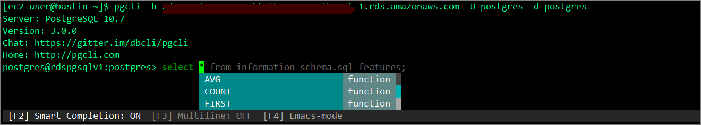

### Introduction

I want to use pgcli to connect to RDS and Aurora, so I'll install it on the bastion EC2 instance.

pgcli is a Postgres CLI with autocompletion and syntax highlighting. I thought installing it via pip would be straightforward, but I ran into some unexpected issues, so here's a note.

The project is at:

> dbcli/pgcli: Postgres CLI with autocompletion and syntax highlighting https://github.com/dbcli/pgcli

By installing this, you get suggestions and syntax highlighting like the following:


### Installation Steps

Based on GitHub and other blog posts, it seemed like having Python installed would be enough, but note that the following libraries and packages are required.

##### Prerequisites

```sh
sudo yum install -y python3
sudo pip3 install psycopg2-binary
sudo yum -y install postgresql-devel
sudo yum -y install gcc
sudo yum -y install python3-devel.x86_64
```

##### Install

```sh
sudo pip3 install -U pgcli
```

##### Connect

```sh
[ec2-user@bastin ~]$ pgcli -h rdspgsqlv1.xxxxxxxxxx.ap-northeast-1.rds.amazonaws.com -U postgres -d postgres
Server: PostgreSQL 10.7
Version: 3.0.0
Chat: https://gitter.im/dbcli/pgcli
Home: http://pgcli.com
postgres@rdspgsqlv1:postgres>
```

##### Screen Image



---

The following are notes on errors encountered and how to fix them. Errors 2 and 3 should not occur in environments where PostgreSQL is already installed locally.

### Install Python Environment

Since pip is bundled with Python 3.4 and later, you don't need to install pip3 separately.

```sh
sudo yum install -y python3
```

### Error 1: psycopg2 Error

Try installing pgcli in this state:

```sh
sudo pip3 install -U pgcli
```

The following error occurs:

```sh
Command "python setup.py egg_info" failed with error code 1 in /tmp/pip-build-2mywyxn1/psycopg2/
```

Install `psycopg2-binary` via pip:

```sh
sudo pip3 install psycopg2-binary
```

### Error 2: pg_config Error

Running again causes an error related to `pg_config`:

```sh
Error: pg_config executable not found.

pg_config is required to build psycopg2 from source.  Please add the directory
containing pg_config to the $PATH or specify the full executable path with the
option:

    python setup.py build_ext --pg-config /path/to/pg_config build ...

or with the pg_config option in 'setup.cfg'.
```

`pg_config` is included in `postgresql-devel`, so install it:

```sh
sudo yum -y install postgresql-devel
```

### Error 3: gcc Error

`gcc` not found:

```sh
unable to execute 'gcc': No such file or directory

It appears you are missing some prerequisite to build the package from source.

You may install a binary package by installing 'psycopg2-binary' from PyPI.
If you want to install psycopg2 from source, please install the packages
required for the build and try again.
```

Install `gcc`:

```sh
sudo yum -y install gcc
```

### Error 4: Python-Related Error

```sh
./psycopg/psycopg.h:35:10: fatal error: Python.h: No such file or directory
 #include <Python.h>
          ^~~~~~~~~~
compilation terminated.

It appears you are missing some prerequisite to build the package from source.

You may install a binary package by installing 'psycopg2-binary' from PyPI.
If you want to install psycopg2 from source, please install the packages
required for the build and try again.
```

Install `python3-devel.x86_64`:

```sh
sudo yum -y install python3-devel.x86_64
```

### Install pgcli

After installing all of the above, pgcli installation finally completes.

```sh
[ec2-user@bastinv1 ~]$ sudo pip3 install -U pgcli
WARNING: Running pip install with root privileges is generally not a good idea. Try `pip3 install --user` instead.
Collecting pgcli

～(omitted)～

Running setup.py install for psycopg2 ... done
  Running setup.py install for setproctitle ... done
Successfully installed cli-helpers-1.2.1 click-7.1.2 humanize-2.4.0 pgcli-3.0.0 pgspecial-1.11.10 prompt-toolkit-3.0.5 psycopg2-2.8.5 setproctitle-1.1.10 tabulate-0.8.7 terminaltables-3.1.0 wcwidth-0.1.9
```
