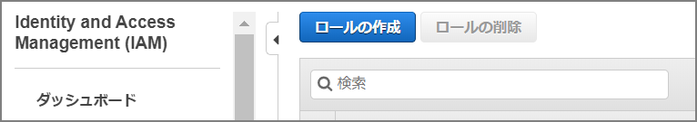
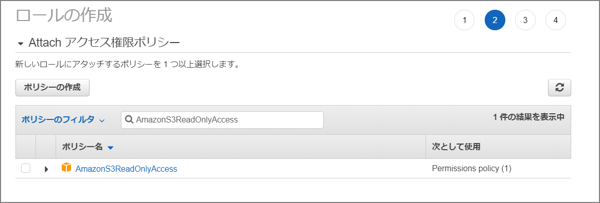
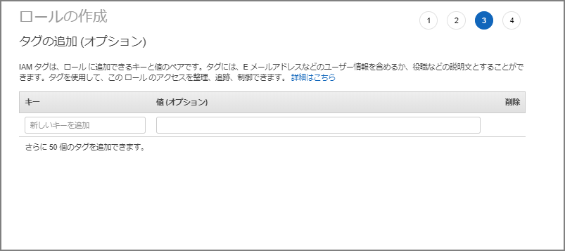
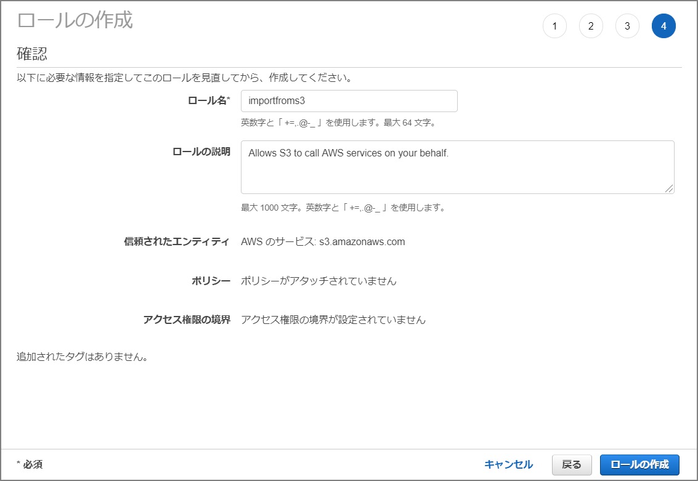
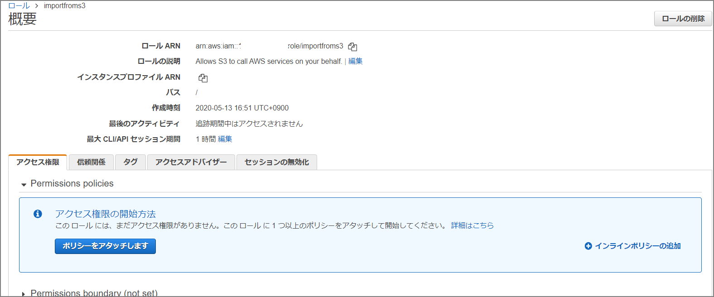
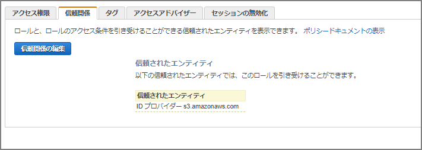
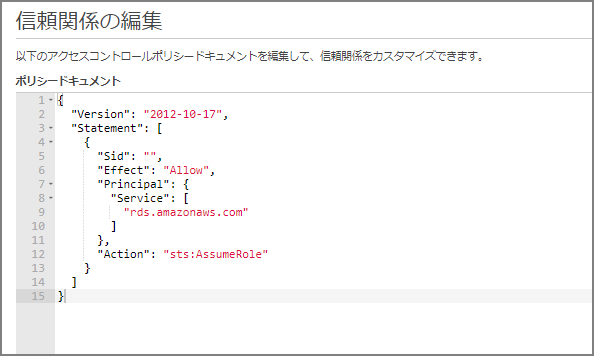
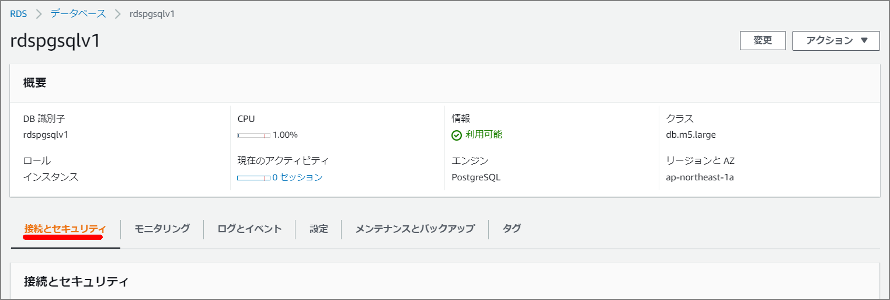
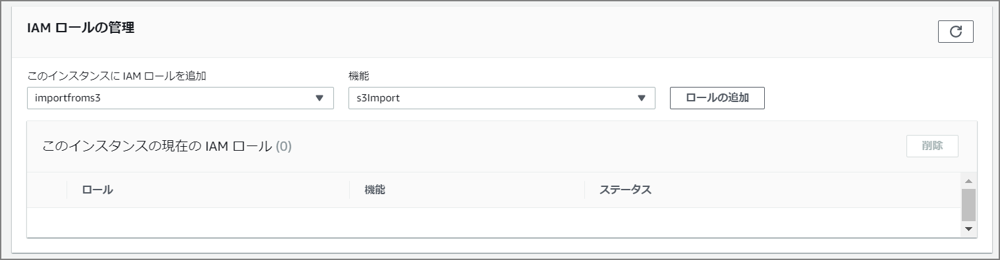
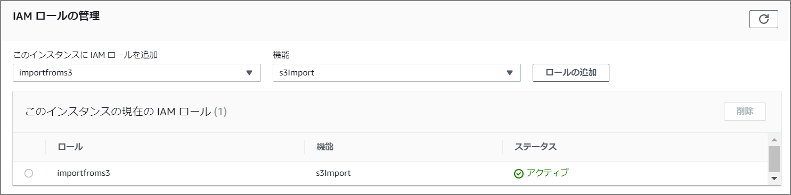

This covers loading a CSV file into RDS (PostgreSQL), starting from setting up the prerequisite IAM role. The procedures for RDS and Aurora are largely the same, but to import from Amazon S3 into Aurora PostgreSQL, the database must be running PostgreSQL version 10.7 or later.

For detailed steps and restrictions, refer to the manual:

> Migrating Data to Amazon Aurora with PostgreSQL Compatibility - Amazon Aurora https://docs.aws.amazon.com/ja_jp/AmazonRDS/latest/AuroraUserGuide/AuroraPostgreSQL.Migrating.html#USER_PostgreSQL.S3Import

### Configure IAM Role

Set up the IAM role as a prerequisite for data loading.

Select "Create role" from the IAM screen.



Select S3.


Select `AmazonS3ReadOnlyAccess` and attach the policy.



Set tags as needed.



Name the role "importfroms3".



Navigate to the created role's screen.



Go to "Trust relationships" - "Edit trust relationship" and paste the following:



```json
{
  "Version": "2012-10-17",
  "Statement": [
    {
      "Sid": "",
      "Effect": "Allow",
      "Principal": {
        "Service": [
          "rds.amazonaws.com"
        ]
      },
      "Action": "sts:AssumeRole"
    }
  ]
}
```



### Add IAM Role to Amazon Aurora Cluster

Navigate to the Aurora cluster and select "Manage IAM roles".



Add the "importfroms3" role just created in the IAM role management section. Set the feature to "s3import".





The preliminary setup is now complete.

The actual import is performed via command on the CLI, but first enable `aws_s3`:

```
CREATE EXTENSION aws_s3 CASCADE;
```

##### Import Command

```
SELECT aws_s3.table_import_from_s3(
 'aozora_kaiseki',
 '',
 '(format csv)',
 'nep-s3-bk',
 'utf8_all.csv',
 'ap-northeast-1'
);
```

The function arguments are as follows:

> Migrating Data to Amazon Aurora with PostgreSQL Compatibility - Amazon Aurora https://docs.aws.amazon.com/ja_jp/AmazonRDS/latest/AuroraUserGuide/AuroraPostgreSQL.Migrating.html#USER_PostgreSQL.S3Import.FileFormats
>
> Importing Amazon S3 Data Using aws_s3.table_import_from_s3 Function

```sh
dbname=> SELECT aws_s3.table_import_from_s3(
 'table_name',
 'column_list', -- empty string ('') matches the table's columns
 'PostgreSQL COPY arguments/format',
 'S3 bucket name',
 'S3 key',
 'S3 region'
);
```

Approximately 10GB of data was imported in about 4 minutes.

```
postgres@rdspgsqlv1:postgres> SELECT aws_s3.table_import_from_s3(
  'aozora_kaiseki',
  '',
  '(format csv)',
  'nep-s3-bk',
  'utf8_all.csv',
  'ap-northeast-1'
  );
+--------------------------------------------------------------------------------------------------+
| table_import_from_s3                                                                             |
|--------------------------------------------------------------------------------------------------|
| 87701673 rows imported into relation "aozora_kaiseki" from file utf8_all.csv of 6539180310 bytes |
+--------------------------------------------------------------------------------------------------+
SELECT 1
Time: 272.534s (4 minutes), executed in: 272.522s (4 minutes)
postgres@rdspgsqlv1:postgres>

```

Comparing with CSV import using the psql COPY command, the time was not significantly different.

```
■ CSV Import (COPY Command)
[ec2-user@bastin ~]$ time psql -h rdspgsqlv1.xxxxxxxx.ap-northeast-1.rds.amazonaws.com -d postgres -U postgres -c "COPY aozora_kaiseki(file,num,row,word,subtype1,subtype2,subtype3,subtype4,conjtype,conjugation,basic,ruby,pronunce) from stdin with csv DELIMITER ','" < /home/ec2-user/utf8_all.csv
COPY 87701673

real	4m20.753s
user	0m19.471s
sys	0m6.427s
```
