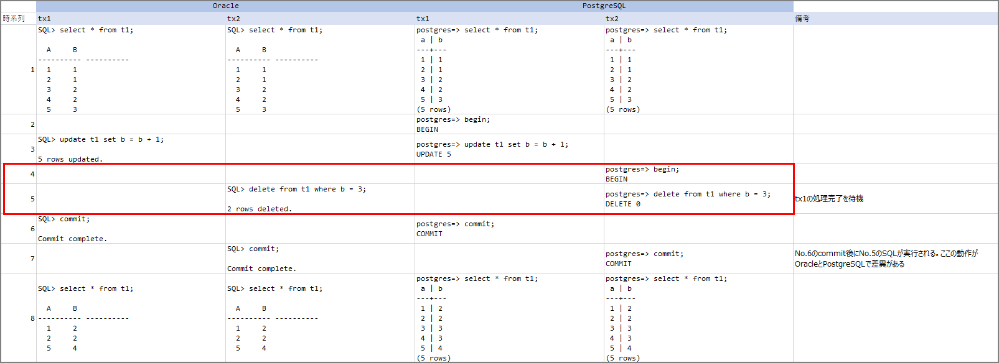
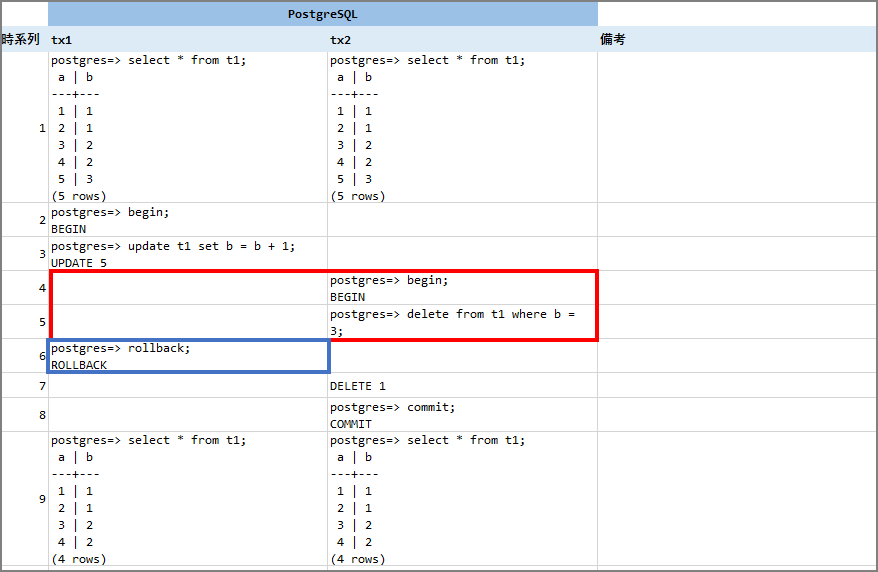
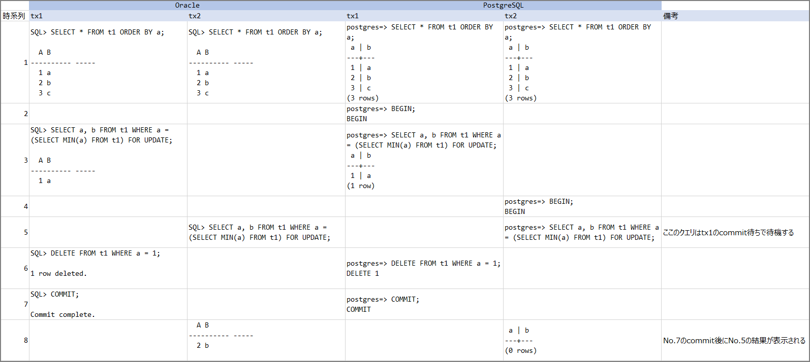

Both Oracle and PostgreSQL use READ COMMITTED as their default transaction isolation level, but depending on the transaction, the behavior can differ between the two databases. Function differences and feature gaps cause errors during testing, but these specification differences do not cause errors — they lead to different data results, making them a particularly tricky problem.

I wrote an overview of transaction isolation levels in a previous article:

> Transaction Isolation Levels (ISOLATION LEVEL) and Each DB Engine | my opinion is my own https://zatoima.github.io/oracle-mysql-postgresql-isolation-level.html

This article notes the behavioral differences between each DB engine that were not covered in the above. This transaction difference is well-known, but I found very few articles online explaining "why this happens," so I'm recording my research findings and hands-on verification results here. (Please point out any errors.)

### Cases Where Transaction Results Differ

#### Write Conflict

| -         | oracle                   |                             | PostgreSQL               |                             |
| --------- | ------------------------ | --------------------------- | ------------------------ | --------------------------- |
| Timeline  | tx1                      | tx2                         | tx1                      | tx2                         |
| 1         | select * from t1;        | select * from t1;           | select * from t1;        | select * from t1;           |
| 2         |                          |                             | begin;                   |                             |
| 3         | update t1 set b = b + 1; |                             | update t1 set b = b + 1; |                             |
| 4         |                          |                             |                          | begin;                      |
| 5         |                          | delete from t1 where b = 3; |                          | delete from t1 where b = 3; |
| 6         | commit;                  |                             | commit;                  |                             |
| 7         |                          | commit;                     |                          | commit;                     |
| 8         | select * from t1;        | select * from t1;           | select * from t1;        | select * from t1;           |

When executing the above steps in practice, the following results occur. The transaction behavior differs in the area enclosed by the red box. (Since I couldn't format this well as a markdown table, I used an image.)

- ### Oracle Behavior Specification

In Oracle's case, this behavior is described in the manual:

> Data Concurrency and Consistency https://docs.oracle.com/cd/E57425_01/121/CNCPT/consist.htm
>
> Write Conflicts in Read-Committed Transactions
>
> In a read-committed transaction, a write conflict occurs when the transaction attempts to change a row that was changed by an uncommitted concurrent transaction (also called the *blocking transaction*). The read-committed transaction waits for the blocking transaction to end and release row locks.
>
> - If the blocking transaction commits and releases locks, the waiting transaction proceeds to update the newly changed row.

As stated above: "If the blocking transaction commits and releases locks, the waiting transaction proceeds to update the newly changed row." Therefore, when tx1 commits at step 6, the `delete from t1 where b = 3;` at step 5 executes based on the calculation result from step 3.

- ### PostgreSQL Behavior Specification

In PostgreSQL's case, the relevant section of the manual is:

> 13.2. Transaction Isolation https://www.postgresql.jp/document/11/html/transaction-iso.html
>
> The UPDATE, DELETE, SELECT FOR UPDATE, and SELECT FOR SHARE commands behave the same as SELECT in terms of searching for target rows: they will only find target rows that were already committed as of the command start time. However, such a target row might have already been updated (or deleted or locked) by another concurrent transaction by the time it is found. In this case, the would-be updater will wait for the first updating transaction to commit or roll back (if it is still in progress). If the first updater rolls back, then its effects are negated and the second updater can proceed with updating the originally found row. If the first updater commits, the second updater will ignore the row if the first updater deleted it, or it will attempt to apply its operation to the updated version of the row if the first updater did not delete it. The search condition of the command (the WHERE clause) is re-evaluated to see if the updated version of the row still matches the search condition. If so, the second updater proceeds with its operation using the updated version of the row.

Since "if the first updater commits, the second updater will ignore the row if the first updater deleted it," when tx1 commits at step 6, since the row was deleted by the first update, processing for that row is skipped.

As noted above, **in Oracle, SQL statements are re-evaluated (restarted) and executed, whereas in PostgreSQL, if a row is deleted, the row is ignored** — which leads to different results. (Personally, I find PostgreSQL's behavior here confusing.)

Next, let's try rolling back the commit highlighted in the blue box. (Verifying the statement: "If the first updater rolls back, then its effects are negated and the second updater can proceed with updating the originally found row.")

In this case, the original `b=3` data is deleted. Oracle's manual states the same behavior:

> Data Concurrency and Consistency https://docs.oracle.com/cd/E57425_01/121/CNCPT/consist.htm
>
> - If the blocking transaction rolls back, the waiting transaction proceeds to change the locked row as if the blocking transaction had never existed.

#### SELECT FOR UPDATE and DELETE Conflict

Next, let's look at this pattern:

|          | oracle                                                       |                                                              | PostgreSQL                                                   |                                                              |
| -------- | ------------------------------------------------------------ | ------------------------------------------------------------ | ------------------------------------------------------------ | ------------------------------------------------------------ |
| Timeline | tx1                                                          | tx2                                                          | tx1                                                          | tx2                                                          |
| 1        | SELECT * FROM t1 ORDER BY a;                                 |                                                              | SELECT * FROM t1 ORDER BY a;                                 |                                                              |
| 2        |                                                              |                                                              | BEGIN;                                                       |                                                              |
| 3        | SELECT a, b FROM t1 WHERE a = (SELECT MIN(a) FROM t1) FOR UPDATE; |                                                              | SELECT a, b FROM t1 WHERE a = (SELECT MIN(a) FROM t1) FOR UPDATE; |                                                              |
| 4        |                                                              |                                                              |                                                              | BEGIN;                                                       |
| 5        |                                                              | SELECT a, b FROM t1 WHERE a = (SELECT MIN(a) FROM t1) FOR UPDATE; |                                                              | SELECT a, b FROM t1 WHERE a = (SELECT MIN(a) FROM t1) FOR UPDATE; |
| 6        | DELETE FROM t1 WHERE a = 1;                                  |                                                              | DELETE FROM t1 WHERE a = 1;                                  |                                                              |
| 7        | COMMIT;                                                      |                                                              | COMMIT;                                                      |                                                              |

The results when executing the above transactions are as follows:

- #### Oracle Behavior Specification

The basic concept is the same as for write conflicts, but as stated in the manual, if the selected row is updated or deleted, the query is restarted and re-evaluated. Therefore, in this case, at the time of commit in step 7, the query is re-evaluated, and `2`, which is the minimum value at that point, is returned.

> SQL Processing for Application Developers https://docs.oracle.com/cd/E57425_01/121/ADFNS/adfns_sqlproc.htm#i1025003
>
> During the execution of a query, the result set for SELECT FOR UPDATE can change. For example, a column selected by the query might be updated after the query starts, or a row might be deleted. In such cases, SELECT FOR UPDATE obtains a lock on the unchanged rows, uses this lock to obtain a read-consistent snapshot of the table, and then restarts the query to obtain the remaining locks.

- #### PostgreSQL Behavior Specification

Same as the write conflict pattern: "if the first updater commits, the second updater will ignore the row if the first updater deleted it," so the result is 0 rows.

### References

SQL Migration Research Report https://pgecons-sec-tech.github.io/tech-report/pdf/09_SqlMigrationResearch.pdf

Different processing results between Oracle DB and PostgreSQL — beware of "specification differences" | Nikkei Cross Tech https://xtech.nikkei.com/atcl/nxt/column/18/00817/061300007/

13.2. Transaction Isolation https://www.postgresql.jp/document/11/html/transaction-iso.html

Incompatibilities in DML containing subqueries between Oracle/MySQL/PostgreSQL - SH2's Blog https://sh2.hatenablog.jp/entry/20131223

ept/hermitage: What are the differences between the transaction isolation levels in databases? This is a suite of test cases which differentiate isolation levels. https://github.com/ept/hermitage
