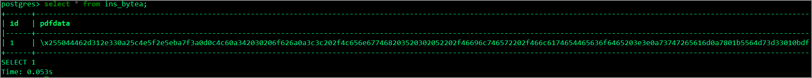

#### Introduction

There are not many occasions to manipulate binary data directly from psql, but in Aurora/RDS, the `pg_read_binary_file` function cannot be used (`permission denied for function pg_read_binary_file`). The reason is that the owner of `pg_read_binary_file` is `rdsadmin`, a non-login user, so it cannot be used. Additionally, since `pg_read_binary_file` is a server-side function, it is not possible to INSERT a file on EC2 (Bastion) into a bytea column while logged in via psql.

```sql
postgres> create table test01(id serial primary key,data bytea);                                                                       CREATE TABLE

postgres> insert into test01 (data) values (pg_read_binary_file('/home/ec2-user/test.pdf'));
permission denied for function pg_read_binary_file

postgres> SELECT proacl FROM pg_proc WHERE proname='pg_read_binary_file';
+-----------------------+
| proacl                |
|-----------------------|
| {rdsadmin=X/rdsadmin} |
| {rdsadmin=X/rdsadmin} |
| {rdsadmin=X/rdsadmin} |
+-----------------------+
```

#### Sample Script for Inserting Data into Aurora PostgreSQL Using Python's psycopg2

We will store a [file](https://d1.awsstatic.com/whitepapers/aws-overview.pdf) called `aws-overview.pdf` in the database.

Place `test.pdf` in the same directory as the Python script and run it.

```python
import psycopg2
import psycopg2.extras

conn = psycopg2.connect("host=aurorapgsqlv1.cluster-xxxxxx.ap-northeast-1.rds.amazonaws.com port=5432 dbname=postgres user=postgres password=postgres")

cur = conn.cursor()
img = open('aws-overview.pdf', 'rb').read()

cur.execute("create table ins_bytea(id serial,pdfdata bytea)")

cur.execute("INSERT INTO ins_bytea (pdfdata) values (%s)",
    (psycopg2.Binary(img),))

conn.commit()
cur.close()
conn.close()
```

#### Results



#### How to Retrieve the Stored Binary Data

Extract the data as a file named `aws-overview_export.pdf`.

```
import psycopg2
import psycopg2.extras

conn = psycopg2.connect("host=aurorapgsqlv1.cluster-xxxxxx.ap-northeast-1.rds.amazonaws.com port=5432 dbname=postgres user=postgres password=postgres")

cur = conn.cursor(cursor_factory=psycopg2.extras.DictCursor)
cur.execute("SELECT pdfdata FROM ins_bytea;")

row = cur.fetchone()
pic = row['pdfdata']

f = open('aws-overview_export.pdf', 'wb')
f.write(pic)
f.close()
cur.close()
conn.close()
```

No differences found.

```
[ec2-user@bastin ~]$ diff aws-overview.pdf aws-overview_export.pdf
[ec2-user@bastin ~]$
```

#### Reference

> How to Connect to PostgreSQL from Python | Ashisuto https://www.ashisuto.co.jp/db_blog/article/20160308_postgresql_with_python.html
