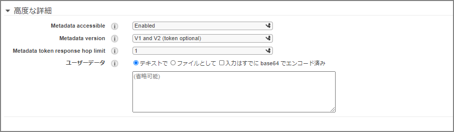

### What Is User Data?

User data refers to commands that are executed when a Linux instance first boots. By default, it runs only on the initial boot, but it can also be configured to run on every reboot.

> https://docs.aws.amazon.com/AWSEC2/latest/UserGuide/user-data.html
>
> When you launch an instance in Amazon EC2, you can pass user data to the instance that can be used to perform common automated configuration tasks and even run scripts after the instance starts. You can pass two types of user data to Amazon EC2.

### How to Configure User Data

In `Step 3: Configure Instance Details`, there is a field to specify user data under the `Advanced Details` section.



The following user data is specified. It performs a yum update, installs Apache, and sets up permissions.

```sh
#!/bin/bash
yum update -y
amazon-linux-extras install -y lamp-mariadb10.2-php7.2 php7.2
yum install -y httpd mariadb-server
systemctl start httpd
systemctl enable httpd
usermod -a -G apache ec2-user
chown -R ec2-user:apache /var/www
chmod 2775 /var/www
find /var/www -type d -exec chmod 2775 {} \;
find /var/www -type f -exec chmod 0664 {} \;
echo `hostname` > /var/www/html/index.html
```

After this, proceed with the rest of the EC2 creation process as usual, and Apache will be automatically installed when the instance launches. Security group configuration is omitted here.
