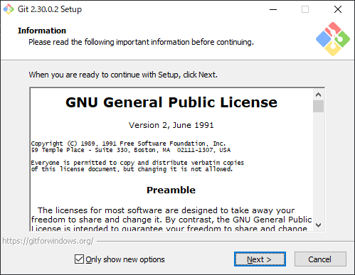

Just one command.

```
C:\Users\imazaj>git update-git-for-windows
Git for Windows 2.26.2.windows.1 (64bit)
Update 2.30.0.windows.2 is available
Download and install Git for Windows 2.30.0(2) [N/y]? y
################################################################################################################ 100.0%################################################################################################################# 100.0%

```

A GUI popup will appear, so install (update) with the default settings.



> Git for Windows https://gitforwindows.org/
