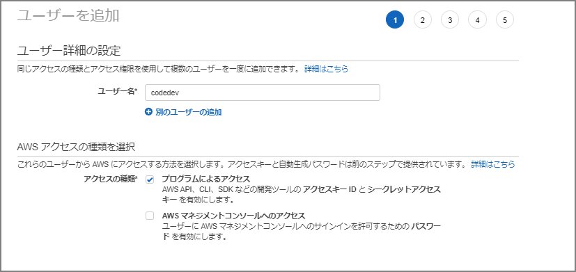
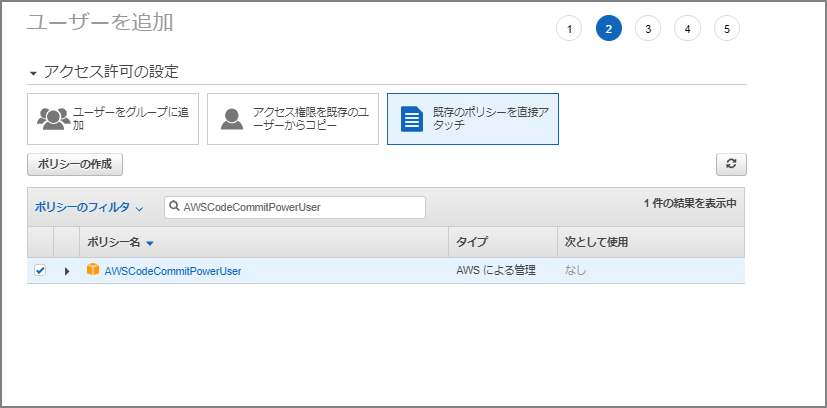
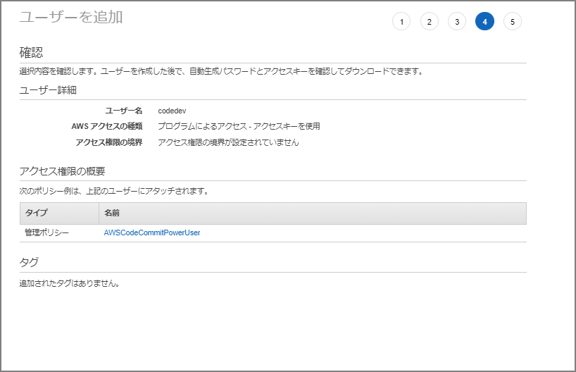
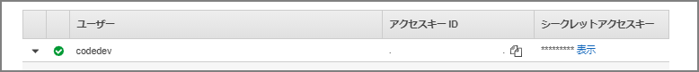
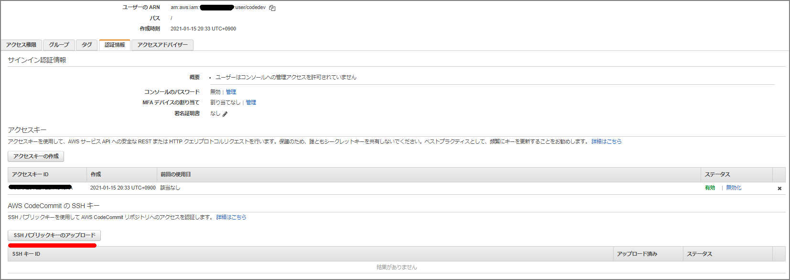
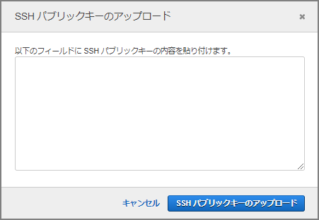
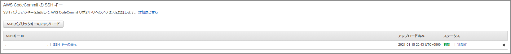

# Create an IAM User

Create an IAM user and attach the following managed policy:

- AWSCodeCommitPowerUser

> Using identity-based policies (IAM policies) with CodeCommit - AWS CodeCommit https://docs.aws.amazon.com/ja_jp/codecommit/latest/userguide/auth-and-access-control-iam-identity-based-access-control.html#managed-policies-poweruser









# Install Git

Already installed, so skipping.

```
C:\Users\imazaj>git --version
git version 2.30.0.windows.2
```

Download from here if needed:

> Git - Downloads http://git-scm.com/downloads

# Configure Public and Private Keys for Git and CodeCommit

Launch Git Bash from Git for Windows and create key files with the ssh-keygen command.

```
$ ssh-keygen
Generating public/private rsa key pair.
～omitted～
```

```
C:\Users\imazaj>dir C:\Users\imazaj\.ssh

2019/12/17  15:47    <DIR>          .
2019/12/17  15:47    <DIR>          ..
2021/01/15  20:39             2,610 id_rsa
2021/01/15  20:39               575 id_rsa.pub
2019/12/17  15:47               799 known_hosts
```

Navigate to the "Security credentials" tab of the IAM user and upload the public key file to `SSH public keys for AWS CodeCommit`.



Paste the public key content and upload.



Note the `SSH public key ID`.



Create `~/.ssh/config` and enter the following. Set `User` to the `SSH public key ID` and `IdentityFile` to the private key.

```
Host git-codecommit.*.amazonaws.com
  User xxxxxxxxxxxxxxxxxxx
  IdentityFile ~/.ssh/id_rsa
```

Verify the SSH configuration:

```
ssh git-codecommit.us-east-2.amazonaws.com
```

# Clone a Repository

A `README.md` has been created in a repository called toolrepo.

```
C:\Users\imazaj>git clone ssh://git-codecommit.ap-northeast-1.amazonaws.com/v1/repos/toolrepo
Cloning into 'toolrepo'...
Warning: Permanently added the RSA host key for IP address 'xxxxxxxxxxxx' to the list of known hosts.
remote: Counting objects: 3, done.
Receiving objects: 100% (3/3), 215 bytes | 23.00 KiB/s, done.
```

```
C:\Users\imazaj\toolrepo>dir
 Volume in drive C is OSDisk
 Volume Serial Number is E49E-5113

 Directory of C:\Users\imazaj\toolrepo

2021/01/15  20:56    <DIR>          .
2021/01/15  20:56    <DIR>          ..
2021/01/15  20:56                 0 README.md
               1 File(s)                   0 bytes
               2 Dir(s)   3,597,164,544 bytes free
```

Edit README.md and commit:

```
C:\Users\imazaj\toolrepo>git status
On branch master
Your branch is up to date with 'origin/master'.

Changes not staged for commit:
  (use "git add <file>..." to update what will be committed)
  (use "git restore <file>..." to discard changes in working directory)
        modified:   README.md

no changes added to commit (use "git add" and/or "git commit -a")

C:\Users\imazaj\toolrepo>git add README.md

C:\Users\imazaj\toolrepo>git commit -m "first commit"
[master 2ab1525] first commit
 1 file changed, 1 insertion(+)

C:\Users\imazaj\toolrepo>git push
Enumerating objects: 5, done.
Counting objects: 100% (5/5), done.
Writing objects: 100% (3/3), 252 bytes | 252.00 KiB/s, done.
Total 3 (delta 0), reused 0 (delta 0), pack-reused 0
To ssh://git-codecommit.ap-northeast-1.amazonaws.com/v1/repos/toolrepo
   357bc6c..2ab1525  master -> master
```

# References

> Setting up SSH connections to AWS CodeCommit repositories on Windows - AWS CodeCommit https://docs.aws.amazon.com/ja_jp/codecommit/latest/userguide/setting-up-ssh-windows.html
