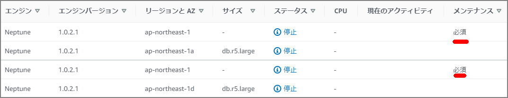
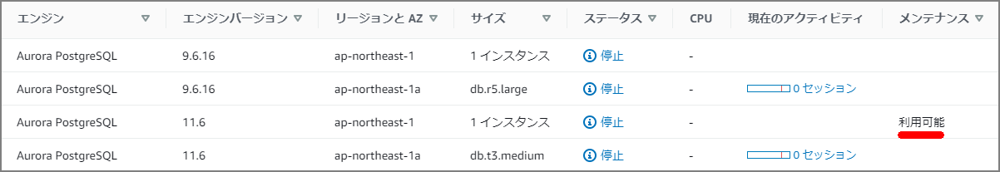

# Introduction

RDS maintenance types include "Available" and "Required". Since Aurora (PostgreSQL) and Neptune each had both Available and Required patches, I looked into them.

Neptune appears to share the same operational technology as RDS. (Though not everything is identical.)

> https://docs.aws.amazon.com/ja_jp/neptune/latest/userguide/limits.html
>
> \> For certain management functions, Amazon Neptune uses shared operational technology with Amazon Relational Database Service (Amazon RDS).

#### Neptune



#### Aurora



# About Available and Required

- **Required** - The maintenance action will be applied to the resource and cannot be deferred.
- **Available** - The maintenance action is available but will not be automatically applied to the resource. It can be applied manually.

### DescribePendingMaintenanceActions API

Maintenance can be checked via the [DescribePendingMaintenanceActions API](http://docs.aws.amazon.com/AmazonRDS/latest/APIReference/API_DescribePendingMaintenanceActions.html).

```
[ec2-user@bastin ~]$ aws rds describe-pending-maintenance-actions
{
    "PendingMaintenanceActions": [
        {
            "PendingMaintenanceActionDetails": [
                {
                    "Action": "system-update",
                    "Description": "Upgrade to Aurora PostgreSQL 3.1.2"
                }
            ],
            "ResourceIdentifier": "arn:aws:rds:ap-northeast-1:xxxxxx:cluster:xxxxxxxpostgresv11"
        },
        {
            "PendingMaintenanceActionDetails": [
                {
                    "Action": "system-update",
                    "CurrentApplyDate": "2020-05-08T18:33:00Z",
                    "AutoAppliedAfterDate": "2020-05-08T18:33:00Z",
                    "Description": "Engine Patch Upgrade"
                }
            ],
            "ResourceIdentifier": "arn:aws:rds:ap-northeast-1:xxxxxxx:cluster:xxxxxxx-cluster"
        }
    ]
}

```

From the CLI, you cannot tell whether it is Available or Required just by looking at the items. For Required, `AutoAppliedAfterDate` and `CurrentApplyDate` are output.

The descriptions of each field are as follows:

| Field                | Description                                                  |
| -------------------- | ------------------------------------------------------------ |
| Action               | The type of pending maintenance action available for the resource: system-update, db-upgrade, hardware-maintenance, or ca-certificate-rotation. |
| Description          | Describes the details of the maintenance action              |
| AutoAppliedAfterDate | The date when the action will be applied during the maintenance window |
| CurrentApplyDate     | The effective date when the pending maintenance action will be applied to the resource |
| ForcedApplyDate      | The date when the maintenance action will be automatically applied (cannot be deferred) |
| OptInStatus          | The type of opt-in request received for the resource: "next-maintenance", "immediate", "undo-opt-in". Output when apply-pending-maintenance-action is explicitly executed. |

OptInStatus is output when explicitly specified with `apply-pending-maintenance-action`, or by selecting "Upgrade at Next Window" or "Upgrade Now" in the management console.

```
[ec2-user@bastin ~]$ aws rds apply-pending-maintenance-action --resource-identifier arn:aws:rds:ap-northeast-1:xxxxxxxxxxxxxx:cluster:neptestdb-cluster --apply-action system-update --opt-in-type next-maintenance
```

After this, `OptInStatus` will be output as follows:

```
[ec2-user@bastin ~]$ aws rds describe-pending-maintenance-actions --resource-identifier arn:aws:rds:ap-northeast-1:xxxxxxxxxxxxxx:cluster:neptestdb-cluster
{
    "PendingMaintenanceActions": [
        {
            "PendingMaintenanceActionDetails": [
                {
                    "Action": "system-update",
                    "Description": "Engine Patch Upgrade",
                    "CurrentApplyDate": "2020-05-03T15:58:00Z",
                    "AutoAppliedAfterDate": "2020-05-03T15:58:00Z",
                    "OptInStatus": "next-maintenance"
                }
            ],
            "ResourceIdentifier": "arn:aws:rds:ap-northeast-1:xxxxxxx:cluster:xxxxxxx-cluster"
        }
    ]
}

```

References:

> https://docs.aws.amazon.com/AmazonRDS/latest/APIReference/API_PendingMaintenanceAction.html
>
> https://docs.aws.amazon.com/cli/latest/reference/rds/apply-pending-maintenance-action.html
