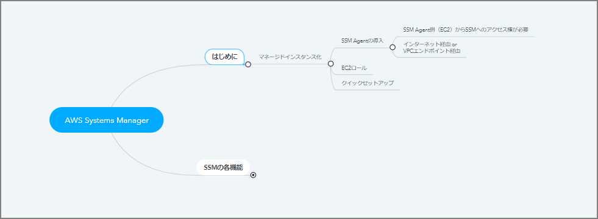
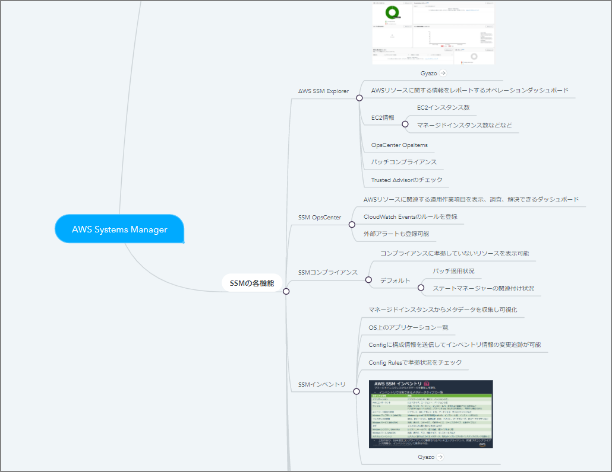
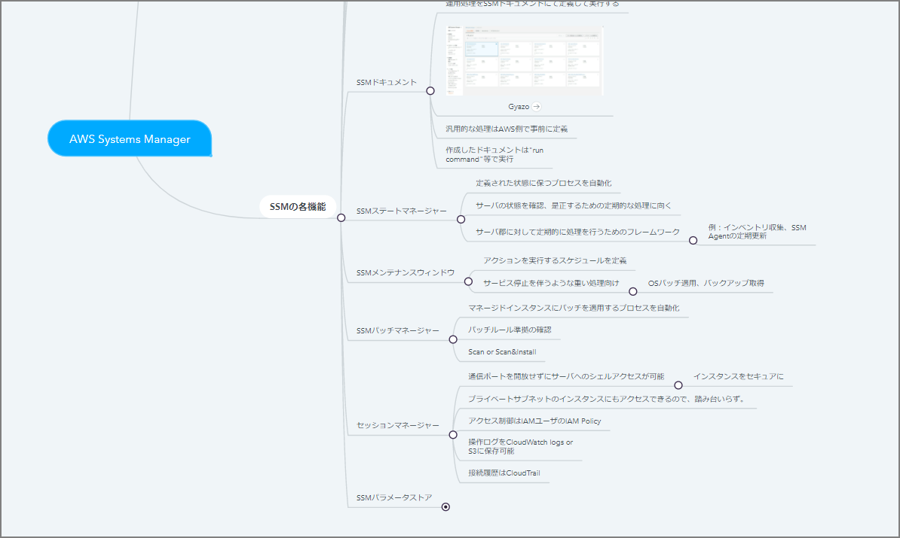

# Introduction

Study notes for "AWS Certified DevOps Engineer - Professional"

# Rough Notes

# AWS Systems Manager

- Getting Started
    - Making Managed Instances
        - Install SSM Agent
            - SSM Agent (EC2) needs access rights to SSM
            - Via internet or VPC endpoint
- EC2 Role
        - Quick Setup

- SSM Features

    - AWS SSM Explorer
        - Operations dashboard that reports information about AWS resources
        - EC2 information
            - Number of EC2 instances
            - Number of managed instances, etc.
        - OpsCenter OpsItems
        - Patch compliance
        - Trusted Advisor checks
    - SSM OpsCenter
        - Dashboard to view, investigate, and resolve operational work items related to AWS resources
        - Register CloudWatch Events rules
        - External alerts can also be registered
    - SSM Compliance
        - Displays resources that are not in compliance
        - Default
            - Patch application status
            - State Manager association status
    - SSM Inventory
        - Collect and visualize metadata from managed instances
        - List of applications on the OS
        - Can send configuration information to Config to track changes in inventory information
        - Check compliance status with Config Rules

    

    - SSM Documents
    - Define and execute operational procedures in SSM documents
        - Common procedures are pre-defined by AWS
        - Created documents are executed with "run command", etc.
    - SSM State Manager
    - Automate the process of maintaining defined states
        - Suited for periodic processing to check and correct server states
        - Framework for performing periodic processing on groups of servers
            - Examples: inventory collection, periodic SSM Agent updates
    - SSM Maintenance Window
        - Define schedules for executing actions
        - For heavy processing that involves service downtime
            - OS patch application, backup acquisition
    - SSM Patch Manager
        - Automate the process of applying patches to managed instances
        - Check patch rule compliance
        - Scan
        - Scan & Install
    - Session Manager
        - Allows shell access to servers without opening communication ports
        - Secure access to instances
        - Can access instances in private subnets without a bastion host
        - Access control via IAM Policy for IAM users
        - Operation logs can be saved to CloudWatch Logs or S3
    - Connection history in CloudTrail
    - SSM Parameter Store
        - Storage for managing configuration and settings information
        - Encrypt sensitive information like passwords with KMS
