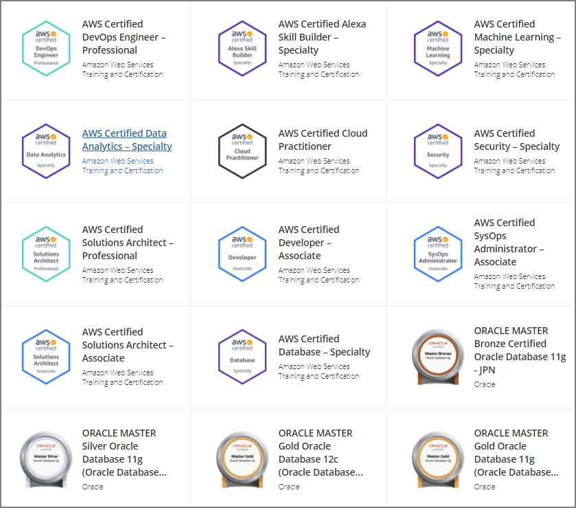

I passed the [AWS Certified DevOps Engineer - Professional](https://aws.amazon.com/jp/certification/certified-devops-engineer-professional/) after about one month of study, so here's a brief note.

# Preparation Method

- [Exam Guide](https://d1.awsstatic.com/ja_JP/training-and-certification/docs-devops-pro/AWS-Certified-DevOps-Engineer-Professional_Exam-Guide.pdf)
- [BlackBelt materials](https://aws.amazon.com/jp/aws-jp-introduction/aws-jp-webinar-service-cut/) for important services
- Official free practice e-learning
  - [Exam Readiness: AWS Certified DevOps Engineer - Professional](https://www.aws.training/Details/eLearning?id=40664)
- Hands-on practice (especially CF and Code series)
- Official practice exam
- [Paid question bank (Whizlabs)](https://www.whizlabs.com/aws-devops-certification-training/)
- Whitepapers
  - [Practicing Continuous Integration and Continuous Delivery on AWS](https://d1.awsstatic.com/International/ja_JP/Whitepapers/practicing-continuous-integration-continuous-delivery-on-AWS_JA_final.pdf)

# Study Subjects

Having studied broadly for the Solutions Architect Professional and various Specialty certifications, I focused on hands-on practice and study of key services. I was able to progress smoothly in part because I had already obtained SAP and others.

### Important Services

- Systems Manager
- CloudFormation
- Elastic Beanstalk
- Config
- CodePipeline/CodeBuild/CodeDeploy
- CloudWatch (especially Logs, Events, etc.)
- AutoScaling
- ECS

### Required Concepts

- CI/CD
- Disaster recovery design
- Deployment (Blue/Green, Canary releases, etc.)
  - This is a good reference:
    - [AWS Black Belt Online Seminar: Deployment on AWS](https://d0.awsstatic.com/webinars/jp/pdf/services/20170822_AWS-BlackBelt_Deployment_on_AWS.pdf)
- RTO/RPO concepts
  - Whether you can choose the appropriate backup and design for each use case
- Backup/Recovery

### Services Worth Studying at a High Level

- Inspector
- EC2
- Opsworks
- StepFunction
- GuardDuty
- Macie
- KMS
- DynamoDB

# Impressions and Other Notes

I feel like I've gained the concepts needed for DevOps starting with CI/CD, knowledge and skills needed for operations. During the exam, I felt that many of the scenarios closely resembled situations I had considered in my actual work, and it seemed applicable to my day-to-day job.

Passing this, I now have 11 certifications. With this many, 12 certifications is the final goal, but I plan to study for the [G Certification](https://www.jdla.org/certificate/general/) for deepening ML knowledge and IPA exams in winter and spring.

https://www.youracclaim.com/users/jumpei-imazato/badges

- AWS Certified Cloud Practitioner
- AWS Certified Solutions Architect - Associate
- AWS Certified Developer - Associate
- AWS Certified SysOps Administrator - Associate
- AWS Certified Solutions Architect - Professional
- AWS Certified DevOps Engineer - Professional
- AWS Certified Security - Specialty
- AWS Certified Machine Learning - Specialty
- AWS Certified Database - Specialty
- AWS Certified Data Analytics - Specialty
- AWS Certified Alexa Skill Builder - Specialty

