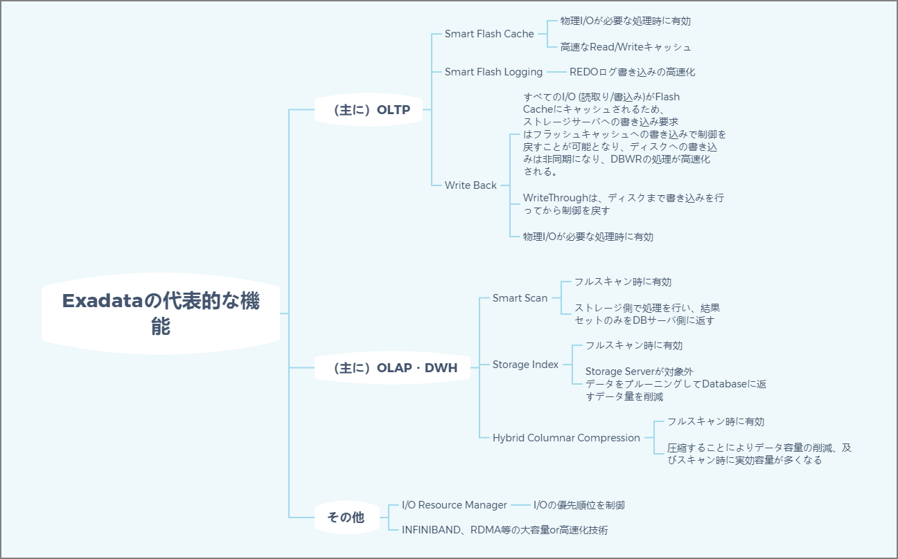
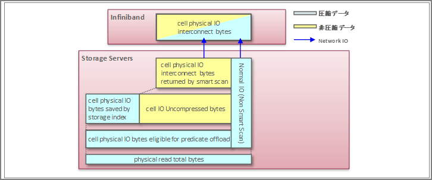

# Typical Exadata Features (Performance)

> Oracle Exadata System Software Overview https://docs.oracle.com/cd/F19137_01/sagug/exadata-storage-server-software-introduction.html#GUID-D6856B9A-DBB2-44DF-8632-01637AFAE962

# Statistics Needed for Performance Analysis

When analyzing the effects of features like SmartScan, referring to these statistics is recommended. One of the good things about Oracle products is that beyond the functionality itself, information is relatively easy to find when you look it up.

> Dr. Tsushima's Performance Seminar - Vol. 69: About Oracle Exadata Database Machine | Oracle Technology Network Japan Blog https://blogs.oracle.com/otnjp/tsushima-hakushi-69

| Statistic Name                                              | Meaning                                                      | V$SQL Statistic                |
| ----------------------------------------------------------- | ------------------------------------------------------------ | ------------------------------ |
| cell physical IO interconnect bytes                        | IO size exchanged between DB server and Cell, including non-Smart Scan (size after decompression) | IO_INTERCONNECT_BYTES          |
| cell physical IO interconnect bytes returned by smart scan | IO size returned from Cell by Smart Scan (size after decompression) | IO_CELL_OFFLOAD_RETURNED_BYTES |
| cell physical IO bytes eligible for predicate offload      | IO size subject to Smart Scan (differs from physical read total bytes in that non-Smart Scan is not included) | IO_CELL_OFFLOAD_ELIGIBLE_BYTES |
| cell IO uncompressed bytes                                 | Uncompressed data size processed by cell                     | IO_CELL_UNCOMPRESSED_BYTES     |
| cell physical IO bytes saved by storage index              | IO reduction size by Storage Index                           | OPTIMIZED_PHY_READ_REQUESTS    |
| cell flash cache read hits                                 | Number of requests to Smart Flash Cache                      |                                |
| physical read total IO requests                            | Number of physical read I/O requests                         | PHYSICAL_READ_REQUESTS         |
| physical read total Bytes                                  | Physical read size (bytes)                                   | PHYSICAL_READ_BYTES            |

# Additional References

> The Mystery of Exadata Flash Cache: Technical Notes on Oracle Database Blog https://tech-oracle.blog.ss-blog.jp/2019-02-06
