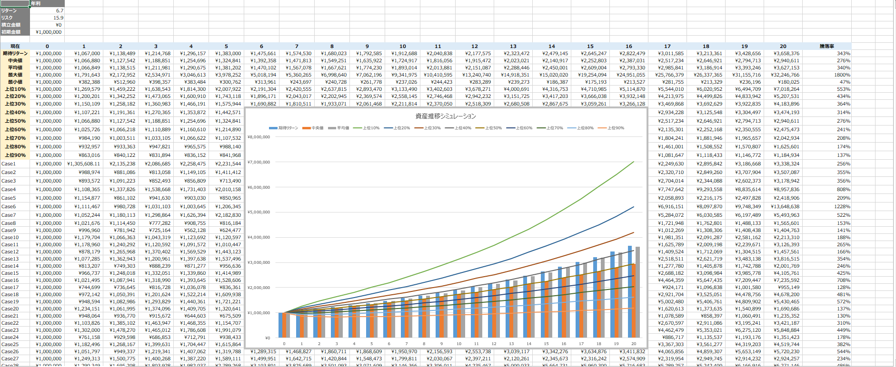
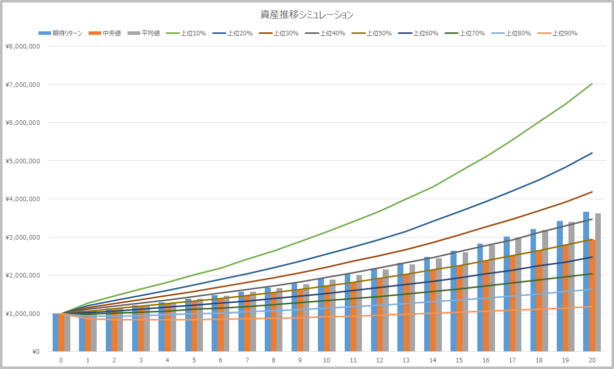

The Monte Carlo method produces results that converge toward the solution by repeating random trials as many times as the sample count, creating a normal distribution based on returns and risks using random numbers. In Excel functions, this looks like:

> NORM.INV(RAND(), Return (mean), Risk (standard deviation))

The 20-year annualized average return for ACWI, the benchmark used for global equity index funds synonymous with diversified investing, is `6.7%` with an annualized average risk (standard deviation) of `15.9%`. I'll use these two variables for simulation.

|             | 6 months | 1 year | 3 years | 5 years | 10 years | 15 years | 20 years | 30 years |
| ----------- | -------- | ------ | ------- | ------- | -------- | -------- | -------- | -------- |
| Return (%)  | 24.3     | 16.8   | 10.6    | 12.9    | 9.7      | 7.8      | 6.7      | 8.4      |
| Risk (%)    | 14.3     | 26     | 18.4    | 15.1    | 14.1     | 16.3     | 15.9     | 15       |

> MSCI All Country World Index (ACWI) | Stock Index https://myindex.jp/data_i.php?q=MS1025USD

Using the above return and risk figures, I ran approximately 50,000 Monte Carlo simulations starting with `1,000,000 JPY` (no additional contributions). Here are the final results. The calculation Excel sheet is available [here](https://github.com/zatoima/zatoima.github.io/blob/master/%E3%82%B7%E3%83%9F%E3%83%A5%E3%83%AC%E3%83%BC%E3%82%B7%E3%83%A7%E3%83%B3.xlsx). Note it is about 20MB.

The following metrics were calculated from approximately 50,000 sample cases and graphed. The values shift slightly with each recalculation, but the overall trend remains the same.

- Expected return
- Median
- Mean
- Top xx%

The "top xx%" expression may seem confusing, but even in the worst 10% case (= top 90%), the principal increased somewhat, and the median resulted in approximately 3x through the power of compound interest.

