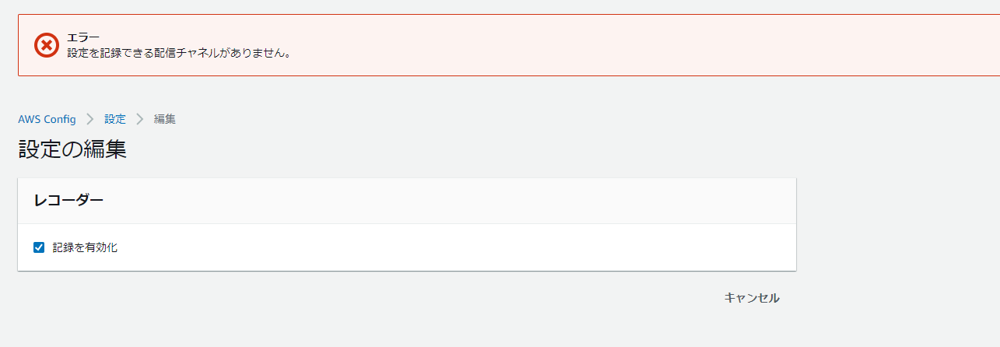

## Problem

When trying to enable recording in AWS Config, you get "No delivery channel exists to record settings." and cannot enable it.



As shown below, the delivery channel appears to be missing, so create one manually. DeliveryChannels is indeed null.

```json
[ec2-user@bastin ~]$ aws configservice describe-delivery-channels
{
    "DeliveryChannels": []
}
[ec2-user@bastin ~]$ aws configservice describe-configuration-recorders
{
    "ConfigurationRecorders": [
        {
            "name": "default",
            "roleARN": "arn:aws:iam::xxxxxx:role/aws-service-role/config.amazonaws.com/AWSServiceRoleForConfig",
            "recordingGroup": {
                "allSupported": true,
                "includeGlobalResourceTypes": true,
                "resourceTypes": []
            }
        }
    ]
}
```

### Solution: Create a Delivery Channel

After creating the delivery channel, reconfigure Config.

```sh
[ec2-user@bastin ~]$ aws configservice put-delivery-channel --delivery-channel name=default,s3BucketName=config-bucket-xxxxxxxxxx --region ap-northeast-1
```

Reference:

- [put-delivery-channel - AWS CLI 1.22.73 Command Reference](https://docs.aws.amazon.com/cli/latest/reference/configservice/put-delivery-channel.html)

### Verify Configuration

```json
[ec2-user@bastin ~]$ aws configservice describe-delivery-channels
{
    "DeliveryChannels": [
        {
            "name": "default",
            "s3BucketName": "config-bucket-xxxxx"
        }
    ]
}
[ec2-user@bastin ~]$ aws configservice describe-configuration-recorders
{
    "ConfigurationRecorders": [
        {
            "name": "default",
            "roleARN": "arn:aws:iam::xxxx:role/aws-service-role/config.amazonaws.com/AWSServiceRoleForConfig",
            "recordingGroup": {
                "allSupported": true,
                "includeGlobalResourceTypes": true,
                "resourceTypes": []
            }
        }
    ]
}

```
