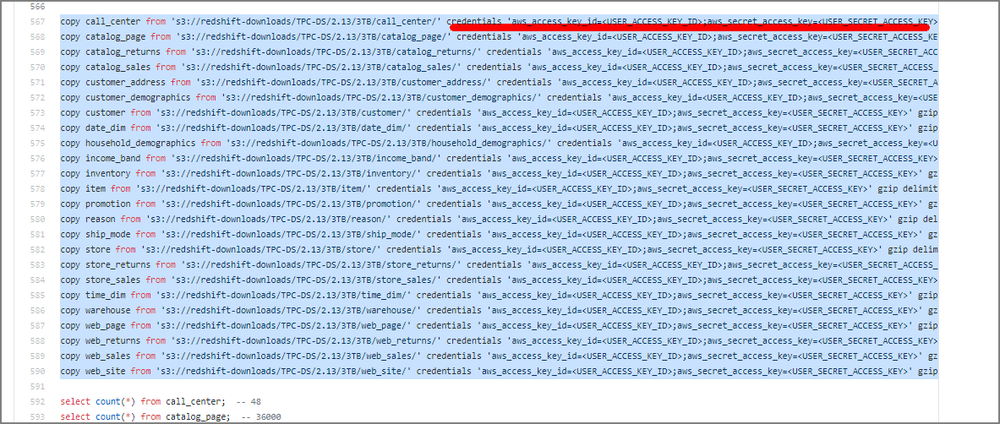

I tried loading TPC-DS data, which is also used for Redshift benchmarks, and executing analytical queries. It provides a fixed volume of data (from 100GB to 1PB), making it easy to run analytical queries against large datasets.

For information on the TPC-DS benchmark, see [here](http://www.tpc.org/tpc_documents_current_versions/pdf/tpc-ds_v2.5.0.pdf). It appears to model the decision support functions of a retail product supplier.

# Resources

Scripts are organized in `amazon-redshift-utils`.

> amazon-redshift-utils/src/CloudDataWarehouseBenchmark/Cloud-DWB-Derived-from-TPCDS at master - awslabs/amazon-redshift-utils - GitHub https://github.com/awslabs/amazon-redshift-utils/tree/master/src/CloudDataWarehouseBenchmark/Cloud-DWB-Derived-from-TPCDS

The data loading scripts are in the `US-EAST-1` region, so be aware of potential transfer overhead if running Redshift in the Tokyo region.

> https://s3.console.aws.amazon.com/s3/buckets/redshift-downloads?prefix=TPC-DS%2F&region=us-east-1

# Procedure Overview

1. Edit ddl.sql and replace `<USER_ACCESS_KEY_ID>` and `<USER_SECRET_ACCESS_KEY>` with valid S3 credentials.

2. Create a new database to load the dataset.

3. Connect to the created database and execute ddl.sql.

   Note: Depending on the data scale and data warehouse size, this may take several hours.

4. Execute query_0.sql etc. to measure execution time.

# Procedure

1. ### Edit ddl.sql

Replace the following sections with your credentials. The target ddl.sql is here. Clone locally with git clone and edit.

> https://github.com/awslabs/amazon-redshift-utils/blob/master/src/CloudDataWarehouseBenchmark/Cloud-DWB-Derived-from-TPCDS/3TB/ddl.sql



You can also rewrite to use an IAM role:

```
copy call_center from 's3://redshift-downloads/TPC-DS/2.13/3TB/call_center/' iam_role 'arn:aws:iam::xxxxxxxxxxxxxxx:role/myRedshiftRole' gzip delimiter '|' EMPTYASNULL region 'us-east-1';
copy catalog_page from 's3://redshift-downloads/TPC-DS/2.13/3TB/catalog_page/' iam_role 'arn:aws:iam::xxxxxxxxxxxxxxx:role/myRedshiftRole' gzip delimiter '|' EMPTYASNULL region 'us-east-1';
copy catalog_returns from 's3://redshift-downloads/TPC-DS/2.13/3TB/catalog_returns/' iam_role 'arn:aws:iam::xxxxxxxxxxxxxxx:role/myRedshiftRole' gzip delimiter '|' EMPTYASNULL region 'us-east-1';
～omitted～
```

### 2. Create the Database

```
drop database tpcds_3tb;
CREATE DATABASE tpcds_3tb;
```

### 3. Execute Load Against the Created Database

```
psql -h redshift-cluster.xxxxx.ap-northeast-1.redshift.amazonaws.com -U awsuser -d tpcds_3tb -p 5439 -f /home/ec2-user/amazon-redshift-utils-master/src/CloudDataWarehouseBenchmark/Cloud-DWB-Derived-from-TPCDS/3TB/ddl.sql
```

This executes table creation, data loading, and row count verification. (Note: this takes time)

### 4. Execute Queries

Queries from query_0.sql to query_10.sql are available, execute as appropriate. When benchmarking, don't forget to disable the result cache.

```
psql -h redshift-cluster.xxxxx.ap-northeast-1.redshift.amazonaws.com -U awsuser -d tpcds_3tb -p 5439 -f /home/ec2-user/amazon-redshift-utils-master/src/CloudDataWarehouseBenchmark/Cloud-DWB-Derived-from-TPCDS/3TB/queries/query_0.sql
```
