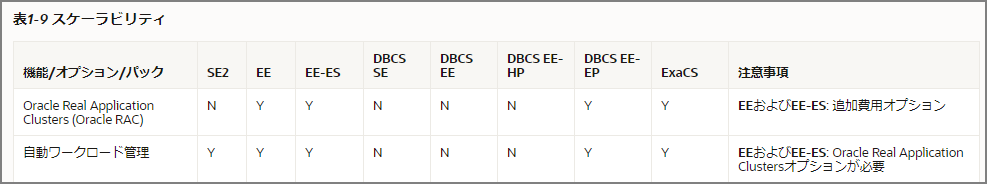

Notes on differences between Enterprise Edition and Standard Edition and things to consider when migrating. Below, Enterprise Edition is abbreviated as EE and Standard Edition 2 as SE2. Note that the [MECE](https://ja.wikipedia.org/wiki/MECE) perspective is also insufficient.

### SE2 Overview

- Maximum 2 sockets
- Limited to 16 thread execution per database
  - Be mindful of the CPU count of the source system
- EE-exclusive features cannot be used
  - Almost all paid option products
    - Oracle Advanced Security
    - Oracle Real Application Testing
    - Oracle Tuning Pack
    - Oracle Diagnostics Pack
    - Oracle Real Application Clusters (Oracle RAC)
      - RAC was available for free until 18c, but is not available in SE2 from 19c onwards
    - Oracle Partitioning
    - Oracle Active Data Guard
    - Many others
  - EE-specific features
    - Oracle Data Guard
    - Online reorganization
    - Tablespace Point-in-Time Recovery
    - Various parallel processing
    - Many others

### List of Features Available/Unavailable in EE vs SE2

There are features exclusive to Exadata and features only available in Oracle Cloud, so check the SE2 and EE columns on the left.

> Oracle Database Release 19 Database Licensing Information User Manual
>
> https://docs.oracle.com/cd/F19136_01/dblic/Licensing-Information.html#GUID-B6113390-9586-46D7-9008-DCC9EDA45AB4

### What Doesn't Change Between EE and SE2

As shown below, basic database functionality doesn't change. Most existing assets (applications, tools, skills) should be reusable.

- Transactions
- Stored Procedures
- RMAN
- Dictionary views, static dictionaries

### EE-Exclusive Features to Be Aware Of

Since this relates to how security and availability requirements are met, an assessment is required as the first step for SE2 migration. Performance is the second consideration.

I personally picked out features that are commonly used, were used, or are excellent. There are others, so consider after extracting the features currently in use. Not only non-functional requirements like performance, availability, and security, but also existing operations will be significantly impacted, so each needs to be verified as acceptable, and alternative approaches need to be explored.

- Paid options
  - Oracle Advanced Security (security)
  - Oracle Tuning Pack (tuning-related)
  - Oracle Diagnostics Pack (diagnostics)
  - Oracle Real Application Clusters (availability, performance)
  - Oracle Partitioning (performance, operations)
  - Oracle Active Data Guard (availability, performance)

- EE-specific features

  - Basic Table Compression
  - Various parallel processing
  - Data Guard
  - Online operations (online index rebuild, online reorganization, etc.)
  - Tablespace Point-in-Time Recovery
  - Parallel backup and recovery
  - Flashback operations
  - Recover tables and table partitions from RMAN backups
  - Result cache

### How to Handle Feature Alternatives

Considering RDS for Oracle as the migration target managed service. After roughly thinking about what concerned me, some can be replaced with AWS-specific features or somewhat inferior alternatives (AWR -> StatsPack). However, the first key consideration is whether non-functional requirements can be met without partition, parallel, and various option features.

Note: There are many 3rd party products compatible with Oracle, so patterns combining these also exist.

| Category                   | EE                                             | SE2                      | AWS RDS for Oracle                 | Notes                                                   |
| -------------------------- | ---------------------------------------------- | ------------------------ | ---------------------------------- | ------------------------------------------------------- |
| Security                   | Tablespace Encryption                          | -                        | Check if storage encryption meets requirements | Note that the protection layer is different    |
| Security                   | Network Encryption                             | Network Encryption       |                                    | Originally paid but appears to have changed             |
| Performance                | Automatic Workload Repository (AWR)            | Statspack                | Performance Insights, CloudWatch   |                                                         |
| Performance                | ASH (Active Session History)                   | -                        | Performance Insights?              |                                                         |
| Performance                | SQL Trace                                      | SQL Trace                |                                    |                                                         |
| Performance                | Enterprise Manager Performance features        | -                        | Performance Insights, CloudWatch   |                                                         |
| Performance                | SQL Access Advisor                             | -                        |                                    |                                                         |
| Performance                | SQL Tuning Advisor                             | -                        |                                    |                                                         |
| Performance                | Automatic SQL Tuning                           | -                        |                                    |                                                         |
| Performance                | SQL Profile                                    | -                        |                                    |                                                         |
| Performance                | Oracle Partitioning                            | View partitioning?       | -                                  | Requires investigation                                  |
| Availability & Performance | Oracle Real Application Clusters               | -                        | Multi-AZ configuration             |                                                         |
| Availability               | Data Guard                                     | -                        | Multi-AZ configuration             |                                                         |
| EE Feature                 | Online operations                              | -                        |                                    |                                                         |
| EE Feature                 | Tablespace Point-in-Time Recovery              | -                        |                                    |                                                         |
| EE Feature                 | Parallel backup and recovery                   | -                        | Snapshots                          |                                                         |
| EE Feature                 | Flashback operations                           | -                        |                                    |                                                         |
| EE Feature                 | Recover tables/partitions from RMAN backups    | -                        |                                    |                                                         |
| EE Feature                 | Result cache                                   | -                        |                                    |                                                         |

### Supplement

I tried an alternative approach to partitioning without the Partition option:

[Trying an Alternative to Oracle Partition Option (View + Trigger) | my opinion is my own](https://zatoima.github.io/oracle-ee-se2-partition-trigger-view.html)

### References

> EE Features in SE2 https://www.doag.org/formes/pubfiles/11343091/2019-NN-Clemens_Bleile-Oracle_Standard_Edition_2_Fehlende_Features_ergaenzen-Praesentation.pdf
>
> dbts19_cosol_oracle_se2.pdf http://cosol.jp/techdb/dbts19_cosol_oracle_se2.pdf
