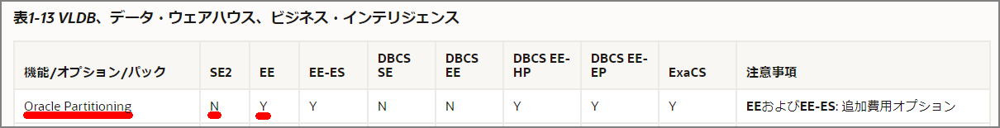
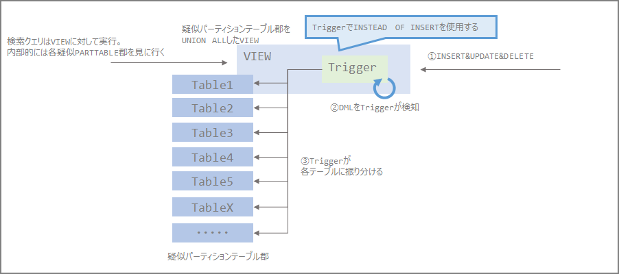

### Introduction

As a follow-up to the considerations in the article below, I tried implementing an alternative to Oracle Partition.

> Notes on Considering a Downgrade from Oracle Enterprise Edition to Standard Edition | my opinion is my own https://zatoima.github.io/oracle-ee-se2-migration-to-aws-rds-for-oracle.html

Partitioning is commonly used for large tables and historical data, but when considering a downgrade from Oracle EE to SE2, the Partition option cannot be used, so an alternative is needed.



There are several reasons to use partitioning, and the following are the typical benefits:

1. Performance improvement through partition pruning
2. Performance improvement through parallelism at the partition level
   - Effective when searching across multiple partitions
3. Operational improvement through the ability to drop at the partition level
   - Without this capability, a DELETE statement must be issued, which is difficult in terms of both I/O and time

After some research, I found several alternative approaches, so this article implements those alternatives. The references I consulted are below. In this article, I call this approach "pseudo partitioning."

> Implementing table partitioning in Oracle Standard Edition: Part 1 | AWS Database Blog https://aws.amazon.com/jp/blogs/database/implementing-table-partitioning-in-oracle-standard-edition-part-1/
>
> Partitioning and Oracle Standard Edition | Oracle FAQ https://www.orafaq.com/node/2992
>
> Oracle Partitioning and Standard Edition | the gruffdba https://gruffdba.wordpress.com/2018/08/05/oracle-partitioning-and-standard-edition/
>
> Oracle SE partition using INSERT TRIGGER and VIEW - kenken0807_DB Memo https://kenken0807.hatenablog.com/entry/2015/07/21/161333

### Conceptual Diagram of the Partition Alternative

As shown in the diagram below, this is an alternative using Triggers and Views. This approach was used in Oracle before Partitioning was implemented (Oracle 7 era?), and PostgreSQL before version 9.6 used inheritance and triggers, which is similar to this conceptual diagram.

When increasing the number of pseudo partition table groups, modifications to Table, View definitions, and Triggers are required, so whether this is operationally acceptable needs to be verified separately.



The key points are as follows (imagining range partitioning here):

- Prepare multiple tables, each containing data divided by year/month units
- The target table for SELECT and DML (INSERT, UPDATE, DELETE) operations is a VIEW
  - The VIEW is defined by joining each table with UNION ALL
- When DML (INSERT in this case) arrives, the Trigger fires, determines which partition (table) the target year/month belongs to using IF/CASE statements, and inserts into the appropriate table
- Since indexes cannot be added to a VIEW, only local indexes are available. (= Global indexes that could be used with partitions cannot be added)
- Create local indexes on the partition key

### Workflow

In trying this approach, I primarily wanted to compare performance between the source environment (EE partition table configuration) and the target environment (pseudo partition configuration), so I proceeded as follows:

1. Using EE partition tables

   - Create a large-capacity table and perform simple performance verification using EE's partition feature
   - Verify with and without partitions, with and without indexes

2. Using pseudo partitions

   - The environment setup is the same as `1. Using EE partition tables`. The partition portion is replaced with pseudo partition configuration

   - Verify with and without pseudo partitions, with and without indexes

### Using EE Partition Tables

Starting from environment creation

### User Creation

```sql
drop user TESTPART;
create user TESTPART identified by oracle;
grant dba to TESTPART;
conn testpart/oracle@rdsoraclev19c.xxxx.ap-northeast-1.rds.amazonaws.com:1521/ora19c
```

- ##### Pattern: With Partition, Without Index

Create the partition table

```sql
CREATE TABLE PARTTEST_EE_PART(
  id number,
  ymd DATE,
  str1 VARCHAR(120),
  str2 VARCHAR(500),
  str3 VARCHAR2(10),
  str4 NUMBER(9,0)
)
PARTITION BY RANGE(ymd)
(
  PARTITION ymd_p00 VALUES LESS THAN(TO_DATE('2010/01/01','YYYY/MM/DD')),
  PARTITION ymd_p01 VALUES LESS THAN(TO_DATE('2011/01/01','YYYY/MM/DD')),
  PARTITION ymd_p02 VALUES LESS THAN(TO_DATE('2012/01/01','YYYY/MM/DD')),
  PARTITION ymd_p03 VALUES LESS THAN(TO_DATE('2013/01/01','YYYY/MM/DD')),
  PARTITION ymd_p04 VALUES LESS THAN(TO_DATE('2014/01/01','YYYY/MM/DD')),
  PARTITION ymd_p05 VALUES LESS THAN(TO_DATE('2015/01/01','YYYY/MM/DD')),
  PARTITION ymd_p06 VALUES LESS THAN(TO_DATE('2016/01/01','YYYY/MM/DD')),
  PARTITION ymd_p07 VALUES LESS THAN(TO_DATE('2017/01/01','YYYY/MM/DD')),
  PARTITION ymd_p08 VALUES LESS THAN(TO_DATE('2018/01/01','YYYY/MM/DD')),
  PARTITION ymd_p09 VALUES LESS THAN(TO_DATE('2019/01/01','YYYY/MM/DD')),
  PARTITION ymd_p10 VALUES LESS THAN(TO_DATE('2020/01/01','YYYY/MM/DD')),
  PARTITION ymd_p11 VALUES LESS THAN(TO_DATE('2021/01/01','YYYY/MM/DD'))
);
```

Create 1 million rows of data

```sql
INSERT /*+ APPEND */ INTO PARTTEST_EE_PART NOLOGGING
SELECT
  parttest_seq.nextval,
  TO_DATE('20100101','YYYYMMDD') +MOD(ABS(DBMS_RANDOM.RANDOM()),TO_DATE('20200101','YYYYMMDD')-TO_DATE('20100101','YYYYMMDD')) DT
  ,DBMS_RANDOM.STRING('X', 50)
  ,'あいうえおかきくけこさしすせそ'
  ,TO_CHAR(ABS(DBMS_RANDOM.RANDOM()),'FM0000000000') CD
  ,MOD(DBMS_RANDOM.RANDOM(),100000) KIN
FROM
(SELECT 0 FROM ALL_CATALOG WHERE ROWNUM <= 1000)
,(SELECT 0 FROM ALL_CATALOG WHERE ROWNUM <= 1000);
commit;
```

Amplify data using Insert ~ Select (many times)

```sql
insert into PARTTEST_EE_PART NOLOGGING select * from PARTTEST_EE_PART;
commit;
select count(*) from PARTTEST_EE_PART;
```

Approximately 100 million+ rows

```sql
SQL> select count(*) from PARTTEST_EE_PART;
    COUNT(*)
____________
   128000000
```

Gather statistics to check num_rows

```sql
exec DBMS_STATS.GATHER_TABLE_STATS(ownname=>'TESTPART',tabname=>'PARTTEST_EE_PART',cascade=>false,DEGREE =>4);
```

Check row counts per partition

```sql
select
    TABLE_OWNER
    ,TABLE_NAME
    ,PARTITION_NAME
    ,NUM_ROWS
from
    ALL_TAB_PARTITIONS
where table_name='PARTTEST_EE_PART'
order by
    TABLE_NAME;
```

```sql
SQL> select
  2      TABLE_OWNER
  3      ,TABLE_NAME
  4      ,PARTITION_NAME
  5      ,NUM_ROWS
  6  from
  7      ALL_TAB_PARTITIONS
  8  where table_name='PARTTEST_EE_PART'
  9  order by
 10      TABLE_NAME;
   TABLE_OWNER          TABLE_NAME    PARTITION_NAME    NUM_ROWS
______________ ___________________ _________________ ___________
TESTPART       PARTTEST_EE_PART    YMD_P00                     0
TESTPART       PARTTEST_EE_PART    YMD_P01              12830976
TESTPART       PARTTEST_EE_PART    YMD_P02              12804736
TESTPART       PARTTEST_EE_PART    YMD_P03              12837760
TESTPART       PARTTEST_EE_PART    YMD_P04              12809088
TESTPART       PARTTEST_EE_PART    YMD_P05              12786176
TESTPART       PARTTEST_EE_PART    YMD_P06              12755840
TESTPART       PARTTEST_EE_PART    YMD_P07              12817408
TESTPART       PARTTEST_EE_PART    YMD_P08              12797184
TESTPART       PARTTEST_EE_PART    YMD_P09              12803072
TESTPART       PARTTEST_EE_PART    YMD_P10              12757760
TESTPART       PARTTEST_EE_PART    YMD_P11                     0
```

Measure query time with and without partitions, with and without indexes in this environment. Checking the count of data spanning 2 years.

```sql
exec rdsadmin.rdsadmin_util.flush_shared_pool;
exec rdsadmin.rdsadmin_util.flush_buffer_cache;
set autotrace on
set timing on
select count(*) from PARTTEST_EE_PART where ymd between to_date('2017/05/01 11:00:00','YYYY/MM/DD HH24:MI:SS') and to_date('2019/05/11 12:00:00','YYYY/MM/DD HH24:MI:SS');
```

Execution result

```sql
SQL> select count(*) from PARTTEST_EE_PART where ymd between to_date('2017/05/01 11:00:00','YYYY/MM/DD HH24:MI:SS') and to_date('2019/05/11 12:00:00','YYYY/MM/DD HH24:MI:SS');
   COUNT(*)
___________
   25941120


Explain Plan
-----------------------------------------------------------
                                                                                                PLAN_TABLE_OUTPUT
_________________________________________________________________________________________________________________
Plan hash value: 2195020283

--------------------------------------------------------------------------------------------------------------
| Id  | Operation                 | Name             | Rows  | Bytes | Cost (%CPU)| Time     | Pstart| Pstop |
--------------------------------------------------------------------------------------------------------------
|   0 | SELECT STATEMENT          |                  |     1 |     8 |   192K  (1)| 00:00:08 |       |       |
|   1 |  SORT AGGREGATE           |                  |     1 |     8 |            |          |       |       |
|   2 |   PARTITION RANGE ITERATOR|                  |    26M|   198M|   192K  (1)| 00:00:08 |     9 |    11 |
|*  3 |    TABLE ACCESS FULL      | PARTTEST_EE_PART |    26M|   198M|   192K  (1)| 00:00:08 |     9 |    11 |
--------------------------------------------------------------------------------------------------------------

Predicate Information (identified by operation id):
---------------------------------------------------

   3 - filter("YMD">=TO_DATE(' 2017-05-01 11:00:00', 'syyyy-mm-dd hh24:mi:ss') AND "YMD"<=TO_DATE('
              2019-05-11 12:00:00', 'syyyy-mm-dd hh24:mi:ss'))


Statistics
-----------------------------------------------------------
             249  CPU used by this session
             250  CPU used when call started
             865  DB time
               3  Requests to/from client
              10  enqueue releases
              10  enqueue requests
            5028  non-idle wait count
             621  non-idle wait time
             200  opened cursors cumulative
               1  opened cursors current
            5567  physical read total IO requests
            5504  physical read total multi block requests
               1  pinned cursors current
               9  process last non-idle time
             460  recursive calls
               2  recursive cpu usage
          701356  session logical reads
             621  user I/O wait time
               4  user calls
Elapsed: 00:00:08.748
SQL>

```

- ##### Pattern: Without Partition, Without Index

Create a non-partitioned table and use the same data

```sql
CREATE TABLE PARTTEST_EE_NONPART(
  id number,
  ymd DATE,
  str1 VARCHAR(120),
  str2 VARCHAR(500),
  str3 VARCHAR2(10),
  str4 NUMBER(9,0)
);

insert into PARTTEST_EE_NONPART NOLOGGING select * from PARTTEST_EE_PART;
select count(*) from PARTTEST_EE_PART;
```

Measure time

```sql
exec rdsadmin.rdsadmin_util.flush_shared_pool;
exec rdsadmin.rdsadmin_util.flush_buffer_cache;
set autotrace on
set timing on
select count(*) from PARTTEST_EE_NONPART where ymd between to_date('2017/05/01 11:00:00','YYYY/MM/DD HH24:MI:SS') and to_date('2019/05/11 12:00:00','YYYY/MM/DD HH24:MI:SS');
```

```sql
SQL> select count(*) from PARTTEST_EE_NONPART where ymd between to_date('2017/05/01 11:00:00','YYYY/MM/DD HH24:MI:SS') and to_date('2019/05/11 12:00:00','YYYY/MM/DD HH24:MI:SS');
   COUNT(*)
___________
   25941120


Explain Plan
-----------------------------------------------------------
                                                                            PLAN_TABLE_OUTPUT
_____________________________________________________________________________________________
Plan hash value: 3084685461

------------------------------------------------------------------------------------------
| Id  | Operation          | Name                | Rows  | Bytes | Cost (%CPU)| Time     |
------------------------------------------------------------------------------------------
|   0 | SELECT STATEMENT   |                     |     1 |     8 |   635K  (1)| 00:00:25 |
|   1 |  SORT AGGREGATE    |                     |     1 |     8 |            |          |
|*  2 |   TABLE ACCESS FULL| PARTTEST_EE_NONPART |    26M|   198M|   635K  (1)| 00:00:25 |
------------------------------------------------------------------------------------------

Predicate Information (identified by operation id):
---------------------------------------------------

   2 - filter("YMD">=TO_DATE(' 2017-05-01 11:00:00', 'syyyy-mm-dd hh24:mi:ss')
              AND "YMD"<=TO_DATE(' 2019-05-11 12:00:00', 'syyyy-mm-dd hh24:mi:ss'))


Statistics
-----------------------------------------------------------
            1077  CPU used by this session
            1078  CPU used when call started
            3105  DB time
               3  Requests to/from client
               5  enqueue releases
               5  enqueue requests
           15184  non-idle wait count
            2045  non-idle wait time
              42  opened cursors cumulative
               1  opened cursors current
           18335  physical read total IO requests
           18288  physical read total multi block requests
               1  pinned cursors current
              31  process last non-idle time
             115  recursive calls
         4667336  session logical reads
            2045  user I/O wait time
               4  user calls
Elapsed: 00:00:31.136

```

- ##### Pattern: With Partition, With Index

Create index

```sql
drop index PARTTEST_EE_PART_IDX;
create index PARTTEST_EE_PART_IDX ON PARTTEST_EE_PART(ymd) local nologging parallel 4;
```

Execution result

```sql
SQL> set autotrace on
Autotrace Enabled
Shows the execution plan as well as statistics of the statement.
SQL> set timing on
SQL> select count(*) from PARTTEST_EE_PART where ymd between to_date('2017/05/01 11:00:00','YYYY/MM/DD HH24:MI:SS') and to_date('2019/05/11 12:00:00','YYYY/MM/DD HH24:MI:SS');
   COUNT(*)
___________
   25941120


Explain Plan
-----------------------------------------------------------
                                                                                                                                       PLAN_TABLE_OUTPUT
________________________________________________________________________________________________________________________________________________________
Plan hash value: 2795901320

-----------------------------------------------------------------------------------------------------------------------------------------------------
| Id  | Operation                       | Name                 | Rows  | Bytes | Cost (%CPU)| Time     | Pstart| Pstop |    TQ  |IN-OUT| PQ Distrib |
-----------------------------------------------------------------------------------------------------------------------------------------------------
|   0 | SELECT STATEMENT                |                      |     1 |     8 | 69179   (1)| 00:00:03 |       |       |        |      |            |
|   1 |  SORT AGGREGATE                 |                      |     1 |     8 |            |          |       |       |        |      |            |
|   2 |   PX COORDINATOR                |                      |       |       |            |          |       |       |        |      |            |
|   3 |    PX SEND QC (RANDOM)          | :TQ10000             |     1 |     8 |            |          |       |       |  Q1,00 | P->S | QC (RAND)  |
|   4 |     SORT AGGREGATE              |                      |     1 |     8 |            |          |       |       |  Q1,00 | PCWP |            |
|   5 |      PX PARTITION RANGE ITERATOR|                      |    26M|   198M| 69179   (1)| 00:00:03 |     9 |    11 |  Q1,00 | PCWC |            |
|*  6 |       INDEX RANGE SCAN          | PARTTEST_EE_PART_IDX |    26M|   198M| 69179   (1)| 00:00:03 |     9 |    11 |  Q1,00 | PCWP |            |
-----------------------------------------------------------------------------------------------------------------------------------------------------

Predicate Information (identified by operation id):
---------------------------------------------------

   6 - access("YMD">=TO_DATE(' 2017-05-01 11:00:00', 'syyyy-mm-dd hh24:mi:ss') AND "YMD"<=TO_DATE(' 2019-05-11 12:00:00', 'syyyy-mm-dd
              hh24:mi:ss'))


Statistics
-----------------------------------------------------------
             277  CPU used by this session
               3  CPU used when call started
            3654  DB time
               3  Requests to/from client
               6  enqueue conversions
              18  enqueue releases
              21  enqueue requests
            1770  in call idle wait time
               3  messages sent
           68920  non-idle wait count
            1704  non-idle wait time
             318  opened cursors cumulative
               1  opened cursors current
           68894  physical read total IO requests
               1  pinned cursors current
               9  process last non-idle time
             779  recursive calls
             277  recursive cpu usage
           69883  session logical reads
            1703  user I/O wait time
              16  user calls
Elapsed: 00:00:09.506
```

- ##### Pattern: Without Partition, With Index

```sql
drop index PARTTEST_EE_NONPART_IDX;
create index PARTTEST_EE_NONPART_IDX ON PARTTEST_EE_NONPART(ymd) nologging parallel 4;
```

Execution result

```sql
SQL> select count(*) from PARTTEST_EE_NONPART where ymd between to_date('2017/05/01 11:00:00','YYYY/MM/DD HH24:MI:SS') and to_date('2019/05/11 12:00:00','YYYY/MM/DD HH24:MI:SS');
   COUNT(*)
___________
   25941120


Explain Plan
-----------------------------------------------------------
                                                                               PLAN_TABLE_OUTPUT
________________________________________________________________________________________________
Plan hash value: 1281488453

---------------------------------------------------------------------------------------------
| Id  | Operation         | Name                    | Rows  | Bytes | Cost (%CPU)| Time     |
---------------------------------------------------------------------------------------------
|   0 | SELECT STATEMENT  |                         |     1 |     9 | 76083   (1)| 00:00:03 |
|   1 |  SORT AGGREGATE   |                         |     1 |     9 |            |          |
|*  2 |   INDEX RANGE SCAN| PARTTEST_EE_NONPART_IDX |    33M|   290M| 76083   (1)| 00:00:03 |
---------------------------------------------------------------------------------------------

Predicate Information (identified by operation id):
---------------------------------------------------

   2 - access("YMD">=TO_DATE(' 2017-05-01 11:00:00', 'syyyy-mm-dd hh24:mi:ss') AND
              "YMD"<=TO_DATE(' 2019-05-11 12:00:00', 'syyyy-mm-dd hh24:mi:ss'))

Note
-----
   - dynamic statistics used: dynamic sampling (level=2)


Statistics
-----------------------------------------------------------
             236  CPU used by this session
             237  CPU used when call started
            2182  DB time
               3  Requests to/from client
               5  enqueue releases
               5  enqueue requests
           68838  non-idle wait count
            2030  non-idle wait time
              25  opened cursors cumulative
               1  opened cursors current
           68834  physical read total IO requests
               1  pinned cursors current
              22  process last non-idle time
              82  recursive calls
               1  recursive cpu usage
           68890  session logical reads
            2030  user I/O wait time
               4  user calls
Elapsed: 00:00:21.901

```

### Results

|            | With Partition | Without Partition |
| ---------- | -------------- | ----------------- |
| With Index | 9.506          | 21.901            |
| No Index   | 8.748          | 31.136            |

##### Using Pseudo Partitions

Starting from environment creation

### Pseudo Partition Concept (reprinted)


##### Partition Table Image

The following is the type of partition we want to create. (This is not what we will create)

```sql
CREATE TABLE PARTTEST_EE_PART(
  id number,
  ymd DATE,
  str1 VARCHAR(120),
  str2 VARCHAR(500),
  str3 VARCHAR2(10),
  str4 NUMBER(9,0)
)
PARTITION BY RANGE(ymd)
(
  PARTITION ymd_p00 VALUES LESS THAN(TO_DATE('2010/01/01','YYYY/MM/DD')),
  PARTITION ymd_p01 VALUES LESS THAN(TO_DATE('2011/01/01','YYYY/MM/DD')),
  PARTITION ymd_p02 VALUES LESS THAN(TO_DATE('2012/01/01','YYYY/MM/DD')),
  PARTITION ymd_p03 VALUES LESS THAN(TO_DATE('2013/01/01','YYYY/MM/DD')),
  PARTITION ymd_p04 VALUES LESS THAN(TO_DATE('2014/01/01','YYYY/MM/DD')),
  PARTITION ymd_p05 VALUES LESS THAN(TO_DATE('2015/01/01','YYYY/MM/DD')),
  PARTITION ymd_p06 VALUES LESS THAN(TO_DATE('2016/01/01','YYYY/MM/DD')),
  PARTITION ymd_p07 VALUES LESS THAN(TO_DATE('2017/01/01','YYYY/MM/DD')),
  PARTITION ymd_p08 VALUES LESS THAN(TO_DATE('2018/01/01','YYYY/MM/DD')),
  PARTITION ymd_p09 VALUES LESS THAN(TO_DATE('2019/01/01','YYYY/MM/DD')),
  PARTITION ymd_p10 VALUES LESS THAN(TO_DATE('2020/01/01','YYYY/MM/DD')),
  PARTITION ymd_p11 VALUES LESS THAN(TO_DATE('2021/01/01','YYYY/MM/DD'))
);
```

The table comparison is as follows:

| Partition Name | Table               |
| -------------- | ------------------- |
| ymd_p00        | PARTTEST_SE_PART_1  |
| ymd_p01        | PARTTEST_SE_PART_2  |
| ymd_p02        | PARTTEST_SE_PART_3  |
| ymd_p03        | PARTTEST_SE_PART_4  |
| ymd_p04        | PARTTEST_SE_PART_5  |
| ymd_p05        | PARTTEST_SE_PART_6  |
| ymd_p06        | PARTTEST_SE_PART_7  |
| ymd_p07        | PARTTEST_SE_PART_8  |
| ymd_p08        | PARTTEST_SE_PART_9  |
| ymd_p09        | PARTTEST_SE_PART_10 |
| ymd_p10        | PARTTEST_SE_PART_11 |
| ymd_p11        | PARTTEST_SE_PART_12 |

##### Create Tables (= Pseudo Partition Table Group)

```sql
-- Partition like table 1
CREATE TABLE PARTTEST_SE_PART_1
(
  id number,
  ymd DATE,
  str1 VARCHAR(120),
  str2 VARCHAR(500),
  str3 VARCHAR2(10),
  str4 NUMBER(9,0)
);

-- Partition like table 2
CREATE TABLE PARTTEST_SE_PART_2
(
  id number,
  ymd DATE,
  str1 VARCHAR(120),
  str2 VARCHAR(500),
  str3 VARCHAR2(10),
  str4 NUMBER(9,0)
);

-- Partition like table 3
CREATE TABLE PARTTEST_SE_PART_3
(
  id number,
  ymd DATE,
  str1 VARCHAR(120),
  str2 VARCHAR(500),
  str3 VARCHAR2(10),
  str4 NUMBER(9,0)
);

-- Partition like table 4
CREATE TABLE PARTTEST_SE_PART_4
(
  id number,
  ymd DATE,
  str1 VARCHAR(120),
  str2 VARCHAR(500),
  str3 VARCHAR2(10),
  str4 NUMBER(9,0)
);

-- Partition like table 5
CREATE TABLE PARTTEST_SE_PART_5
(
  id number,
  ymd DATE,
  str1 VARCHAR(120),
  str2 VARCHAR(500),
  str3 VARCHAR2(10),
  str4 NUMBER(9,0)
);

-- Partition like table 6
CREATE TABLE PARTTEST_SE_PART_6
(
  id number,
  ymd DATE,
  str1 VARCHAR(120),
  str2 VARCHAR(500),
  str3 VARCHAR2(10),
  str4 NUMBER(9,0)
);

-- Partition like table 7
CREATE TABLE PARTTEST_SE_PART_7
(
  id number,
  ymd DATE,
  str1 VARCHAR(120),
  str2 VARCHAR(500),
  str3 VARCHAR2(10),
  str4 NUMBER(9,0)
);

-- Partition like table 8
CREATE TABLE PARTTEST_SE_PART_8
(
  id number,
  ymd DATE,
  str1 VARCHAR(120),
  str2 VARCHAR(500),
  str3 VARCHAR2(10),
  str4 NUMBER(9,0)
);


-- Partition like table 9
CREATE TABLE PARTTEST_SE_PART_9
(
  id number,
  ymd DATE,
  str1 VARCHAR(120),
  str2 VARCHAR(500),
  str3 VARCHAR2(10),
  str4 NUMBER(9,0)
);

-- Partition like table 10
CREATE TABLE PARTTEST_SE_PART_10
(
  id number,
  ymd DATE,
  str1 VARCHAR(120),
  str2 VARCHAR(500),
  str3 VARCHAR2(10),
  str4 NUMBER(9,0)
);

-- Partition like table 11
CREATE TABLE PARTTEST_SE_PART_11
(
  id number,
  ymd DATE,
  str1 VARCHAR(120),
  str2 VARCHAR(500),
  str3 VARCHAR2(10),
  str4 NUMBER(9,0)
);

-- Partition like table 12
CREATE TABLE PARTTEST_SE_PART_12
(
  id number,
  ymd DATE,
  str1 VARCHAR(120),
  str2 VARCHAR(500),
  str3 VARCHAR2(10),
  str4 NUMBER(9,0)
);
```

##### Create View

```sql
CREATE VIEW PARTTEST_SE_PART AS
SELECT * FROM PARTTEST_SE_PART_1 UNION ALL
SELECT * FROM PARTTEST_SE_PART_2 UNION ALL
SELECT * FROM PARTTEST_SE_PART_3 UNION ALL
SELECT * FROM PARTTEST_SE_PART_4 UNION ALL
SELECT * FROM PARTTEST_SE_PART_5 UNION ALL
SELECT * FROM PARTTEST_SE_PART_6 UNION ALL
SELECT * FROM PARTTEST_SE_PART_7 UNION ALL
SELECT * FROM PARTTEST_SE_PART_8 UNION ALL
SELECT * FROM PARTTEST_SE_PART_9 UNION ALL
SELECT * FROM PARTTEST_SE_PART_10 UNION ALL
SELECT * FROM PARTTEST_SE_PART_11 UNION ALL
SELECT * FROM PARTTEST_SE_PART_12
/
```

##### Create INSERT Trigger

Only an INSERT trigger is created here, but if DELETE and UPDATE also arrive, triggers for each DML operation are required. This creates a pseudo range partition, but pseudo list partitions and likely pseudo hash partitions should also be possible.

```sql
CREATE OR REPLACE TRIGGER PARTTEST_SE_PART_INSERT
INSTEAD OF INSERT
ON PARTTEST_SE_PART
FOR EACH ROW

DECLARE
n_part date;

BEGIN
  n_part := :NEW.ymd;
  IF n_part between to_date('2009/01/01','YYYY/MM/DD') and to_date('2010/01/01','YYYY/MM/DD') THEN
    insert into PARTTEST_SE_PART_1 values(:new.id,:new.ymd,:new.str1,:new.str2,:new.str3,:new.str4);
  ELSIF n_part between to_date('2010/01/01','YYYY/MM/DD') and to_date('2010/12/31','YYYY/MM/DD') THEN
    insert into PARTTEST_SE_PART_2 values(:new.id,:new.ymd,:new.str1,:new.str2,:new.str3,:new.str4);
  ELSIF n_part between to_date('2011/01/01','YYYY/MM/DD') and to_date('2011/12/31','YYYY/MM/DD') THEN
    insert into PARTTEST_SE_PART_3 values(:new.id,:new.ymd,:new.str1,:new.str2,:new.str3,:new.str4);
  ELSIF n_part between to_date('2012/01/01','YYYY/MM/DD') and to_date('2012/12/31','YYYY/MM/DD') THEN
    insert into PARTTEST_SE_PART_4 values(:new.id,:new.ymd,:new.str1,:new.str2,:new.str3,:new.str4);
  ELSIF n_part between to_date('2013/01/01','YYYY/MM/DD') and to_date('2013/12/31','YYYY/MM/DD') THEN
    insert into PARTTEST_SE_PART_5 values(:new.id,:new.ymd,:new.str1,:new.str2,:new.str3,:new.str4);
  ELSIF n_part between to_date('2014/01/01','YYYY/MM/DD') and to_date('2014/12/31','YYYY/MM/DD') THEN
    insert into PARTTEST_SE_PART_6 values(:new.id,:new.ymd,:new.str1,:new.str2,:new.str3,:new.str4);
  ELSIF n_part between to_date('2015/01/01','YYYY/MM/DD') and to_date('2015/12/31','YYYY/MM/DD') THEN
    insert into PARTTEST_SE_PART_7 values(:new.id,:new.ymd,:new.str1,:new.str2,:new.str3,:new.str4);
  ELSIF n_part between to_date('2016/01/01','YYYY/MM/DD') and to_date('2016/12/31','YYYY/MM/DD') THEN
    insert into PARTTEST_SE_PART_8 values(:new.id,:new.ymd,:new.str1,:new.str2,:new.str3,:new.str4);
  ELSIF n_part between to_date('2017/01/01','YYYY/MM/DD') and to_date('2017/12/31','YYYY/MM/DD') THEN
    insert into PARTTEST_SE_PART_9 values(:new.id,:new.ymd,:new.str1,:new.str2,:new.str3,:new.str4);
  ELSIF n_part between to_date('2018/01/01','YYYY/MM/DD') and to_date('2018/12/31','YYYY/MM/DD') THEN
    insert into PARTTEST_SE_PART_10 values(:new.id,:new.ymd,:new.str1,:new.str2,:new.str3,:new.str4);
  ELSIF n_part between to_date('2019/01/01','YYYY/MM/DD') and to_date('2019/12/31','YYYY/MM/DD') THEN
    insert into PARTTEST_SE_PART_11 values(:new.id,:new.ymd,:new.str1,:new.str2,:new.str3,:new.str4);
  ELSIF n_part between to_date('2020/01/01','YYYY/MM/DD') and to_date('2020/12/31','YYYY/MM/DD') THEN
    insert into PARTTEST_SE_PART_12 values(:new.id,:new.ymd,:new.str1,:new.str2,:new.str3,:new.str4);
 END IF;
END;
/
```

##### INSERT Test

Try inserting a single row into the view as a test.

```sql
insert into PARTTEST_SE_PART values(1,TO_DATE('2012/01/01','YYYY/MM/DD'),DBMS_RANDOM.STRING('X', 50),'あああああ','AAAA',1);
```

```sql
SQL> insert into PARTTEST_SE_PART values(1,TO_DATE('2012/01/01','YYYY/MM/DD'),DBMS_RANDOM.STRING('X', 50),'あああああ','AAAA',1);

1 row inserted.

Elapsed: 00:00:00.092
SQL> commit;

Commit complete.

Elapsed: 00:00:00.004
SQL> select * from PARTTEST_SE_PART;
   ID          YMD                                                  STR1     STR2    STR3    STR4
_____ ____________ _____________________________________________________ ________ _______ _______
    1 01-JAN-12    XDB01K5LVWKZC5KH5XRRV6Z2UAGU40I3U06ZPQ1H0JV5H7RGEC    あああああ    AAAA          1


Elapsed: 00:00:00.113
SQL>
```

##### Check Row Counts for View and Tables

```sql
select 'PARTTEST_SE_PART',count(*) rowcount from PARTTEST_SE_PART
union all
select 'PARTTEST_SE_PART_1',count(*) rowcount from PARTTEST_SE_PART_1
union all
select 'PARTTEST_SE_PART_2',count(*) rowcount from PARTTEST_SE_PART_2
union all
select 'PARTTEST_SE_PART_3',count(*) rowcount from PARTTEST_SE_PART_3
union all
select 'PARTTEST_SE_PART_4',count(*) rowcount from PARTTEST_SE_PART_4
union all
select 'PARTTEST_SE_PART_5',count(*) rowcount from PARTTEST_SE_PART_5
union all
select 'PARTTEST_SE_PART_6',count(*) rowcount from PARTTEST_SE_PART_6
union all
select 'PARTTEST_SE_PART_7',count(*) rowcount from PARTTEST_SE_PART_7
union all
select 'PARTTEST_SE_PART_8',count(*) rowcount from PARTTEST_SE_PART_8
union all
select 'PARTTEST_SE_PART_9',count(*) rowcount from PARTTEST_SE_PART_9
union all
select 'PARTTEST_SE_PART_10',count(*) rowcount from PARTTEST_SE_PART_10
union all
select 'PARTTEST_SE_PART_11',count(*) rowcount from PARTTEST_SE_PART_11
union all
select 'PARTTEST_SE_PART_12',count(*) rowcount from PARTTEST_SE_PART_12
;
```

Confirmed that data was inserted into the correct partition table

```
    'PARTTEST_SE_PART'    ROWCOUNT
______________________ ___________
PARTTEST_SE_PART                 1
PARTTEST_SE_PART_1               0
PARTTEST_SE_PART_2               0
PARTTEST_SE_PART_3               0
PARTTEST_SE_PART_4               1
PARTTEST_SE_PART_5               0
PARTTEST_SE_PART_6               0
PARTTEST_SE_PART_7               0
PARTTEST_SE_PART_8               0
PARTTEST_SE_PART_9               0
PARTTEST_SE_PART_10              0
PARTTEST_SE_PART_11              0
PARTTEST_SE_PART_12              0

13 rows selected.
```

##### Load Data

Extract data from the partition table verified in the first half

```sql
insert into /*+ PARALLEL (4)) */ PARTTEST_SE_PART_1 NOLLOGING SELECT * FROM PARTTEST_EE_PART PARTITION(ymd_p00);
insert into /*+ PARALLEL (4)) */ PARTTEST_SE_PART_2 NOLLOGING SELECT * FROM PARTTEST_EE_PART PARTITION(ymd_p01);
insert into /*+ PARALLEL (4)) */ PARTTEST_SE_PART_3 NOLLOGING SELECT * FROM PARTTEST_EE_PART PARTITION(ymd_p02);
insert into /*+ PARALLEL (4)) */ PARTTEST_SE_PART_4 NOLLOGING SELECT * FROM PARTTEST_EE_PART PARTITION(ymd_p03);
insert into /*+ PARALLEL (4)) */ PARTTEST_SE_PART_5 NOLLOGING SELECT * FROM PARTTEST_EE_PART PARTITION(ymd_p04);
insert into /*+ PARALLEL (4)) */ PARTTEST_SE_PART_6 NOLLOGING SELECT * FROM PARTTEST_EE_PART PARTITION(ymd_p05);
insert into /*+ PARALLEL (4)) */ PARTTEST_SE_PART_7 NOLLOGING SELECT * FROM PARTTEST_EE_PART PARTITION(ymd_p06);
insert into /*+ PARALLEL (4)) */ PARTTEST_SE_PART_8 NOLLOGING SELECT * FROM PARTTEST_EE_PART PARTITION(ymd_p07);
insert into /*+ PARALLEL (4)) */ PARTTEST_SE_PART_9 NOLLOGING SELECT * FROM PARTTEST_EE_PART PARTITION(ymd_p08);
insert into /*+ PARALLEL (4)) */ PARTTEST_SE_PART_10 NOLLOGING SELECT * FROM PARTTEST_EE_PART PARTITION(ymd_p09);
insert into /*+ PARALLEL (4)) */ PARTTEST_SE_PART_11 NOLLOGING SELECT * FROM PARTTEST_EE_PART PARTITION(ymd_p10);
insert into /*+ PARALLEL (4)) */ PARTTEST_SE_PART_12 NOLLOGING SELECT * FROM PARTTEST_EE_PART PARTITION(ymd_p11);
commit;
```

##### Check Row Counts

```sql
select 'PARTTEST_SE_PART',count(*) rowcount from PARTTBL_MAIN
union all
select 'PARTTEST_SE_PART_1',count(*) rowcount from PARTTEST_SE_PART_1
union all
select 'PARTTEST_SE_PART_2',count(*) rowcount from PARTTEST_SE_PART_2
union all
select 'PARTTEST_SE_PART_3',count(*) rowcount from PARTTEST_SE_PART_3
union all
select 'PARTTEST_SE_PART_4',count(*) rowcount from PARTTEST_SE_PART_4
union all
select 'PARTTEST_SE_PART_5',count(*) rowcount from PARTTEST_SE_PART_5
union all
select 'PARTTEST_SE_PART_6',count(*) rowcount from PARTTEST_SE_PART_6
union all
select 'PARTTEST_SE_PART_7',count(*) rowcount from PARTTEST_SE_PART_7
union all
select 'PARTTEST_SE_PART_8',count(*) rowcount from PARTTEST_SE_PART_8
union all
select 'PARTTEST_SE_PART_9',count(*) rowcount from PARTTEST_SE_PART_9
union all
select 'PARTTEST_SE_PART_10',count(*) rowcount from PARTTEST_SE_PART_10
union all
select 'PARTTEST_SE_PART_11',count(*) rowcount from PARTTEST_SE_PART_11
union all
select 'PARTTEST_SE_PART_12',count(*) rowcount from PARTTEST_SE_PART_12
;
```

### Simple Performance Verification

Each pseudo partition contains approximately 30 million rows of data, for a total of approximately 120 million rows of data.

```sql
SQL> select 'PARTTEST_SE_PART',count(*) rowcount from PARTTBL_MAIN
  2  union all
  3  select 'PARTTEST_SE_PART_1',count(*) rowcount from PARTTEST_SE_PART_1
  4  union all
  5  select 'PARTTEST_SE_PART_2',count(*) rowcount from PARTTEST_SE_PART_2
  6  union all
  7  select 'PARTTEST_SE_PART_3',count(*) rowcount from PARTTEST_SE_PART_3
  8  union all
  9  select 'PARTTEST_SE_PART_4',count(*) rowcount from PARTTEST_SE_PART_4
 10  union all
 11  select 'PARTTEST_SE_PART_5',count(*) rowcount from PARTTEST_SE_PART_5
 12  union all
 13  select 'PARTTEST_SE_PART_6',count(*) rowcount from PARTTEST_SE_PART_6
 14  union all
 15  select 'PARTTEST_SE_PART_7',count(*) rowcount from PARTTEST_SE_PART_7
 16  union all
 17  select 'PARTTEST_SE_PART_8',count(*) rowcount from PARTTEST_SE_PART_8
 18  union all
 19  select 'PARTTEST_SE_PART_9',count(*) rowcount from PARTTEST_SE_PART_9
 20  union all
 21  select 'PARTTEST_SE_PART_10',count(*) rowcount from PARTTEST_SE_PART_10
 22  union all
 23  select 'PARTTEST_SE_PART_11',count(*) rowcount from PARTTEST_SE_PART_11
 24  union all
 25  select 'PARTTEST_SE_PART_12',count(*) rowcount from PARTTEST_SE_PART_12
 26  ;
    'PARTTEST_SE_PART'      ROWCOUNT
______________________ _____________
PARTTEST_SE_PART          2017394688
PARTTEST_SE_PART_1                 0
PARTTEST_SE_PART_2          12830976
PARTTEST_SE_PART_3          12804736
PARTTEST_SE_PART_4          12837760
PARTTEST_SE_PART_5          12809088
PARTTEST_SE_PART_6          12786176
PARTTEST_SE_PART_7          12755840
PARTTEST_SE_PART_8          12817408
PARTTEST_SE_PART_9          12797184
PARTTEST_SE_PART_10         12803072
PARTTEST_SE_PART_11         12757760
PARTTEST_SE_PART_12                0


13 rows selected.

SQL>

```

Create a regular table that is neither a partition table nor a pseudo partition

```sql
drop table PARTTEST_SE_NONPART;
CREATE TABLE PARTTEST_SE_NONPART
(
  id number,
  ymd DATE,
  str1 VARCHAR(120),
  str2 VARCHAR(500),
  str3 VARCHAR2(10),
  str4 NUMBER(9,0)
);
insert into /*+ PARALLEL (4)) */ PARTTEST_SE_NONPART NOLOGGING select * from PARTTEST_SE_PART;
```

##### Pattern: With Pseudo Partition, Without Index

Now performing the actual simple performance verification.

```sql
exec rdsadmin.rdsadmin_util.flush_shared_pool;
exec rdsadmin.rdsadmin_util.flush_buffer_cache;
set autotrace on
set timing on
set pages 2000 lin 2000
select count(*) from PARTTEST_SE_PART where ymd between to_date('2017/05/01 11:00:00','YYYY/MM/DD HH24:MI:SS') and to_date('2019/05/11 12:00:00','YYYY/MM/DD HH24:MI:SS');
```

Execution result

```sql
SQL> select count(*) from PARTTEST_SE_PART where ymd between to_date('2017/05/01 11:00:00','YYYY/MM/DD HH24:MI:SS') and to_date('2019/05/11 12:00:00','YYYY/MM/DD HH24:MI:SS');
   COUNT(*)
___________
   25941120


Explain Plan
-----------------------------------------------------------
                                                                              PLAN_TABLE_OUTPUT
_______________________________________________________________________________________________
Plan hash value: 2206839629

--------------------------------------------------------------------------------------------
| Id  | Operation            | Name                | Rows  | Bytes | Cost (%CPU)| Time     |
--------------------------------------------------------------------------------------------
|   0 | SELECT STATEMENT     |                     |     1 |     9 |   642K  (1)| 00:00:26 |
|   1 |  SORT AGGREGATE      |                     |     1 |     9 |            |          |
|   2 |   VIEW               | PARTTEST_SE_PART    |    27M|   239M|   642K  (1)| 00:00:26 |
|   3 |    UNION-ALL         |                     |       |       |            |          |
|*  4 |     TABLE ACCESS FULL| PARTTEST_SE_PART_1  |     1 |     9 |     2   (0)| 00:00:01 |
|*  5 |     TABLE ACCESS FULL| PARTTEST_SE_PART_2  |  2606 | 23454 | 64292   (1)| 00:00:03 |
|*  6 |     TABLE ACCESS FULL| PARTTEST_SE_PART_3  |  2606 | 23454 | 64298   (1)| 00:00:03 |
|*  7 |     TABLE ACCESS FULL| PARTTEST_SE_PART_4  |  2606 | 23454 | 64280   (1)| 00:00:03 |
|*  8 |     TABLE ACCESS FULL| PARTTEST_SE_PART_5  |  2606 | 23454 | 64293   (1)| 00:00:03 |
|*  9 |     TABLE ACCESS FULL| PARTTEST_SE_PART_6  |  2606 | 23454 | 64298   (1)| 00:00:03 |
|* 10 |     TABLE ACCESS FULL| PARTTEST_SE_PART_7  |  2606 | 23454 | 64269   (1)| 00:00:03 |
|* 11 |     TABLE ACCESS FULL| PARTTEST_SE_PART_8  |  2606 | 23454 | 64273   (1)| 00:00:03 |
|* 12 |     TABLE ACCESS FULL| PARTTEST_SE_PART_9  |  9594K|    82M| 64294   (1)| 00:00:03 |
|* 13 |     TABLE ACCESS FULL| PARTTEST_SE_PART_10 |    13M|   113M| 64287   (1)| 00:00:03 |
|* 14 |     TABLE ACCESS FULL| PARTTEST_SE_PART_11 |  5094K|    43M| 64294   (1)| 00:00:03 |
|* 15 |     TABLE ACCESS FULL| PARTTEST_SE_PART_12 |     1 |     9 |     2   (0)| 00:00:01 |
--------------------------------------------------------------------------------------------

Predicate Information (identified by operation id):
---------------------------------------------------

   4 - filter("YMD">=TO_DATE(' 2017-05-01 11:00:00', 'syyyy-mm-dd hh24:mi:ss') AND
              "YMD"<=TO_DATE(' 2019-05-11 12:00:00', 'syyyy-mm-dd hh24:mi:ss'))
   5 - filter("YMD">=TO_DATE(' 2017-05-01 11:00:00', 'syyyy-mm-dd hh24:mi:ss') AND
              "YMD"<=TO_DATE(' 2019-05-11 12:00:00', 'syyyy-mm-dd hh24:mi:ss'))
   6 - filter("YMD">=TO_DATE(' 2017-05-01 11:00:00', 'syyyy-mm-dd hh24:mi:ss') AND
              "YMD"<=TO_DATE(' 2019-05-11 12:00:00', 'syyyy-mm-dd hh24:mi:ss'))
   7 - filter("YMD">=TO_DATE(' 2017-05-01 11:00:00', 'syyyy-mm-dd hh24:mi:ss') AND
              "YMD"<=TO_DATE(' 2019-05-11 12:00:00', 'syyyy-mm-dd hh24:mi:ss'))
   8 - filter("YMD">=TO_DATE(' 2017-05-01 11:00:00', 'syyyy-mm-dd hh24:mi:ss') AND
              "YMD"<=TO_DATE(' 2019-05-11 12:00:00', 'syyyy-mm-dd hh24:mi:ss'))
   9 - filter("YMD">=TO_DATE(' 2017-05-01 11:00:00', 'syyyy-mm-dd hh24:mi:ss') AND
              "YMD"<=TO_DATE(' 2019-05-11 12:00:00', 'syyyy-mm-dd hh24:mi:ss'))
  10 - filter("YMD">=TO_DATE(' 2017-05-01 11:00:00', 'syyyy-mm-dd hh24:mi:ss') AND
              "YMD"<=TO_DATE(' 2019-05-11 12:00:00', 'syyyy-mm-dd hh24:mi:ss'))
  11 - filter("YMD">=TO_DATE(' 2017-05-01 11:00:00', 'syyyy-mm-dd hh24:mi:ss') AND
              "YMD"<=TO_DATE(' 2019-05-11 12:00:00', 'syyyy-mm-dd hh24:mi:ss'))
  12 - filter("YMD">=TO_DATE(' 2017-05-01 11:00:00', 'syyyy-mm-dd hh24:mi:ss') AND
              "YMD"<=TO_DATE(' 2019-05-11 12:00:00', 'syyyy-mm-dd hh24:mi:ss'))
  13 - filter("YMD">=TO_DATE(' 2017-05-01 11:00:00', 'syyyy-mm-dd hh24:mi:ss') AND
              "YMD"<=TO_DATE(' 2019-05-11 12:00:00', 'syyyy-mm-dd hh24:mi:ss'))
  14 - filter("YMD">=TO_DATE(' 2017-05-01 11:00:00', 'syyyy-mm-dd hh24:mi:ss') AND
              "YMD"<=TO_DATE(' 2019-05-11 12:00:00', 'syyyy-mm-dd hh24:mi:ss'))
  15 - filter("YMD">=TO_DATE(' 2017-05-01 11:00:00', 'syyyy-mm-dd hh24:mi:ss') AND
              "YMD"<=TO_DATE(' 2019-05-11 12:00:00', 'syyyy-mm-dd hh24:mi:ss'))

Note
-----
   - dynamic statistics used: dynamic sampling (level=2)


Statistics
-----------------------------------------------------------
            1600  CPU used by this session
            1601  CPU used when call started
            3853  DB time
              42  Requests to/from client
              30  enqueue releases
              30  enqueue requests
           19833  non-idle wait count
            2523  non-idle wait time
             210  opened cursors cumulative
               1  opened cursors current
           19782  physical read total IO requests
           18766  physical read total multi block requests
              38  process last non-idle time
             444  recursive calls
               8  recursive cpu usage
         2340871  session logical reads
            2524  user I/O wait time
              43  user calls
Elapsed: 00:00:39.026
SQL>

```

##### Pattern: Without Pseudo Partition, Without Index

```sql
exec rdsadmin.rdsadmin_util.flush_shared_pool;
exec rdsadmin.rdsadmin_util.flush_buffer_cache;
set autotrace on
set timing on
set pages 2000 lin 2000
select count(*) from PARTTEST_SE_NONPART where ymd between to_date('2017/05/01 11:00:00','YYYY/MM/DD HH24:MI:SS') and to_date('2019/05/11 12:00:00','YYYY/MM/DD HH24:MI:SS');
```

Execution result

```sql
SQL> set timing on
SQL> set pages 2000 lin 2000
SQL> select count(*) from PARTTEST_SE_NONPART where ymd between to_date('2017/05/01 11:00:00','YYYY/MM/DD HH24:MI:SS') and to_date('2019/05/11 12:00:00','YYYY/MM/DD HH24:MI:SS');
   COUNT(*)
___________
   25941120


Explain Plan
-----------------------------------------------------------
                                                                            PLAN_TABLE_OUTPUT
_____________________________________________________________________________________________
Plan hash value: 145121306

------------------------------------------------------------------------------------------
| Id  | Operation          | Name                | Rows  | Bytes | Cost (%CPU)| Time     |
------------------------------------------------------------------------------------------
|   0 | SELECT STATEMENT   |                     |     1 |     9 |   635K  (1)| 00:00:25 |
|   1 |  SORT AGGREGATE    |                     |     1 |     9 |            |          |
|*  2 |   TABLE ACCESS FULL| PARTTEST_SE_NONPART |    36M|   314M|   635K  (1)| 00:00:25 |
------------------------------------------------------------------------------------------

Predicate Information (identified by operation id):
---------------------------------------------------

   2 - filter("YMD">=TO_DATE(' 2017-05-01 11:00:00', 'syyyy-mm-dd hh24:mi:ss')
              AND "YMD"<=TO_DATE(' 2019-05-11 12:00:00', 'syyyy-mm-dd hh24:mi:ss'))

Note
-----
   - dynamic statistics used: dynamic sampling (level=2)


Statistics
-----------------------------------------------------------
             818  CPU used by this session
             819  CPU used when call started
            3118  DB time
               3  Requests to/from client
               4  enqueue conversions
              13  enqueue releases
              13  enqueue requests
               1  enqueue waits
           15903  non-idle wait count
            2319  non-idle wait time
              50  opened cursors cumulative
               1  opened cursors current
           21147  physical read total IO requests
           18288  physical read total multi block requests
               1  pinned cursors current
              32  process last non-idle time
             142  recursive calls
               7  recursive cpu usage
         2339571  session logical reads
            2319  user I/O wait time
               4  user calls
Elapsed: 00:00:31.506
SQL>

```

##### Using Indexes

Create indexes on each pseudo partition table, similar to local indexes.

```sql

create index PARTTEST_SE_PART_1_IDX ON PARTTEST_SE_PART_1(ymd) nologging parallel 4;
create index PARTTEST_SE_PART_2_IDX ON PARTTEST_SE_PART_2(ymd) nologging parallel 4;
create index PARTTEST_SE_PART_3_IDX ON PARTTEST_SE_PART_3(ymd) nologging parallel 4;
create index PARTTEST_SE_PART_4_IDX ON PARTTEST_SE_PART_4(ymd) nologging parallel 4;
create index PARTTEST_SE_PART_5_IDX ON PARTTEST_SE_PART_5(ymd) nologging parallel 4;
create index PARTTEST_SE_PART_6_IDX ON PARTTEST_SE_PART_6(ymd) nologging parallel 4;
create index PARTTEST_SE_PART_7_IDX ON PARTTEST_SE_PART_7(ymd) nologging parallel 4;
create index PARTTEST_SE_PART_8_IDX ON PARTTEST_SE_PART_8(ymd) nologging parallel 4;
create index PARTTEST_SE_PART_9_IDX ON PARTTEST_SE_PART_9(ymd) nologging parallel 4;
create index PARTTEST_SE_PART_10_IDX ON PARTTEST_SE_PART_10(ymd) nologging parallel 4;
create index PARTTEST_SE_PART_11_IDX ON PARTTEST_SE_PART_11(ymd) nologging parallel 4;
create index PARTTEST_SE_PART_12_IDX ON PARTTEST_SE_PART_12(ymd) nologging parallel 4;

create index PARTTEST_SE_NONPART_IDX ON PARTTEST_SE_NONPART(ymd) nologging parallel 4;
```

- ##### Pattern: With Pseudo Partition, With Index

```sql
exec rdsadmin.rdsadmin_util.flush_shared_pool;
exec rdsadmin.rdsadmin_util.flush_buffer_cache;
set autotrace on
set timing on
set pages 2000 lin 2000
select count(*) from PARTTEST_SE_PART where ymd between to_date('2017/05/01 11:00:00','YYYY/MM/DD HH24:MI:SS') and to_date('2019/05/11 12:00:00','YYYY/MM/DD HH24:MI:SS');
```

```sql
SQL> select count(*) from PARTTEST_SE_PART where ymd between to_date('2017/05/01 11:00:00','YYYY/MM/DD HH24:MI:SS') and to_date('2019/05/11 12:00:00','YYYY/MM/DD HH24:MI:SS');
   COUNT(*)
___________
   25941120


Explain Plan
-----------------------------------------------------------
                                                                                                                      PLAN_TABLE_OUTPUT
_______________________________________________________________________________________________________________________________________
Plan hash value: 1340602939

------------------------------------------------------------------------------------------------------------------------------------
| Id  | Operation                   | Name                    | Rows  | Bytes | Cost (%CPU)| Time     |    TQ  |IN-OUT| PQ Distrib |
------------------------------------------------------------------------------------------------------------------------------------
|   0 | SELECT STATEMENT            |                         |     1 |     9 | 28333   (1)| 00:00:02 |        |      |            |
|   1 |  SORT AGGREGATE             |                         |     1 |     9 |            |          |        |      |            |
|   2 |   PX COORDINATOR            |                         |       |       |            |          |        |      |            |
|   3 |    PX SEND QC (RANDOM)      | :TQ10000                |     1 |     9 |            |          |  Q1,00 | P->S | QC (RAND)  |
|   4 |     SORT AGGREGATE          |                         |     1 |     9 |            |          |  Q1,00 | PCWP |            |
|   5 |      VIEW                   | PARTTEST_SE_PART        |    27M|   239M| 28333   (1)| 00:00:02 |  Q1,00 | PCWP |            |
|   6 |       UNION-ALL             |                         |       |       |            |          |  Q1,00 | PCWP |            |
|   7 |        PX SELECTOR          |                         |       |       |            |          |  Q1,00 | PCWP |            |
|*  8 |         INDEX RANGE SCAN    | PARTTEST_SE_PART_1_IDX  |     1 |     9 |     0   (0)| 00:00:01 |  Q1,00 | PCWP |            |
|   9 |        PX SELECTOR          |                         |       |       |            |          |  Q1,00 | PCWP |            |
|* 10 |         INDEX RANGE SCAN    | PARTTEST_SE_PART_2_IDX  |     1 |     9 |     2   (0)| 00:00:01 |  Q1,00 | PCWP |            |
|  11 |        PX SELECTOR          |                         |       |       |            |          |  Q1,00 | PCWP |            |
|* 12 |         INDEX RANGE SCAN    | PARTTEST_SE_PART_3_IDX  |     1 |     9 |     2   (0)| 00:00:01 |  Q1,00 | PCWP |            |
|  13 |        PX SELECTOR          |                         |       |       |            |          |  Q1,00 | PCWP |            |
|* 14 |         INDEX RANGE SCAN    | PARTTEST_SE_PART_4_IDX  |     1 |     9 |     2   (0)| 00:00:01 |  Q1,00 | PCWP |            |
|  15 |        PX SELECTOR          |                         |       |       |            |          |  Q1,00 | PCWP |            |
|* 16 |         INDEX RANGE SCAN    | PARTTEST_SE_PART_5_IDX  |     1 |     9 |     2   (0)| 00:00:01 |  Q1,00 | PCWP |            |
|  17 |        PX SELECTOR          |                         |       |       |            |          |  Q1,00 | PCWP |            |
|* 18 |         INDEX RANGE SCAN    | PARTTEST_SE_PART_6_IDX  |     1 |     9 |     2   (0)| 00:00:01 |  Q1,00 | PCWP |            |
|  19 |        PX SELECTOR          |                         |       |       |            |          |  Q1,00 | PCWP |            |
|* 20 |         INDEX RANGE SCAN    | PARTTEST_SE_PART_7_IDX  |     1 |     9 |     2   (0)| 00:00:01 |  Q1,00 | PCWP |            |
|  21 |        PX SELECTOR          |                         |       |       |            |          |  Q1,00 | PCWP |            |
|* 22 |         INDEX RANGE SCAN    | PARTTEST_SE_PART_8_IDX  |     1 |     9 |     2   (0)| 00:00:01 |  Q1,00 | PCWP |            |
|  23 |        PX BLOCK ITERATOR    |                         |  9594K|    82M|  9447   (1)| 00:00:01 |  Q1,00 | PCWC |            |
|* 24 |         INDEX FAST FULL SCAN| PARTTEST_SE_PART_9_IDX  |  9594K|    82M|  9447   (1)| 00:00:01 |  Q1,00 | PCWP |            |
|  25 |        PX BLOCK ITERATOR    |                         |    13M|   113M|  9452   (1)| 00:00:01 |  Q1,00 | PCWC |            |
|* 26 |         INDEX FAST FULL SCAN| PARTTEST_SE_PART_10_IDX |    13M|   113M|  9452   (1)| 00:00:01 |  Q1,00 | PCWP |            |
|  27 |        PX BLOCK ITERATOR    |                         |  5094K|    43M|  9419   (1)| 00:00:01 |  Q1,00 | PCWC |            |
|* 28 |         INDEX FAST FULL SCAN| PARTTEST_SE_PART_11_IDX |  5094K|    43M|  9419   (1)| 00:00:01 |  Q1,00 | PCWP |            |
|  29 |        PX SELECTOR          |                         |       |       |            |          |  Q1,00 | PCWP |            |
|* 30 |         INDEX RANGE SCAN    | PARTTEST_SE_PART_12_IDX |     1 |     9 |     0   (0)| 00:00:01 |  Q1,00 | PCWP |            |
------------------------------------------------------------------------------------------------------------------------------------

Predicate Information (identified by operation id):
---------------------------------------------------

   8 - access("YMD">=TO_DATE(' 2017-05-01 11:00:00', 'syyyy-mm-dd hh24:mi:ss') AND "YMD"<=TO_DATE(' 2019-05-11 12:00:00',
              'syyyy-mm-dd hh24:mi:ss'))
  10 - access("YMD">=TO_DATE(' 2017-05-01 11:00:00', 'syyyy-mm-dd hh24:mi:ss') AND "YMD"<=TO_DATE(' 2019-05-11 12:00:00',
              'syyyy-mm-dd hh24:mi:ss'))
  12 - access("YMD">=TO_DATE(' 2017-05-01 11:00:00', 'syyyy-mm-dd hh24:mi:ss') AND "YMD"<=TO_DATE(' 2019-05-11 12:00:00',
              'syyyy-mm-dd hh24:mi:ss'))
  14 - access("YMD">=TO_DATE(' 2017-05-01 11:00:00', 'syyyy-mm-dd hh24:mi:ss') AND "YMD"<=TO_DATE(' 2019-05-11 12:00:00',
              'syyyy-mm-dd hh24:mi:ss'))
  16 - access("YMD">=TO_DATE(' 2017-05-01 11:00:00', 'syyyy-mm-dd hh24:mi:ss') AND "YMD"<=TO_DATE(' 2019-05-11 12:00:00',
              'syyyy-mm-dd hh24:mi:ss'))
  18 - access("YMD">=TO_DATE(' 2017-05-01 11:00:00', 'syyyy-mm-dd hh24:mi:ss') AND "YMD"<=TO_DATE(' 2019-05-11 12:00:00',
              'syyyy-mm-dd hh24:mi:ss'))
  20 - access("YMD">=TO_DATE(' 2017-05-01 11:00:00', 'syyyy-mm-dd hh24:mi:ss') AND "YMD"<=TO_DATE(' 2019-05-11 12:00:00',
              'syyyy-mm-dd hh24:mi:ss'))
  22 - access("YMD">=TO_DATE(' 2017-05-01 11:00:00', 'syyyy-mm-dd hh24:mi:ss') AND "YMD"<=TO_DATE(' 2019-05-11 12:00:00',
              'syyyy-mm-dd hh24:mi:ss'))
  24 - filter("YMD">=TO_DATE(' 2017-05-01 11:00:00', 'syyyy-mm-dd hh24:mi:ss') AND "YMD"<=TO_DATE(' 2019-05-11 12:00:00',
              'syyyy-mm-dd hh24:mi:ss'))
  26 - filter("YMD">=TO_DATE(' 2017-05-01 11:00:00', 'syyyy-mm-dd hh24:mi:ss') AND "YMD"<=TO_DATE(' 2019-05-11 12:00:00',
              'syyyy-mm-dd hh24:mi:ss'))
  28 - filter("YMD">=TO_DATE(' 2017-05-01 11:00:00', 'syyyy-mm-dd hh24:mi:ss') AND "YMD"<=TO_DATE(' 2019-05-11 12:00:00',
              'syyyy-mm-dd hh24:mi:ss'))
  30 - access("YMD">=TO_DATE(' 2017-05-01 11:00:00', 'syyyy-mm-dd hh24:mi:ss') AND "YMD"<=TO_DATE(' 2019-05-11 12:00:00',
              'syyyy-mm-dd hh24:mi:ss'))

Note
-----
   - dynamic statistics used: dynamic sampling (level=2)


Statistics
-----------------------------------------------------------
             472  CPU used by this session
               6  CPU used when call started
             709  DB time
               3  Requests to/from client
               8  enqueue conversions
              50  enqueue releases
              54  enqueue requests
             148  in call idle wait time
               2  messages sent
            1320  non-idle wait count
              93  non-idle wait time
             273  opened cursors cumulative
               1  opened cursors current
            1290  physical read total IO requests
             922  physical read total multi block requests
               1  pinned cursors current
               2  process last non-idle time
             557  recursive calls
             471  recursive cpu usage
          113998  session logical reads
              93  user I/O wait time
              20  user calls
Elapsed: 00:00:01.856

```

- ##### Pattern: Without Pseudo Partition, With Index

```sql
exec rdsadmin.rdsadmin_util.flush_shared_pool;
exec rdsadmin.rdsadmin_util.flush_buffer_cache;
set autotrace on
set timing on
set pages 2000 lin 2000
select count(*) from PARTTEST_SE_NONPART where ymd between to_date('2017/05/01 11:00:00','YYYY/MM/DD HH24:MI:SS') and to_date('2019/05/11 12:00:00','YYYY/MM/DD HH24:MI:SS');
```

```sql
SQL> select count(*) from PARTTEST_SE_NONPART where ymd between to_date('2017/05/01 11:00:00','YYYY/MM/DD HH24:MI:SS') and to_date('2019/05/11 12:00:00','YYYY/MM/DD HH24:MI:SS');
   COUNT(*)
___________
   25941120


Explain Plan
-----------------------------------------------------------
                                                                                                                    PLAN_TABLE_OUTPUT
_____________________________________________________________________________________________________________________________________
Plan hash value: 2697818807

----------------------------------------------------------------------------------------------------------------------------------
| Id  | Operation                 | Name                    | Rows  | Bytes | Cost (%CPU)| Time     |    TQ  |IN-OUT| PQ Distrib |
----------------------------------------------------------------------------------------------------------------------------------
|   0 | SELECT STATEMENT          |                         |     1 |     9 | 93390   (1)| 00:00:04 |        |      |            |
|   1 |  SORT AGGREGATE           |                         |     1 |     9 |            |          |        |      |            |
|   2 |   PX COORDINATOR          |                         |       |       |            |          |        |      |            |
|   3 |    PX SEND QC (RANDOM)    | :TQ10000                |     1 |     9 |            |          |  Q1,00 | P->S | QC (RAND)  |
|   4 |     SORT AGGREGATE        |                         |     1 |     9 |            |          |  Q1,00 | PCWP |            |
|   5 |      PX BLOCK ITERATOR    |                         |    36M|   314M| 93390   (1)| 00:00:04 |  Q1,00 | PCWC |            |
|*  6 |       INDEX FAST FULL SCAN| PARTTEST_SE_NONPART_IDX |    36M|   314M| 93390   (1)| 00:00:04 |  Q1,00 | PCWP |            |
----------------------------------------------------------------------------------------------------------------------------------

Predicate Information (identified by operation id):
---------------------------------------------------

   6 - filter("YMD">=TO_DATE(' 2017-05-01 11:00:00', 'syyyy-mm-dd hh24:mi:ss') AND "YMD"<=TO_DATE(' 2019-05-11 12:00:00',
              'syyyy-mm-dd hh24:mi:ss'))

Note
-----
   - dynamic statistics used: dynamic sampling (level=2)


Statistics
-----------------------------------------------------------
             867  CPU used by this session
               2  CPU used when call started
            1853  DB time
               3  Requests to/from client
               8  enqueue conversions
              16  enqueue releases
              20  enqueue requests
               1  enqueue waits
             404  in call idle wait time
               2  messages sent
            1261  non-idle wait count
             577  non-idle wait time
              49  opened cursors cumulative
               1  opened cursors current
            2774  physical read total IO requests
            2711  physical read total multi block requests
               1  pinned cursors current
               4  process last non-idle time
             136  recursive calls
             866  recursive cpu usage
          344724  session logical reads
             576  user I/O wait time
              20  user calls
Elapsed: 00:00:04.011

```

### Results

The pseudo partition with index pattern was able to search quickly using indexes. As can be seen from the `Predicate Information`, indexes were used as access predicates to efficiently process unnecessary tables. (= Fewer blocks are being read) The difference between `access` and `filter` in `Predicate Information` is as follows: `access` means using something to "access" data, meaning it only "accesses" relevant data. `filter` means retrieving more data than necessary and filtering after retrieval. The filter is applied to all rows, and only rows that pass the filter are sent.

(Also, in the pattern without pseudo partitions and with indexes, I couldn't immediately understand the optimizer's reasoning for why INDEX FAST FULL SCAN is being used.)

|          | With Pseudo Partition | Without Pseudo Partition |
| -------- | --------------------- | ------------------------ |
| With Index | 1.856               | 4.011                    |
| No Index   | 39.026              | 31.506                   |

### Overall Results

In this case, there was no significant difference between the partition configuration and the pseudo partition, and in fact the pseudo partition with indexes performed faster. I've roughly understood the behavior and configuration of the pseudo partition approach, so this concludes the verification notes for now. Whether this is operationally feasible, how it performs for other search patterns, etc., still need to be considered.

Performance values can vary significantly depending on the amount of data retrieved and the optimizer's execution plan, so no definitive judgments can be made based on this alone. The recommendation is to conduct a PoC including operational considerations before deciding what to do about the partition option.

|          | With Partition | Without Partition |
| -------- | -------------- | ----------------- |
| With Index | 9.506        | 21.901            |
| No Index   | 8.748        | 31.136            |


|          | With Pseudo Partition | Without Pseudo Partition |
| -------- | --------------------- | ------------------------ |
| With Index | 1.856               | 4.011                    |
| No Index   | 39.026              | 31.506                   |
