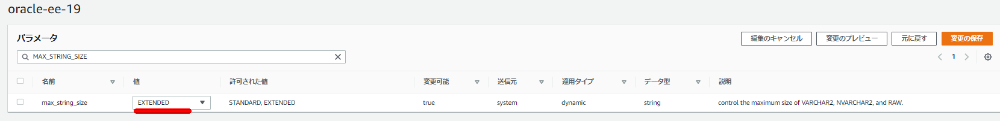

The extended data types feature allows users to expand VARCHAR2, NVARCHAR2, and RAW columns to a maximum size of 32767 bytes (default: 4000 bytes). Here are notes on how to configure this feature in RDS Oracle.

1. Create a database snapshot

2. Set the `MAX_STRING_SIZE` parameter in the parameter group to `EXTENDED`

   

3. Modify the DB instance to associate it with the parameter group that has `MAX_STRING_SIZE` set to `EXTENDED`

4. Restart the DB

5. Verify the parameter

```
SQL> show parameters max_string_size

NAME				     TYPE
------------------------------------ ---------------------------------
VALUE
------------------------------
max_string_size 		     string
EXTENDED
SQL>
```

The procedure is simpler than on-premises since there is no need to put the database into upgrade mode or run `utl32k.sql`.

> Enabling Extended VARCHAR2 Type in Oracle 19c | my opinion is my own https://zatoima.github.io/oracle-19c-extended-varchar2.html

### References

> Performing Common DBA Tasks for Oracle DB Instances - Amazon Relational Database Service https://docs.aws.amazon.com/ja_jp/AmazonRDS/latest/UserGuide/Appendix.Oracle.CommonDBATasks.Misc.html#Oracle.Concepts.ExtendedDataTypes
>
> Enabling Extended Data Types
