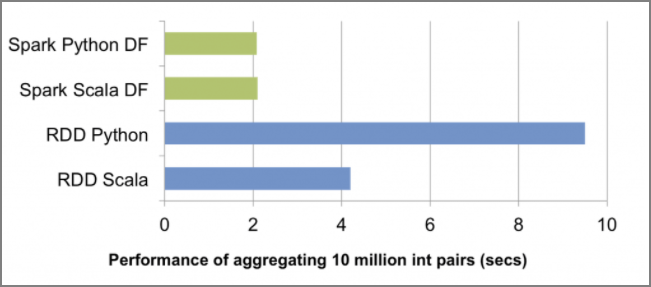

Note that <u>communication round trips occur between Python and JVM</u>.

Reference: O'Reilly Japan - Learning Spark https://www.oreilly.co.jp/books/9784873117348/

> 3.3 Accelerating PySpark with DataFrame
>
> What makes DataFrame and Catalyst Optimizer (and Project Tungsten) stand out is that they improve PySpark query performance compared to non-optimized RDD queries. As shown in the figure below, before the advent of DataFrame, it was not uncommon for the speed of Python queries against RDD to be less than half that of the same Scala queries. This query performance degradation is usually due to the overhead of communication between Python and JVM.
>
> 
>
> The advent of DataFrame not only significantly improved performance in Python, but also made the performance of Python, Scala, SQL, and R equivalent. Even though PySpark is significantly faster with DataFrame, don't forget that there are exceptions. The most common is when using Python UDFs, which create communication round trips between Python and JVM. This can be a worst-case scenario similar to performing operations on RDDs, so caution is needed.
>
> The Catalyst Optimizer codebase is written in Scala, but Python can also benefit from Spark's performance optimizations. Essentially, the code that significantly speeds up queries in DataFrame in PySpark is merely about 2,000 lines of wrappers written in Python.
>
